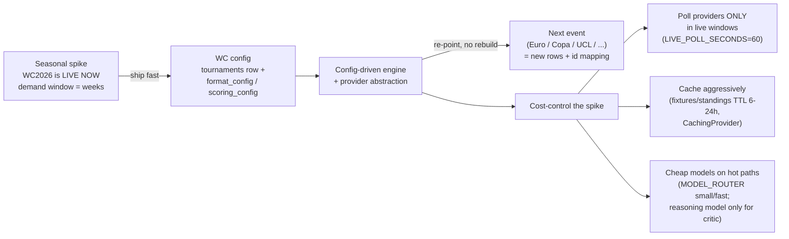

# 00 — Product Overview

> Purpose: the one-page north star for Pitch IQ — what we are building, what we are deliberately not building, how we know it works, and why a config-driven engine (not a World-Cup-hardcoded app) is the whole point.

**Status:** derived from the canonical spec (`research/canonical-spec.md` §0) and the decision memo (`research/09-decision-memo.md`). If anything here disagrees with the canonical spec, the spec wins.

---

## 1. Vision & the gap in official apps

**Pitch IQ is an agentic "tournament companion" web app.** A user picks a bracket and favorite teams; the app then acts as a knowledgeable friend watching alongside them, delivering four things:

1. **Pre-match briefings** — plain-language storyline + stakes + bracket implications, generated and stored *before* kickoff.
2. **In/post-match Q&A** grounded in live data — "why 6 minutes added?", "was that offside?", "what does this result do to my bracket?"
3. **Predictions** that a critic pressure-tests against odds and form, so they are not naive favorite-picking.
4. **Bracket scoring + private friend leagues** — pick, lock (with explicit confirmation), score, and compete on a leaderboard.

**The gap.** Official tournament apps (FIFA, broadcaster apps) are scoreboards and schedules. They show *what* happened but never explain *why* it matters to **you** — your bracket, your favorite team, this rule, this stage. They do not converse, they do not reason about consequences, and they do not pressure-test a prediction. Pitch IQ closes that gap with an LLM agent grounded in live match data, personalized to the user's bracket and favorites.

> Two layers are kept strictly separate throughout the planning docs:
> - **Runtime patterns** = LangGraph behavior *inside the product* (what the app does for users).
> - **Build workflows** = Claude Code dynamic-workflow orchestration used *to build the product* (covered in `06-workflows/`).
> This overview is about the product (runtime + scope); it does not describe how we code it.

---

## 2. Core principle: tournament-companion **engine**, not WC-hardcoded

> **Pitch IQ is a config-driven tournament-companion engine, not a World-Cup app.** The FIFA World Cup 2026 is a *seed row + config*, not the architecture.

Any group/knockout event is a target: Euro, Copa América, UEFA Champions League, March Madness, NFL playoffs. The launch configuration is **FIFA World Cup 2026** (live now — group stage finished Jun 27, the Round of 32 is live), chosen because the demand window is open *right now*.

What "config-driven" concretely means (see canonical-spec §4–§5):

- A tournament is a row in **`tournaments`** carrying **`format_config jsonb`** (bracket/group shape) and **`scoring_config jsonb`** (how picks earn points). No code branches on "is this the World Cup".
- Teams/fixtures/standings come through a **provider abstraction** (`app/providers/base.py` `Protocol`s) so the live data source is swappable per tournament, not wired into the engine.
- Re-pointing at a second event is **new `tournaments` rows + a provider id mapping** — see Success Criteria below for the hard guarantee (zero schema DDL).

---

## 3. MVP scope (in) — checklist

- [ ] **Auth** — email/JWT (PyJWT HS256 + pwdlib[argon2]) **+ Google OAuth (Authlib)** [Q5 resolved]; favorite teams; **one bracket per user per tournament**; pick editing.
- [ ] **HITL-confirmed bracket submit/lock** — submitting/locking is consequential, so it requires explicit user approval (`interrupt` → confirm) before the write.
- [ ] **Streaming chat companion (SSE)** — intent routing → ReAct Q&A over live data + rule explanations; token streaming over the chat channel.
- [ ] **Predictions** with a **generator → critic loop** (critic pressure-tests vs no-vig odds + form; ≤2 revision rounds).
- [ ] **Scheduled pre-match briefings** — per fixture at **kickoff − 2h** (`BRIEFING_LEAD_HOURS=2`) + **post-match recap**.
- [ ] **Bracket scoring + private leagues** — invite-code join + leaderboard.
- [ ] **Live "what's happening" panel** — events feed (SSE) for the user's relevant match.
- [ ] **LangSmith tracing + eval harness** — routing accuracy, prediction calibration, groundedness.

---

## 4. Non-goals (explicit, MVP)

These are out of scope on purpose. The engine may *support* some of them later, but the MVP does **not** ship them:

| Not in MVP | Note |
|---|---|
| Native mobile apps | Web only. |
| Payments / subscriptions | No billing surface. |
| Public social feed | Leagues are private (invite code) only. |
| Video highlights | No media pipeline. |
| Multi-sport at launch | Engine supports it; **only football is seeded** (`tournaments.sport='football'`). |
| Live odds **betting** / wagering | Odds are used only to pressure-test predictions; never resell raw odds. Show "18+ Gamble Responsibly" if odds are surfaced. |
| Sub-second push | **We poll** (`LIVE_POLL_SECONDS=60`); no realtime websocket fan-out. |
| Admin CMS | Config is edited as `tournaments` rows, not via a UI. |
| i18n beyond English | English only. |
| Sportradar-grade official feeds | Deferred — B2B ~$10k+/mo and a prediction-market ToS clause (memo §2). |

---

## 5. Success criteria (concrete, measurable)

Copied from canonical-spec §0:

| Metric | Target |
|---|---|
| Chat time-to-first-token | **< 1.5s p50** |
| Briefing readiness | Generated and stored **before kickoff for 100%** of the user's relevant fixtures |
| Routing accuracy | **≥ 0.9 macro-F1** on the eval set |
| Prediction calibration | Probabilities within a sane band of the no-vig market line — **Brier ≤ market + 0.02** |
| Groundedness | Pass-rate **≥ 0.95** (no fabricated numbers) |
| Engine reuse (the principle, made testable) | A 2nd tournament config ships with **zero schema DDL** — only new `tournaments` rows + provider id mapping |

The last row is the operational proof of the "engine, not WC-app" principle: if standing up a second tournament requires a migration, we failed it.

---

## 6. Seasonal-window strategy (ship fast + last long, cheaply)

The tournament is **live now** and the demand window is **weeks**, so the strategy is two-sided:

**Ship fast:** get the WC config out the door while the event is live — the seasonal window does not wait for a perfect product.

**Last long:** everything sits behind **config + a provider abstraction**, so the same engine is re-pointable at the next event with no rebuild. Longevity without a rewrite.

**Cost-control the seasonal spike** (the live tournament is when both API bills and LLM bills spike):

- **Poll providers only in live windows.** The `poller` service polls a fixture at `LIVE_POLL_SECONDS=60` *only while a relevant fixture is in its live window*; fixtures/standings are cached at 6–24h TTL otherwise. This keeps us inside API-Football's caps (free = 100 req/day + 10 req/min → prototyping only; live needs **Pro $19/mo, 7,500 req/day**). 429 → exponential backoff → failover to the **football-data.org** fallback (memo §2).
- **Cache aggressively** via the `CachingProvider` decorator (TTL cache + token-bucket rate limit + live/idle cadence + provider failover).
- **Cheap models on hot paths.** Models are config-driven via `app/graph/llm.py`: `MODEL_ROUTER` (small/fast — router, chitchat), `MODEL_AGENT` (mid — ReAct Q&A, briefing sections), `MODEL_CRITIC` (reasoning — only the prediction critic and briefing plan). The expensive reasoning model never runs on the high-frequency path.
- **Eval cost control:** `LANGSMITH_TEST_CACHE` avoids paying for LLM calls on every commit.

---

## 7. Open questions touching scope

Resolved at sign-off #0 and the still-open items:

1. ✅ **Briefings (Q2) — RESOLVED: shared-per-fixture.** `briefings.user_id` stays **nullable** (null = shared/generic); a personalized bracket-impact overlay is layered client-side. Cheapest path; cuts LLM spend + scheduler load.
2. **Leagues: single-tournament vs season-long (Q3) — STILL OPEN.** Default = single-tournament (`leagues.tournament_id` as-is); season-long is a post-MVP config change.
3. ✅ **Auth scope (Q5) — RESOLVED: email/password JWT + Google OAuth (Authlib) in MVP.** `users.password_hash` nullable; OAuth users keyed by `(auth_provider, auth_subject)`.
4. ✅ **Budget ceiling (Q7) — RESOLVED: baseline ≈ $50–90/mo** (API-Football Pro $19 + The Odds API $30 + LangSmith free; football-data.org free fallback).
5. ✅ **Hosting (Q4) — RESOLVED: Vercel (frontend) + Railway (web + single scheduler worker) + managed Postgres.**
6. **Still open:** OpenAI model snapshot ids (Q1) and at-rest checkpoint encryption scope (Q6).

---

### Source URLs (fast-moving claims)

- API-Football WC2026 (`league=1, season=2026`, free = 100/day + 10/min, Pro $19/mo): https://www.api-football.com/news/post/fifa-world-cup-2026-guide-to-using-data-with-api-sports · https://www.api-football.com/pricing
- The Odds API (free 500/mo → $30/mo, `soccer_fifa_world_cup`): https://the-odds-api.com/sports/fifa-world-cup-odds.html
- Sportradar prediction-market clause (why deferred): https://developer.sportradar.com/sportradar-updates/page/terms-and-conditions
- LangSmith tracing + eval cost control: https://docs.langchain.com/langsmith/trace-with-langgraph
