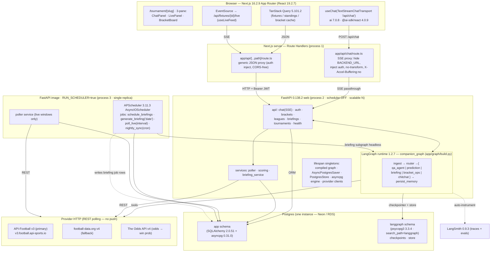
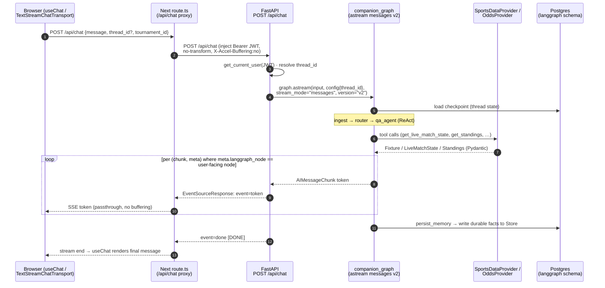
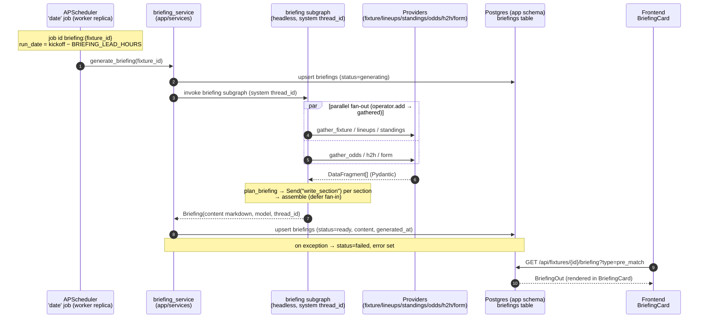
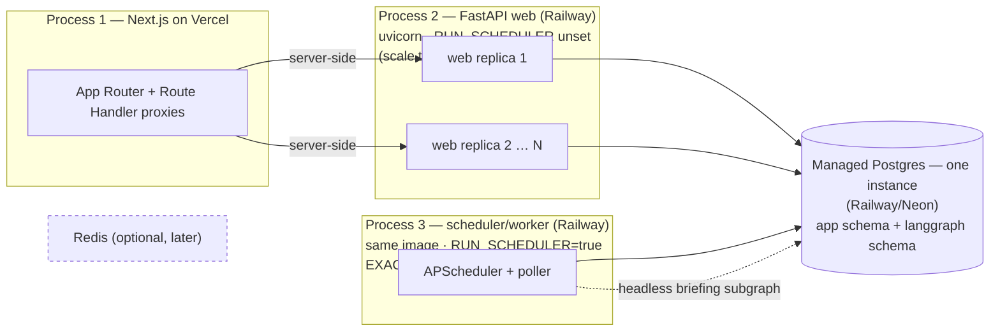

# 01 — System Architecture

> Purpose: the authoritative wiring diagram for Pitch IQ — how the frontend, Next proxy, FastAPI, the LangGraph runtime, data providers, scheduler, Postgres, and LangSmith fit together, plus the two hot paths (chat, briefing), the deployment topology, and the canonical env/secrets surface.

**Source of truth:** [`research/canonical-spec.md`](research/canonical-spec.md) §2 (and §5–§6 for the pieces referenced here). Library/version/API claims trace to [`research/04-fastapi-langgraph-integration-background-scheduler.md`](research/04-fastapi-langgraph-integration-background-scheduler.md), [`research/06-persistence.md`](research/06-persistence.md), and [`research/09-decision-memo.md`](research/09-decision-memo.md).

**Two layers, kept strictly separate (and this whole doc is about layer a):**
- **(a) Runtime patterns** — LangGraph behavior *inside the product*. This document describes the deployed system that serves users.
- **(b) Build workflows** — Claude Code dynamic-workflow orchestration used *to build the product*. Out of scope here; see `06-workflows/` / spec §8.

This doc describes the system *boundaries* and *flows*. It deliberately does **not** duplicate:
- LangGraph node/edge internals (the 7 runtime patterns) → see `02-langgraph-design.md` / spec §3.
- The Postgres app schema (tables/columns) → see `04-backend-plan.md` / spec §5.

---

## 1. System + component diagram

Five tiers: browser → Next proxy → FastAPI (+ embedded LangGraph runtime) → external providers/observability → one Postgres with two isolated schemas. The scheduler/poller lives in a **separate process** that shares the same FastAPI image and the same Postgres (see §4).

**Component responsibilities (one line each):**

| Component | File / module | Responsibility |
|---|---|---|
| 3-pane UI | `frontend/app/tournament/[slug]/page.tsx` | Chat + live + bracket, server-prefetch → `HydrationBoundary` |
| Chat transport | `useChat(TextStreamChatTransport)` | Token stream over plain-text SSE protocol (Risk #3) |
| SSE proxy | `frontend/app/api/chat/route.ts` | Hide `BACKEND_URL`, inject auth, disable buffering |
| JSON proxy | `frontend/app/api/[...path]/route.ts` | CORS-free pass-through for all non-stream calls |
| FastAPI app | `backend/app/main.py` + `api/*` | Routers, CORS, exception handlers (RFC-9457) |
| Lifespan | `backend/app/lifespan.py` | Build graph + savers + store + pools + (scheduler if `RUN_SCHEDULER`) |
| LangGraph runtime | `backend/app/graph/build.py` | `companion_graph` compiled with checkpointer + store (internals → doc 02) |
| Services | `backend/app/services/{poller,scoring,briefing_service}.py` | Live polling, bracket scoring, headless briefing generation |
| Scheduler | `backend/app/scheduler/{scheduler,jobs}.py` | APScheduler jobs (single replica only) |
| Providers | `backend/app/providers/*` | Protocol-typed sports/odds clients + `CachingProvider` decorator |

---

## 2. The two hot paths (sequence diagrams)

### 2.1 Chat path (token streaming)

Browser → Next `/api/chat` proxy → FastAPI SSE endpoint → `graph.astream(stream_mode="messages", version="v2")` → tokens streamed back. We ship the **stable** `stream_mode="messages"` v2 contract; the typed-projection `astream_events(version="v3")` is beta and gated behind GA (Risk #2). SSE transport is **`sse-starlette` 3.4.5 `EventSourceResponse`** (chosen over the unverified first-party `fastapi.sse` — Open Question #5 in the decision memo).

Notes:
- The user-facing token filter is `meta["langgraph_node"]` (only the `qa_agent` / `chitchat` node tokens reach the browser; tool chatter and internal nodes are suppressed). The MVP text protocol drops structured tool/usage parts — acceptable per Risk #3.
- TTFT target: < 1.5s p50 (spec success criteria).
- HITL bracket submit does **not** flow through this path — it runs through the brackets API (`POST /api/brackets/{id}/submit` → `{interrupt}` → `…/submit/confirm`), surfaced in the `SubmitConfirmDialog`. See doc 02 §3.4.

### 2.2 Briefing path (scheduled, headless)

A `'date'` job fires at **kickoff − `BRIEFING_LEAD_HOURS` (=2)** on the single scheduler replica → `generate_briefing(fixture_id)` → `briefing_service` runs the **briefing subgraph headless** (system `thread_id`, not a user chat) → upsert the `briefings` row → frontend later reads it via a plain JSON GET. This is decoupled from chat: nothing is streamed to a browser; the result is a stored row.

Notes:
- `briefings.status` lifecycle: `pending → generating → ready` (or `failed` with `error`). The frontend reads whatever is current; a `pending`/`generating` row renders a skeleton.
- The same briefing subgraph is **also** reachable from the chat path via route `BRIEFING` — same graph, two entry points (scheduler-headless vs. user-asked). Subgraph internals → doc 02 §3.3.
- `briefings.user_id` nullable (null = shared/generic, set = personalized) — the personalized-vs-shared product decision is Open Question #7/#9 and changes cache hit-rate, not this topology.

---

## 3. Deployment topology

Three processes, one Postgres, optional Redis later. The web tier scales horizontally; the scheduler is pinned to exactly one replica. **Hosting (Q4 resolved): Next.js on Vercel, the two FastAPI services (web + single scheduler worker) on Railway, managed Postgres (Railway Postgres or Neon).**

| # | Process | Image / runtime | Scaling | Scheduler | Owns |
|---|---|---|---|---|---|
| 1 | **Next.js** | Node ≥ 22 on **Vercel** | horizontal | n/a | UI + Route Handler proxies; holds `BACKEND_URL` server-only |
| 2 | **FastAPI web** | uvicorn 0.49.0, Python ≥ 3.12 on **Railway** | **horizontal (N)** | **OFF** (`RUN_SCHEDULER` unset/false) | HTTP API, SSE chat, graph `astream`, ORM reads/writes |
| 3 | **Scheduler/worker** | **same FastAPI image** on **Railway** | **single replica only** | **ON** (`RUN_SCHEDULER=true`) | APScheduler (`AsyncIOScheduler` + `SQLAlchemyJobStore` on same Postgres), poller, headless briefing runs |

**Why a single scheduler process (Risk #4):** APScheduler runs **in-process**. If it were started inside every uvicorn worker, each replica would independently fire `'date'` jobs and you would get *N* duplicate briefings per fixture. Running the scheduler in exactly one dedicated replica (or, later, a Postgres advisory-lock leader election) guarantees **one briefing per fixture**. We chose APScheduler 3.11.3 (not 4.x — alpha, "do NOT use in production") because its `AsyncIOScheduler` is async-native, in-process, needs no broker, reuses the Postgres we already run, and supports both one-off `'date'` triggers (kickoff − N h) and cron (`nightly_sync`). Durable jobs survive restarts when given an explicit `id` + `replace_existing=True`.

**Data store:** one managed Postgres serves both the app ORM (asyncpg, `app` schema) and the LangGraph checkpointer + store (psycopg3, `langgraph` schema). Two **separate connection pools**; no cross-schema FK (the `conversations.thread_id ⇄ checkpoints.thread_id` join is logical). Schema/pool details → doc 04 / spec §5. Split to a second instance only if checkpoint write volume contends with app OLTP.

**Secrets distribution:** `.env` files locally; in prod, **Vercel env vars** (frontend) and **Railway service variables** (FastAPI web + worker). Hosting is resolved (Q4: Vercel + Railway + managed Postgres); the single-scheduler invariant maps to one Railway worker service with `RUN_SCHEDULER=true`. LangSmith is configured purely via env vars; traces leave processes 2 and 3 over HTTPS.

---

## 4. Environment variables (canonical) + secrets handling

All config flows through `pydantic-settings` (`backend/app/config.py`, `Settings`) and the frontend's server-only env. The table below is the canonical set from spec §2; defaults shown where the spec pins one.

### Backend (`backend/.env.example` → `app/config.py`)

| Var | Example / default | Consumer | Secret? |
|---|---|---|---|
| `DATABASE_URL` | `postgresql+asyncpg://…/pitchiq` | app ORM (asyncpg pool) | yes |
| `CHECKPOINTER_DB_URL` | `postgresql://…?options=-c%20search_path%3Dlanggraph` | checkpointer/store (psycopg3 pool) | yes |
| `OPENAI_API_KEY` | `sk-…` | `app/graph/llm.py` | yes |
| `MODEL_ROUTER` | small/fast snapshot | router + chitchat | no (id only) |
| `MODEL_AGENT` | mid snapshot | ReAct Q&A, briefing sections | no |
| `MODEL_CRITIC` | reasoning snapshot | prediction critic, briefing plan | no |
| `API_FOOTBALL_KEY` | provider key | `ApiFootballProvider` (`x-apisports-key`) | yes |
| `FOOTBALL_DATA_TOKEN` | provider token | `FootballDataProvider` (`X-Auth-Token`) | yes |
| `THE_ODDS_API_KEY` | provider key | `TheOddsApiProvider` (`apiKey` query) | yes |
| `JWT_SECRET` | random 32B+ | `app/security.py` (HS256 sign/verify) | yes |
| `JWT_ALG` | `HS256` | security | no |
| `ACCESS_TOKEN_TTL_MIN` | e.g. `60` | security | no |
| `GOOGLE_CLIENT_ID` | OAuth client id | `app/security.py` Authlib (Q5) | no (id only) |
| `GOOGLE_CLIENT_SECRET` | OAuth client secret | Authlib Google flow | yes |
| `OAUTH_REDIRECT_URI` | `https://api…/api/auth/google/callback` | Authlib callback | no |
| `LANGSMITH_TRACING` | `true` | LangSmith auto-instrument | no |
| `LANGSMITH_API_KEY` | `ls-…` | LangSmith | yes |
| `LANGSMITH_PROJECT` | `pitch-iq` | LangSmith | no |
| `LANGGRAPH_AES_KEY` | optional 32B | `EncryptedSerializer` (at-rest checkpoint encryption) | yes |
| `RUN_SCHEDULER` | `false` web / `true` worker | `lifespan.py` (start APScheduler?) | no |
| `CORS_ORIGINS` | `https://app…,http://localhost:3000` | FastAPI CORS middleware | no |
| `LIVE_POLL_SECONDS` | `60` | poller cadence in live windows | no |
| `BRIEFING_LEAD_HOURS` | `2` | scheduler `'date'` offset | no |

### Frontend (`frontend/.env.example`)

| Var | Example | Consumer | Exposure |
|---|---|---|---|
| `BACKEND_URL` | `http://localhost:8000` | Route Handlers only (`api/chat`, `api/[...path]`) | **server-only — never `NEXT_PUBLIC_`** |
| `NEXT_PUBLIC_APP_URL` | `https://app.pitchiq…` | client (absolute URLs, share links) | public |

### Secrets handling rules

- **Never ship secrets to the browser.** `BACKEND_URL` is intentionally *not* `NEXT_PUBLIC_`; the proxy is the only thing that knows the FastAPI origin and the only thing that attaches the user's auth. The proxy injects the `Authorization: Bearer …` header server-side so the token is never read from a public env var.
- **`RUN_SCHEDULER` is the single switch** that distinguishes process 2 (web, `false`) from process 3 (worker, `true`). `lifespan.py` reads it and conditionally starts APScheduler. Misconfiguring it on >1 replica reintroduces Risk #4.
- **Two DB URLs on purpose.** `DATABASE_URL` (asyncpg) and `CHECKPOINTER_DB_URL` (psycopg3 with `search_path=langgraph`) point at the same instance but different schemas + drivers. They are distinct secrets so credentials/pool settings can diverge.
- **Optional at-rest encryption** via `LANGGRAPH_AES_KEY` enables `EncryptedSerializer` for checkpoint blobs. Its exact activation scope (platform vs. self-host) is Open Question #12/#10 — treat as optional until confirmed.
- **Local vs. prod:** `.env` (git-ignored) locally; platform secret manager in prod. `*.env.example` files are committed with placeholder values only.

---

## 5. Open questions touching architecture (do not assert as fact)

| # | Question | Impact on this doc |
|---|---|---|
| 5 | Does first-party `fastapi.sse.EventSourceResponse` exist in 0.138.2? Not adversarially verified. | We use `sse-starlette` 3.4.5 (verified). If first-party is confirmed it's a drop-in swap; SSE topology unchanged. |
| 2 | `astream_events(version="v3")` GA status. | Chat path ships `stream_mode="messages"` v2; v3 migration is gated, sequence diagram unaffected in shape. |
| ~~9~~ | ✅ **RESOLVED (Q4): Vercel + Railway + managed Postgres.** | Process 1 → Vercel; processes 2 & 3 → Railway services (web + single `RUN_SCHEDULER` worker); Postgres = Railway/Neon. 3-process model + single-scheduler rule unchanged. |
| ~~7~~ | ✅ **RESOLVED (Q2): shared-per-fixture.** | `briefings.user_id` NULL = shared; personalized bracket-impact overlay client-side. Briefing-path flow unchanged. |
| 10/12 | `EncryptedSerializer` scope when `LANGGRAPH_AES_KEY` set. | Keeps that env var optional for now. |

---

*This document is layer (a) — the runtime system. For how we build it (layer b), see `06-workflows/`. For graph internals see `02`; for the DB schema see `04`.*
