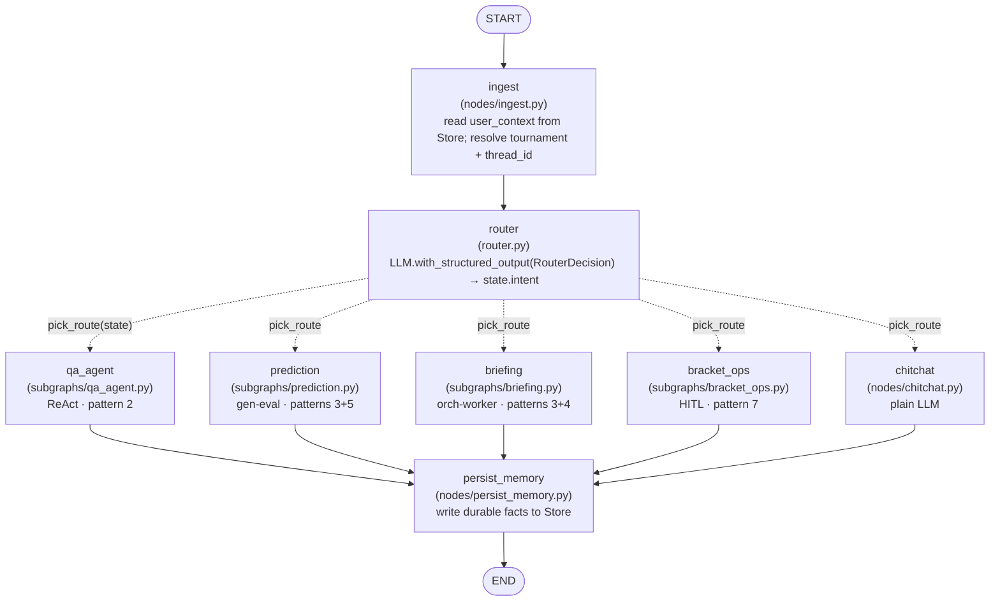
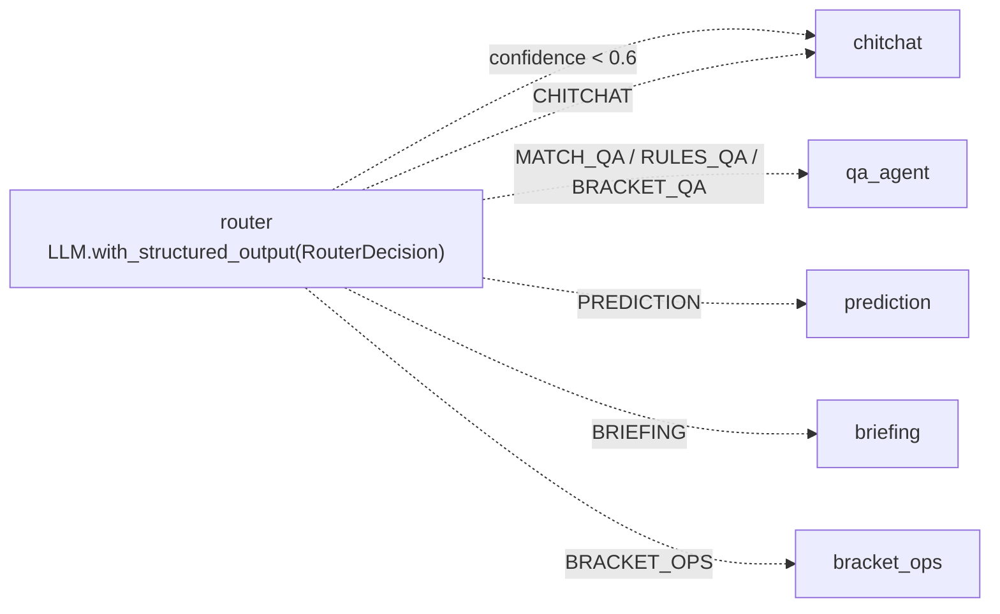
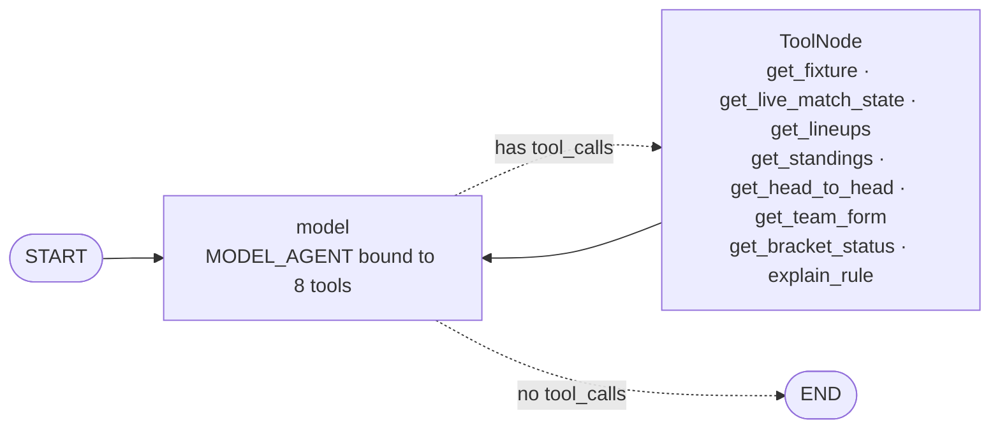
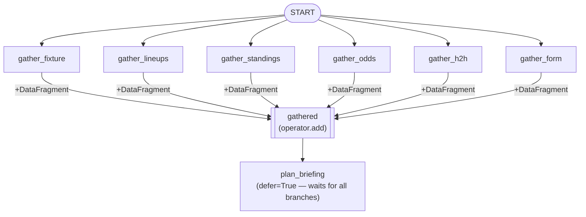
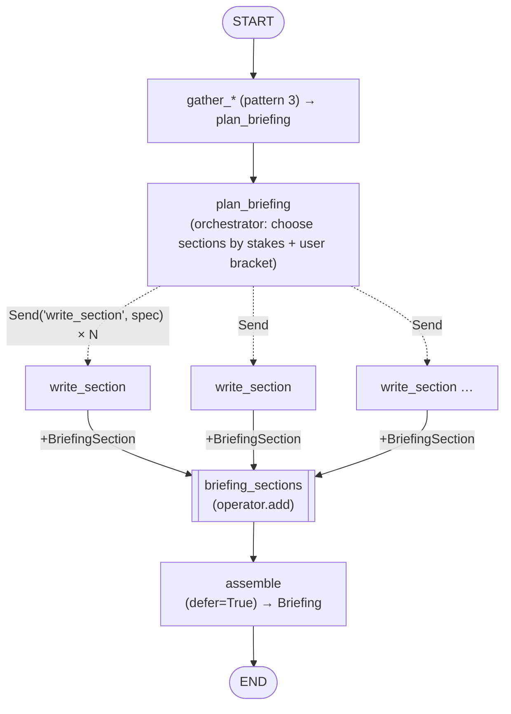
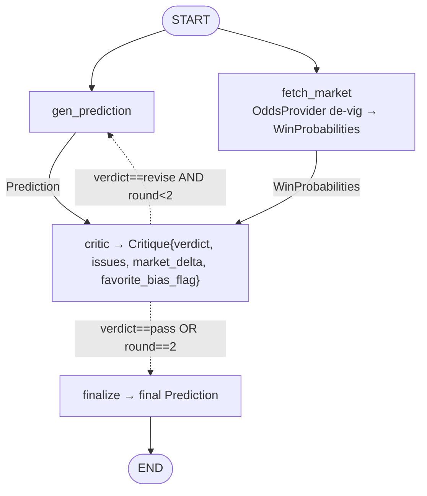
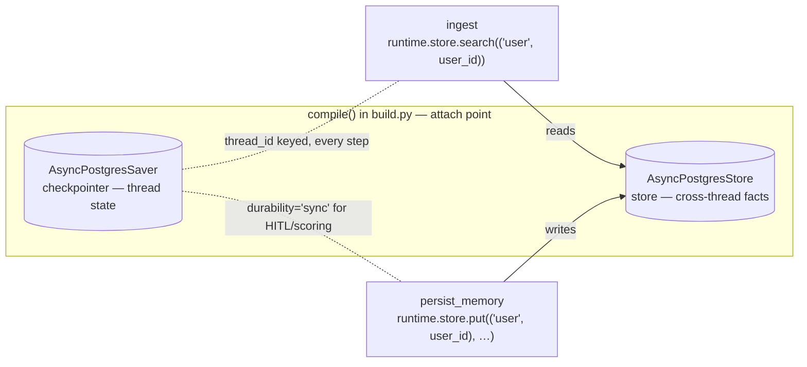
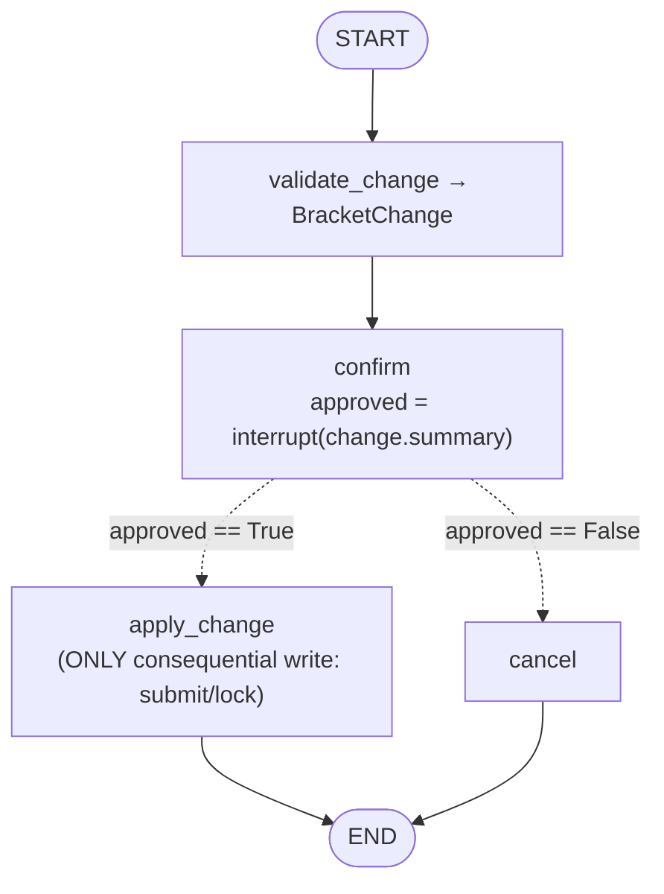
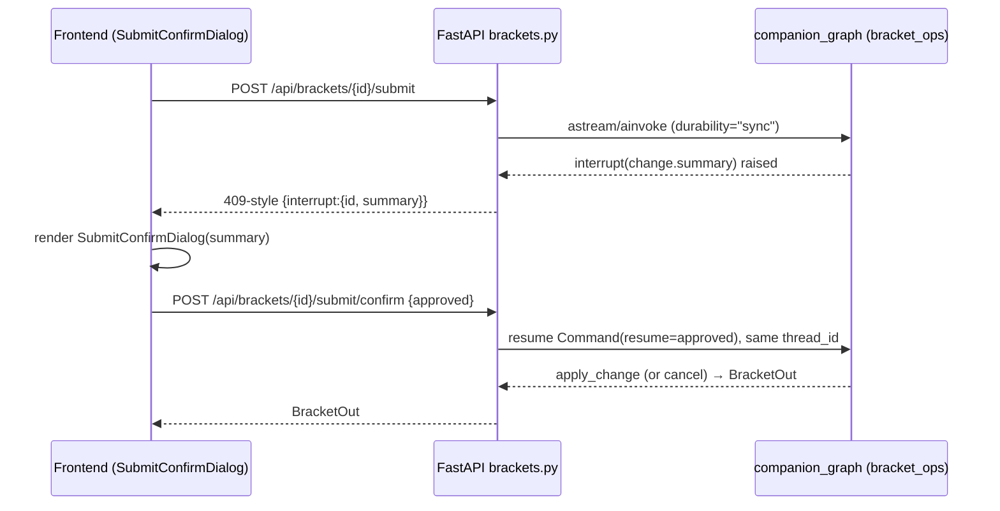

# 02 — LangGraph Design

> Purpose: the implementation-grade blueprint for the in-product agent runtime (`companion_graph`) — its strict state schema, the top-level supervisor graph, and each of the 7 mandated LangGraph runtime patterns with exact module paths, node/edge wiring, and where tools, checkpointer/store, and interrupts attach.

**Source of truth:** `docs/plan/research/canonical-spec.md` §3 (state, graph, patterns), §5 (persistence), §6 (where the graph is invoked). Library claims trace to `research/00-langgraph.md`, `research/01-langgraph.md`, and the adversarial `research/08-verification-verdicts.md`.

**Layer discipline (read this first).** This doc describes **layer (a): LangGraph runtime patterns = behavior INSIDE the product.** It does *not* describe how we build the product. The Claude Code dynamic build-workflows (layer (b)) — `wf-03 core-graph`, `wf-04 advanced-graph`, `wf-05 memory-hitl` — live in `docs/plan/06-workflows/*` and `docs/plan/10-build-orchestration.md`. Where a runtime concept maps to a build workflow it is footnoted, never conflated.

**Pinned runtime libraries** (from spec §1; verified in `research/00`/`research/01` against PyPI on 2026-06-30):

| Package | Version | Used for |
|---|---|---|
| `langgraph` | **1.2.7** | `StateGraph`, `compile`, `Send`, `interrupt`, `Command`, streaming |
| `langchain` | **1.3.11** | `langchain.agents.create_agent` (ReAct) |
| `langchain-core` | **1.4.8** | `AnyMessage`, `add_messages`, runnables |
| `langchain-openai` | **1.3.3** | OpenAI chat models (router/agent/critic) |
| `langgraph-checkpoint` | **4.1.1** | `BaseStore`, `InMemorySaver`, `InMemoryStore` |
| `langgraph-checkpoint-postgres` | **3.1.0** | `AsyncPostgresSaver`, `AsyncPostgresStore` |
| `langgraph-prebuilt` | **1.1.0** | `ToolNode` |

> **`create_agent` replaces the deprecated `create_react_agent`.** `langgraph.prebuilt.create_react_agent` is officially deprecated in the LangChain 1.x line; the replacement is `langchain.agents.create_agent` (same engine, adds middleware). Migration is an import swap plus `prompt=` → `system_prompt=`. We use `create_agent` everywhere. Source: `research/00-langgraph.md` (PyPI + v1 migration guide); reference.langchain.com/python/langgraph.prebuilt/chat_agent_executor/create_react_agent.

---

## 1. Top-level graph: `companion_graph`

Built in **`app/graph/build.py`** as a supervisor/router `StateGraph(CompanionState, context_schema=CompanionContext)`. Each mandated pattern is a labeled **subgraph/module** added as a node. The checkpointer and store attach **only** at `compile()`.



**Edge wiring (literal):**

```python
# app/graph/build.py
builder = StateGraph(CompanionState, context_schema=CompanionContext)
builder.add_node("ingest", ingest)
builder.add_node("router", router)
builder.add_node("qa_agent", qa_agent_subgraph)        # compiled subgraph (create_agent)
builder.add_node("prediction", prediction_subgraph)    # compiled subgraph
builder.add_node("briefing", briefing_subgraph)        # compiled subgraph
builder.add_node("bracket_ops", bracket_ops_subgraph)  # compiled subgraph
builder.add_node("chitchat", chitchat)
builder.add_node("persist_memory", persist_memory)

builder.add_edge(START, "ingest")
builder.add_edge("ingest", "router")
builder.add_conditional_edges(
    "router", pick_route,
    ["qa_agent", "prediction", "briefing", "bracket_ops", "chitchat"],
)
for n in ("qa_agent", "prediction", "briefing", "bracket_ops", "chitchat"):
    builder.add_edge(n, "persist_memory")
builder.add_edge("persist_memory", END)

graph = builder.compile(checkpointer=checkpointer, store=store)   # see §5
```

Subgraphs compose by **shared state keys** (added directly as a node; they read/write the parent's channels) — the dominant pattern from `research/00`. `bracket_ops` and `prediction` are explicit `StateGraph`s (they need mid-run control / interrupts); `qa_agent` is a `create_agent` instance whose `messages` state slots straight into the parent.

### 1.1 Conditional routing function

```python
# app/graph/router.py
CONFIDENCE_FLOOR = 0.6

_ROUTE_TO_NODE = {
    Route.MATCH_QA:    "qa_agent",
    Route.RULES_QA:    "qa_agent",
    Route.BRACKET_QA:  "qa_agent",
    Route.PREDICTION:  "prediction",
    Route.BRIEFING:    "briefing",
    Route.BRACKET_OPS: "bracket_ops",
    Route.CHITCHAT:    "chitchat",
}

def pick_route(state: CompanionState) -> str:
    decision = state["intent"]                       # RouterDecision (already classified by `router` node)
    if decision.confidence < CONFIDENCE_FLOOR:
        return "chitchat"                            # low-confidence → ask a clarifying question
    return _ROUTE_TO_NODE[decision.route]
```

The three Q&A routes (`MATCH_QA`, `RULES_QA`, `BRACKET_QA`) all fan into the one `qa_agent` ReAct node — the route distinction is preserved in `state.intent.params` so the agent's system prompt can specialize, but they share one tool-bound executor. Routing accuracy target: **≥ 0.9 macro-F1** on the eval set (spec §0, evaluated as a closed-set classifier in `eval/datasets/routing.jsonl`).

---

## 2. State schema — `app/graph/state.py`

Graph state is a **`TypedDict`** (so `Annotated[..., reducer]` channels work). **All nested payloads and tool I/O are strict Pydantic `BaseModel`** with `model_config = ConfigDict(extra="forbid")` — invalid/extra keys raise rather than silently pass.

```python
# app/graph/state.py
import operator
from enum import Enum
from typing import Annotated, Any, Literal, NotRequired
from typing_extensions import TypedDict
from datetime import datetime
from pydantic import BaseModel, ConfigDict, Field
from langchain.messages import AnyMessage
from langgraph.graph.message import add_messages

# Cross-layer import: WinProbabilities + ProviderRef are defined in app/providers/base.py (§4 of spec).
from app.providers.base import WinProbabilities, ProviderRef


class Route(str, Enum):
    MATCH_QA    = "match_qa"
    RULES_QA    = "rules_qa"
    BRACKET_QA  = "bracket_qa"
    PREDICTION  = "prediction"
    BRIEFING    = "briefing"
    BRACKET_OPS = "bracket_ops"
    CHITCHAT    = "chitchat"


class _Strict(BaseModel):
    model_config = ConfigDict(extra="forbid")        # strict: extra keys forbidden everywhere


# ── router output (OpenAI strict json_schema, enum-closed) ──────────────────────
class RouterDecision(_Strict):
    route: Route
    confidence: float = Field(ge=0.0, le=1.0)
    params: dict[str, str] = Field(default_factory=dict)   # e.g. {"fixture_id": "...", "team": "..."}
    rationale: str | None = None


# ── durable cross-thread user facts (loaded from Store at ingest) ───────────────
class UserContext(_Strict):
    user_id: str
    favorite_team_ids: list[str] = Field(default_factory=list)
    favorite_team_names: list[str] = Field(default_factory=list)
    tone: Literal["concise", "detailed"] = "concise"
    locale: str = "en"
    timezone: str = "UTC"
    notes: list[str] = Field(default_factory=list)         # learned preferences/facts


# ── parallel fan-in wrapper (one per provider pull) ─────────────────────────────
class DataFragment(_Strict):
    kind: str                                              # "fixture"|"lineups"|"standings"|"odds"|"h2h"|"form"
    payload: dict[str, Any]                                # serialized provider Pydantic model


# ── prediction (generator–evaluator) ───────────────────────────────────────────
class Prediction(_Strict):
    fixture_ref: ProviderRef
    probabilities: WinProbabilities                        # home/draw/away, de-vigged; from providers/base.py
    scoreline: str                                         # e.g. "2-1"
    drivers: list[str]                                     # form/H2H-grounded reasons, not vibes
    confidence: float = Field(ge=0.0, le=1.0)
    round: int = 0                                         # which gen iteration produced this


class Critique(_Strict):
    verdict: Literal["pass", "revise"]
    issues: list[str] = Field(default_factory=list)
    market_delta: float | None = None                     # |model_prob - no-vig market_prob|
    favorite_bias_flag: bool = False


# ── briefing (orchestrator–worker map-reduce) ───────────────────────────────────
class SectionSpec(_Strict):                               # nested in BriefingPlan; one per Send() worker
    kind: Literal["stakes", "key_players", "bracket_impact",
                  "head_to_head", "form_and_prediction", "how_it_works"]
    title: str
    instructions: str                                     # what the worker should write
    needs: list[str] = Field(default_factory=list)        # DataFragment.kind values it consumes

class BriefingPlan(_Strict):
    fixture_ref: ProviderRef
    sections: list[SectionSpec]                           # data-dependent count → Send fan-out

class BriefingSection(_Strict):
    kind: str
    title: str
    body_markdown: str
    order: int

class Briefing(_Strict):
    fixture_ref: ProviderRef
    title: str
    sections: list[BriefingSection]
    markdown: str                                         # assembled document
    model: str
    generated_at: datetime


# ── bracket HITL ────────────────────────────────────────────────────────────────
class BracketChange(_Strict):
    bracket_id: str
    action: Literal["submit", "lock", "edit_picks"]
    summary: str                                          # human-readable, surfaced in interrupt()
    diff: list[str] = Field(default_factory=list)         # e.g. ["R32: ESP→BRA", "lock bracket"]
    pick_updates: list[dict[str, Any]] | None = None


# ── the graph state ─────────────────────────────────────────────────────────────
class CompanionState(TypedDict):
    messages:          Annotated[list[AnyMessage], add_messages]      # reducer: add_messages
    user_id:           str
    tournament_id:     str
    thread_id:         str
    route:             NotRequired[Route]
    intent:            NotRequired[RouterDecision]
    user_context:      NotRequired[UserContext]                       # from Store at ingest
    gathered:          Annotated[list[DataFragment], operator.add]    # reducer: operator.add (fan-in)
    prediction:        NotRequired[Prediction]
    critique:          NotRequired[Critique]
    prediction_round:  NotRequired[int]
    briefing_plan:     NotRequired[BriefingPlan]
    briefing_sections: Annotated[list[BriefingSection], operator.add] # reducer: operator.add (map-reduce)
    briefing:          NotRequired[Briefing]
    pending_change:    NotRequired[BracketChange]
    approved:          NotRequired[bool]
    final_response:    NotRequired[str]
```

**Reducer rules (from `research/00`):** a bare key is last-write-wins (overwrite); `Annotated[list, add_messages]` merges chat history; `Annotated[list, operator.add]` appends across concurrent branches — used for the two fan-in channels `gathered` and `briefing_sections`. Every other field is `NotRequired` and overwritten by the node that owns it.

### 2.1 Run-scoped context — `CompanionContext`

`context_schema=CompanionContext` injects per-run dependencies (not graph state) and gives every node `runtime.store` access (`research/01`). Providers are wired here so tools/nodes never construct clients:

```python
class CompanionContext(BaseModel):     # passed at invoke via context=...
    sports: SportsDataProvider          # Protocol (app/providers/base.py) — CachingProvider in prod
    odds:   OddsProvider                # Protocol
    user_tz: str = "UTC"
# nodes receive `runtime: Runtime[CompanionContext]`; reach providers via runtime.context.sports
# and long-term memory via runtime.store (see §3.6 / §5).
```

---

## 3. The 7 mandated runtime patterns

| # | Pattern | Module | Fires at | One-line rationale |
|---|---|---|---|---|
| 1 | Conditional routing | `app/graph/router.py` | `router` node + `add_conditional_edges` | one cheap structured-output classifier picks the specialist; testable as a closed-set classifier |
| 2 | ReAct + tool binding | `app/graph/subgraphs/qa_agent.py` | `create_agent(model, tools=[…8…])` | live-data Q&A needs tool-use loops; prebuilt agent binds tools + streams `messages` |
| 3 | Parallelization | `subgraphs/briefing.py` (`gather_*`) & `prediction.py` (`gen ∥ fetch_market`) | static fan-out → `operator.add` → `defer=True` fan-in | independent data pulls run concurrently → lower latency |
| 4 | Orchestrator–worker | `subgraphs/briefing.py` | `plan_briefing` → `Send("write_section", spec)` → `assemble` | section count is data-dependent → Send-API map-reduce |
| 5 | Generator–evaluator | `subgraphs/prediction.py` | `gen_prediction` → `critic` → loop ≤2 → `finalize` | critic pressure-tests vs no-vig odds + form so predictions aren't naive |
| 6 | Memory (checkpointer + store) | `build.py`, `nodes/ingest.py`, `nodes/persist_memory.py` | `compile(checkpointer=…, store=…)`; read at `ingest`, write at `persist_memory` | short-term thread state + HITL durability (checkpointer) + cross-thread user facts (store) |
| 7 | Human-in-the-loop | `subgraphs/bracket_ops.py` | `interrupt(summary)` in `confirm`; resume `Command(resume=bool)` | locking/submitting a bracket is consequential → explicit approval before the write |

### 3.1 Pattern 1 — Conditional routing

**Module:** `app/graph/router.py`. The `router` node runs `MODEL_ROUTER.with_structured_output(RouterDecision)` (OpenAI strict `json_schema`, enum-closed on `Route`) and writes `state.intent`. `pick_route` (§1.1) maps the decision to one specialist node. Low confidence → `chitchat` (asks a clarifying question) rather than a wrong specialist.



*Rationale:* a single small/fast model call (`MODEL_ROUTER`) picks the right specialist and is independently testable as a classifier (eval target ≥ 0.9 macro-F1).

### 3.2 Pattern 2 — ReAct + tool binding

**Module:** `app/graph/subgraphs/qa_agent.py`. This is the **main chat path** and the **only place tools bind**. Built with `langchain.agents.create_agent`:

```python
# app/graph/subgraphs/qa_agent.py
from langchain.agents import create_agent
from langchain.agents.middleware import ToolCallLimitMiddleware
from app.graph.tools.sports  import (
    get_fixture, get_live_match_state, get_lineups, get_standings,
    get_head_to_head, get_team_form,
)
from app.graph.tools.bracket import get_bracket_status
from app.graph.tools.rules   import explain_rule

QA_TOOLS = [
    get_fixture, get_live_match_state, get_lineups, get_standings,   # tools/sports.py
    get_head_to_head, get_team_form,
    get_bracket_status,                                              # tools/bracket.py
    explain_rule,                                                    # tools/rules.py
]  # ── exactly 8 bound tools ──

qa_agent_subgraph = create_agent(
    model=MODEL_AGENT,                 # resolved via app/graph/llm.py init_chat_model(...)
    tools=QA_TOOLS,                    # bound + ToolNode created automatically
    system_prompt=QA_SYSTEM_PROMPT,    # forbids stating unverified facts; must call a tool for any live claim
    middleware=[ToolCallLimitMiddleware(run_limit=8)],
    checkpointer=True,                 # inherit the parent compiled checkpointer (per-thread persistence)
)
```

The **8 bound tools**: `get_fixture`, `get_live_match_state`, `get_lineups`, `get_standings`, `get_head_to_head`, `get_team_form`, `get_bracket_status`, `explain_rule`. Tools depend only on the `SportsDataProvider`/`OddsProvider` Protocols (spec §4.1), reaching the concrete client via `runtime.context`.



*Rationale:* live-data Q&A ("why 6 minutes added?", "what does this do to my bracket?") needs tool-use loops; the prebuilt agent binds tools, enforces the call limit, and streams `messages` so the parent graph streams tokens unchanged. Groundedness target ≥ 0.95 (no fabricated numbers) — enforced by the system prompt + `eval/datasets/groundedness.jsonl`.

### 3.3 Pattern 3 — Parallelization

**Modules:** `subgraphs/briefing.py` (`gather_*` fan-out) and `subgraphs/prediction.py` (`gen_prediction ∥ fetch_market`). Pattern = static fan-out edges from one source into a shared `operator.add` channel, fan-in by a downstream node marked `defer=True` (runs only after all upstream branches finish — `research/00`).



Each `gather_*` node calls one provider method and returns `{"gathered": [DataFragment(kind=..., payload=...)]}`; `operator.add` concatenates them with no lost writes. The same shape applies inside `prediction` (two parallel branches `gen_prediction` and `fetch_market` join at `critic`).

*Rationale:* the six provider pulls (and the prediction's gen/market pull) are independent, so running them concurrently cuts wall-clock latency on the briefing/prediction paths.

### 3.4 Pattern 4 — Orchestrator–worker (Send-API map-reduce)

**Module:** `subgraphs/briefing.py`. `plan_briefing` (orchestrator) reads `gathered` + the user's bracket and emits a `BriefingPlan` whose **section count is data-dependent** (stakes always; `bracket_impact` only if the user has a stake; `how_it_works` only for rules-relevant fixtures, etc.). A conditional edge returns a list of `Send` objects — one worker invocation per section — and results merge through the `operator.add` channel `briefing_sections`. `assemble` is `defer=True` fan-in.

```python
# app/graph/subgraphs/briefing.py
from langgraph.types import Send

def fan_out_sections(state) -> list[Send]:
    plan = state["briefing_plan"]
    return [Send("write_section", {"spec": s, "gathered": state["gathered"]})
            for s in plan.sections]

bsub.add_conditional_edges("plan_briefing", fan_out_sections, ["write_section"])
bsub.add_node("assemble", assemble, defer=True)   # fan-in after all workers
bsub.add_edge("write_section", "assemble")
```



Candidate sections (`SectionSpec.kind`): `stakes`, `key_players`, `bracket_impact`, `head_to_head`, `form_and_prediction`, `how_it_works`.

**Two invocation paths for this subgraph (spec §3.3):** (1) interactively via the `BRIEFING` route in `companion_graph`; (2) **headless by the scheduler** — `services/briefing_service.py` calls the briefing subgraph directly with a system `thread_id` at `kickoff − BRIEFING_LEAD_HOURS` (default 2h), upserting `briefings`.

*Rationale:* the number of sections is only known at runtime, so a static fan-out can't express it — Send-API map-reduce dispatches exactly the needed workers in parallel.

### 3.5 Pattern 5 — Generator–evaluator (bounded loop)

**Module:** `subgraphs/prediction.py`. `gen_prediction` and `fetch_market` run in parallel (pattern 3); `critic` evaluates the `Prediction` against the de-vigged market `WinProbabilities` and form; a conditional edge loops back to `gen_prediction` while `verdict=="revise" and prediction_round < 2`, else routes to `finalize`. **Hard cap: ≤ 2 revision rounds** (`prediction_round` increments each gen) — guarantees termination.

```python
# app/graph/subgraphs/prediction.py
def after_critic(state) -> str:
    c = state["critique"]
    if c.verdict == "revise" and state.get("prediction_round", 0) < 2:
        return "gen_prediction"
    return "finalize"

psub.add_conditional_edges("critic", after_critic, ["gen_prediction", "finalize"])
```



`fetch_market` runs once (the loop edge targets only `gen_prediction`; the cached `WinProbabilities` is reused). **Critic rubric** (spec §3.3): probabilities valid and sum→1; model probability within a sane band of the no-vig market line; rationale cites form/H2H, not vibes; flags favorite-bias. Calibration target: **Brier ≤ market + 0.02** (eval `eval/datasets/predictions.jsonl`).

*Rationale:* a single LLM prediction is naive; an explicit critic that compares against the market line and form catches over/under-confidence before the user sees it.

### 3.6 Pattern 6 — Memory (checkpointer + store)

**Two-tier memory** (`research/01`). The checkpointer holds short-term, thread-scoped state (conversation continuity, HITL pause/resume, fault tolerance); the Store holds long-term, **cross-thread** user facts. Both attach **only at `compile()`** in `app/graph/build.py`:

```python
# app/graph/build.py — attach point (called once in app/lifespan.py)
from langgraph.checkpoint.postgres.aio import AsyncPostgresSaver
from langgraph.store.postgres.aio import AsyncPostgresStore     # InMemoryStore in dev

graph = builder.compile(checkpointer=checkpointer, store=store)
# checkpointer = AsyncPostgresSaver over a psycopg3 pool, langgraph schema (see §5)
# store        = AsyncPostgresStore (prod) / InMemoryStore (dev)
```

- **Read at `ingest`** (`nodes/ingest.py`): `runtime.store.search(("user", user_id))` → populate `state.user_context` (favorites, tone, locale, tz, notes).
- **Write at `persist_memory`** (`nodes/persist_memory.py`): `runtime.store.put(("user", user_id), key, {...})` for durable facts learned this turn (e.g., a newly stated favorite, a tone preference).
- **Checkpointer**: keyed per conversation by `config={"configurable": {"thread_id": state.thread_id}}`; reusing a `thread_id` resumes the conversation. Subgraphs inherit the parent checkpointer (`create_agent(checkpointer=True)`).



**Namespace:** `("user", user_id)`. **Durability:** `durability="sync"` for HITL/scoring runs (persist before next step); default modes are `exit`/`async`/`sync` least→most durable (`research/01`). *Default-mode value is an open question — confirm before relying on the omitted default (see §6).*

*Rationale:* casual fans return across days; the Store remembers their favorites/tone across threads, while the checkpointer makes the bracket-confirm interrupt survive a process restart.

### 3.7 Pattern 7 — Human-in-the-loop

**Module:** `subgraphs/bracket_ops.py`. The **only consequential write path** (submit/lock a bracket). `interrupt()` fires in the `confirm` node and **nowhere else** in the graph. On resume the node re-executes from the top, so the node is written idempotently.

```python
# app/graph/subgraphs/bracket_ops.py
from langgraph.types import interrupt, Command

def confirm(state):
    change = state["pending_change"]                  # BracketChange (validated upstream)
    approved = interrupt(change.summary)              # PAUSES; persists to checkpointer
    return {"approved": bool(approved)}

def after_confirm(state) -> str:
    return "apply_change" if state["approved"] else "cancel"
```



**Idempotency rules (spec §3.3, `research/01`):** keep all side effects *after* `interrupt()`; keep the number/order of `interrupt()` calls deterministic (resume values match by index); never wrap `interrupt()` in a bare `except`. Resume with `Command(resume=True/False)` reusing the same `thread_id`. This run uses `durability="sync"`.

*Rationale:* locking/submitting a bracket is irreversible relative to scoring, so an explicit human approval gates the write.

---

## 4. Attachment summary (the "where" the spec demands)

| Concern | Exact location | Mechanism |
|---|---|---|
| **Tools bind** | `app/graph/subgraphs/qa_agent.py` only | `create_agent(model=MODEL_AGENT, tools=QA_TOOLS, …)` — 8 tools, auto-bound + `ToolNode`. Other subgraphs call providers directly (not as agent tools). |
| **Checkpointer attaches** | `app/graph/build.py` `compile(checkpointer=…)`; constructed in `app/lifespan.py` | `AsyncPostgresSaver` over a psycopg3 pool on the `langgraph` schema; `await checkpointer.setup()` once at startup. Subgraphs inherit it. |
| **Store attaches** | `app/graph/build.py` `compile(store=…)`; constructed in `app/lifespan.py` | `AsyncPostgresStore` (prod) / `InMemoryStore` (dev); read at `ingest`, written at `persist_memory`; namespace `("user", user_id)`. |
| **Interrupt fires** | `subgraphs/bracket_ops.py` `confirm` node only | `interrupt(change.summary)`; resumed by `Command(resume=bool)`; run with `durability="sync"`. |
| **Run context injected** | invoke-time `context=CompanionContext(...)` | provider clients + `user_tz`; nodes reach them via `runtime.context`, plus `runtime.store`. |

---

## 5. Persistence wiring (graph-relevant slice of spec §5)

```python
# app/lifespan.py (singletons; built once, shared by web + worker processes)
from psycopg_pool import AsyncConnectionPool
from psycopg.rows import dict_row
from langgraph.checkpoint.postgres.aio import AsyncPostgresSaver
from langgraph.store.postgres.aio import AsyncPostgresStore

conn_kwargs = {"autocommit": True, "prepare_threshold": 0, "row_factory": dict_row}  # REQUIRED for self-managed pools
pool = AsyncConnectionPool(conninfo=CHECKPOINTER_DB_URL, kwargs=conn_kwargs, max_size=20, open=False)
await pool.open()
checkpointer = AsyncPostgresSaver(pool)
await checkpointer.setup()              # creates tables/indexes on first run (langgraph schema)
store = AsyncPostgresStore(pool)
await store.setup()
```

- **Schema isolation:** `CHECKPOINTER_DB_URL` includes `?options=-c%20search_path%3Dlanggraph` so checkpointer/store tables live in the `langgraph` schema, separate from the app's `app` schema (which uses SQLAlchemy 2.0 async + asyncpg). No cross-schema FK; join logically on `conversations.thread_id` ↔ `checkpoints.thread_id`.
- **`autocommit=True, prepare_threshold=0, row_factory=dict_row`** are mandatory for self-managed psycopg3 pools (lets `.setup()` commit DDL; avoids prepared-statement/pipeline errors) — `research/01`, langgraph issues #5327/#3193.
- **Dev/test:** `InMemorySaver` + `InMemoryStore` + `FakeProvider` (deterministic) for graph unit tests; assert routing, interrupt/resume durability, and critic-loop termination.

---

## 6. Streaming + interrupt surfacing

### 6.1 Token streaming (MVP)

```python
# the user-facing chat path (FastAPI POST /api/chat → EventSourceResponse)
async for chunk, meta in graph.astream(
        {"messages": [...], "user_id": uid, "tournament_id": tid, "thread_id": thr},
        config={"configurable": {"thread_id": thr}},
        stream_mode="messages",            # token-by-token chunks
        version="v2"):                     # stable unified StreamPart format
    if meta["langgraph_node"] in ("qa_agent", "chitchat"):   # filter to user-facing nodes
        yield sse_token(chunk)
```

We ship **`stream_mode="messages"` with `version="v2"`** for the MVP — fully supported and non-deprecated; each item is `(message_chunk, metadata)`, and we filter `meta["langgraph_node"]` to the user-facing nodes (`qa_agent`, `chitchat`).

> **Verdict (`research/08`, PARTIALLY_TRUE):** as of 2026-06-30 the *officially recommended* in-process streaming model for new apps is the **typed-projection "event streaming" API** — `graph.astream_events(..., version="v3")` with `.messages`/`.values`/`.interrupts` projections, introduced in LangGraph v1.2 — **but v3 is still in beta** ("may change"). We deliberately stay on `stream_mode="messages" version="v2"` for the MVP and migrate to v3 behind GA (spec Risk #2). Source: docs.langchain.com/oss/python/langgraph/event-streaming.

Frontend pairing (spec §7): `useChat({ transport: new TextStreamChatTransport({ api: '/api/chat' }) })` — the **text protocol**, because the AI SDK full data-protocol has open FastAPI issues (vercel/ai #7496); the Next `/api/chat` Route Handler proxies to FastAPI (hides `BACKEND_URL`, injects auth, disables buffering). Target time-to-first-token < 1.5s p50.

### 6.2 Interrupts surface via the brackets API — **not the chat stream**

Bracket submit/lock runs the graph through the **brackets REST endpoints**, never over the SSE chat channel:



- `POST /api/brackets/{id}/submit` runs the graph; if it hits the `confirm` interrupt, the endpoint returns a `409`-style payload `{interrupt:{id, summary}}` (not a chat token).
- `POST /api/brackets/{id}/submit/confirm` (`ConfirmIn{approved}`) resumes with `Command(resume=True/False)` on the same `thread_id` → returns `BracketOut`.
- The live panel uses a separate SSE feed (`GET /api/fixtures/{id}/live`); three decoupled streams (chat / live / interrupt-via-REST) keep the chat token stream clean.

---

## 7. Open questions (do not assert; resolve at build time)

These are runtime-layer uncertainties carried from the research streams and spec §9; treat as open until confirmed against the installed/live version:

1. **`durability` default value** — modes are `exit`/`async`/`sync`; `"async"` is widely treated as default but couldn't be quoted from a rendered primary doc. Use explicit `durability="sync"` for HITL/scoring; confirm the default before omitting it (`research/01`).
2. **`durability=` on `ainvoke`** — added to `astream`/`stream` first; extension to `invoke`/`ainvoke` tracked in langgraph #5741. Verify on 1.2.7's signature; the chat path uses `astream` so it's covered.
3. **`stream_events(version="v3")` GA** — currently beta; the MVP uses `stream_mode="messages" version="v2"` until v3 is stable (Risk #2).
4. **Full `create_agent` signature** — `model/tools/system_prompt/middleware/checkpointer` are confirmed; `response_format`, `state_schema`, `context_schema`, pre/post-model hooks not yet pulled from the primary reference — confirm before relying on them (`research/00`).
5. **OpenAI snapshot ids** for `MODEL_ROUTER`/`MODEL_AGENT`/`MODEL_CRITIC` — resolved via `app/graph/llm.py` `init_chat_model(...)`; pin exact snapshots at build against OpenAI's live model list (spec §1, open question #1).
6. **Briefing personalization** — `briefings.user_id` nullable (shared-per-fixture) vs always-set (personalized) affects whether the briefing subgraph runs once per fixture or once per user (spec §9 open question #7); the subgraph supports both via the `thread_id` it's invoked with.
