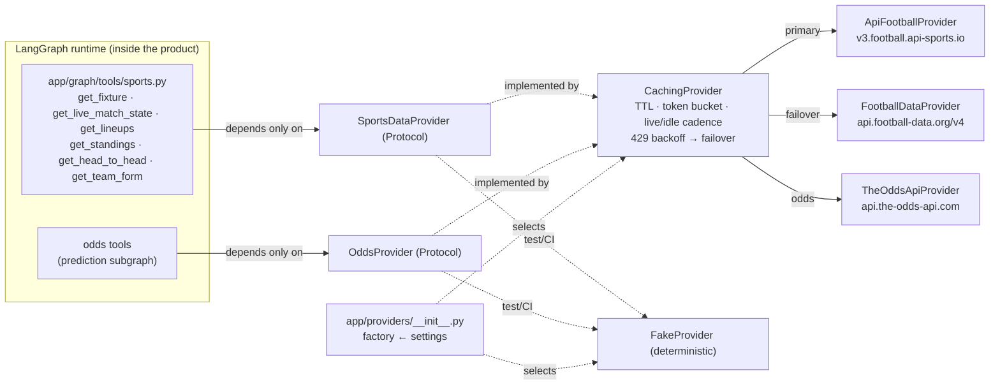

# 03 — Data & APIs

> Purpose: pin the sports-data + odds providers Pitch IQ depends on, the exact endpoints/response shapes used, the rate-limit/polling/caching/failover strategy, the provider-swappable tool abstraction (`SportsDataProvider`/`OddsProvider` Protocols + `CachingProvider` + `FakeProvider`), and the Pydantic data models — all faithful to `research/canonical-spec.md` §4.

**Layer note.** Everything here is the **(a) runtime layer** — provider behavior consumed by the LangGraph tools *inside the product*. How we *build* these modules (wf-02 `data-tools`, the `data-tool-researcher`/`adversarial-reviewer` agents) is the **(b) build layer** and lives in `06-workflows/`. The two are not mixed below.

This doc expands canonical-spec §4 (Data + provider abstraction). Where the spec is authoritative (file paths, model names, ids, versions) it is reproduced verbatim; where it is silent, elaboration is marked or flagged as an open question.

---

## 1. Decisive provider comparison

Three providers, three jobs: **API-Football** = primary live/fixture/standings source, **football-data.org** = zero-cost reconciliation/cold-backup, **The Odds API** = market line for the prediction critic. **Sportradar is deferred** (cost + ToS). All four are polling — none of API-Football, football-data.org, or The Odds API expose a public websocket/push feed; only enterprise Sportradar does.

| | **API-Football** (primary) | **football-data.org** (fallback) | **The Odds API** (odds) | Sportradar (deferred) |
|---|---|---|---|---|
| Role in Pitch IQ | Live state, fixtures, lineups, standings, H2H, form | Reconciliation + cold backup for fixtures/results/standings | Market odds → de-vigged win probabilities | — (not integrated) |
| WC2026 coverage | **Yes** — `league=1, season=2026` | **Yes, free tier** — competition code **`WC`** | **Yes** — sport key **`soccer_fifa_world_cup`** | Yes (global soccer) |
| API / version | v3 | v4 | v4 | v4 (probabilities) |
| Base URL | `https://v3.football.api-sports.io` | `https://api.football-data.org/v4` | `https://api.the-odds-api.com` | `api.sportradar.com/...` |
| Auth | header `x-apisports-key: <KEY>` | header `X-Auth-Token: <TOKEN>` | query param `apiKey=<KEY>` | header `x-api-key` |
| Free tier | **100 req/day + 10 req/min**, all endpoints, current season | 10 req/min, 12 comps, **DELAYED scores** | **500 credits/mo, no card** | 30-day trial, **non-commercial only** (cannot display data) |
| Paid entry (what we need) | **Pro $19/mo = 7,500/day, 300/min** (live realistically needs this) | Livescores add-on **€12/mo**; Deep Data (lineups/scorers) **€29/mo** | **$30/mo = 20K credits** | **~$10k+/mo** (no public price, signed Order Form) |
| Higher tiers | Ultra $29/mo (75K/day), Mega $39/mo (150K/day) | Standard €49 / Advanced €99 / Pro €199 | $59 (100K) / $119 (5M) / $249 (15M) | — |
| Live latency | **~15s** refresh (poll ≈1 req/min per in-play fixture) | delayed (free) / polling (paid) | **60s pre-match / 40s in-play** (ramps from 6h pre-kickoff) | sub-second (official push) |
| Win-prob | n/a (we don't use its `predictions`) | n/a | **derive** (`1/odds`, de-vig) | native 3-way (unused) |
| Push/websocket | No | No | No | Yes (only one) |
| ToS friction | Low; logo/redistribution limits — verify before resale | **Attribution required**; redistribution/caching ToS unread (open Q) | Low; commercial OK; no resell as standalone data; "18+ Gamble Responsibly" encouraged | **High**: §2.12 mandatory "powered by Sportradar" logo; §2.10/§8 gambling needs written approval; **§2.1 prediction-market clause may bar our use** |

### Why these picks (verified against `research/08-verification-verdicts.md`)
- **API-Football primary** — best price/coverage balance; full live match state (minute/score/added-time/events), lineups, 12-group standings and H2H in one cheap REST API. Verdict CONFIRMED: WC2026 (`league=1, season=2026`) fixtures, live in-play data, events, lineups and standings are flowing **right now (2026-06-30)** — group stage ended Jun 27, Round of 32 (Jun 28–Jul 3) underway. **Caveat (Risk #1):** 100/day + 10/min is impractical for 15s-refresh polling, so production live use realistically needs **Pro $19/mo**; coverage flags are `true` but "availability may vary from match to match" — handle missing lineups/events gracefully.
- **football-data.org fallback** — free, zero-cost source of truth for fixtures/results/group tables (code `WC`); used for reconciliation/redundancy and 429 failover. Accept delayed scores on free; **attribution string required**: "Football data provided by the Football-Data.org API".
- **The Odds API for odds** — explicitly carries WC2026 (`soccer_fifa_world_cup`), returns 3-way `h2h` decimal prices from 50+ books **including the sharp book Pinnacle (EU region, key `pinnacle`)**; we de-vig to fair probabilities. ~0.3% of Sportradar's cost for ~95% of the value, and ToS-clean.
- **Sportradar deferred** — B2B-only, ~$10k+/mo (third-party estimate, not an official quote), signed agreement + mandatory logo, and its **§2.1 prediction-market / "financial product" clause plausibly bars a prediction product like Pitch IQ**. Revisit only if official sub-second branded probabilities ever become a hard requirement *and* legal clears §2.1/§2.10.

**Env vars (canonical-spec §1):** `API_FOOTBALL_KEY`, `FOOTBALL_DATA_TOKEN`, `THE_ODDS_API_KEY`, plus `LIVE_POLL_SECONDS=60`, `BRIEFING_LEAD_HOURS=2`.

---

## 2. Endpoints used + response-shape highlights

Only the endpoints the tool layer actually calls are listed. Tournament identity is **provider-specific** — resolved per-provider from `tournaments.format_config` / `teams.external_ref` / `fixtures.external_ref` (jsonb), never hardcoded.

### 2.1 API-Football (v3) — `x-apisports-key`

| Tool method (§3) | HTTP call | Returns |
|---|---|---|
| `list_fixtures` (schedule) | `GET /fixtures?league=1&season=2026` | all 104 matches as the tournament progresses |
| `list_fixtures(live=True)` | `GET /fixtures?live=all` (or `?live=1`) | every in-play match (one call) |
| `get_fixture` | `GET /fixtures?id={id}` | single fixture, can embed events + lineups |
| `get_live_state` | `GET /fixtures?id={id}` + `GET /fixtures/events?fixture={id}` | minute/score/added-time + event feed |
| `get_lineups` | `GET /fixtures/lineups?fixture={id}` | XI + formations + bench |
| `get_standings` | `GET /standings?league=1&season=2026` | all 12 group tables |
| `get_head_to_head` | `GET /fixtures/headtohead?h2h={idA}-{idB}` | prior meetings |
| `get_team_form` | `GET /fixtures?team={id}&last={n}` | last-N results for WDL form |

**Fixture shape** (`response[].fixture`): `id, referee, timezone, date, timestamp, periods{first,second}, venue{id,name,city}, status{long,short,elapsed,extra}`; sibling objects `league{id,season,round}`, `teams{home,away}` (each with `winner`), `goals{home,away}`, `score{halftime,fulltime,extratime,penalty}`.
**Events shape** (`/fixtures/events`): `time{elapsed,extra}, team, player{id,name}, assist{id,name}, type` (Goal/Card/subst/Var), `detail, comments`. Added time is `90+4 → elapsed=90, extra=4`.
**Live status codes** (`status.short`): `1H / HT / 2H / ET / BT / P / FT / AET / PEN`. Drive logic off `status.short` (live window), `status.elapsed` (minute), `time.extra` (injury minutes).
> Open Q (from research/02): exact field-level JSON for `/fixtures/events` (VAR sub-types, assist nulls) was inferred from v3 docs, not read from a live WC2026 response — `FakeProvider` fixtures + `respx` recordings should be reconciled against a real call during wf-02.

### 2.2 football-data.org (v4) — `X-Auth-Token`

| Use | HTTP call | Notes |
|---|---|---|
| Fixtures/results | `GET /v4/competitions/WC/matches` | free; scores delayed |
| Standings | `GET /v4/competitions/WC/standings` | TOTAL/HOME/AWAY group tables |
| Single match | `GET /v4/matches/{id}` | lineups/scorers = paid Deep Data add-on |
| Head-to-head | `GET /v4/matches/{id}/head2head` | reconciliation |

**Match fields:** `id, utcDate, status, minute, injuryTime, matchday, stage, group, score{winner,duration,fullTime,halfTime}`; `homeTeam/awayTeam` (with `coach, formation, lineup, bench, statistics` on paid); arrays `goals/bookings/substitutions/penalties/referees`.
**Status enum:** `SCHEDULED, TIMED, IN_PLAY, PAUSED, FINISHED, SUSPENDED, POSTPONED, CANCELLED, AWARDED`.
> Open Q (research/02): full ToS redistribution/caching rules were not machine-readable; attribution confirmed only via third party — verify directly before commercial caching.

### 2.3 The Odds API (v4) — `apiKey` query param

Core call (1 credit = markets × regions):
```
GET /v4/sports/soccer_fifa_world_cup/odds/?apiKey=KEY&regions=eu&markets=h2h&oddsFormat=decimal
```
Free helpers (0 credits): `GET /v4/sports`, `GET /v4/sports/soccer_fifa_world_cup/events`.

**Response shape** (array of events):
```json
{
  "id": "...", "sport_key": "soccer_fifa_world_cup",
  "commence_time": "2026-06-30T19:00:00Z",
  "home_team": "Netherlands", "away_team": "Japan",
  "bookmakers": [{
    "key": "pinnacle", "title": "Pinnacle", "last_update": "...",
    "markets": [{ "key": "h2h", "outcomes": [
      {"name": "Netherlands", "price": 1.97},
      {"name": "Japan",       "price": 3.6},
      {"name": "Draw",        "price": 3.6}]}]
  }]
}
```
**Quota headers:** `x-requests-remaining`, `x-requests-used`, `x-requests-last` — read these to drive the token bucket and tier alarms. Anchor on `pinnacle` (EU); fall back to Betfair Exchange or a multi-book median if Pinnacle is absent for a fixture.

---

## 3. Tool-interface abstraction (provider-swappable)

`app/providers/base.py` defines the `Protocol`s + Pydantic models. Tools in `app/graph/tools/sports.py` depend **only on the Protocol**, never a concrete client — so swapping API-Football for football-data.org (or `FakeProvider` in tests) is a config change in `app/providers/__init__.py`, with zero graph edits.

```python
# app/providers/base.py
class SportsDataProvider(Protocol):
    async def list_fixtures(self, t: TournamentRef, *, date=None, live=False) -> list[Fixture]: ...
    async def get_fixture(self, ref: ProviderRef) -> Fixture: ...
    async def get_live_state(self, ref: ProviderRef) -> LiveMatchState: ...
    async def get_lineups(self, ref: ProviderRef) -> Lineups: ...
    async def get_standings(self, t: TournamentRef) -> Standings: ...
    async def get_head_to_head(self, a: TeamRef, b: TeamRef) -> HeadToHead: ...
    async def get_team_form(self, team: TeamRef, n: int = 5) -> TeamForm: ...

class OddsProvider(Protocol):
    async def get_match_odds(self, a: TeamRef, b: TeamRef, kickoff) -> MatchOdds: ...        # raw decimal
    async def get_win_probabilities(self, a, b, kickoff) -> WinProbabilities: ...            # de-vigged
```

**Implementations** (all in `app/providers/`):
- `ApiFootballProvider` (`api_football.py`) — primary `SportsDataProvider`.
- `FootballDataProvider` (`football_data.py`) — fallback `SportsDataProvider`.
- `TheOddsApiProvider` (`the_odds_api.py`) — `OddsProvider`; owns the de-vig math.
- `CachingProvider` (`caching.py`) — **decorator** wrapping any provider: TTL cache + per-provider token-bucket rate limit + live/idle cadence + 429 backoff + failover to the fallback `SportsDataProvider`.
- `FakeProvider` (`fake.py`) — deterministic fixtures for tests/CI (paired with `InMemorySaver` for graph tests; `respx` mocks real HTTP for provider unit tests).
- Factory in `app/providers/__init__.py` selects + wires impls from `settings`.



---

## 4. Rate-limit / polling / caching / failover strategy

The `CachingProvider` decorator and the scheduler-owned `poller` service (`app/services/poller.py`) jointly keep us inside free/Pro caps during the seasonal spike.

**Token bucket** — one bucket per provider sized to the tier ceiling, so concurrent tools/jobs share a budget instead of independently blowing the cap:
- API-Football Pro: ~300/min, 7,500/day.
- football-data.org free: 10/min.
- The Odds API: budget by monthly credits (1 credit per `h2h × eu` call); read `x-requests-remaining` to back off as the quota nears zero.

**Caching cadence (TTL):**
| Data | TTL | Refresh trigger |
|---|---|---|
| fixtures / standings | 6–24h | nightly sync; tighten near kickoff |
| lineups | ~1h pre-kickoff | published ~1h before kickoff |
| odds | ≤ 6h pre-match | ramp toward kickoff |
| live state | **`LIVE_POLL_SECONDS=60`** | **only while a relevant fixture is in its live window** |

**Live-window-only polling.** `poll_live()` (interval job, `LIVE_POLL_SECONDS`) runs **only when a user-relevant fixture has `status.short` in the live set** (`1H/HT/2H/ET/BT/P/PEN`). It writes live state into the `fixtures` cache, emits SSE to the live panel, and on `FT/AET/PEN` triggers `score_settled_fixtures()`. Outside live windows: 1 call/day per fixture. This is the core cost lever (Risk #1) — API-Football live refreshes ~15s, but we poll at 60s to fit the budget; sub-second is an explicit non-goal.

**429 / failure ladder:**
```
request → token bucket gate
  ├─ 200 → cache (TTL) → return
  ├─ 429 / RateLimitError → exponential backoff (retry within bucket)
  │        → on repeated 429 → FAILOVER to FootballDataProvider (fixtures/standings/H2H)
  └─ 5xx / timeout → backoff → failover → ProviderError if all sources fail
```
Failover is asymmetric: football-data.org can backstop fixtures/results/standings/H2H, but **not** live (delayed) or odds — odds have no fallback (The Odds API only), so the prediction critic must tolerate a missing market line (degrade, don't fabricate). Typed exceptions (`ProviderError, RateLimitError, AuthError, NotFound`) surface to FastAPI handlers → RFC-9457 `problem+json`.

---

## 5. Win-probability: de-vig formula

`TheOddsApiProvider.get_win_probabilities()` converts raw 3-way decimal odds into fair, normalized home/draw/away probabilities. Decimal price `d_i` → raw implied probability `1/d_i`; the three sum to **> 1** (the bookmaker overround / "vig"), so normalize:

$$ p_i = \frac{1/d_i}{\sum_j 1/d_j} \qquad (i,j \in \{\text{home},\text{draw},\text{away}\}) $$

Anchor on **Pinnacle** (sharpest book, key `pinnacle`, EU region); fall back to Betfair Exchange or a multi-book median. The result is the market benchmark the in-house model is scored against (Brier / log-loss / ECE vs market) — calibration target is **Brier ≤ market + 0.02** (canonical-spec success criteria).

**Worked example** (Netherlands 1.97 / Japan 3.6 / Draw 3.6):
```
raw:  1/1.97 = 0.5076   1/3.6 = 0.2778   1/3.6 = 0.2778   → Σ = 1.0632  (overround ≈ 6.32%)
fair: p_home = 0.5076/1.0632 = 0.4774
      p_draw = 0.2778/1.0632 = 0.2613
      p_away = 0.2778/1.0632 = 0.2613    → Σ = 1.0000
```
Emitted as `WinProbabilities(home=0.477, draw=0.261, away=0.261, source="pinnacle", devig=True)`. The prediction critic (`app/graph/subgraphs/prediction.py`) checks the generator's probabilities are valid, sum→1, and within a sane band of this no-vig line; it flags favorite-bias and rationale that cites vibes over form.

> Note (proportional de-vig). The `p_i = (1/d_i)/Σ(1/d_j)` method (canonical-spec §4.2) is the simplest and what we ship; more sophisticated vig-removal (Shin / power / logarithmic) is a possible later refinement, not MVP — listed only so the choice is explicit, not an open question.

---

## 6. Pydantic data models (`app/providers/base.py`)

All tool I/O is strict Pydantic `BaseModel` with `model_config = ConfigDict(extra="forbid")` (canonical-spec §3.1). These are the provider-layer DTOs the tools and graph state consume — distinct from the SQLAlchemy app-schema tables in `db/models.py` (persistence is doc `04`/spec §5).

| Model | Key fields | Purpose |
|---|---|---|
| `ProviderRef` | `provider: str, id: str` | provider-scoped opaque id (the WC id is `1` on API-Football, `WC`/match-id on football-data) |
| `TeamRef` | team identity (ref) | tool input for team-scoped calls |
| `TournamentRef` | tournament identity (ref) | resolves `league=1, season=2026` per provider |
| `Team` | `name, short_name, country_code, crest_url, external_ref` | display + cross-provider mapping |
| `Fixture` | `status, kickoff, home/away, score, score_et, pens, venue, round_key, group` | scheduled/result match |
| `MatchEvent` | `minute, extra, type, detail, team, player, assist` | one feed entry (goal/card/subst/VAR) |
| `LiveMatchState` | `status, minute, extra, score, events[]` | live-panel + Q&A "what's happening" |
| `Lineups` | `home_xi, away_xi, formations, bench` | starting XI / formation tool output |
| `Standings` | `groups[GroupTable]` | 12-group tables |
| `HeadToHead` | prior meetings | H2H tool output |
| `TeamForm` | `last_n[], wdl` | recent-form signal for critic |
| `MatchOdds` | `bookmaker, home, draw, away` | raw decimal prices |
| `WinProbabilities` | `home, draw, away, source, devig=True` | de-vigged market line (§5) |
| `DataFragment` | `kind, payload` | fan-in wrapper for the parallel `gathered` channel (briefing/prediction subgraphs) |

`DataFragment` is the bridge into graph state: parallel `gather_*` nodes each emit a `DataFragment` into `CompanionState.gathered: Annotated[list[DataFragment], operator.add]`, then the orchestrator reduces them (briefing `plan_briefing`, prediction `critic`).

---

## 7. Source URLs

**API-Football** — WC2026 guide: https://www.api-football.com/news/post/fifa-world-cup-2026-guide-to-using-data-with-api-sports · coverage: https://www.api-football.com/coverage · v3 docs: https://api-sports.io/documentation/football/v3 · rate limits: https://www.api-football.com/news/post/how-ratelimit-works · save-calls guide: https://www.api-football.com/news/post/how-to-save-calls-to-the-api · pricing: https://www.api-football.com/pricing
**football-data.org** — coverage: https://www.football-data.org/coverage · v4 match docs: https://docs.football-data.org/general/v4/match.html · policies: https://docs.football-data.org/general/v4/policies.html · pricing: https://www.football-data.org/pricing
**The Odds API** — WC odds: https://the-odds-api.com/sports/fifa-world-cup-odds.html · v4 guide: https://the-odds-api.com/liveapi/guides/v4/ · bookmaker list (Pinnacle confirmed): https://the-odds-api.com/sports-odds-data/bookmaker-apis.html · update intervals: https://the-odds-api.com/sports-odds-data/update-intervals.html · pricing: https://the-odds-api.com/ · terms: https://the-odds-api.com/terms-and-conditions.html
**Sportradar (deferred)** — probabilities overview: https://developer.sportradar.com/odds/reference/probabilities-overview · auth: https://developer.sportradar.com/getting-started/docs/authentication · T&C (§2.1/§2.10/§2.12): https://developer.sportradar.com/sportradar-updates/page/terms-and-conditions

---

## 8. Open questions (carry to wf-02 / sign-off)

1. **API-Football live event JSON** — reconcile `FakeProvider` + `respx` recordings against a real WC2026 `/fixtures/events` response (VAR sub-types, assist nulls); coverage flags `true` but vary per match — handle missing lineups/events. (research/02)
2. **football-data.org redistribution/caching ToS** — exact wording for commercial caching unread; verify directly before relying on it beyond cold backup. Attribution string is required. (research/02, spec open Q #6)
3. **The Odds API concurrent throughput** — no published hard concurrent rate-limit (only 429 on exceed); load-test in-play polling during simultaneous WC matches. (research/03)
4. **Budget ceiling for paid tiers** during the seasonal window (API-Football Pro $19/mo, Odds $30/mo) — spec open Q #11.
5. **Sportradar §2.1 prediction-market clause** — would Pitch IQ's critic use be deemed a prohibited "prediction market / financial product"? Must clear with Sportradar legal *before* any commitment. Deferred regardless for MVP. (research/03)
