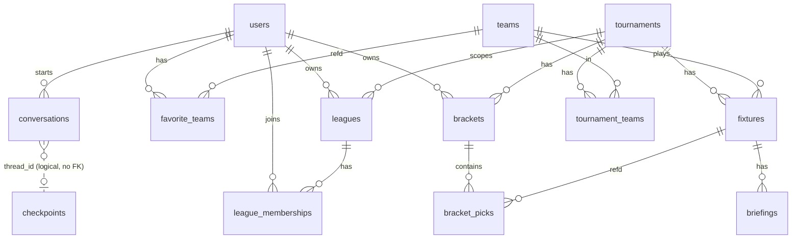
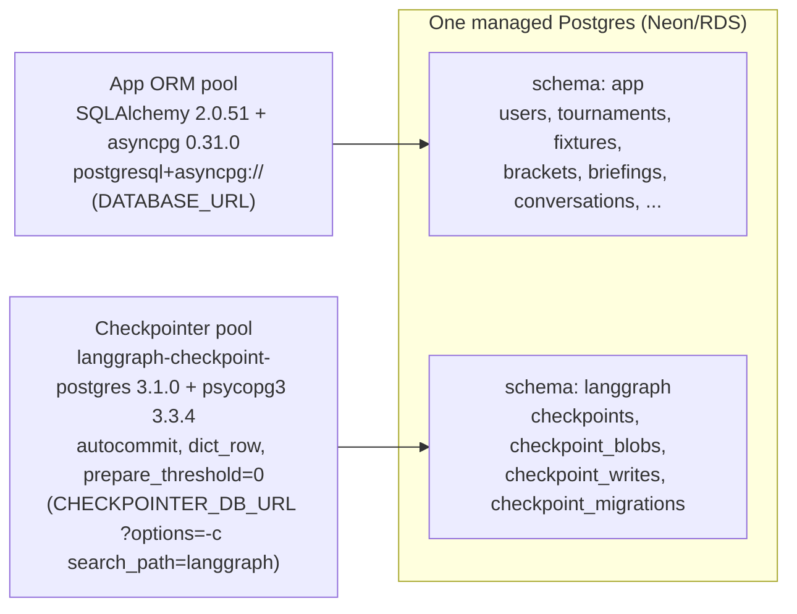
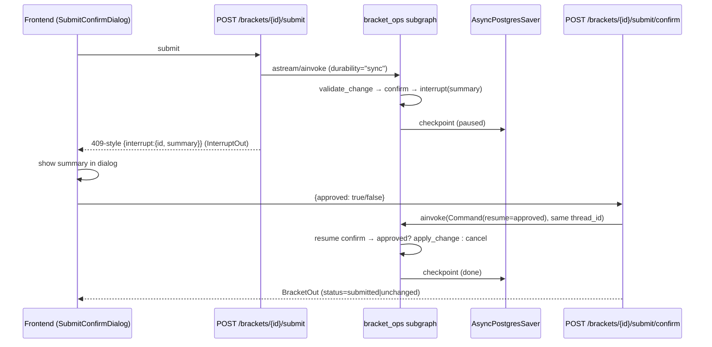

# 04 — Backend Plan (FastAPI)

> Purpose: the authoritative build plan for the Pitch IQ `backend/` service — folder tree, async endpoint signatures, lifespan singletons, two-pool/two-schema persistence, the APScheduler briefing pipeline, error model, and testing strategy — expanded faithfully from the canonical spec (`research/canonical-spec.md` §5 + §6).

This doc is the **single source of truth's backend chapter**. Where it touches the graph it references the LangGraph design (spec §3) but does not re-specify it.

## 0. Scope & the two-layer rule

Two layers are kept strictly separate throughout this plan:

- **Runtime (inside the product):** everything below — FastAPI process behavior, the compiled `companion_graph`, SSE streaming, the scheduler, the DB. This is what *runs in production*.
- **Build workflow (how we make it):** the FastAPI service is built by **wf-06 api-streaming** (spec §8) — a *dynamic Claude Code workflow* fanned out ~6 ways (auth · chat-SSE · brackets · leagues+briefings · tournaments · scheduler) **after** a turn-by-turn SSE spike, verified by `adversarial-reviewer` against the §6 signatures + httpx/SSE tests, and saved as `/review-endpoints`. The `fastapi-builder` subagent owns it (Sonnet; **Opus for SSE**). Build mechanics are **out of scope for this doc** except where called out.

When this doc says "the graph", it means the runtime artifact compiled in `lifespan.py`; it never means a build step.

## 1. Pinned backend versions (quick reference)

All from spec §1 and the two research files (primary-source-verified 2026-06-30).

| Package | Version | Role | Source |
|---|---|---|---|
| fastapi | **0.138.2** | API framework | https://pypi.org/project/fastapi/ |
| starlette / uvicorn | **1.3.1** / **0.49.0** | ASGI / server | https://pypi.org/project/starlette/ · https://pypi.org/project/uvicorn/ |
| sse-starlette | **3.4.5** | SSE transport (`EventSourceResponse`) | https://pypi.org/project/sse-starlette/ |
| langgraph | **1.2.7** | graph runtime | https://pypi.org/pypi/langgraph/json |
| langgraph-checkpoint | **4.1.1** | base savers + `BaseStore` | spec §1 |
| langgraph-checkpoint-postgres | **3.1.0** | `AsyncPostgresSaver` / `AsyncPostgresStore` (psycopg3) | https://pypi.org/project/langgraph-checkpoint-postgres/ |
| SQLAlchemy | **2.0.51** (async) | app ORM (`postgresql+asyncpg://`) | https://pypi.org/project/SQLAlchemy/ |
| asyncpg | **0.31.0** | app DB driver | https://pypi.org/project/asyncpg/ |
| psycopg[binary,pool] | **3.3.4** | checkpointer pool only | https://pypi.org/project/psycopg/ |
| alembic | **1.18.5** | async migrations (`init -t async`) | https://pypi.org/project/alembic/ |
| APScheduler | **3.11.3** (`AsyncIOScheduler`) | scheduler — **NOT 4.x alpha** | https://pypi.org/project/APScheduler/ |
| PyJWT + pwdlib[argon2] | latest (pin in lock) | JWT HS256 + Argon2 hashing | spec §1 |
| Authlib | latest (⚠️ pin + verify at install) | Google OAuth2 code flow (Q5) | spec §1 |
| pydantic / pydantic-settings | **2.x** | schemas + env config | spec §1 |
| pytest / pytest-asyncio / httpx / respx | latest | tests | spec §6 |

> **Open question (spec §9 #5):** first-party `fastapi.sse.EventSourceResponse` exists in FastAPI ≥0.135 (PR #15030, [commit 2238155](https://github.com/fastapi/fastapi/commit/22381558446c5d1ac376680a6581dd63b3a04119); [tutorial](https://fastapi.tiangolo.com/tutorial/server-sent-events/)). The spec **chooses `sse-starlette` 3.4.5** as the dependable path (same semantics, cross-version). This plan uses `sse-starlette`. Migrating to `fastapi.sse` is a one-import swap if/when verified in 0.138.2 — tracked, not adopted.

## 2. Backend folder tree (spec §6, verbatim)

```
backend/
  pyproject.toml  uv.lock  alembic.ini  .env.example  Dockerfile
  alembic/ (env.py async, versions/)
  app/
    main.py            # FastAPI(), include routers, CORS, lifespan
    config.py          # pydantic-settings Settings
    lifespan.py        # build graph + savers + store + pools + scheduler(if RUN_SCHEDULER)
    deps.py            # get_settings, get_db, get_state, get_current_user
    security.py        # PyJWT HS256 + pwdlib[argon2]
    api/  health.py auth.py chat.py brackets.py leagues.py briefings.py tournaments.py
    schemas/  auth.py chat.py bracket.py league.py briefing.py tournament.py common.py
    db/  base.py models.py session.py repositories/{users,brackets,leagues,fixtures,briefings,conversations}.py
    graph/  state.py build.py router.py llm.py
            nodes/{ingest,chitchat,persist_memory}.py
            subgraphs/{qa_agent,prediction,briefing,bracket_ops}.py
            tools/{__init__,sports,bracket,rules}.py
    providers/  base.py api_football.py football_data.py the_odds_api.py caching.py fake.py __init__.py
    services/  briefing_service.py scoring_service.py poller.py
    scheduler/  scheduler.py jobs.py
    memory/  store.py
    eval/  datasets/{routing.jsonl,predictions.jsonl,groundedness.jsonl} evaluators.py run_evals.py
  tests/  conftest.py unit/ integration/ eval/
```

`graph/`, `providers/`, and `eval/` are specified in sibling planning docs (graph design = spec §3, providers = spec §4, evals = spec §9). This doc owns `main.py`, `config.py`, `lifespan.py`, `deps.py`, `security.py`, `api/`, `schemas/`, `db/`, `services/`, and `scheduler/`.

## 3. Lifespan singletons + dependency injection

### 3.1 Singletons built once in `app/lifespan.py`

Per the integration research, expensive resources are created once in an `@asynccontextmanager lifespan(app)` (the official replacement for deprecated `@app.on_event`; [docs](https://fastapi.tiangolo.com/advanced/events/)) and shared via `Depends`. The compiled graph is thread-safe to reuse; per-conversation isolation is by `thread_id` in the run config, so **one** compiled graph + **one** saver serves all requests.

```python
# app/lifespan.py
from contextlib import asynccontextmanager
from fastapi import FastAPI
from sqlalchemy.ext.asyncio import create_async_engine, async_sessionmaker
from langgraph.checkpoint.postgres.aio import AsyncPostgresSaver
from langgraph.store.postgres.aio import AsyncPostgresStore
from langgraph.store.memory import InMemoryStore

from app.config import get_settings
from app.graph.build import build_graph
from app.providers import build_providers          # factory → CachingProvider(...)
from app.scheduler.scheduler import build_scheduler # AsyncIOScheduler + SQLAlchemyJobStore

@asynccontextmanager
async def lifespan(app: FastAPI):
    s = get_settings()

    # (1) App DB — asyncpg pool, `app` schema (SQLAlchemy 2.0.51 async)
    engine = create_async_engine(s.DATABASE_URL, pool_size=10, max_overflow=20, pool_pre_ping=True)
    app.state.engine = engine
    app.state.sessionmaker = async_sessionmaker(engine, expire_on_commit=False)

    # (2) Checkpointer — psycopg3 pool, `langgraph` schema (search_path in the URL)
    #     CHECKPOINTER_DB_URL = "...?options=-c%20search_path%3Dlanggraph"
    cp_cm = AsyncPostgresSaver.from_conn_string(s.CHECKPOINTER_DB_URL)
    checkpointer = await cp_cm.__aenter__()
    await checkpointer.setup()                 # idempotent; creates langgraph.* tables on first run
    app.state._cp_cm = cp_cm                   # keep CM to close on shutdown
    app.state.checkpointer = checkpointer

    # (3) Long-term Store (cross-thread user facts, namespace ("user", user_id))
    if s.ENV == "prod":
        store_cm = AsyncPostgresStore.from_conn_string(s.CHECKPOINTER_DB_URL)
        store = await store_cm.__aenter__()
        await store.setup()
        app.state._store_cm = store_cm
    else:
        store = InMemoryStore()
    app.state.store = store

    # (4) Provider clients (CachingProvider wrapping API-Football / football-data / Odds API)
    app.state.providers = build_providers(s)

    # (5) Compiled graph — checkpointer + store attach at compile()
    app.state.graph = build_graph().compile(checkpointer=checkpointer, store=store)

    # (6) Scheduler — ONLY on the worker replica
    app.state.scheduler = None
    if s.RUN_SCHEDULER:
        scheduler = build_scheduler(s)          # AsyncIOScheduler + SQLAlchemyJobStore(DATABASE_URL)
        scheduler.start()
        app.state.scheduler = scheduler

    try:
        yield
    finally:
        if app.state.scheduler:
            app.state.scheduler.shutdown(wait=False)
        if getattr(app.state, "_store_cm", None):
            await app.state._store_cm.__aexit__(None, None, None)
        await app.state._cp_cm.__aexit__(None, None, None)
        await engine.dispose()
```

Notes pinned from research:
- `AsyncPostgresSaver` lives in `langgraph.checkpoint.postgres.aio`; `.from_conn_string()` is an async context manager; call `.setup()` once ([checkpoint-postgres README](https://github.com/langchain-ai/langgraph/blob/main/libs/checkpoint-postgres/README.md)).
- If you ever swap to a long-lived `psycopg AsyncConnectionPool`, connections **must** be `autocommit=True, row_factory=dict_row, prepare_threshold=0` or checkpoint ops raise `TypeError: tuple indices must be integers...` (spec §5; research/06 §2). The `search_path=langgraph` URL keeps these tables out of `public`.
- **Open question (spec §9 #4):** the exact `durability=` default and whether it is wired into `ainvoke` (langgraph #5741) is unconfirmed; this plan sets `durability="sync"` explicitly on HITL/scoring runs (§7) rather than relying on a default.

### 3.2 `app/deps.py` (DI surface)

| Dependency | Signature | Returns | Notes |
|---|---|---|---|
| settings | `def get_settings() -> Settings` | `Settings` | `@lru_cache`; pydantic-settings reads env (spec §2 env list) |
| app state | `def get_state(request: Request) -> State` | `request.app.state` | exposes `graph`, `checkpointer`, `store`, `engine`, `sessionmaker`, `providers`, `scheduler` |
| db session | `async def get_db(state=Depends(get_state)) -> AsyncIterator[AsyncSession]` | `AsyncSession` | `async with state.sessionmaker() as s: yield s` |
| current user | `async def get_current_user(token=Depends(oauth2_scheme), db=Depends(get_db)) -> User` | `User` | decode JWT (`security.decode_token`), load user; raise `AuthError`→401 on `InvalidTokenError` |

`oauth2_scheme = OAuth2PasswordBearer(tokenUrl="/api/auth/login")`. `app/security.py` (PyJWT HS256 + `pwdlib[argon2]`): `hash_password(pw)`, `verify_password(pw, h)`, `create_access_token(sub, ttl=ACCESS_TOKEN_TTL_MIN)`, `decode_token(tok) -> dict`. The custom dependency (~40 lines) is preferred over `fastapi-users` 15.0.5 (maintenance mode) per the integration research.

**Google OAuth (Q5 resolved).** `app/security.py` also configures an **Authlib** OAuth client (`oauth.register("google", ...)` reading `GOOGLE_CLIENT_ID`/`GOOGLE_CLIENT_SECRET`/`OAUTH_REDIRECT_URI`). Flow: `/api/auth/google/login` returns Google's consent redirect; `/api/auth/google/callback` exchanges the `code`, reads the verified Google profile, **upserts the user by `(auth_provider="google", auth_subject=<google sub>)`**, and returns the *same* PyJWT session token as password login (Google is only the identity handshake; our HS256 JWT stays the session credential). Password accounts have `auth_provider="password"`; `users.password_hash` is **nullable** (null for OAuth-only accounts). ⚠️ Pin `authlib` exact version at install.

### 3.3 `app/main.py`

```python
app = FastAPI(title="Pitch IQ API", lifespan=lifespan)
app.add_middleware(CORSMiddleware, allow_origins=settings.CORS_ORIGINS, allow_credentials=True,
                   allow_methods=["*"], allow_headers=["*"])
for r in (health, auth, chat, brackets, leagues, briefings, tournaments):
    app.include_router(r.router)            # auth/health unprefixed-ish; others under /api
register_exception_handlers(app)            # §8 problem+json
```

## 4. Endpoint catalog (async signatures + Pydantic schemas)

All handlers are `async def`. All routes except `auth` and `health` require `user: User = Depends(get_current_user)`. Request/response schema names map to `app/schemas/*.py`. JSON bodies use Pydantic models; `login` uses `OAuth2PasswordRequestForm`.

### 4.1 Health (`api/health.py`) — `schemas/common.py`

```python
@router.get("/healthz", response_model=HealthOut)                 # {status, db, checkpointer}
async def healthz(state=Depends(get_state)) -> HealthOut: ...
```

### 4.2 Auth & profile (`api/auth.py`) — `schemas/auth.py`

```python
@router.post("/api/auth/register", response_model=TokenOut, status_code=201)
async def register(body: RegisterIn, db=Depends(get_db)) -> TokenOut: ...

@router.post("/api/auth/login", response_model=TokenOut)
async def login(form: OAuth2PasswordRequestForm = Depends(), db=Depends(get_db)) -> TokenOut: ...

@router.get("/api/auth/google/login")                              # 302 → Google consent
async def google_login(request: Request) -> RedirectResponse: ...

@router.get("/api/auth/google/callback", response_model=TokenOut)  # Authlib code exchange → upsert by auth_subject
async def google_callback(request: Request, db=Depends(get_db)) -> TokenOut: ...

@router.get("/api/me", response_model=UserOut)
async def me(user=Depends(get_current_user)) -> UserOut: ...

@router.put("/api/me/favorite-teams", response_model=UserOut)
async def set_favorites(body: FavTeamsIn, user=Depends(get_current_user), db=Depends(get_db)) -> UserOut: ...
```
Schemas: `RegisterIn(email, password, display_name, timezone?)`, `TokenOut(access_token, token_type="bearer")`, `UserOut(id, email, display_name, timezone, favorite_team_ids[])`, `FavTeamsIn(team_ids: list[UUID])`.

### 4.3 Chat — SSE (`api/chat.py`) — `schemas/chat.py`

```python
from sse_starlette.sse import EventSourceResponse, ServerSentEvent

@router.post("/api/chat", response_model=None)                    # streaming; not a JSON body
async def chat(body: ChatIn, user=Depends(get_current_user), state=Depends(get_state)):
    cfg = {"configurable": {"thread_id": body.thread_id or new_thread_id()},
           "context": CompanionContext(providers=state.providers, ...)}
    async def gen():
        async for chunk, meta in state.graph.astream(
            {"messages": [("user", body.message)],
             "user_id": str(user.id), "tournament_id": body.tournament_id},
            config=cfg, stream_mode="messages",                   # v2 token stream (spec §3.4)
        ):
            node = meta.get("langgraph_node")
            if node in USER_FACING_NODES and chunk.content:
                yield ServerSentEvent(event="token", data=chunk.content)
            elif node == "tools" and is_tool_event(chunk):
                yield ServerSentEvent(event="tool", data=tool_badge_json(chunk))
        yield ServerSentEvent(event="done", data="[DONE]")
    return EventSourceResponse(gen())
```
Schema: `ChatIn(thread_id: str | None, message: str, tournament_id: str)`. Emits SSE events **`token`**, **`tool`**, **`done`** (spec §6). Proxied by the Next.js `/api/chat` Route Handler (hides `BACKEND_URL`, injects auth, disables buffering). `sse-starlette` sets `text/event-stream`, `Cache-Control: no-cache`, `X-Accel-Buffering: no` and pings ~15s. `bracket_ops` does **not** stream here — it runs through §4.6.

### 4.4 Tournaments & fixtures (`api/tournaments.py`) — `schemas/tournament.py`

```python
@router.get("/api/tournaments/{slug}", response_model=TournamentOut)
async def get_tournament(slug: str, db=Depends(get_db)) -> TournamentOut: ...

@router.get("/api/tournaments/{slug}/fixtures", response_model=list[FixtureOut])
async def list_fixtures(slug: str, date: date | None = None, db=Depends(get_db)) -> list[FixtureOut]: ...

@router.get("/api/tournaments/{slug}/standings", response_model=StandingsOut)
async def standings(slug: str, db=Depends(get_db)) -> StandingsOut: ...

@router.get("/api/fixtures/{id}", response_model=FixtureOut)
async def get_fixture(id: UUID, db=Depends(get_db)) -> FixtureOut: ...

@router.get("/api/fixtures/{id}/live", response_model=None)        # SSE event feed (live panel)
async def fixture_live(id: UUID, user=Depends(get_current_user), state=Depends(get_state)):
    async def gen():
        cursor = None
        while True:
            fx, events = await read_live_cache(state, id, after=cursor)  # tail fixtures cache
            for e in events:
                yield ServerSentEvent(event="match_event", data=e.model_dump_json())
                cursor = e.id
            yield ServerSentEvent(event="score", data=fx.score_json())
            await asyncio.sleep(state.settings.LIVE_POLL_SECONDS)
    return EventSourceResponse(gen())
```
Schemas: `TournamentOut(id, slug, name, status, format_config, scoring_config)`, `FixtureOut(id, stage, round_key, group_label, home, away, kickoff_at, status, score, venue)`, `StandingsOut(groups: list[GroupTableOut])`. The live SSE **reads the `fixtures` cache** that the scheduler-owned `poller` writes (§6); see the cross-process note in §7.2.

### 4.5 Brackets — incl. HITL submit/confirm (`api/brackets.py`) — `schemas/bracket.py`

```python
@router.post("/api/brackets", response_model=BracketOut, status_code=201)
async def create_bracket(body: BracketCreateIn, user=Depends(get_current_user), db=Depends(get_db)) -> BracketOut: ...

@router.get("/api/brackets", response_model=list[BracketOut])
async def my_brackets(tournament_id: UUID, user=Depends(get_current_user), db=Depends(get_db)) -> list[BracketOut]: ...

@router.get("/api/brackets/{id}", response_model=BracketOut)
async def get_bracket(id: UUID, user=Depends(get_current_user), db=Depends(get_db)) -> BracketOut: ...

@router.patch("/api/brackets/{id}/picks", response_model=BracketOut)
async def edit_picks(id: UUID, body: PicksIn, user=Depends(get_current_user), db=Depends(get_db)) -> BracketOut: ...

# HITL step 1: run bracket_ops subgraph; if interrupt → 409-style envelope, else applied bracket
@router.post("/api/brackets/{id}/submit", response_model=None)     # InterruptOut | BracketOut
async def submit_bracket(id: UUID, user=Depends(get_current_user), state=Depends(get_state)): ...

# HITL step 2: resume the interrupted run with Command(resume=approved)
@router.post("/api/brackets/{id}/submit/confirm", response_model=BracketOut)
async def confirm_submit(id: UUID, body: ConfirmIn, user=Depends(get_current_user), state=Depends(get_state)) -> BracketOut: ...

@router.get("/api/brackets/{id}/score", response_model=ScoreOut)
async def bracket_score(id: UUID, user=Depends(get_current_user), db=Depends(get_db)) -> ScoreOut: ...
```
Schemas: `BracketCreateIn(tournament_id, name)`, `PicksIn(picks: list[PickIn])` where `PickIn(fixture_id?, round_key, pick_type, predicted_winner_team_id?, predicted_home_score?, predicted_away_score?, predicted_team_id?)`, `ConfirmIn(approved: bool)`, `BracketOut(id, tournament_id, name, status, total_score, picks[])`, `ScoreOut(bracket_id, total_score, per_pick[])`, and (spec §3.4) `InterruptOut(interrupt: InterruptInfo)` with `InterruptInfo(id, summary)`. Submit/confirm mechanics in §7.3.

### 4.6 Briefings (`api/briefings.py`) — `schemas/briefing.py`

```python
@router.get("/api/fixtures/{id}/briefing", response_model=BriefingOut)
async def get_briefing(id: UUID, type: BriefingType = "pre_match",
                       user=Depends(get_current_user), db=Depends(get_db)) -> BriefingOut: ...

@router.post("/api/briefings/{fixture_id}/generate", response_model=JobOut, status_code=202)
async def generate_briefing_now(fixture_id: UUID, user=Depends(get_current_user),
                                state=Depends(get_state)) -> JobOut: ...        # admin/manual
```
Schemas: `BriefingOut(id, fixture_id, type, status, content, content_format, model, generated_at)`, `JobOut(job_id: str)`. The manual generate enqueues the same `generate_briefing` job (§6) immediately (`scheduler.add_job(..., 'date', run_date=now)`); the GET returns `status in {pending|generating|ready|failed}` so the UI can poll.

### 4.7 Leagues (`api/leagues.py`) — `schemas/league.py`

```python
@router.post("/api/leagues", response_model=LeagueOut, status_code=201)
async def create_league(body: LeagueCreateIn, user=Depends(get_current_user), db=Depends(get_db)) -> LeagueOut: ...

@router.post("/api/leagues/join", response_model=LeagueOut)
async def join_league(body: JoinIn, user=Depends(get_current_user), db=Depends(get_db)) -> LeagueOut: ...

@router.get("/api/leagues/{id}/leaderboard", response_model=LeaderboardOut)
async def leaderboard(id: UUID, user=Depends(get_current_user), db=Depends(get_db)) -> LeaderboardOut: ...
```
Schemas: `LeagueCreateIn(tournament_id, name, max_members?, scoring_config?)`, `JoinIn(invite_code: str, bracket_id: UUID)`, `LeagueOut(id, name, invite_code, member_count, scoring_config?)`, `LeaderboardOut(league_id, rows: list[LeaderboardRow])` where `LeaderboardRow(user_id, display_name, bracket_id, total_score, rank)` — read from the denormalized `brackets.total_score` (spec §5), no recompute at read time.

### 4.8 Endpoint map

| Method | Path | Req schema | Resp schema | Auth | Router |
|---|---|---|---|---|---|
| GET | `/healthz` | — | `HealthOut` | no | health |
| POST | `/api/auth/register` | `RegisterIn` | `TokenOut` | no | auth |
| POST | `/api/auth/login` | OAuth2 form | `TokenOut` | no | auth |
| GET | `/api/auth/google/login` | — | 302 redirect | no | auth |
| GET | `/api/auth/google/callback` | `code,state` | `TokenOut` | no | auth |
| GET | `/api/me` | — | `UserOut` | yes | auth |
| PUT | `/api/me/favorite-teams` | `FavTeamsIn` | `UserOut` | yes | auth |
| POST | `/api/chat` | `ChatIn` | **SSE** `EventSourceResponse` | yes | chat |
| GET | `/api/tournaments/{slug}` | — | `TournamentOut` | yes | tournaments |
| GET | `/api/tournaments/{slug}/fixtures` | `?date=` | `list[FixtureOut]` | yes | tournaments |
| GET | `/api/tournaments/{slug}/standings` | — | `StandingsOut` | yes | tournaments |
| GET | `/api/fixtures/{id}` | — | `FixtureOut` | yes | tournaments |
| GET | `/api/fixtures/{id}/live` | — | **SSE** event feed | yes | tournaments |
| POST | `/api/brackets` | `BracketCreateIn` | `BracketOut` | yes | brackets |
| GET | `/api/brackets` | `?tournament_id=` | `list[BracketOut]` | yes | brackets |
| GET | `/api/brackets/{id}` | — | `BracketOut` | yes | brackets |
| PATCH | `/api/brackets/{id}/picks` | `PicksIn` | `BracketOut` | yes | brackets |
| POST | `/api/brackets/{id}/submit` | — | `InterruptOut \| BracketOut` | yes | brackets |
| POST | `/api/brackets/{id}/submit/confirm` | `ConfirmIn` | `BracketOut` | yes | brackets |
| GET | `/api/brackets/{id}/score` | — | `ScoreOut` | yes | brackets |
| GET | `/api/fixtures/{id}/briefing` | `?type=` | `BriefingOut` | yes | briefings |
| POST | `/api/briefings/{fixture_id}/generate` | — | `JobOut` | yes | briefings |
| POST | `/api/leagues` | `LeagueCreateIn` | `LeagueOut` | yes | leagues |
| POST | `/api/leagues/join` | `JoinIn` | `LeagueOut` | yes | leagues |
| GET | `/api/leagues/{id}/leaderboard` | — | `LeaderboardOut` | yes | leagues |

## 5. App DB schema, two-pool/two-schema, Alembic

### 5.1 Schema summary (spec §5 — authoritative)

12 app tables in the **`app`** schema, PK `id uuid` unless noted. The full column list is spec §5; relationships below.



Config-driven core: `tournaments.format_config jsonb` + `tournaments.scoring_config jsonb` de-hardcode the engine — a second tournament is a new `tournaments` row + provider id mapping with **zero DDL** (spec §0 success criterion). Scoring: rules in `tournaments.scoring_config` (overridable per `leagues.scoring_config`); `scoring_service` settles each `bracket_picks` row vs `fixtures` outcome → `points_awarded`/`is_correct`/`scored_at`; `brackets.total_score` denormalized for leaderboard reads.

Notable nullability that affects open questions:
- `briefings.user_id` **nullable** (null = shared/generic per fixture; set = personalized) — spec §9 #7 product decision affects the unique constraint + cache hit rate.
- `fixtures.home_team_id`/`away_team_id` nullable with `home_placeholder`/`away_placeholder` (e.g. "Winner Group A") for unresolved knockout slots.
- `conversations.thread_id text unique` is the **logical join** to checkpointer `checkpoints.thread_id` — keep it a UUID string < 255 chars, **no cross-schema FK** (checkpointer owns its tables/migrations).

### 5.2 Two pools, two schemas (one Postgres instance)



- **App pool** — `create_async_engine(DATABASE_URL)`; driver asyncpg 0.31.0; manages `app` tables only.
- **Checkpointer + Store pool** — psycopg3; `AsyncPostgresSaver`/`AsyncPostgresStore` have **no Python `schema=` arg** (only the JS port does — research/06 §2, verified against the [AsyncPostgresSaver API ref](https://reference.langchain.com/python/langgraph.checkpoint.postgres/aio/AsyncPostgresSaver)). Isolation is via `search_path=langgraph` in `CHECKPOINTER_DB_URL` (`?options=-c%20search_path%3Dlanggraph`). It owns its 4 tables via `setup()`.
- **Risk #6 (spec §9):** checkpointer/app schema collision → two schemas + separate pools, as above.

### 5.3 Alembic async migrations

Scaffold with `alembic init -t async` (alembic 1.18.5). `alembic/env.py` runs `run_migrations_online()` through an `AsyncEngine`, executing the sync migration body via `connection.run_sync(...)` (greenlet bridge), per the persistence research and the [official async template](https://pypi.org/project/alembic/).

```python
# alembic/env.py (key wiring)
from app.db.base import Base                 # imports app.db.models so all tables register
target_metadata = Base.metadata
config.set_main_option("sqlalchemy.url", settings.DATABASE_URL)  # asyncpg URL

def include_name(name, type_, parent_names):
    # Alembic manages ONLY the app schema; never autogenerate/drop langgraph.* (checkpointer owns it)
    if type_ == "schema":
        return name in ("app", None)
    return True

def do_run_migrations(connection):
    context.configure(connection=connection, target_metadata=target_metadata,
                      version_table_schema="app", include_schemas=True, include_name=include_name)
    with context.begin_transaction():
        context.run_migrations()
```

Rules:
- `Base = declarative_base(metadata=MetaData(schema="app"))` in `app/db/base.py`; the `citext` extension + `app`/`langgraph` schemas are created in the **first** migration (`CREATE SCHEMA IF NOT EXISTS ...`, `CREATE EXTENSION IF NOT EXISTS citext`).
- Alembic's `version_table` lives in `app` and `include_name` excludes the `langgraph` schema so autogenerate never tries to drop checkpointer tables.
- CI gate: `alembic upgrade head` runs in the integration suite (§9) on a throwaway Postgres.

## 6. Scheduler job design (`app/scheduler/`)

**Engine:** APScheduler **3.11.3** `AsyncIOScheduler` + a persistent `SQLAlchemyJobStore` on the same Postgres (reuses `DATABASE_URL`), started from `lifespan` **only when `RUN_SCHEDULER=true`**. Chosen over Celery (no native asyncio, broker + beat) and arq (maintenance-only) per the integration research. **NOT 4.x** (still alpha `4.0.0a6`).

```python
# app/scheduler/scheduler.py
def build_scheduler(s: Settings) -> AsyncIOScheduler:
    jobstores = {"default": SQLAlchemyJobStore(url=s.SYNC_DATABASE_URL)}  # sync psycopg/pg8000 URL for the store
    return AsyncIOScheduler(jobstores=jobstores, timezone="UTC")
```

> `SQLAlchemyJobStore` uses a sync driver; derive `SYNC_DATABASE_URL` from `DATABASE_URL` (strip `+asyncpg`). The app ORM stays async; only the jobstore is sync. The store table lives in `app` (or a `scheduler` schema) and is **not** Alembic-managed (APScheduler creates it).

### 6.1 Jobs (`app/scheduler/jobs.py`)

| Job | Trigger | Id / dedupe | Action |
|---|---|---|---|
| `schedule_briefings(tournament_id)` | called by `nightly_sync` / on startup | per-fixture child jobs | scan upcoming fixtures; for each add a `'date'` job → `generate_briefing(fixture_id)` at `kickoff − BRIEFING_LEAD_HOURS` (default 2h), id `briefing:{fixture_id}`, `replace_existing=True` |
| `generate_briefing(fixture_id)` | `'date'` (one-off, kickoff−2h) | id `briefing:{fixture_id}` | call `briefing_service` → runs the **briefing subgraph headless** with a system `thread_id`; upsert `briefings` (`pending→generating→ready/failed`) |
| `poll_live()` | `'interval'`, `LIVE_POLL_SECONDS` (60) | id `poll_live`, `max_instances=1` | active only while a relevant fixture is in its `live` window; `poller` writes live state to the `fixtures` cache; on FT triggers `scoring_service.score_settled_fixtures()` |
| `nightly_sync()` | `'cron'` (nightly) | id `nightly_sync` | refresh fixtures/standings, `(re)schedule_briefings`, reconcile vs football-data.org fallback |

```python
scheduler.add_job(generate_briefing, "date",
                  run_date=fixture.kickoff_at - timedelta(hours=settings.BRIEFING_LEAD_HOURS),
                  args=[str(fixture.id)], id=f"briefing:{fixture.id}", replace_existing=True)
```

```mermaid
sequenceDiagram
    participant N as nightly_sync (cron)
    participant SB as schedule_briefings
    participant AP as APScheduler (SQLAlchemyJobStore)
    participant GB as generate_briefing (date, kickoff-2h)
    participant BS as briefing_service
    participant G as briefing subgraph (headless)
    participant DB as briefings table
    N->>SB: scan upcoming fixtures
    SB->>AP: add_job('date', id=briefing:{fx}, replace_existing=True)
    Note over AP: persisted; survives restart
    AP->>GB: fire at kickoff-2h
    GB->>BS: generate(fixture_id)
    BS->>DB: status=generating
    BS->>G: invoke (system thread_id)
    G-->>BS: Briefing(content, sections)
    BS->>DB: status=ready, content, model, generated_at
```

### 6.2 Single-process caveat (Risk #4)

APScheduler in-process under **multiple uvicorn workers double-fires** (one briefing per worker). Mitigation (spec §2): run the scheduler on a **single dedicated worker replica** — same FastAPI image with `RUN_SCHEDULER=true`, 1 replica — while web replicas run `RUN_SCHEDULER=false` and scale horizontally. The persistent `SQLAlchemyJobStore` makes one-off jobs **survive restarts**; `id` + `replace_existing=True` prevents duplicate jobs on each boot. A Postgres advisory-lock leader election is the later upgrade if the worker must scale > 1 (open question, spec §9 #9 hosting target).

> **Cross-process note (design, see §7.2):** because `poll_live()` runs in the worker process, its "push SSE" is realized as **DB fan-out** — the poller writes the `fixtures` cache; the web-process `/api/fixtures/{id}/live` endpoint tails that cache at `LIVE_POLL_SECONDS` and emits to connected clients. Direct in-memory push across processes requires Redis pub/sub (deferred to post-MVP; consistent with the "we poll, no sub-second push" non-goal).

## 7. Streaming & interrupts (runtime mechanics)

### 7.1 Chat token stream

MVP path (spec §3.4): `graph.astream(input, config, stream_mode="messages")` (v2, stable) yields `(chunk, meta)`; filter `meta["langgraph_node"]` to the user-facing node(s) (the `qa_agent`/`chitchat` output, plus a `tool` badge from the `tools` node). The typed-projection `astream_events(version="v3")` is recommended-but-beta — migrate behind GA (Risk #2). `streaming=True` on the chat model is required; on Python <3.11 pass `RunnableConfig` explicitly (research/04) — our floor is Python ≥3.12 so this does not bite us.

### 7.2 Live panel stream

`/api/fixtures/{id}/live` is an `EventSourceResponse` that tails the `fixtures` cache (events table / `raw` payload) written by the scheduler `poller`, emitting `match_event` and `score` SSE events at `LIVE_POLL_SECONDS`. No client-driven provider calls — the poller is the single live reader, respecting provider rate caps (spec §4.3).

### 7.3 HITL bracket submit/confirm (interrupt + resume)

`bracket_ops` runs through the **brackets API, not the chat stream** (spec §3.4). The submit run executes the graph with `durability="sync"`; the `confirm` node calls `interrupt(change_summary)`.



`apply_change` is the **only consequential write** (lock/submit) and is **idempotent** (interrupt re-runs the node from the top on resume): side effects happen **after** `interrupt()`, interrupt order is deterministic, and there is **never a bare `except` around `interrupt()`** (Risk #5; spec §3.3). The submit response uses a 409-style envelope `InterruptOut(interrupt=InterruptInfo(id, summary))`; confirm resumes via `Command(resume=body.approved)`.

## 8. Error handling — typed exceptions → RFC-9457 problem+json

Domain code raises **typed exceptions** (spec §6); a small set of exception handlers (registered in `main.py`) translate them to RFC-9457 `application/problem+json`. `schemas/common.py` defines `ProblemDetail(type, title, status, detail, instance?)`.

| Exception | HTTP | `title` | Raised by |
|---|---|---|---|
| `AuthError` | 401 | `authentication_failed` | `get_current_user`, login |
| `NotFound` | 404 | `not_found` | repositories (bracket/fixture/league missing) |
| `RateLimitError` | 429 | `provider_rate_limited` | `CachingProvider` token bucket / provider 429 |
| `ProviderError` | 502 | `upstream_provider_error` | provider clients after failover exhausted |
| `RequestValidationError` (FastAPI) | 422 | `validation_error` | request body validation |
| `Exception` (catch-all) | 500 | `internal_error` | unhandled (logged, no internals leaked) |

```python
@app.exception_handler(ProviderError)
async def provider_err(request: Request, exc: ProviderError):
    return JSONResponse(status_code=502, media_type="application/problem+json",
        content=ProblemDetail(type="about:blank", title="upstream_provider_error",
                              status=502, detail=str(exc)).model_dump())
```

Inside the SSE generators, errors after headers are sent cannot change the HTTP status — emit a terminal `ServerSentEvent(event="error", data=...)` then close, and log with the LangSmith trace id.

## 9. Testing strategy

Test pyramid (spec §6 + §9), all async via `pytest-asyncio`:

| Layer | Tooling | What it asserts |
|---|---|---|
| Unit (most) | pytest + pytest-asyncio | repositories, scoring rules (`scoring_config` JSONB), schema validation (`extra="forbid"`), security (hash/verify/JWT) |
| Provider | `respx` mocks provider HTTP | API-Football/football-data/Odds API parsing, de-vig math, caching TTL + token-bucket + failover |
| API integration | `httpx.ASGITransport` against the app | every endpoint contract vs §6 signatures; auth 401s; problem+json shape |
| Graph integration | `FakeProvider` + `InMemorySaver` | routing decisions, critic loop terminates ≤2 rounds, briefing `Send` fan-in, ingest/persist_memory |
| SSE smoke | httpx streaming client | `/api/chat` yields ≥1 `token` frame then `done`; `/api/fixtures/{id}/live` yields `match_event`/`score` |
| HITL | `InMemorySaver` + ASGITransport | submit returns `InterruptOut`; confirm(`approved=true`) applies once and is idempotent on re-run; confirm(`approved=false`) cancels |
| Migrations | throwaway Postgres | `alembic upgrade head` succeeds; `app`/`langgraph` schemas isolated |
| Eval (gated) | `langsmith[pytest]` + openevals | routing macro-F1, prediction Brier vs market, groundedness — **wf-08**, nightly/PR-gated, `LANGSMITH_TEST_CACHE` on |

Key fixtures in `tests/conftest.py`:
- `app` built with `lifespan` overrides → `InMemorySaver`/`InMemoryStore`, `FakeProvider`, `RUN_SCHEDULER=false`.
- `client = httpx.AsyncClient(transport=ASGITransport(app=app), base_url="http://test")`.
- `auth_headers` fixture mints a JWT via `security.create_access_token`.
- Graph tests import the compiled graph with `FakeProvider` (deterministic fixtures) so no network and no flakiness.

Gate command (spec §9): `uv run ruff check . && uv run mypy app && uv run pytest -q`. Evals: `uv run pytest -m langsmith`.

## 10. Open questions (carried from spec §9; resolve at build time)

1. **`fastapi.sse` in 0.138.2?** If first-party `EventSourceResponse` ships and is verified, swap the import; until then `sse-starlette` 3.4.5 stands (§1).
2. **`durability` default + `ainvoke` wiring** (langgraph #5741) — we set `durability="sync"` explicitly on HITL/scoring runs rather than trust a default (§3.1, §7.3).
3. **Cross-process live push** — MVP tails the `fixtures` cache from the web SSE endpoint; Redis pub/sub is the post-MVP upgrade (§6.2, §7.2).
4. **`briefings.user_id` nullability** — personalized-per-user vs shared-per-fixture changes the unique constraint + cache hit rate (spec §9 #7).
5. **Leagues single- vs multi-tournament** — MVP scopes a league to one `tournament_id`; season-long needs a `league_tournaments` join (spec §9 #8).
6. **Scheduler topology** — single worker replica for MVP; advisory-lock leader election if the worker must scale > 1 (depends on hosting target, spec §9 #9).
7. **OpenAI snapshot ids** for `MODEL_ROUTER/AGENT/CRITIC` — verify vs OpenAI's live model list before pinning in `app/graph/llm.py` (spec §9 #1).
8. **`EncryptedSerializer` scope** — whether to enable at-rest checkpoint encryption (`LANGGRAPH_AES_KEY`) for self-host vs platform (spec §9 #12).
