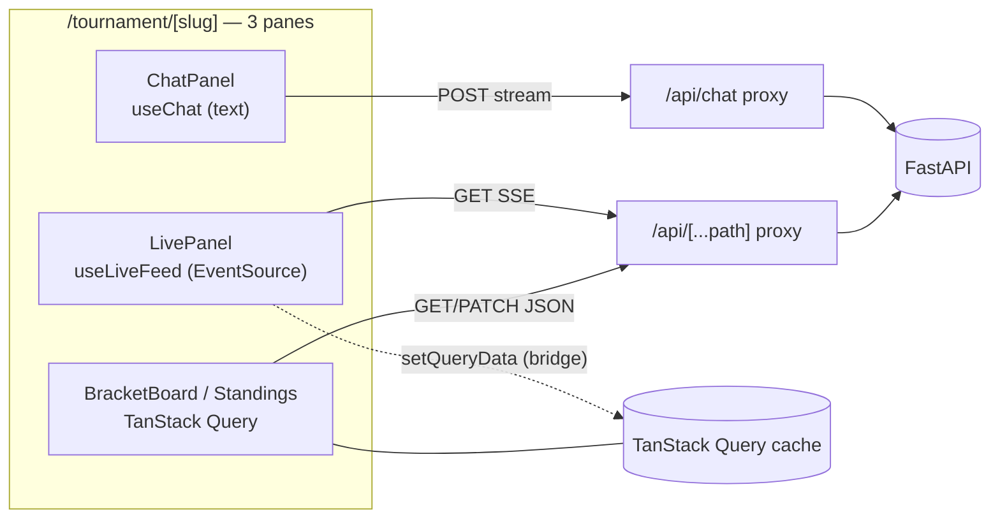
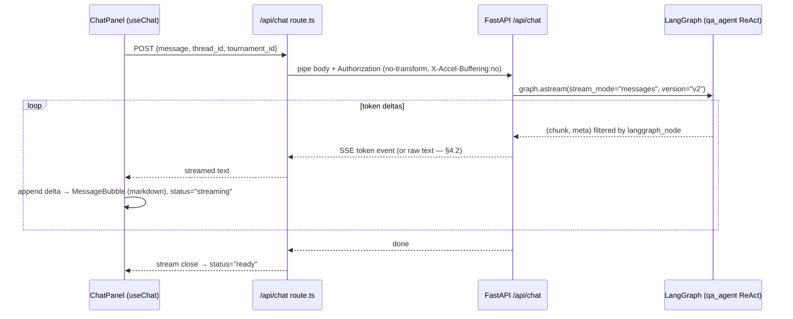

# 05 — Frontend Plan (Next.js)

> Purpose: the authoritative build plan for the Pitch IQ web client — folder tree, routes, components, the three decoupled streams (chat / live / query cache), and the corrected streaming wiring — expanded from `research/canonical-spec.md` §7 (which wins on every conflict).

---

## 0. Scope & the two-layer rule

This doc covers the **product's frontend** — the browser surface a fan uses during FIFA World Cup 2026. Keep the two layers the canonical spec mandates strictly separate:

- **(a) LangGraph runtime patterns** = behavior *inside the product*. The chat companion, the ReAct Q&A loop, the gen→critic prediction, and the bracket-submit **human-in-the-loop interrupt** all live in the **FastAPI/LangGraph backend** (`backend/app/graph/*`, see `02-langgraph-design.md` / spec §3). The frontend only *renders* their output and *surfaces* the HITL approval. The browser never calls an LLM and never imports LangGraph.
- **(b) Claude Code dynamic workflows** = how we *build* the product. This entire client is produced by **wf-07 frontend** (spec §8): a parallel build-workflow, ~6 fan-out units, `nextjs-builder` subagent (Sonnet), verified by typecheck + Playwright smoke + visual review. That is build-time orchestration; it has nothing to do with how the app behaves at runtime. See §9 below.

The frontend is a **transport edge**: it proxies token streams and JSON to FastAPI, hides `BACKEND_URL`, injects auth, and renders. Nothing more.

### Pinned versions (Node ≥ 22, pnpm)

| Package | Pin | Role | Source (primary) |
|---|---|---|---|
| `next` | **16.2.9** | App Router, Turbopack default | https://registry.npmjs.org/next/latest |
| `react` / `react-dom` | **19.2.7** | UI (lockstep) | https://registry.npmjs.org/react/latest |
| `ai` | **7.0.8** | Vercel AI SDK core (`TextStreamChatTransport`) | https://registry.npmjs.org/ai/latest (pub. 2026-06-30) |
| `@ai-sdk/react` | **4.0.9** ⚠️ | `useChat` hook | https://registry.npmjs.org/@ai-sdk/react/latest |
| `@tanstack/react-query` | **5.101.2** | server cache (fixtures/standings/bracket) | https://registry.npmjs.org/@tanstack/react-query/latest |
| `tailwindcss` | **4.3.2** | CSS-first `@theme` styling | https://registry.npmjs.org/tailwindcss/latest (rel. 2026-06-29) |
| `shadcn` (CLI) | **4.12.0** | components (Tailwind v4 + React 19 native) | https://registry.npmjs.org/shadcn/latest |
| `typescript`, `eslint`, `prettier`, `vitest`, `@playwright/test` | latest | tooling/tests | spec §1 |

> ⚠️ **Open question (verify at install, spec OQ #2):** the AI SDK 7 announcement did not document which `@ai-sdk/react` pins against `ai@7.0.8`. We pin `@ai-sdk/react@4.0.9` from the npm `latest` dist-tag; **confirm the peer range resolves cleanly** (`pnpm why ai` / no peer warnings) before locking `pnpm-lock.yaml`. If it conflicts, bump to whatever `@ai-sdk/react` declares `ai@^7` as a peer.

---

## 1. Folder tree (exactly as spec §7)

```
frontend/
  package.json  pnpm-lock.yaml  next.config.ts  tsconfig.json  postcss.config.mjs  components.json  .env.example
  app/
    layout.tsx  globals.css(@import shadcn/tailwind)  page.tsx(dashboard)
    (auth)/login/page.tsx  (auth)/register/page.tsx
    tournament/[slug]/page.tsx     # 3-pane companion (Server Component prefetch → HydrationBoundary)
    bracket/[id]/page.tsx          # bracket editor
    league/[id]/page.tsx           # leaderboard
    api/chat/route.ts              # SSE proxy → FastAPI (no-transform, X-Accel-Buffering:no, auth inject)
    api/[...path]/route.ts         # generic JSON proxy → FastAPI
  components/
    chat/{ChatPanel,MessageList,MessageBubble,Composer,ToolBadge}.tsx
    bracket/{BracketBoard,MatchNode,PickEditor,SubmitConfirmDialog}.tsx   # SubmitConfirmDialog = HITL UI
    live/{LivePanel,EventFeed,MatchHeader}.tsx
    briefing/{BriefingCard,BriefingList}.tsx
    league/{Leaderboard,InvitePanel}.tsx
    ui/  # shadcn primitives (Card, Tabs, Badge, ScrollArea, Avatar, Skeleton, Dialog, Sonner, …)
  lib/  api.ts  types.ts  queries.ts(TanStack hooks)  format.ts
  providers/  QueryProvider.tsx
  hooks/  useLiveFeed.ts
```

**Env vars (frontend, spec §2):** `BACKEND_URL` (server-only — never `NEXT_PUBLIC_*`), `NEXT_PUBLIC_APP_URL`.

---

## 2. Routes & route handlers

### 2.1 Pages

| Route | File | Type | Responsibility |
|---|---|---|---|
| `/` | `app/page.tsx` | Server Component (dashboard) | landing for an authed fan: favorite teams, today's relevant fixtures, briefing list, links to bracket/league. Server `prefetchQuery` for the user's fixtures + briefings → `HydrationBoundary`. |
| `/login` | `app/(auth)/login/page.tsx` | Client form | POST `/api/auth/login` (OAuth2 form) via generic proxy → store JWT (httpOnly cookie, §5) → redirect `/`. |
| `/register` | `app/(auth)/register/page.tsx` | Client form | POST `/api/auth/register` (RegisterIn) → TokenOut → same as login. |
| `/tournament/[slug]` | `app/tournament/[slug]/page.tsx` | **Server Component → 3-pane** | the companion. Server-prefetches tournament + fixtures + standings + bracket, dehydrates into `HydrationBoundary`; renders `ChatPanel · LivePanel · BracketBoard`. |
| `/bracket/[id]` | `app/bracket/[id]/page.tsx` | Server + client editor | full-screen bracket editor: `BracketBoard` + `PickEditor` + Submit → `SubmitConfirmDialog` (HITL). |
| `/league/[id]` | `app/league/[id]/page.tsx` | Server + client | `Leaderboard` + `InvitePanel` (invite code, join). |

The `(auth)` route group keeps login/register out of the authed shell layout without affecting URLs (`/login`, `/register`).

### 2.2 The two proxy route handlers

Both run **server-side** (Node runtime). They are the only place `BACKEND_URL` and the bearer token are read. The browser is always **same-origin** → no CORS, secrets hidden.

**`app/api/chat/route.ts` — streaming SSE proxy** (token stream for `useChat`):

```ts
// app/api/chat/route.ts
import { cookies } from 'next/headers';

export const runtime = 'nodejs';        // need streaming + cookies; not edge-buffered
export const dynamic = 'force-dynamic'; // never cache a stream

export async function POST(req: Request) {
  const token = (await cookies()).get('pitchiq_token')?.value;
  const upstream = await fetch(`${process.env.BACKEND_URL}/api/chat`, {
    method: 'POST',
    headers: {
      'content-type': 'application/json',
      ...(token ? { authorization: `Bearer ${token}` } : {}),
    },
    body: req.body,        // pipe the client POST body straight up
    duplex: 'half',        // required to stream a request body in fetch
  });

  // Pipe the upstream token stream straight back to the browser, buffering disabled.
  return new Response(upstream.body, {
    status: upstream.status,
    headers: {
      'Content-Type': 'text/event-stream',
      'Cache-Control': 'no-cache, no-transform', // defeat compression/CDN buffering
      'X-Accel-Buffering': 'no',                  // defeat Nginx buffering
      Connection: 'keep-alive',
    },
  });
}
```

**`app/api/[...path]/route.ts` — generic JSON proxy** (everything non-streaming: auth, brackets, leagues, briefings, tournaments, fixtures). One handler covers GET/POST/PATCH/PUT/DELETE, forwards method + body + query, injects `Authorization`, and relays `Set-Cookie` on the auth paths:

```ts
// app/api/[...path]/route.ts  (sketch)
import { cookies } from 'next/headers';
export const runtime = 'nodejs';

async function proxy(req: Request, { params }: { params: Promise<{ path: string[] }> }) {
  const { path } = await params;
  const token = (await cookies()).get('pitchiq_token')?.value;
  const url = new URL(req.url);
  const upstream = await fetch(`${process.env.BACKEND_URL}/api/${path.join('/')}${url.search}`, {
    method: req.method,
    headers: {
      'content-type': req.headers.get('content-type') ?? 'application/json',
      ...(token ? { authorization: `Bearer ${token}` } : {}),
    },
    body: ['GET', 'HEAD'].includes(req.method) ? undefined : await req.text(),
  });
  return new Response(upstream.body, { status: upstream.status, headers: upstream.headers });
}
export const GET = proxy; export const POST = proxy; export const PATCH = proxy;
export const PUT = proxy; export const DELETE = proxy;
```

> Note: `/api/chat` is a **dedicated** handler (not swept up by `[...path]`) because Next routes the more specific segment first, and the chat path needs the streaming-specific response headers above. The live SSE feed (`/api/fixtures/{id}/live`) flows through the **generic** proxy — `upstream.body` is piped through unchanged and `EventSource` parses the SSE frames client-side (see §4.3); if buffering shows up there, give it its own dedicated streaming handler with the same headers as `/api/chat`.

---

## 3. Component breakdown

Real files under `components/`. All client components carry `'use client'`; shadcn primitives live in `ui/` (copied source, Tailwind v4 / React 19, no `forwardRef`, `data-slot` attrs, OKLCH tokens).

### 3.1 `chat/` — the companion chat (token stream)
| Component | Role |
|---|---|
| `ChatPanel.tsx` | owns `useChat({ transport: new TextStreamChatTransport({ api: '/api/chat' }) })`; passes a per-conversation `thread_id` + `tournament_id` in `sendMessage` body; renders `MessageList` + `Composer`; shows typing indicator while `status === 'streaming'`. |
| `MessageList.tsx` | `ScrollArea` of `MessageBubble`s; auto-scroll via a bottom sentinel + `IntersectionObserver`. |
| `MessageBubble.tsx` | renders one message's `parts`; `part.type === 'text'` rendered with stream-safe markdown (e.g. `react-markdown` — partial content renders fine). |
| `Composer.tsx` | textarea + send; `stop()` while streaming; disabled on `error`; submits to `sendMessage`. |
| `ToolBadge.tsx` | small `Badge` indicating a tool call (e.g. "checked live score"). **Note:** the **text protocol drops tool-call parts** (§4.1), so for the MVP this renders from a side-channel only if/when we add one, or stays dormant until the data-protocol upgrade. Keep it built but expect it inert at launch. |

### 3.2 `bracket/` — bracket board + HITL submit
| Component | Role |
|---|---|
| `BracketBoard.tsx` | the knockout tree: a **Tailwind CSS grid of `Card` nodes** (no shadcn bracket primitive exists) with connector lines drawn via borders/pseudo-elements. Reads bracket + fixtures from TanStack Query (`useSuspenseQuery`), `refetchInterval` during live windows. |
| `MatchNode.tsx` | one `Card` = one fixture/pick cell (teams, crests, predicted winner/score, scored badge). The grid unit referenced by "bracket = Tailwind grid of Card nodes." |
| `PickEditor.tsx` | edits a pick → `PATCH /api/brackets/{id}/picks` (PicksIn) via generic proxy; optimistic `setQueryData` then invalidate. |
| `SubmitConfirmDialog.tsx` | **the HITL UI.** A shadcn `Dialog` that displays the interrupt **summary** returned by the backend and the approve/cancel choice (see §4.4). This is the browser surface of the LangGraph `interrupt()` in `bracket_ops` — runtime layer (a). |

### 3.3 `live/` — "what's happening" panel (event stream)
| Component | Role |
|---|---|
| `LivePanel.tsx` | container; `Tabs`/`Card`/`Skeleton`; subscribes to the live feed via `useLiveFeed` (§4.3) for the user's relevant match. |
| `EventFeed.tsx` | append-only `ScrollArea` of `MatchEvent`s (goals, cards, subs, added-time) with `Badge`s. |
| `MatchHeader.tsx` | score + clock + status header, updated from the live feed. |

### 3.4 `briefing/` — pre/post-match briefings
| Component | Role |
|---|---|
| `BriefingCard.tsx` | renders a stored briefing (markdown `content`) with status (`pending`/`generating`/`ready`/`failed`); fetched via `GET /api/fixtures/{id}/briefing?type=pre_match`. |
| `BriefingList.tsx` | the dashboard list of upcoming briefings for the user's relevant fixtures. |

### 3.5 `league/` — private friend leagues
| Component | Role |
|---|---|
| `Leaderboard.tsx` | `GET /api/leagues/{id}/leaderboard` → ranked table (denormalized `brackets.total_score`). |
| `InvitePanel.tsx` | shows invite code; `POST /api/leagues/join` (JoinIn{invite_code, bracket_id}). |

### 3.6 `ui/` — shadcn primitives
Installed via the CLI (§6): `Card, Tabs, Badge, ScrollArea, Avatar, Skeleton, Dialog, Sonner` (toasts; the old `toast` is deprecated), plus `Button, Input, Textarea, Separator, Form` as needed. All copied source — themeable for World Cup styling.

---

## 4. Streaming integration (the corrected choice)

### 4.1 Chat token stream — `useChat` + `TextStreamChatTransport` (TEXT protocol)

**Decision (locked, spec §7 "corrected per verdict"):** use the **text protocol**, not the data/UI-message protocol.

```ts
// components/chat/ChatPanel.tsx
'use client';
import { useChat } from '@ai-sdk/react';
import { TextStreamChatTransport } from 'ai';

const { messages, sendMessage, status, stop, error } = useChat({
  transport: new TextStreamChatTransport({ api: '/api/chat' }),
});
// sendMessage({ text }, { body: { thread_id, tournament_id } })
```

**Why text, not data protocol — citation:** the AI SDK *does* support a richer UI-Message/Data-Stream protocol (SSE with header `x-vercel-ai-ui-message-stream: v1` and typed `text-delta`/`tool-input-*`/`finish` frames) consumed by `DefaultChatTransport`, and it *can* point at an external FastAPI URL. But the adversarial verdict (`research/08-verification-verdicts.md`, "useChat can consume a custom external FastAPI SSE stream") is explicit: the full data protocol is **byte-format-sensitive and the official FastAPI example has open, unresolved issues** — **[vercel/ai #7496](https://github.com/vercel/ai/issues/7496)** (opened 2025-07-23, still open) reports that after fixing the v4→v5 drift "the data protocol just doesn't work," while the **text protocol works**. The verdict's net: the text protocol or a Next proxy is "the more dependable choice in practice." So for the MVP we use `TextStreamChatTransport`, and the proxy hides the backend.

**Accepted cost of the text protocol (verdict):** "tool calls, token usage, and finish reasons are not available." That is why `ToolBadge` is inert at launch (§3.1) and why this is an **upgrade-later** path: once #7496 closes (or our FastAPI emits a verified UI-message stream), switch the transport to `DefaultChatTransport` to unlock tool/finish parts — a one-line client change plus a backend emitter change. (Risk #3 in spec §9.)

**Sources:** AI SDK transport — https://ai-sdk.dev/docs/ai-sdk-ui/transport · stream protocols — https://ai-sdk.dev/docs/ai-sdk-ui/stream-protocol · `useChat` ref — https://ai-sdk.dev/docs/reference/ai-sdk-ui/use-chat

### 4.2 Protocol contract between proxy and backend (`/api/chat`)

The backend `POST /api/chat` (spec §6) returns an `EventSourceResponse` (sse-starlette) with events `token`, `tool`, `done`. The `/api/chat/route.ts` proxy **pipes that body straight through** (§2.2) and disables buffering. The client `TextStreamChatTransport` then reads the streamed text.

> ⚠️ **Open question — SSE-frame vs raw-text reconciliation (verify in the wf-06 SSE spike before wf-07):** `TextStreamChatTransport` consumes a **plain-text token stream**; sse-starlette emits framed `event: token\ndata: …\n\n`. Two consistent resolutions, pick at build time:
> 1. **Backend emits raw text on the chat path** — the `/api/chat` endpoint streams bare token deltas (text/plain-ish), reserving `tool`/`done` framing for the future data-protocol path. Proxy = pure pass-through. (Simplest; matches the §2.2 sketch.)
> 2. **Proxy unwraps SSE → text** — keep the backend `EventSourceResponse`, and have `/api/chat/route.ts` pipe through a `TransformStream` that extracts `data:` lines from `token` events and drops `tool`/`done` control frames (the text protocol discards them anyway). 
>
> Both are faithful to spec; (1) is preferred for the MVP because it keeps the proxy a dumb pipe. **Confirm which one against `TextStreamChatTransport`'s actual parser behavior** when wf-06's SSE smoke test lands; do **not** assume it parses `event: token` framing.

### 4.3 Live panel — `EventSource` / `useLiveFeed`

The live "what's happening" feed is a **separate, server-push GET** (`GET /api/fixtures/{id}/live` → SSE, spec §6) — distinct from the chat stream. Per MDN, `EventSource` is GET-only with **no custom headers and no request body** (https://developer.mozilla.org/en-US/docs/Web/API/EventSource) — perfectly fine for a push feed, and acceptable here because:

- it hits the **same-origin** proxy path `/api/fixtures/{id}/live` → carries the httpOnly auth cookie automatically → the generic proxy injects the bearer to FastAPI (no custom header needed on the browser side).

`hooks/useLiveFeed.ts` wraps it (subscribe, parse `MatchEvent` frames, append to local state, reconnect/backoff, close on unmount), and **bridges into the query cache** so the bracket/standings stay coherent:

```ts
// hooks/useLiveFeed.ts (shape)
export function useLiveFeed(fixtureId: string) {
  const qc = useQueryClient();
  const [events, setEvents] = useState<MatchEvent[]>([]);
  useEffect(() => {
    const es = new EventSource(`/api/fixtures/${fixtureId}/live`);
    es.onmessage = (e) => {
      const ev: MatchEvent = JSON.parse(e.data);
      setEvents((prev) => [...prev, ev]);
      qc.setQueryData(['standings', /*tournamentSlug*/], patchStandings(ev)); // cross-update cache
      qc.setQueryData(['fixture', fixtureId], patchScore(ev));
    };
    es.onerror = () => { /* backoff + recreate */ };
    return () => es.close();
  }, [fixtureId, qc]);
  return events;
}
```

> Alternative (if the feed ever needs a non-cookie header or POST): swap `EventSource` for a `fetch`-stream reader inside `useLiveFeed` through the proxy. The component contract (`useLiveFeed(fixtureId) → events`) stays identical, so this is a hook-internal change.

### 4.4 HITL — bracket submit/confirm (runtime interrupt, surfaced in UI)

The bracket submit is the one **consequential write**; it runs the LangGraph `bracket_ops` subgraph with an `interrupt()` (spec §3.2 pattern #7). Per spec §3.4, **this does not go through the chat stream** — it uses the brackets REST API:

```mermaid
sequenceDiagram
    actor U as Fan
    participant BB as BracketBoard / PickEditor
    participant D as SubmitConfirmDialog
    participant PX as /api/[...path] proxy
    participant API as FastAPI brackets
    participant G as LangGraph bracket_ops (interrupt)

    U->>BB: click Submit
    BB->>PX: POST /api/brackets/{id}/submit
    PX->>API: + Authorization
    API->>G: run graph (durability="sync")
    G-->>API: interrupt(change_summary)
    API-->>PX: 409-style {interrupt:{id, summary}}
    PX-->>D: open dialog with summary
    U->>D: Approve / Cancel
    D->>PX: POST /api/brackets/{id}/submit/confirm {approved}
    PX->>API: + Authorization
    API->>G: resume Command(resume=approved)
    G-->>API: apply_change (lock) | cancel
    API-->>D: BracketOut
    D-->>BB: invalidate/setQueryData bracket; Sonner toast
```

Client handling: a `submit` mutation returns either `{interrupt:{id,summary}}` (open `SubmitConfirmDialog` with the summary) or a `BracketOut` (already terminal). On confirm, the `confirm` mutation posts `ConfirmIn{approved}`; on success, invalidate the `['bracket', id]` query and toast via Sonner. The dialog renders the backend's `summary` verbatim — the UI never re-derives the change.

### 4.5 Non-streaming data — TanStack Query (prefetch → HydrationBoundary → refetchInterval)

Bracket, fixtures, standings, briefings, leaderboard are **server cache**, owned by `@tanstack/react-query@5.101.2`. App Router pattern (https://tanstack.com/query/latest/docs/framework/react/guides/advanced-ssr):

1. **Server Component** (e.g. `tournament/[slug]/page.tsx`) creates a request-scoped `QueryClient`, runs `await queryClient.prefetchQuery(...)` for tournament/fixtures/standings/bracket, then renders `<HydrationBoundary state={dehydrate(queryClient)}>`.
2. **Client components** read with `useQuery` / `useSuspenseQuery` (hydrated — no client refetch flash).
3. **Live windows:** add `refetchInterval` (e.g. 15–30s) on fixtures/standings while a relevant match is in its live window; tune `staleTime` otherwise. Polling cadence mirrors the backend `LIVE_POLL_SECONDS=60` — no point polling faster than the backend cache turns over.
4. **Bridge:** `useLiveFeed` writes SSE events into the same cache via `queryClient.setQueryData` (§4.3), so the push feed and the polled cache converge on one source of truth.

`lib/queries.ts` holds the typed hooks (`useFixtures`, `useStandings`, `useBracket`, `useLeaderboard`, `useBriefing`) + query keys; `lib/api.ts` holds the fetch wrapper (always same-origin `/api/...`); `lib/types.ts` mirrors the backend `*Out` schemas; `providers/QueryProvider.tsx` creates the client once: `useState(() => new QueryClient())`.

> Open question (spec/research): `@tanstack/react-query-next-experimental` `ReactQueryStreamedHydration` under Next 16 / React 19.2 was not re-verified (docs page 403'd during research). The **standard prefetch + `HydrationBoundary`** pattern above is well-established and is what we ship; streamed hydration is a later optimization, not MVP.

---

## 5. State management — three decoupled streams, one coherent cache

Per spec §7, the client keeps **three independent data planes** and lets exactly one of them own the durable cache:



| Stream | Owner / API | What it owns | Persistence |
|---|---|---|---|
| **Chat** | `useChat` (`@ai-sdk/react`) | the message list + streaming `status` | ephemeral client state; thread durability is server-side (LangGraph checkpointer, keyed by `thread_id`) |
| **Live** | `useLiveFeed` (`EventSource`) | ephemeral in-match events (`MatchEvent[]`) | local `useState`; **cross-updates** the query cache via `setQueryData` |
| **Query cache** | `@tanstack/react-query` | fixtures, standings, bracket, briefings, leaderboard | the **single coherent cache**; the live stream feeds into it, nobody forks it |

Rule: **the chat stream and the live stream never write the query cache except through `setQueryData`**, and the query cache is the only place server data is read from. No Redux/Zustand global store — these three primitives plus URL state cover the MVP. Auth token lives in an **httpOnly cookie** (`pitchiq_token`), set by the login/register flow and read only by the server-side proxies (§2.2) — never exposed to client JS. (Exact cookie name/TTL is a minor build detail; httpOnly + SameSite=Lax is the sensible default.)

---

## 6. Design system

- **shadcn/ui CLI `4.12.0`** on **Tailwind CSS `4.3.2`** + **React `19.2.7`** (all confirmed current, verdict "Current Next.js + React versions…"). Current shadcn is **Tailwind-v4-native, React-19-only**: CSS-first `@theme` / `@theme inline`, **OKLCH** colors, a `data-slot` attribute on every primitive, **no `forwardRef`** (https://ui.shadcn.com/docs/tailwind-v4).
- **Init/add:** `pnpm dlx shadcn@latest init`, then `add` per primitive (https://ui.shadcn.com/docs/cli). `components.json` records config; `app/globals.css` does `@import "shadcn/tailwind.css"`. World-Cup theming via CSS tokens in `@theme` (palette/typography) — because component source is copied, theming is unrestricted. (The `nextjs-builder` agent has the **shadcn MCP** in its allowlist, spec §8, so it can resolve/install primitives during wf-07.)
- **Bracket board = Tailwind grid of `Card` nodes.** There is **no shadcn bracket primitive** (research confirms). Build `BracketBoard` as a CSS-grid of `MatchNode` `Card`s with connector lines via borders/pseudo-elements:

```
Round of 32        Round of 16         Quarter        Semi          Final
┌──────────┐
│ MatchNode│──┐
└──────────┘  │   ┌──────────┐
┌──────────┐  ├──▶│ MatchNode│──┐
│ MatchNode│──┘   └──────────┘  │   ┌──────────┐
└──────────┘                    ├──▶│ MatchNode│── … ──▶ 🏆
   (Card)                       │   └──────────┘
                  ┌──────────┐  │
                  │ MatchNode│──┘
                  └──────────┘
```

- **Chat bubbles** compose from `ScrollArea`, `Avatar`, `Card`; **live feed** from `Card`, `Badge`, `Tabs`, `Skeleton`, `ScrollArea`; **toasts** via `Sonner`.
- **Accelerators (evaluate, not committed):** Vercel *AI Elements* shadcn registry and *assistant-ui* could speed up the chat surface; neither was version-verified against this stack (research open question). Treat as optional; default is composing shadcn primitives.
- **Legal:** if odds are surfaced anywhere (briefing/prediction UI), show "18+ Gamble Responsibly" and football-data.org attribution where its data is shown (spec §4.2).

---

## 7. Page composition — `/tournament/[slug]` (the 3-pane companion)

```
┌──────────────────────────────────────────────────────────────────────────────┐
│  MatchHeader (live score + clock)                                              │
├───────────────────────┬───────────────────────────┬──────────────────────────┤
│  ChatPanel            │  LivePanel                │  BracketBoard            │
│  useChat(text) →      │  useLiveFeed(EventSource) │  TanStack Query          │
│  /api/chat proxy      │  → EventFeed              │  (Card-grid) +           │
│  MessageList/Composer │  setQueryData bridge      │  SubmitConfirmDialog     │
│  (stream plane)       │  (live plane)             │  (cache plane + HITL)    │
└───────────────────────┴───────────────────────────┴──────────────────────────┘
   Server Component: prefetchQuery(tournament, fixtures, standings, bracket) → HydrationBoundary
```

The page is a **Server Component** that prefetches and dehydrates; the three panes are client components, each on its own data plane (§5). On narrow viewports collapse to tabs (`Tabs`: Chat / Live / Bracket).

---

## 8. End-to-end chat sequence (text protocol)



(Backend token source is `stream_mode="messages"` v2 — stable — not the v3 typed-projection beta; spec §3.4 / verdict "recommended way to stream LangGraph tokens." That choice is backend-side; the frontend is agnostic to it.)

---

## 9. How this gets built (build-layer (b), wf-07)

| Field | Value (spec §8) |
|---|---|
| Workflow | **wf-07 frontend** |
| Depends on | wf-06 (api-streaming — endpoints + SSE must exist first) |
| Mode | **dynamic workflow** (parallelizable across independent components) |
| Fan-out (~6) | (1) proxy + providers (`api/*`, `QueryProvider`, `lib/`), (2) chat, (3) bracket + HITL dialog, (4) live, (5) league, (6) dashboard + auth |
| Subagent | `nextjs-builder` — Sonnet; tools: Read, Edit, Write, Grep, Glob, `Bash(pnpm)`, shadcn MCP, context7 |
| Verifier | reviewer: typecheck + Playwright smoke + visual |
| Gate command | `pnpm lint && pnpm typecheck && pnpm test && pnpm build` |
| Sign-off boundary | #6 — after wf-07, approve UX (spec §9) |
| Cost control | run one component slice first (e.g. chat) to gauge spend, then full fan-out (cap ≤ 16) |

E2E (Playwright, spec §9): login → pick bracket → submit (confirm dialog) → chat streams → briefing shows. **Verify peers at install** (`@ai-sdk/react` ↔ `ai@7`) as part of wf-07's first unit.

---

## 10. Open questions (frontend)

1. **`@ai-sdk/react`@4.0.9 ↔ `ai`@7.0.8 peer pairing** — confirm at install; bump if peer range rejects (spec OQ #2). *(blocking for chat unit)*
2. **SSE-frame vs raw-text on `/api/chat`** — does `TextStreamChatTransport` parse `event: token` SSE framing, or need bare text? Decide pass-through vs proxy `TransformStream` in the wf-06 SSE spike (§4.2). *(blocking for chat unit)*
3. **Token storage** — httpOnly cookie (recommended, §5) vs other; finalize name/TTL/SameSite. ✅ **Auth resolved (Q5): email/password + Google OAuth.** The `(auth)/login` + `(auth)/register` pages need a **"Continue with Google"** button that hits the backend `GET /api/auth/google/login` (full-page redirect, not the JSON proxy); the callback returns the session JWT, then store it per §5. Email/password forms remain.
4. ✅ **Briefing personalization resolved (Q2): shared-per-fixture.** `BriefingCard`/`BriefingList` fetch the shared per-fixture briefing (`briefings.user_id` NULL); a personalized "bracket impact" overlay is computed client-side from the user's bracket.
5. **Live feed transport** — `EventSource` (cookie auth) is the default; switch to `fetch`-stream in `useLiveFeed` only if a non-cookie header/POST is ever required (§4.3). Confirm the generic proxy doesn't buffer the SSE feed; give it a dedicated streaming handler if it does.
6. **Data-protocol upgrade trigger** — track [vercel/ai #7496](https://github.com/vercel/ai/issues/7496); when resolved (or when FastAPI emits a verified UI-message stream), swap to `DefaultChatTransport` to light up `ToolBadge`/finish parts (§4.1).
7. **Chat accelerators** — evaluate AI Elements / assistant-ui vs hand-composed shadcn (research open question); default is shadcn primitives.
8. **Streamed hydration** — `ReactQueryStreamedHydration` under Next 16 unverified; ship standard `HydrationBoundary`, revisit as optimization (§4.5).
```
