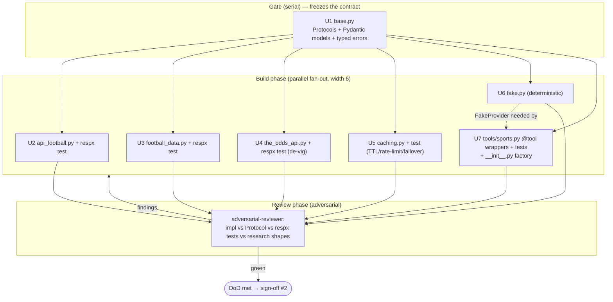
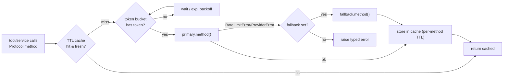

# wf-02 — Data Tools (sports-data provider abstraction)

> Build the provider-swappable sports/odds data layer (`app/providers/*`) and the Protocol-only `@tool` wrappers (`app/graph/tools/sports.py`), with every provider's HTTP mocked by `respx` — so the rest of the product talks to one interface, never a vendor SDK.

---

## 0. What this workflow produces & the two-layer rule

This WF delivers the **data tier** the LangGraph runtime depends on but knows nothing about:

```
app/providers/base.py          # Protocols + Pydantic models   ← the contract
app/providers/api_football.py  # ApiFootballProvider   (primary SportsDataProvider)
app/providers/football_data.py # FootballDataProvider  (fallback SportsDataProvider)
app/providers/the_odds_api.py  # TheOddsApiProvider    (OddsProvider)
app/providers/caching.py       # CachingProvider       (TTL + token-bucket + failover decorator)
app/providers/fake.py          # FakeProvider          (deterministic, for tests/CI)
app/providers/__init__.py      # settings-driven factory
app/graph/tools/sports.py      # @tool wrappers (depend ONLY on the Protocol)
tests/unit/providers/*         # respx-mocked unit tests per provider + tool tests
```

**Layer separation (held throughout this doc):**
- **(a) LangGraph runtime patterns** = behavior *inside the product*. The only runtime touchpoint here is that `qa_agent` (ReAct) binds the `@tool` functions in `sports.py`, and `prediction`/`briefing` subgraphs consume the providers. Those subgraphs are built in **wf-03/wf-04** — this WF only delivers the tools/providers they call.
- **(b) Claude Code dynamic workflows** = how we *build* the product. Section 2 below is layer (b): the fan-out of subagents that writes the code in layer (a).

Everything downstream depends **only** on the `Protocol` in `base.py`. No node, tool, or service may import `httpx`, `ApiFootballProvider`, or any concrete client directly.

---

## 1. Prerequisites

**Depends on: wf-01 foundations** (monorepo, `backend/pyproject.toml` + `uv.lock`, `app/config.py` Settings, ruff/mypy/pytest wired, `.claude/agents/*`, `.claude/settings.json` allowlist, root `CLAUDE.md`).

Concretely, before wf-02 starts these must exist and pass `uv run ruff check . && uv run mypy app && uv run pytest -q`:

| Needed from wf-01 | Used by |
|---|---|
| `app/config.py` `Settings` (pydantic-settings 2.x) with `API_FOOTBALL_KEY`, `FOOTBALL_DATA_TOKEN`, `THE_ODDS_API_KEY`, `LIVE_POLL_SECONDS=60`, `BRIEFING_LEAD_HOURS=2` | `__init__.py` factory, `caching.py` cadence |
| `pyproject` deps pinned: `httpx`, `respx`, `pydantic`/`pydantic-settings` **2.x**, `pytest`, `pytest-asyncio` (all "latest", frozen in `uv.lock`) | every unit |
| Python **≥ 3.12**, `uv`, `ruff`, `mypy` gate commands | DoD |
| Typed exception base classes `ProviderError`, `RateLimitError`, `AuthError`, `NotFound` (spec §6 "Error handling"). If wf-01 did not create them, **task T1 of this WF defines them** in `app/providers/base.py`. | failover + handlers |

---

## 2. Execution strategy — **Mode = dynamic workflow**

### 2.1 Why dynamic workflow (not turn-by-turn)
Per the spec's mode rule (§8): *dynamic workflow when parallelizable across many independent units / benefits from adversarial cross-check.* This WF is exactly that:

- **~7 independent units.** After the shared contract (`base.py`) is frozen, the three providers + caching + fake + tool-wrappers are **mutually independent** — each is a self-contained file + its own `respx` test. No shared mutable state between them.
- **API-shape correctness is the main risk and it is adversarially checkable.** The whole value of this layer is that each provider maps a vendor's quirky JSON onto our Pydantic models *correctly*. That is precisely the kind of claim a separate Opus reviewer can break by diffing the impl against (i) the `base.py` Protocol, (ii) the `respx` golden fixtures, and (iii) the real response shapes documented in `research/02` & `research/03`.
- **No mid-stream human sign-off needed.** Sign-off #2 happens at the *boundary* after wf-02 (spec §9), not inside it — consistent with "sign-off = boundary between two workflows, never an interrupt inside one."

### 2.2 Phases: **Build → Review**



- **U1 (`base.py`) is a serialization point**, not part of the fan-out — it defines the interface all six workers code against. It is small and must land + typecheck before the fan-out spawns. (The spec counts it as one of the "~7" decomposition units; the *effective parallel width is 6*.)
- The fan-out width **6** is well under the **≤16 cap** (spec §8 "all fan-outs ≤ 16").
- One soft intra-phase edge: **U7 imports `FakeProvider`** for its tool tests, so U6 should land slightly ahead of (or co-assigned with) U7. All other Build units are fully independent.

### 2.3 Subagent decomposition + model routing

| Unit | File(s) | Subagent | Model | Notes |
|---|---|---|---|---|
| U1 contract (gate) | `app/providers/base.py` | `langgraph-builder` | **Opus 4.8** | design-sensitive: the Protocol + models are the contract everything else depends on |
| U2 primary | `app/providers/api_football.py` + `tests/unit/providers/test_api_football.py` | `data-tool-researcher` | Sonnet (→ **Opus if shape ambiguous**) | richest shape; most mapping surface |
| U3 fallback | `app/providers/football_data.py` + `tests/unit/providers/test_football_data.py` | `data-tool-researcher` | Sonnet | different status enum, delayed scores |
| U4 odds | `app/providers/the_odds_api.py` + `tests/unit/providers/test_the_odds_api.py` | `data-tool-researcher` | Sonnet | de-vig math; Pinnacle anchor |
| U5 caching | `app/providers/caching.py` + `tests/unit/providers/test_caching.py` | `langgraph-builder` | Sonnet | decorator over the Protocol |
| U6 fake | `app/providers/fake.py` | `data-tool-researcher` | Sonnet | deterministic, no HTTP |
| U7 tools + factory | `app/graph/tools/sports.py`, `app/providers/__init__.py` + `tests/unit/providers/test_sports_tools.py` | `langgraph-builder` | Sonnet | tools must depend on Protocol only |
| Review | (read-only) | `adversarial-reviewer` | **Opus 4.8** | breaks each impl vs Protocol + tests + research |

Model-routing rationale (spec §8): mechanical mapping work → **Sonnet** via `data-tool-researcher`; the contract design (U1) and the adversarial review → **Opus 4.8**; **escalate a provider unit to Opus** if the live API shape is ambiguous vs the research (e.g. API-Football lineups/H2H endpoints were inferred, not machine-read — see open questions). The `data-tool-researcher`'s WebSearch/WebFetch budget exists exactly to resolve such ambiguity against the source URLs in §4.

### 2.4 Tool allowlist (subset of `.claude/settings.json` `permissions.allow` from spec §8)

Per-agent allowlists for this WF:

```
data-tool-researcher : Read, Edit, Write, Bash(uv:*), Bash(uv run:*),
                       Bash(pytest:*), Bash(ruff:*), Bash(mypy:*),
                       WebSearch, WebFetch, mcp__context7__*
langgraph-builder    : Read, Edit, Write, Grep, Glob, Bash(uv:*), Bash(uv run:*),
                       Bash(pytest:*), Bash(ruff:*), Bash(mypy:*),
                       mcp__context7__*, WebFetch
adversarial-reviewer : Read, Grep, Glob, Bash(uv:*), Bash(uv run:*), Bash(pytest:*)
```

Global deny stays in force: `Bash(git push:*)`, destructive `rm -rf`, secret prints. No network calls to live provider APIs during build — all HTTP is `respx`-mocked, so **no real API keys are needed to run this WF's tests** (keys are only read by the factory at production runtime).

### 2.5 Cost control
Per spec §8: run a **one-unit slice first** — implement **U2 (api_football) end-to-end (impl + respx test, green)** before fanning out U3–U7. It exercises the full pattern (httpx client → Protocol method → Pydantic model → respx test) and gauges spend, after which the remaining 5 fan out in parallel.

### 2.6 Save-as-command — optional `/verify-providers`
Worth saving (the spec marks wf-02's save-as-cmd "maybe"). A slash command that runs the provider gate so it's re-runnable after any later edit:

```
# .claude/commands/verify-providers.md  (optional)
Run the wf-02 Definition-of-Done gate and report pass/fail per provider:
  uv run ruff check app/providers app/graph/tools/sports.py
  uv run mypy app/providers app/graph/tools/sports.py
  uv run pytest -q tests/unit/providers
Then confirm: tools/sports.py imports ONLY app.providers.base (Protocol),
never a concrete provider or httpx.
```

---

## 3. The contract — `app/providers/base.py`

This file is the single dependency for everything downstream. It contains **(1)** two `Protocol`s, **(2)** the Pydantic models (all `model_config = ConfigDict(extra="forbid")` per spec §3.1), and **(3)** the typed errors used for failover.

### 3.1 Protocols (verbatim from spec §4.1)

```python
from typing import Protocol

class SportsDataProvider(Protocol):
    async def list_fixtures(self, t: TournamentRef, *, date=None, live=False) -> list[Fixture]: ...
    async def get_fixture(self, ref: ProviderRef) -> Fixture: ...
    async def get_live_state(self, ref: ProviderRef) -> LiveMatchState: ...
    async def get_lineups(self, ref: ProviderRef) -> Lineups: ...
    async def get_standings(self, t: TournamentRef) -> Standings: ...
    async def get_head_to_head(self, a: TeamRef, b: TeamRef) -> HeadToHead: ...
    async def get_team_form(self, team: TeamRef, n: int = 5) -> TeamForm: ...

class OddsProvider(Protocol):
    async def get_match_odds(self, a: TeamRef, b: TeamRef, kickoff) -> MatchOdds: ...        # raw decimal
    async def get_win_probabilities(self, a, b, kickoff) -> WinProbabilities: ...            # de-vigged
```

> These signatures are **frozen by the spec** — do not add/rename/re-order methods. Implementations are checked structurally (`Protocol`), so each concrete class must satisfy these exactly; the reviewer asserts this and mypy enforces it.

### 3.2 Pydantic models (spec §4.4 — authoritative field lists)

| Model | Fields (spec §4.4) | Notes |
|---|---|---|
| `ProviderRef` | `provider: str`, `id: str` | which vendor + that vendor's opaque id; how a `Fixture` round-trips back to `get_fixture` |
| `TeamRef` | `provider: str`, `id: str`, `name: str` | minimal ref; name carried for odds name-matching (see §4.3) |
| `TournamentRef` | `provider: str`, `league_id: str`, `season: str` *(elaboration of `t`)* | for WC2026 API-Football → `league_id="1", season="2026"`; football-data → competition code `"WC"` |
| `Team` | name, short_name, country_code, crest_url, external_ref | global team record |
| `Fixture` | `status`, `kickoff`, `home`, `away`, `score`, `score_et`, `pens`, `venue`, `round_key`, `group` | core match cache row |
| `MatchEvent` | `minute`, `extra`, `type`, `detail`, `team`, `player`, `assist` | `assist` nullable (subs/cards have none) |
| `LiveMatchState` | `status`, `minute`, `extra`, `score`, `events: list[MatchEvent]` | drives the live panel |
| `Lineups` | `home_xi`, `away_xi`, `formations`, `bench` | may be empty pre-kickoff / when coverage missing |
| `Standings` | `groups: list[GroupTable]` | `GroupTable` = group_label + ordered rows (rank, team, played, W/D/L, GF/GA/GD, points, form) |
| `HeadToHead` | recent meetings + aggregate W/D/L | |
| `TeamForm` | `last_n: list[...]`, `wdl` | last `n` results + W-D-L string |
| `MatchOdds` | `bookmaker`, `home`, `draw`, `away` | raw **decimal** prices |
| `WinProbabilities` | `home`, `draw`, `away`, `source`, `devig: bool = True` | de-vigged probabilities, sum→1 |
| `DataFragment` | `kind`, `payload` | fan-in wrapper used by parallel `gathered` channel in wf-04 (defined here, consumed there) |

**Normalized status (sensible elaboration — spec gives the DB column but not the provider enum).** Each provider maps its native status onto one small set so the runtime never sees vendor codes:

```python
class FixtureStatus(str, Enum):
    SCHEDULED="scheduled"; LIVE="live"; HALFTIME="halftime"; PAUSED="paused"
    FINISHED="finished"; POSTPONED="postponed"; CANCELLED="cancelled"; UNKNOWN="unknown"
```

(Keep the raw vendor short code available on the model if cheap, but route all logic off the normalized enum. Mark this enum as an elaboration in a code comment so it's clearly not vendor-locked.)

### 3.3 Typed errors (for failover)
`ProviderError` (base), `RateLimitError` (429 / quota), `AuthError` (401/403), `NotFound` (404). Concrete providers raise these; `CachingProvider` catches `RateLimitError`/`ProviderError` from the primary to trigger failover (§5).

---

## 4. Concrete providers

Each is a thin `httpx.AsyncClient` wrapper. **Pattern (all three):** construct with key + an injected/owned `AsyncClient`; one private `_get(path, params)` that adds auth, raises the typed error on non-2xx, returns JSON; one public method per Protocol member that calls `_get` and maps JSON → Pydantic model. The mapping is the load-bearing part the reviewer checks.

### 4.1 `api_football.py` — `ApiFootballProvider` (primary `SportsDataProvider`)

- **Base URL:** `https://v3.football.api-sports.io` · **Auth header:** `x-apisports-key: <API_FOOTBALL_KEY>`
- **WC2026 selector:** `league=1`, `season=2026`
- **Source:** research/02 §1; API-Football v3 docs https://api-sports.io/documentation/football/v3 ; WC2026 guide https://www.api-football.com/news/post/fifa-world-cup-2026-guide-to-using-data-with-api-sports ; coverage https://www.api-football.com/coverage
- **Limits:** Free 100 req/day, 10 req/min (all endpoints) → prototyping only; **Pro $19/mo = 7,500/day, 300/min** for live. Live refresh ~15s; poll ~1/min per in-progress fixture. (https://www.api-football.com/news/post/how-ratelimit-works , https://www.api-football.com/news/post/how-to-save-calls-to-the-api)
- **Coverage caveat (spec §4.2):** flags are true but "may vary per match" → **handle missing lineups/events gracefully** (return empty `Lineups`/`[]` events, not a crash).

| Protocol method | Endpoint (verified / *inferred) | Maps to |
|---|---|---|
| `list_fixtures` | `GET /fixtures?league=1&season=2026` (+ `&live=all`/`&live=1` when `live=True`, `&date=YYYY-MM-DD` when given) | `list[Fixture]` |
| `get_fixture` | `GET /fixtures?id={ref.id}` | `Fixture` |
| `get_live_state` | `GET /fixtures?id={ref.id}` + `GET /fixtures/events?fixture={ref.id}` | `LiveMatchState` |
| `get_lineups` | `GET /fixtures/lineups?fixture={ref.id}` *(standard v3 endpoint — confirm shape)* | `Lineups` |
| `get_standings` | `GET /standings?league=1&season=2026` | `Standings` |
| `get_head_to_head` | `GET /fixtures/headtohead?h2h={a.id}-{b.id}` *(standard v3 — confirm)* | `HeadToHead` |
| `get_team_form` | `GET /fixtures?team={team.id}&season=2026&last={n}` *(or `standings.form`)* | `TeamForm` |

**Fixtures JSON → `Fixture` (verified fields, research/02):** every item is under `response[]`:

```
response[].fixture.id              → ProviderRef(provider="api_football", id=str(...))
response[].fixture.date            → kickoff (ISO UTC)
response[].fixture.status.short    → status   (NS→SCHEDULED; 1H/2H/ET/BT/P→LIVE; HT→HALFTIME;
                                               FT/AET/PEN→FINISHED; PST→POSTPONED; CANC/ABD→CANCELLED)
response[].fixture.status.elapsed  → minute
response[].fixture.status.extra    → extra    (added/injury minutes; 90+4 ⇒ elapsed 90, extra 4)
response[].fixture.venue.name      → venue
response[].teams.home / .away      → TeamRef(id, name) ; .winner → winner
response[].goals.home / .away      → score
response[].score.extratime         → score_et
response[].score.penalty           → pens
response[].league.round            → round_key   (group from round/standings)
```

**Events JSON → `MatchEvent` (research/02):** `GET /fixtures/events?fixture={id}` → `response[]`:

```
time.elapsed → minute ; time.extra → extra ; type → type (Goal|Card|subst|Var)
detail → detail ; team → team(TeamRef) ; player{id,name} → player ; assist{id,name} → assist (nullable)
```

> ⚠️ The exact field-level JSON for `/fixtures/events` (VAR sub-types, `assist` null behavior) was **inferred from general v3 docs**, not read from a live WC2026 response (research/02 open questions). The `data-tool-researcher` should WebFetch the live docs to confirm before finalizing the mapping; escalate to Opus if ambiguous.

### 4.2 `football_data.py` — `FootballDataProvider` (fallback `SportsDataProvider`)

- **Base URL:** `https://api.football-data.org/v4` · **Auth header:** `X-Auth-Token: <FOOTBALL_DATA_TOKEN>` · **Competition code:** `WC`
- **Source:** research/02 §2; v4 match docs https://docs.football-data.org/general/v4/match.html ; coverage https://www.football-data.org/coverage ; policies https://docs.football-data.org/general/v4/policies.html
- **Limits:** Free 10 req/min, 12 comps, **scores DELAYED** (live = €12/mo add-on; lineups/scorers = €29/mo Deep Data). → use for **reconciliation + cold backup**, accept delayed live state.
- **Attribution required:** surface "Football data provided by the Football-Data.org API" wherever this source is displayed.

| Protocol method | Endpoint | Notes |
|---|---|---|
| `list_fixtures` | `GET /competitions/WC/matches` | filterable by `dateFrom/dateTo`, `status` |
| `get_fixture` | `GET /matches/{ref.id}` | |
| `get_live_state` | `GET /matches/{ref.id}` | delayed on free tier — set `LiveMatchState.events=[]` if not licensed |
| `get_lineups` | `GET /matches/{ref.id}` (`homeTeam/awayTeam.{formation,lineup,bench}`) | paid add-on; return empty `Lineups` if absent |
| `get_standings` | `GET /competitions/WC/standings` | group tables (TOTAL/HOME/AWAY) |
| `get_head_to_head` | `GET /matches/{ref.id}/head2head` | |
| `get_team_form` | derive from `/competitions/WC/matches?status=FINISHED` filtered by team, last `n` | |

**Match JSON → `Fixture` (research/02):**

```
id        → ProviderRef(provider="football_data", id=str(id))
utcDate   → kickoff
status    → status   (SCHEDULED/TIMED→SCHEDULED; IN_PLAY→LIVE; PAUSED→PAUSED/HALFTIME;
                      FINISHED/AWARDED→FINISHED; POSTPONED→POSTPONED; SUSPENDED/CANCELLED→CANCELLED)
minute    → minute ; injuryTime → extra
stage     → round_key/stage ; group → group
homeTeam/awayTeam → TeamRef ; score.fullTime{home,away} → score ; score.winner → winner
```

Status enum is **different from API-Football** — the per-provider status map is exactly why both must normalize onto `FixtureStatus` (§3.2). The reviewer should cross-check both maps.

### 4.3 `the_odds_api.py` — `TheOddsApiProvider` (`OddsProvider`)

- **Base URL:** `https://api.the-odds-api.com` · **Auth:** `apiKey` **query param** (not a header) · **Sport key:** `soccer_fifa_world_cup` · **Market:** `h2h` (3-way) · `regions=eu`, `oddsFormat=decimal`
- **Source:** research/03; v4 docs https://the-odds-api.com/liveapi/guides/v4/ ; WC odds page https://the-odds-api.com/sports/fifa-world-cup-odds.html ; bookmaker list https://the-odds-api.com/sports-odds-data/bookmaker-apis.html
- **Limits:** Free 500 credits/mo (no card) → **$30/mo (20K)**. Cost = markets × regions credits; `/v4/sports` & `/events` are free. Latency 60s pre-match / 40s in-play, ramps from 6h pre-kickoff. Quota headers: `x-requests-remaining`, `x-requests-used`, `x-requests-last` (read them to drive backoff).
- **ToS (spec §4.2 / research/03):** commercial app use permitted; **never resell/redistribute raw odds**; show **"18+ Gamble Responsibly"** wherever odds surface; no "powered by" branding required.

**Core call:**
```
GET /v4/sports/soccer_fifa_world_cup/odds/?apiKey=KEY&regions=eu&markets=h2h&oddsFormat=decimal
```

Returns an array of events. Match the right event by `home_team`/`away_team` name + `commence_time ≈ kickoff` (hence `TeamRef.name`). Then read the **Pinnacle** book (`bookmakers[].key == "pinnacle"`, fall back to Betfair Exchange / multi-book median if absent — research/03):

```
bookmakers[key="pinnacle"].markets[key="h2h"].outcomes:
   {"name": home_team, "price": d_home}
   {"name": away_team, "price": d_away}
   {"name": "Draw",    "price": d_draw}
```

| Protocol method | Returns | Mapping |
|---|---|---|
| `get_match_odds(a,b,kickoff)` | `MatchOdds(bookmaker="pinnacle", home=d_home, draw=d_draw, away=d_away)` | raw decimal prices |
| `get_win_probabilities(a,b,kickoff)` | `WinProbabilities(home,draw,away, source="pinnacle", devig=True)` | de-vig (below) |

**De-vig math (spec §4.2, research/03) — verbatim:** raw implied prob `1/d_i`; the three sum > 1 (overround/vig); normalize:

```
p_i = (1/d_i) / Σ_j (1/d_j)        for i,j ∈ {home, draw, away}
```

Assert in code (and test): `0 < p_i < 1` and `abs(p_home + p_draw + p_away − 1) < 1e-9`. This is the **market benchmark** the `prediction` critic scores against in wf-04 (Brier/log-loss vs market); wf-02 only produces the calibrated number.

---

## 5. `caching.py` — `CachingProvider` decorator

A decorator that **implements the same `SportsDataProvider` Protocol** (and a parallel one for `OddsProvider`), wrapping a primary + optional fallback. Because it satisfies the Protocol, downstream code injects `CachingProvider` and is none the wiser. Four responsibilities (spec §4.1, §4.3):



1. **TTL cache** — keyed by `(method, normalized-args)`, in-memory dict with expiry. Per-method TTL (spec §4.3):
   | data | TTL |
   |---|---|
   | fixtures / standings | 6–24h (refresh near kickoff) |
   | **live state** | `LIVE_POLL_SECONDS` (60s) — **only while a relevant fixture is in its live window** |
   | odds | ≤ 6h pre-match |
2. **Token-bucket rate limit** — per provider, capacity/refill tuned to that vendor's req/min (API-Football 10/min free or 300/min Pro; football-data 10/min; Odds API has no published hard limit → conservative bucket + honor `x-requests-remaining`).
3. **Live/idle cadence** — live cadence (60s) only during live windows; otherwise idle (≥6h). Keeps us inside free/Pro daily caps.
4. **Failover** — on `RateLimitError` (429) from primary: exponential backoff, then **fail over to the fallback** (`football_data`). `OddsProvider` has no fallback (only The Odds API) → caching there is TTL + rate-limit only; on exhaustion it raises `RateLimitError` (the prediction critic must degrade gracefully — handled in wf-04).

> Keep it in-memory + simple (no Redis — spec defers Redis). Inject a **clock function** (`now: Callable[[], float]`) so TTL/bucket are deterministically testable without sleeping (see §9). Do not over-build: no LRU eviction needed at MVP scale (104 fixtures).

---

## 6. `fake.py` — `FakeProvider`

A pure-Python `SportsDataProvider` **and** `OddsProvider` (one class can implement both, or two faux classes) returning **deterministic** canned objects — no `httpx`, no network. Used by graph/integration tests (`FakeProvider` + `InMemorySaver`, spec §6) and CI so the whole product runs offline.

- Deterministic: same input → identical output every call (fixed seed / hardcoded WC2026-shaped fixtures, e.g. a Netherlands–Japan group match mirroring the research example). No randomness, no time-dependence.
- Covers every Protocol method, including a live fixture (non-empty `events`), a finished fixture (with `score`/`pens`), and a `WinProbabilities` that already sums to 1.
- This is the unit that lets wf-03/wf-04/wf-06 test the graph and endpoints without touching real providers.

---

## 7. `tools/sports.py` — `@tool` wrappers (Protocol-only)

The six ReAct tools bound by `qa_agent` (spec §3.3). Each is a thin LangChain `@tool` that resolves the provider from the **graph runtime context** (`CompanionContext` carries the provider clients, spec §3.1/§3.2) and calls **one Protocol method** — never constructing a concrete client and never importing `httpx`.

| `@tool` function | Protocol call | (qa_agent also binds, from other files) |
|---|---|---|
| `get_fixture` | `sports.get_fixture(ref)` | — |
| `get_live_match_state` | `sports.get_live_state(ref)` | — |
| `get_lineups` | `sports.get_lineups(ref)` | — |
| `get_standings` | `sports.get_standings(t)` | — |
| `get_head_to_head` | `sports.get_head_to_head(a, b)` | — |
| `get_team_form` | `sports.get_team_form(team, n)` | — |
| | | `get_bracket_status` → `tools/bracket.py` (wf-03) ; `explain_rule` → `tools/rules.py` (wf-03) — **out of wf-02 scope** |

Provider access (elaboration consistent with spec §3.1 "context_schema injects per-run deps (provider clients)"): tools read `runtime.context.sports` / `runtime.context.odds` typed as `SportsDataProvider` / `OddsProvider`. The reviewer's hard check: **`grep` `app/graph/tools/sports.py` for `import httpx`, `api_football`, `football_data`, `the_odds_api`, `caching` → must be zero hits.** The only provider import allowed is `from app.providers.base import SportsDataProvider` (for typing).

Odds (`OddsProvider`) is **not** a ReAct tool — it is consumed directly by the `prediction` subgraph's `fetch_market` node (wf-04). wf-02 ships the provider + factory wiring; no `@tool` wrapper for odds.

### `__init__.py` — settings-driven factory
```
get_sports_provider(settings) -> SportsDataProvider:
    CachingProvider(primary=ApiFootballProvider(settings.API_FOOTBALL_KEY),
                    fallback=FootballDataProvider(settings.FOOTBALL_DATA_TOKEN))
get_odds_provider(settings) -> OddsProvider:
    CachingProvider(primary=TheOddsApiProvider(settings.THE_ODDS_API_KEY))   # no fallback
# tests / CI (settings flag or env): return FakeProvider()
```
Return types are the **Protocol**, so callers (lifespan singletons, spec §2) bind the interface only.

---

## 8. Tests — `respx`-mocked, `tests/unit/providers/`

```
tests/unit/providers/
  conftest.py                 # respx fixtures, golden JSON loaders, fake clock
  fixtures/                   # *.json golden payloads derived from research shapes
    api_football_fixtures.json  api_football_events.json  api_football_standings.json
    football_data_match.json    football_data_standings.json
    the_odds_api_h2h.json
  test_api_football.py
  test_football_data.py
  test_the_odds_api.py
  test_caching.py
  test_fake.py
  test_sports_tools.py
```

**Provider tests (U2–U4):** use `respx` to mock the exact route + return a golden JSON payload, then assert the provider returns correctly-typed/mapped Pydantic objects. Pattern:

```python
import respx, httpx, pytest
from httpx import Response

@pytest.mark.asyncio
@respx.mock
async def test_get_fixture_maps_status_and_score(load_golden):
    respx.get("https://v3.football.api-sports.io/fixtures").mock(
        return_value=Response(200, json=load_golden("api_football_fixtures.json"))
    )
    p = ApiFootballProvider("test-key")
    fx = await p.get_fixture(ProviderRef(provider="api_football", id="123"))
    assert fx.status is FixtureStatus.LIVE
    assert fx.score.home == 1 and fx.score.away == 0
    # auth header asserted on the captured request
    assert respx.calls.last.request.headers["x-apisports-key"] == "test-key"
```

Required assertions per provider:
- **happy path** mapping for fixtures, live state (+events), standings, H2H, form, (odds for U4).
- **auth wiring**: correct header (`x-apisports-key` / `X-Auth-Token`) or query param (`apiKey`) on the captured request.
- **error mapping**: 429 → `RateLimitError`; 401/403 → `AuthError`; 404 → `NotFound`.
- **missing-coverage resilience** (API-Football): empty lineups/events payload → empty `Lineups`/`[]`, no crash.
- **status-normalization table**: each native status code → expected `FixtureStatus` (parametrized).
- **U4 only**: de-vig — assert `p` sum→1 within 1e-9 and Pinnacle selected; `source=="pinnacle"`.

**Caching test (U5):** inject a fake clock + a spy/fake primary; assert (a) 2nd call within TTL hits cache (primary called once), (b) call after TTL expiry re-fetches, (c) token bucket blocks/queues past capacity, (d) primary raising `RateLimitError` → fallback invoked and its value returned. No real HTTP, no `sleep`.

**Fake test (U6):** assert determinism — two calls return equal objects; `WinProbabilities` sums to 1; a live fixture has non-empty `events`.

**Tools test (U7):** invoke each `@tool` with a `FakeProvider` in the runtime context; assert it returns the provider's object unchanged and that it called exactly one Protocol method (the tool adds no business logic). Plus the static check: `sports.py` imports only `app.providers.base`.

---

## 9. Ordered tiny tasks (build checklist)

| # | Task | File(s) | Owner | Gate to pass |
|---|---|---|---|---|
| T1 | Define `Protocol`s, all §3.2 Pydantic models (`extra="forbid"`), `FixtureStatus`, typed errors | `app/providers/base.py` | langgraph-builder (Opus) | `uv run mypy app/providers/base.py` clean; **freeze before fan-out** |
| T2 | Slice-first: `ApiFootballProvider` (all 7 methods) + golden JSON + respx test | `app/providers/api_football.py`, `tests/.../test_api_football.py`, `tests/.../fixtures/api_football_*.json` | data-tool-researcher | `uv run pytest -q tests/unit/providers/test_api_football.py` green |
| — | **Fan-out gate:** T2 green → spawn T3–T8 in parallel (width 6) | | | |
| T3 | `FootballDataProvider` + golden + respx test (status map differs) | `app/providers/football_data.py`, `tests/.../test_football_data.py`, `fixtures/football_data_*.json` | data-tool-researcher | its test green |
| T4 | `TheOddsApiProvider` + de-vig + golden + respx test | `app/providers/the_odds_api.py`, `tests/.../test_the_odds_api.py`, `fixtures/the_odds_api_h2h.json` | data-tool-researcher | its test green; prob sum→1 |
| T5 | `CachingProvider` (TTL + token-bucket + cadence + failover, injectable clock) + test | `app/providers/caching.py`, `tests/.../test_caching.py` | langgraph-builder | its test green |
| T6 | `FakeProvider` (deterministic, both Protocols) + test | `app/providers/fake.py`, `tests/.../test_fake.py` | data-tool-researcher | determinism test green |
| T7 | Six `@tool` wrappers (Protocol-only) + tests with FakeProvider | `app/graph/tools/sports.py`, `tests/.../test_sports_tools.py` | langgraph-builder | green; zero concrete-provider imports |
| T8 | Factory: `get_sports_provider` / `get_odds_provider` (+ Fake in test mode) | `app/providers/__init__.py` | langgraph-builder | importable; returns Protocol types |
| — | **Review phase** | | | |
| T9 | Adversarial review: each impl vs Protocol + respx tests + research shapes; status maps; de-vig; missing-coverage handling; `sports.py` import purity | (read-only) | adversarial-reviewer (Opus) | findings filed → loop to Build until none |
| T10 | DoD gate (§11) | all | (any) | full gate green |

> If wf-01 did not create `app/graph/tools/__init__.py`, T7 adds it (re-exporting the six tools), consistent with the `tools/{__init__,sports,bracket,rules}.py` layout in spec §6.

---

## 10. Verification stage (adversarial reviewer)

The `adversarial-reviewer` (Opus 4.8, read + `pytest` only) runs after Build and tries to **break** each unit, checking against three independent references:

1. **vs `base.py` Protocol** — every concrete class structurally satisfies the frozen signatures (mypy `Protocol` check + manual: no extra/renamed methods, return types exact).
2. **vs the respx tests** — re-runs `uv run pytest tests/unit/providers`; spot-checks that golden JSON payloads actually match the **real response shapes documented in research/02 & research/03** (field names like `fixture.status.elapsed`, `score.fullTime`, `bookmakers[].markets[].outcomes`), not invented shapes. Flags any golden that diverges from the source URLs.
3. **vs the math/edge rules** — de-vig sums to 1 and anchors Pinnacle; both providers' status maps cover every native code; missing lineups/events return empties not exceptions; `tools/sports.py` imports only the Protocol; error codes map to the right typed exceptions.

Escalation: if the reviewer finds the research is ambiguous/insufficient for a mapping (e.g. the inferred lineups/H2H endpoints), it routes that unit back to a `data-tool-researcher` on **Opus** with a WebFetch task against the live docs.

---

## 11. Definition of Done

- [ ] `app/providers/base.py` defines both Protocols + all §3.2 models (`extra="forbid"`) + typed errors; mypy clean.
- [ ] `ApiFootballProvider`, `FootballDataProvider`, `TheOddsApiProvider` each implement their Protocol; **respx-mocked unit tests per provider green** (happy path + auth + error mapping + status normalization; de-vig for odds).
- [ ] `CachingProvider` test green: TTL hit/expiry, token-bucket throttle, **failover primary→fallback** on `RateLimitError`.
- [ ] **`FakeProvider` deterministic** (equality across calls; probs sum→1) and implements both Protocols.
- [ ] **Tools in `sports.py` call only the Protocol** — static check passes (no `httpx` / concrete-provider imports); tool tests green with `FakeProvider`.
- [ ] `app/providers/__init__.py` factory returns Protocol types and yields `FakeProvider` in test mode.
- [ ] **`uv run pytest -q tests/unit/providers` green.**
- [ ] **`uv run mypy app/providers app/graph/tools/sports.py` clean** and `uv run ruff check` clean.
- [ ] No live API calls in the test suite (keys absent → tests still pass).
- [ ] (Optional) `/verify-providers` command saved.

Backend gate (spec §9) for the touched paths: `uv run ruff check . && uv run mypy app && uv run pytest -q tests/unit/providers`.

→ Clears **sign-off boundary #2** (spec §9): "provider abstraction + WC data flows."

---

## 12. Open questions (carry, don't guess)

Pulled from the research streams + spec — mark in code as `# OPEN-Q`, do not assert:

1. **API-Football `/fixtures/events` field-level shape** (VAR sub-types, `assist` null) was inferred from general v3 docs, not a live WC2026 response (research/02). Confirm via WebFetch before locking the `MatchEvent` map.
2. **API-Football lineups & H2H endpoints** (`/fixtures/lineups`, `/fixtures/headtohead`) are standard v3 routes assumed here; the WC2026 guide/pricing pages return **403 to automated fetch** (research/02) — verify exact paths/shapes with a key.
3. **football-data.org redistribution/caching ToS** for commercial use was only confirmable via a third-party blog (attribution requirement); exact wording unverified (research/02 + spec §9 OQ6). Affects how long `CachingProvider` may persist its data.
4. **The Odds API hard rate limits** are unpublished (only a 429 on exceed) — token-bucket capacity is a conservative guess; load-test live in-play polling (research/03).
5. **Pinnacle availability per WC2026 match** — if absent for some fixtures, fallback to Betfair Exchange / multi-book median (research/03). Confirm anchor coverage.
6. **`TournamentRef` exact field naming** is an elaboration (`league_id`/`season` vs `code`) — keep consistent across both `SportsDataProvider` impls; reviewer to confirm against the spec's `t: TournamentRef` usage in wf-03/04.

---

### Source URLs (for citations)
- API-Football v3 docs — https://api-sports.io/documentation/football/v3
- API-Football WC2026 guide — https://www.api-football.com/news/post/fifa-world-cup-2026-guide-to-using-data-with-api-sports
- API-Football coverage — https://www.api-football.com/coverage · ratelimit — https://www.api-football.com/news/post/how-ratelimit-works · save-calls — https://www.api-football.com/news/post/how-to-save-calls-to-the-api
- football-data.org v4 matches — https://docs.football-data.org/general/v4/match.html · coverage — https://www.football-data.org/coverage · policies — https://docs.football-data.org/general/v4/policies.html · pricing — https://www.football-data.org/pricing
- The Odds API v4 docs — https://the-odds-api.com/liveapi/guides/v4/ · WC odds — https://the-odds-api.com/sports/fifa-world-cup-odds.html · bookmakers — https://the-odds-api.com/sports-odds-data/bookmaker-apis.html · update intervals — https://the-odds-api.com/sports-odds-data/update-intervals.html · terms — https://the-odds-api.com/terms-and-conditions.html
- (Deferred) Sportradar Probabilities — https://developer.sportradar.com/odds/reference/probabilities-overview (B2B, ~$10k+/mo, prediction-market clause §2.1 — not used; see research/03)
