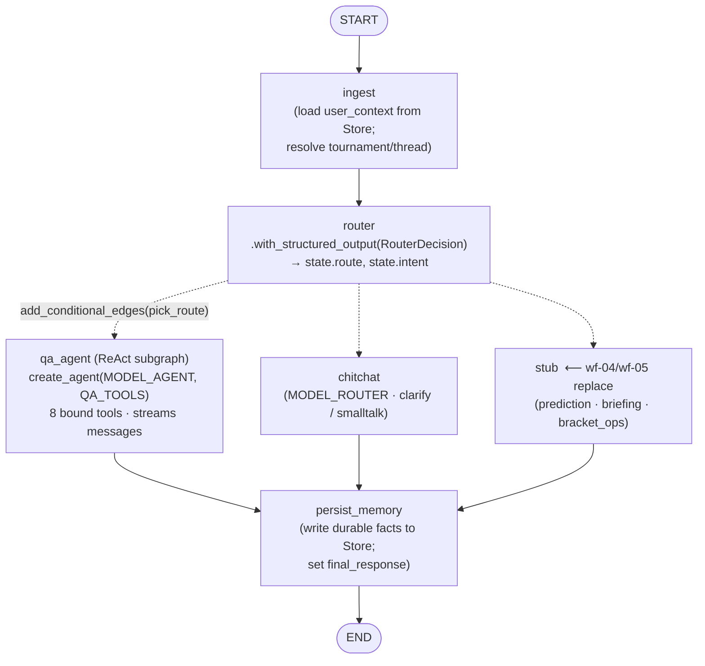
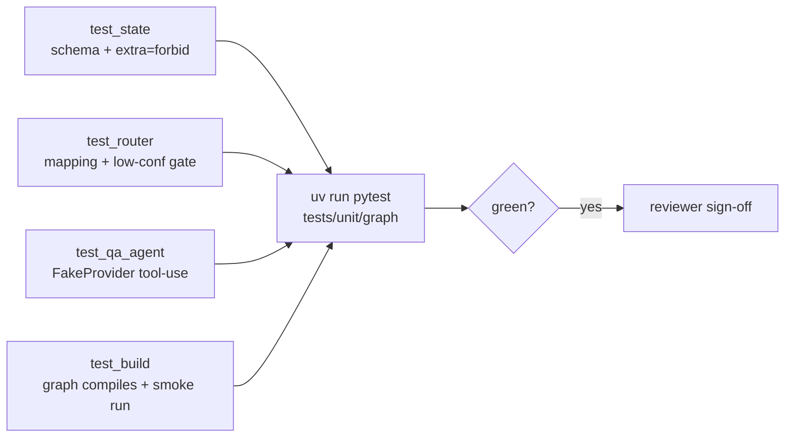

# wf-03 — Core Graph (state · llm factory · router · ReAct qa_agent · build wiring)

> Purpose: build the tightly-coupled LangGraph spine — `CompanionState`, the swappable LLM factory, the structured-output router with conditional edges, the ReAct `qa_agent` subgraph with its 8 bound tools, the `ingest`/`chitchat`/`persist_memory` nodes, and `build.py` wiring `START→ingest→router→{…}→persist_memory→END` (QA path first).

**Spec authority:** [`../research/canonical-spec.md`](../research/canonical-spec.md) §1, §3, §4.1, §6. **Research:** [`../research/00-langgraph.md`](../research/00-langgraph.md) (core API), [`../research/01-langgraph.md`](../research/01-langgraph.md) (memory/HITL, for the `compile(store=…)`/`runtime.store` shape used by `ingest`). If anything here disagrees with the canonical spec, the spec wins.

**Two layers (kept strictly separate):**
- **Runtime patterns** = the LangGraph behavior *inside* Pitch IQ — that is what this doc designs (`app/graph/*`).
- **Build workflows** = how Claude Code *builds* it — that is the [Execution Strategy](#7-execution-strategy-required) section only.

---

## 0. Scope of wf-03

**Prereq:** **wf-02** (provider abstraction `app/providers/base.py` + `FakeProvider` + concrete impls + the provider factory in `app/providers/__init__.py`). The 8 tools depend **only** on the wf-02 `Protocol`s, never a concrete client (spec §4.1).

**In scope (this WF):**
| Build now | File |
|---|---|
| `Route` enum + full `CompanionState` + graph Pydantic payload models + `CompanionContext` | `app/graph/state.py` |
| LLM factory (`init_chat_model`, role→model) | `app/graph/llm.py` |
| 8 QA tools (`@tool`, protocol-only) | `app/graph/tools/{sports,bracket,rules,__init__}.py` |
| Router node (`RouterDecision` structured output) + `pick_route` | `app/graph/router.py` |
| ReAct subgraph via `langchain.agents.create_agent` | `app/graph/subgraphs/qa_agent.py` |
| `ingest`, `chitchat`, `persist_memory` nodes | `app/graph/nodes/{ingest,chitchat,persist_memory}.py` |
| Top-level graph wiring + `build_graph(...)` | `app/graph/build.py` |
| Graph unit tests | `tests/unit/graph/*` |

**Deferred (do NOT build here — but the shared state must already carry their channels):**
- `prediction` subgraph (gen→critic loop) → **wf-04**. Routes `PREDICTION`, `BRIEFING` land on a temporary `stub` node now.
- `briefing` subgraph (orchestrator-worker + parallel) → **wf-04**.
- `bracket_ops` subgraph (`interrupt()` HITL) + `AsyncPostgresSaver`/`PostgresStore` at compile → **wf-05**. Route `BRACKET_OPS` lands on `stub` now; wf-03 compiles with `InMemorySaver`/`InMemoryStore` for tests.

> "QA path first" = the three QA routes (`match_qa`, `rules_qa`, `bracket_qa`) and `chitchat` are fully live end-to-end; the three specialist routes are wired to a single `stub` node that wf-04/wf-05 replace with real subgraph nodes (one-line edits, the spine is unchanged).

---

## 1. Pinned versions (spec §1; sources in §8)

| Package | Version | What wf-03 uses it for |
|---|---|---|
| `langgraph` | **1.2.7** | `StateGraph`, `START`/`END`, `add_conditional_edges`, `compile` |
| `langchain` | **1.3.11** | `langchain.agents.create_agent`, `init_chat_model` |
| `langchain-core` | **1.4.8** | `AnyMessage`, `@tool`, `.with_structured_output(...)` |
| `langchain-openai` | **1.3.3** | OpenAI chat models (pulls `openai>=2.26,<3`) |
| `langgraph-prebuilt` | **1.1.0** | `ToolNode` engine under `create_agent` |
| `langgraph-checkpoint` | **4.1.1** | `InMemorySaver` / `InMemoryStore` for wf-03 tests |
| `pydantic` | **2.x** | all graph payload models (`extra="forbid"`) |

**Models (config-driven, spec §1):** convention `MODEL_ROUTER` (small/fast → router + chitchat), `MODEL_AGENT` (mid → ReAct Q&A), `MODEL_CRITIC` (reasoning → wf-04). All resolved through `init_chat_model(...)` so a non-OpenAI model is a config change. **Open question (spec §8.1):** the exact OpenAI snapshot ids are unverified — read them from env, do **not** hard-code a snapshot in source.

---

## 2. The graph this WF compiles



**Route → node table** (the `add_conditional_edges` mapping; spec §3.2 #1, §3.3):

| `Route` value | Built in wf-03? | Target node | Why |
|---|---|---|---|
| `match_qa` | ✅ | `qa_agent` | "why 6 min added?" — live data Q&A |
| `rules_qa` | ✅ | `qa_agent` | "was that offside?" — `explain_rule` tool |
| `bracket_qa` | ✅ | `qa_agent` | "what does this do to my bracket?" — `get_bracket_status` (read-only) |
| `chitchat` | ✅ | `chitchat` | smalltalk / **low-confidence clarify** |
| `prediction` | ⛔ wf-04 | `stub` | gen→critic loop |
| `briefing` | ⛔ wf-04 | `stub` | orchestrator-worker |
| `bracket_ops` | ⛔ wf-05 | `stub` | consequential write → HITL `interrupt()` |

The three QA routes collapse to one `qa_agent` node: routing is a **closed-set classifier** (cheap, testable), while the *answering* is one ReAct loop with all 8 tools bound (spec §3.3). `bracket_qa` (read-only status) is distinct from `bracket_ops` (the write that needs HITL).

---

## 3. Component design (real signatures)

### 3.1 `app/graph/state.py` — the shared spine

`CompanionState` is a `TypedDict` with `Annotated` reducers; **every** nested payload is a Pydantic `BaseModel` with `model_config = ConfigDict(extra="forbid")` (spec §3.1). Define the **full** state now (it is shared by wf-04/wf-05); fields those WFs consume use minimal-but-valid placeholder models that they flesh out.

```python
# app/graph/state.py  (SKETCH — verbatim from spec §3.1)
import operator
from enum import Enum
from typing import Annotated, NotRequired
from typing_extensions import TypedDict
from pydantic import BaseModel, ConfigDict
from langchain_core.messages import AnyMessage
from langgraph.graph.message import add_messages
from app.providers.base import DataFragment            # wf-02 (fan-in wrapper)

class Route(str, Enum):
    MATCH_QA = "match_qa"; RULES_QA = "rules_qa"; BRACKET_QA = "bracket_qa"
    PREDICTION = "prediction"; BRIEFING = "briefing"
    BRACKET_OPS = "bracket_ops"; CHITCHAT = "chitchat"

class _Strict(BaseModel):
    model_config = ConfigDict(extra="forbid")

class RouterDecision(_Strict):        # router structured output
    route: Route
    params: dict[str, str] = {}       # e.g. {"team": "BRA", "fixture_ref": "..."}
    confidence: float                 # 0..1; below threshold → CHITCHAT (clarify)

class UserContext(_Strict):           # loaded by ingest from Store ("user", user_id)
    favorite_team_ids: list[str] = []
    tone: str = "concise"
    locale: str = "en"

# wf-04 / wf-05 payloads — minimal placeholders NOW so the spine compiles:
class Prediction(_Strict): ...        # fleshed out wf-04
class Critique(_Strict): ...          # fleshed out wf-04
class BriefingPlan(_Strict): ...      # fleshed out wf-04
class BriefingSection(_Strict): ...   # fleshed out wf-04
class Briefing(_Strict): ...          # fleshed out wf-04
class BracketChange(_Strict): ...     # fleshed out wf-05

class CompanionState(TypedDict):
    messages: Annotated[list[AnyMessage], add_messages]
    user_id: str
    tournament_id: str
    thread_id: str
    route: NotRequired[Route]
    intent: NotRequired[RouterDecision]
    user_context: NotRequired[UserContext]
    gathered: Annotated[list[DataFragment], operator.add]   # wf-04 fan-in channel
    prediction: NotRequired[Prediction]
    critique: NotRequired[Critique]
    prediction_round: NotRequired[int]
    briefing_plan: NotRequired[BriefingPlan]
    briefing_sections: Annotated[list[BriefingSection], operator.add]
    briefing: NotRequired[Briefing]
    pending_change: NotRequired[BracketChange]
    approved: NotRequired[bool]
    final_response: NotRequired[str]
```

`CompanionContext` is the `context_schema` (per-run deps; gives nodes `runtime.store`, spec §3.1):

```python
from dataclasses import dataclass
from app.providers.base import SportsDataProvider, OddsProvider

@dataclass
class CompanionContext:
    sports: SportsDataProvider     # wf-02 protocol (FakeProvider in tests)
    odds: OddsProvider
    user_tz: str = "UTC"
```

> Reducer rules (research 00): bare key = last-write-wins; `add_messages` = append/merge messages; `operator.add` = append-only fan-in for parallel branches. `gathered`/`briefing_sections` exist now but are only *written* in wf-04.

### 3.2 `app/graph/llm.py` — swappable factory

One function, role → configured chat model, resolved by `init_chat_model` so the provider is a config change (spec §1). Cache per role.

```python
# app/graph/llm.py  (SKETCH)
from functools import lru_cache
from langchain.chat_models import init_chat_model   # ⚠ confirm import path at install (langchain 1.3.11)
from app.config import get_settings

_ROLE_ENV = {"router": "MODEL_ROUTER", "agent": "MODEL_AGENT", "critic": "MODEL_CRITIC"}

@lru_cache
def get_llm(role: str):
    s = get_settings()
    model_id = getattr(s, _ROLE_ENV[role].lower())   # e.g. settings.model_router
    return init_chat_model(model_id, temperature=0)   # temp=0 for router/critic determinism
```

`init_chat_model` returns a `BaseChatModel`, so `.bind_tools(...)` and `.with_structured_output(...)` work uniformly across providers (research 00).

### 3.3 `app/graph/tools/*` — the 8 bound tools (protocol-only)

`@tool`-decorated functions in three files; `__init__.py` exposes `QA_TOOLS`. Each tool obtains the live provider from the run's `CompanionContext` (injected runtime) and returns a Pydantic model from `app/providers/base.py` — it depends on the **protocol**, never a concrete client (spec §4.1).

| Tool name (bound to agent) | File | Provider call (wf-02) |
|---|---|---|
| `get_fixture` | `tools/sports.py` | `sports.get_fixture(ref)` |
| `get_live_match_state` | `tools/sports.py` | `sports.get_live_state(ref)` ← note name maps to `get_live_state` |
| `get_lineups` | `tools/sports.py` | `sports.get_lineups(ref)` |
| `get_standings` | `tools/sports.py` | `sports.get_standings(t)` |
| `get_head_to_head` | `tools/sports.py` | `sports.get_head_to_head(a, b)` |
| `get_team_form` | `tools/sports.py` | `sports.get_team_form(team, n)` |
| `get_bracket_status` | `tools/bracket.py` | bracket repo read (read-only; no write) |
| `explain_rule` | `tools/rules.py` | static rules KB (no live call) |

```python
# app/graph/tools/sports.py  (SKETCH of the injection pattern)
from langchain_core.tools import tool
from langchain_core.runnables import RunnableConfig
from langgraph.runtime import get_runtime          # ⚠ confirm helper vs ToolRuntime injection (langchain 1.3.11)
from app.graph.state import CompanionContext
from app.providers.base import ProviderRef, Fixture

@tool
async def get_fixture(provider_ref: str) -> Fixture:
    """Fetch a fixture (teams, status, score, kickoff) by provider ref."""
    ctx: CompanionContext = get_runtime(CompanionContext).context
    return await ctx.sports.get_fixture(ProviderRef.parse(provider_ref))
```

```python
# app/graph/tools/__init__.py
from .sports import (get_fixture, get_live_match_state, get_lineups,
                     get_standings, get_head_to_head, get_team_form)
from .bracket import get_bracket_status
from .rules import explain_rule
QA_TOOLS = [get_fixture, get_live_match_state, get_lineups, get_standings,
            get_head_to_head, get_team_form, get_bracket_status, explain_rule]
```

> **Open question (small, confirm at install):** the exact runtime-injection mechanism for tools under `create_agent` in langchain 1.3.11 (`get_runtime(CompanionContext)` vs a `ToolRuntime`/`InjectedState` arg). The contract is fixed (tool reads the provider from `CompanionContext`); only the helper name may differ. Tests pass `CompanionContext(sports=FakeProvider(), odds=FakeProvider())`.

### 3.4 `app/graph/router.py` — conditional routing (pattern #1)

LLM with `.with_structured_output(RouterDecision)` (OpenAI strict `json_schema`, enum-closed). Low confidence → `CHITCHAT` so the bot asks a clarifying question instead of guessing (spec §3.3).

```python
# app/graph/router.py  (SKETCH)
from app.graph.state import CompanionState, Route, RouterDecision
from app.graph.llm import get_llm

ROUTER_SYSTEM = (
    "Classify the user's latest message into exactly one Route for a football "
    "tournament companion. match_qa=live match facts; rules_qa=laws of the game; "
    "bracket_qa=read-only bracket/standings questions; prediction=who will win; "
    "briefing=pre/post-match summary; bracket_ops=submit/lock a bracket (a write); "
    "chitchat=greetings/unclear. Return route, params, confidence."
)
MIN_CONFIDENCE = 0.6

async def router(state: CompanionState) -> dict:
    llm = get_llm("router").with_structured_output(RouterDecision)
    decision: RouterDecision = await llm.ainvoke(
        [{"role": "system", "content": ROUTER_SYSTEM}, *state["messages"]]
    )
    route = decision.route if decision.confidence >= MIN_CONFIDENCE else Route.CHITCHAT
    return {"intent": decision, "route": route}

_ROUTE_TO_NODE = {
    Route.MATCH_QA: "qa_agent", Route.RULES_QA: "qa_agent", Route.BRACKET_QA: "qa_agent",
    Route.CHITCHAT: "chitchat",
    Route.PREDICTION: "stub", Route.BRIEFING: "stub", Route.BRACKET_OPS: "stub",  # wf-04/wf-05
}

def pick_route(state: CompanionState) -> str:        # conditional-edge fn
    return _ROUTE_TO_NODE[state["route"]]
```

### 3.5 `app/graph/subgraphs/qa_agent.py` — ReAct (pattern #2)

`langchain.agents.create_agent` — the replacement for the deprecated `create_react_agent`; same engine, `prompt=` → **`system_prompt=`** (research 00). Returns a compiled graph that reads/writes the `messages` channel, so it slots straight in as a top-level node (shared-state subgraph composition, research 00). It is the **main chat path** and must stream tokens.

```python
# app/graph/subgraphs/qa_agent.py  (SKETCH)
from langchain.agents import create_agent
from app.graph.llm import get_llm
from app.graph.tools import QA_TOOLS
from app.graph.state import CompanionContext

QA_SYSTEM = (
    "You are Pitch IQ's match analyst. NEVER state a live fact (score, minute, "
    "lineup, standing, event) without first calling a tool. If a tool returns no "
    "data, say so — never fabricate numbers. Be concise and plain-language."
)

def build_qa_agent():
    return create_agent(
        model=get_llm("agent"),          # MODEL_AGENT (mid)
        tools=QA_TOOLS,                  # 8 tools, bound automatically
        system_prompt=QA_SYSTEM,         # NOTE: renamed from prompt=
        context_schema=CompanionContext, # provider injection reaches tools
        checkpointer=True,               # inherit parent checkpointer per-thread
    )
```

System prompt enforces the **groundedness** success criterion (spec §0: pass-rate ≥ 0.95, no fabricated numbers).

### 3.6 Nodes — `ingest`, `chitchat`, `persist_memory`

```python
# app/graph/nodes/ingest.py  (SKETCH) — load user_context from Store, resolve ids
from langgraph.runtime import Runtime
from app.graph.state import CompanionState, CompanionContext, UserContext

async def ingest(state: CompanionState, runtime: Runtime[CompanionContext]) -> dict:
    items = await runtime.store.asearch(("user", state["user_id"]))   # cross-thread facts
    ctx = UserContext(**items[0].value) if items else UserContext()
    return {"user_context": ctx}
```

```python
# app/graph/nodes/chitchat.py  (SKETCH) — MODEL_ROUTER; clarifies on low confidence
async def chitchat(state: CompanionState) -> dict:
    llm = get_llm("router")
    msg = await llm.ainvoke([{"role": "system", "content":
        "Friendly tournament companion. If the user's intent was unclear, ask one "
        "short clarifying question; otherwise reply briefly."}, *state["messages"]])
    return {"messages": [msg], "final_response": msg.text()}
```

```python
# app/graph/nodes/persist_memory.py  (SKETCH) — durable facts + final_response
async def persist_memory(state, runtime) -> dict:
    last_ai = state["messages"][-1]
    # (wf-05 deepens this) optional: extract durable user facts → runtime.store.aput(...)
    return {"final_response": state.get("final_response") or last_ai.text()}
```

> `qa_agent` already appends its answer to `messages` (the streamed channel); `persist_memory` just normalizes `final_response` from the last AI message and is where wf-05 wires durable Store writes.

### 3.7 `app/graph/build.py` — wiring

```python
# app/graph/build.py  (SKETCH)
from langgraph.graph import StateGraph, START, END
from app.graph.state import CompanionState, CompanionContext
from app.graph.router import router, pick_route
from app.graph.subgraphs.qa_agent import build_qa_agent
from app.graph.nodes.ingest import ingest
from app.graph.nodes.chitchat import chitchat
from app.graph.nodes.persist_memory import persist_memory

async def _stub(state: CompanionState) -> dict:           # wf-04/wf-05 replace
    return {"final_response": "That feature is coming soon."}

def build_graph(*, checkpointer=None, store=None):
    b = StateGraph(CompanionState, context_schema=CompanionContext)
    b.add_node("ingest", ingest)
    b.add_node("router", router)
    b.add_node("qa_agent", build_qa_agent())              # compiled subgraph as a node
    b.add_node("chitchat", chitchat)
    b.add_node("stub", _stub)
    b.add_node("persist_memory", persist_memory)

    b.add_edge(START, "ingest")
    b.add_edge("ingest", "router")
    b.add_conditional_edges("router", pick_route, ["qa_agent", "chitchat", "stub"])
    for n in ("qa_agent", "chitchat", "stub"):
        b.add_edge(n, "persist_memory")
    b.add_edge("persist_memory", END)
    return b.compile(checkpointer=checkpointer, store=store)
```

**Compile-time caveat (wf-03 vs wf-05):** `qa_agent` uses `checkpointer=True` (inherit), so the parent MUST be compiled **with** a checkpointer. wf-03 tests pass `InMemorySaver()` + `InMemoryStore()`; wf-05 swaps in `AsyncPostgresSaver` + `AsyncPostgresStore` at the lifespan call site — `build_graph` signature does not change.

**Streaming contract (consumed by wf-06, not built here):** the SSE endpoint will call `graph.astream(input, config, stream_mode="messages")` with **`version="v2"`** (stable) and filter `meta["langgraph_node"]` to `qa_agent`/`chitchat` (spec §3.4). The newer `astream_events(version="v3")` is recommended-but-beta — migrate behind GA (spec Risk #2). wf-03 only needs the graph to *emit* message chunks from those nodes.

---

## 4. Ordered tiny tasks (turn-by-turn)

Sequential by design — the state schema in T1 is imported by everything after it. Each task lands one file, is independently unit-tested, and must keep `uv run pytest tests/unit/graph -q` green before the next begins.

| # | Task | File(s) | Done when |
|---|---|---|---|
| T1 | `Route`, full `CompanionState`, graph Pydantic models (real: `RouterDecision`, `UserContext`; placeholders: `Prediction`/`Critique`/`BriefingPlan`/`BriefingSection`/`Briefing`/`BracketChange`), `CompanionContext` | `app/graph/state.py` | imports clean; `RouterDecision`/`UserContext` validate; `extra="forbid"` enforced |
| T2 | LLM factory `get_llm(role)` via `init_chat_model`, env-driven (`MODEL_ROUTER/AGENT/CRITIC`), cached | `app/graph/llm.py` | returns a `BaseChatModel`; unknown role raises |
| T3 | 8 `@tool` wrappers (protocol-only) + `QA_TOOLS` | `app/graph/tools/{sports,bracket,rules,__init__}.py` | each tool runs against `FakeProvider`; `len(QA_TOOLS)==8` |
| T4 | `router` node (`.with_structured_output(RouterDecision)`, confidence gate) + `pick_route` + `_ROUTE_TO_NODE` | `app/graph/router.py` | `pick_route` maps all 7 routes correctly; low-confidence→`chitchat` |
| T5 | `qa_agent` via `create_agent(MODEL_AGENT, QA_TOOLS, system_prompt=…, context_schema=…, checkpointer=True)` | `app/graph/subgraphs/qa_agent.py` | builds; tool-calls a `FakeProvider` and returns a grounded answer |
| T6 | `ingest` (Store read → `user_context`) | `app/graph/nodes/ingest.py` | returns `UserContext` (default when Store empty) |
| T7 | `chitchat` (MODEL_ROUTER, clarify-on-low-confidence) | `app/graph/nodes/chitchat.py` | returns `messages` + `final_response` |
| T8 | `persist_memory` (normalize `final_response`; Store-write hook for wf-05) | `app/graph/nodes/persist_memory.py` | sets `final_response` from last AI msg |
| T9 | `build_graph(checkpointer, store)` wiring | `app/graph/build.py` | `build_graph(checkpointer=InMemorySaver(), store=InMemoryStore())` compiles |
| T10 | Graph unit tests | `tests/unit/graph/{test_state,test_router,test_qa_agent,test_build}.py` | suite green |

> Sign-off boundary is **AFTER** T10 (see §7). wf-04/wf-05 begin only once the spine/routing is approved.

---

## 5. Tests & verification

All deterministic tests use **`FakeProvider`** (wf-02) + **`InMemorySaver`/`InMemoryStore`**, no network, no paid API (spec §6, §9). Location: `tests/unit/graph/`.



- **`test_state.py`** — `RouterDecision`/`UserContext` accept valid payloads and **reject** unknown keys (`extra="forbid"`); `CompanionState` instantiable with required keys.
- **`test_router.py`** — two tiers:
  1. *Deterministic (always runs, gates merge):* monkeypatch `get_llm("router")` with a fake structured-output model (e.g. `langchain_core.language_models.GenericFakeChatModel`) returning canned `RouterDecision`s; assert `pick_route` returns the right **node** for every `Route` and that `confidence < 0.6` ⇒ `chitchat`.
  2. *Labeled mini-set (DoD; live model, `@pytest.mark.langsmith`, skipped without `OPENAI_API_KEY`):* the 7 examples below must classify correctly. The full macro-F1 ≥ 0.9 eval against `eval/datasets/routing.jsonl` is **wf-08** (spec §0, §9).

  | Utterance | Expected `Route` |
  |---|---|
  | "why were 6 minutes added?" | `MATCH_QA` |
  | "was that offside?" | `RULES_QA` |
  | "what does this result do to my bracket?" | `BRACKET_QA` |
  | "who's going to win Brazil vs France?" | `PREDICTION` |
  | "give me the briefing for tonight's match" | `BRIEFING` |
  | "lock my bracket / submit my picks" | `BRACKET_OPS` |
  | "hey there, thanks!" | `CHITCHAT` |

- **`test_qa_agent.py`** — invoke `build_qa_agent()` with `context=CompanionContext(sports=FakeProvider(), odds=FakeProvider())` and a known fixture; assert it (a) calls a sports tool, (b) returns an answer containing the FakeProvider's deterministic value, (c) does **not** fabricate when the provider returns empty. (Live model; `@pytest.mark.langsmith`-gated.)
- **`test_build.py`** — `build_graph(checkpointer=InMemorySaver(), store=InMemoryStore())` compiles; a smoke `astream`/`ainvoke` of a `chitchat` input reaches `END` with a `final_response` (no API key needed if router/chitchat are monkeypatched).

### Definition of Done (wf-03)
1. ✅ `build_graph(...)` **compiles** with `InMemorySaver`+`InMemoryStore` (`test_build`).
2. ✅ Router **classifies the labeled mini-set** correctly (deterministic mapping always green; live mini-set green when keyed).
3. ✅ `qa_agent` **answers using FakeProvider tools**, grounded, no fabrication.
4. ✅ `uv run pytest tests/unit/graph -q` is **green**; `uv run ruff check . && uv run mypy app` clean (spec §9 gate).
5. ✅ All 7 `Route` values map to a real node; `prediction`/`briefing`/`bracket_ops` → `stub` (documented hand-off to wf-04/wf-05).

---

## 6. Risks & open questions (carried into the build)

| # | Item | Stance in wf-03 |
|---|---|---|
| R1 | OpenAI snapshot ids unverified (spec OQ#1) | resolve from env only; never hard-code a snapshot |
| R2 | `init_chat_model` import path (`langchain.chat_models` in 1.3.11) | confirm at install; isolated in `llm.py` |
| R3 | Tool runtime-injection helper name under `create_agent` (research 00 OQ: full signature not pulled) | confirm `get_runtime`/`ToolRuntime`; contract (read provider from `CompanionContext`) fixed |
| R4 | `create_agent` `context_schema` propagation to bound tools | verify in `test_qa_agent`; fallback = closure-bound provider factory if injection unavailable |
| R5 | `stream_mode="messages"` v2 vs `astream_events` v3 (spec §3.4, Risk #2) | wf-03 only emits messages; SSE choice is wf-06 |
| R6 | `checkpointer=True` requires parent checkpointer at compile | tests always pass `InMemorySaver`; wf-05 wires Postgres |

---

## 7. Execution strategy (REQUIRED)

> Build-workflow layer — how Claude Code constructs the runtime above. Does **not** ship in the product.

**Mode = turn-by-turn.** Justification (spec §8 mode rule): this is the **tightly-coupled spine**. `CompanionState` (T1) is imported by every later node and by wf-04/wf-05, so it must be designed once, carefully, and frozen before parallel work fans out. The pieces are sequential (state → llm → tools → router → agent → wiring), each is small, and a wrong shared abstraction here is expensive to unwind. A dynamic fan-out would let subagents diverge on the state contract. Sign-off gates the boundary into wf-04/wf-05.

**Supporting subagents (2–3, sequential, from the `.claude/agents/` roster, spec §8):**

| Slice | Tasks | Agent | Model |
|---|---|---|---|
| state + llm | T1, T2 | `langgraph-builder` | **Opus 4.8** (graph/state *design* — load-bearing) |
| tools + router | T3, T4 | `langgraph-builder` | Opus for `RouterDecision`/`pick_route` design; **Sonnet** for the 8 mechanical tool wrappers |
| qa_agent + nodes + wiring | T5–T9 | `langgraph-builder` | Opus for `create_agent`/build wiring; Sonnet for `ingest`/`chitchat`/`persist_memory` |
| tests | T10 | `test-writer` | **Sonnet** |

**Model routing (spec §8):** graph *design* (state schema, router structured output, `create_agent` wiring, build) → **Opus 4.8**; mechanical/boilerplate (tool wrappers, simple nodes, test scaffolding) → **Sonnet**.

**Verifier:** the **`adversarial-reviewer`** agent (Opus, spec §8 roster) runs the routing unit tests and asserts the graph compiles — i.e. executes `uv run pytest tests/unit/graph -q`, confirms `build_graph(...)` compiles, checks `pick_route` covers all 7 `Route` values, and verifies `qa_agent`'s system prompt forbids ungrounded facts and that tools depend only on the wf-02 protocol (no concrete-client import).

**Tool allowlist (subset of spec §8 unattended allowlist):**
`Read, Edit, Write, Grep, Glob`, `Bash(uv:*)`, `Bash(uv run:*)`, `Bash(pytest:*)`, `Bash(ruff:*)`, `Bash(mypy:*)`, `mcp__context7__*`, `WebFetch`. **Deny:** `Bash(git push:*)`, destructive `rm -rf`, secret prints. (No `pnpm`/`shadcn`/`alembic` — out of scope for the graph spine.)

**Concurrency:** N/A (turn-by-turn; fan-out cap ≤ 16 irrelevant here).

**Save-as-command:** **no** (spec §8 table, wf-03 row).

**Sign-off boundary:** **AFTER** wf-03 — human approves the **graph spine + routing** (spec §9 sign-off #3: "after wf-03 graph spine/routing"). wf-04 (advanced graph) and wf-05 (memory/HITL) both depend on this approval; `stub` is replaced only post-sign-off.

---

## 8. Sources

Versions and API shapes are primary-source-verified in the research streams (run 2026-06-30):

- **langgraph 1.2.7** (and the 1.x dep chain) — [`pypi.org/pypi/langgraph/json`](https://pypi.org/pypi/langgraph/json) · research [`00-langgraph.md`](../research/00-langgraph.md)
- **`langchain.agents.create_agent`** (replaces deprecated `create_react_agent`; `prompt=`→`system_prompt=`) — v1 migration guide [`docs.langchain.com/oss/python/migrate/langgraph-v1`](https://docs.langchain.com/oss/python/migrate/langgraph-v1), reference [`reference.langchain.com/python/langgraph.prebuilt/chat_agent_executor/create_react_agent`](https://reference.langchain.com/python/langgraph.prebuilt/chat_agent_executor/create_react_agent), migration discussion [`github.com/langchain-ai/langgraph/issues/6404`](https://github.com/langchain-ai/langgraph/issues/6404)
- **StateGraph / reducers / `add_conditional_edges` / subgraph-as-node** — Graph API [`docs.langchain.com/oss/python/langgraph/use-graph-api`](https://docs.langchain.com/oss/python/langgraph/use-graph-api), subgraphs [`docs.langchain.com/oss/python/langgraph/use-subgraphs`](https://docs.langchain.com/oss/python/langgraph/use-subgraphs)
- **Workflow patterns (routing) + Send API** — [`docs.langchain.com/oss/python/langgraph/workflows-agents`](https://docs.langchain.com/oss/python/langgraph/workflows-agents)
- **Streaming `stream_mode="messages"` v2 / `stream_events` v3** — [`docs.langchain.com/oss/python/langgraph/event-streaming`](https://docs.langchain.com/oss/python/langgraph/event-streaming)
- **`compile(store=…)` + `runtime.store` (used by `ingest`/`persist_memory`)** — stores [`docs.langchain.com/oss/python/langgraph/stores`](https://docs.langchain.com/oss/python/langgraph/stores), add-memory [`docs.langchain.com/oss/python/langgraph/add-memory`](https://docs.langchain.com/oss/python/langgraph/add-memory) · research [`01-langgraph.md`](../research/01-langgraph.md)
- **Decision rationale / pins** — [`../research/canonical-spec.md`](../research/canonical-spec.md) §1, §3, §4.1; [`../research/09-decision-memo.md`](../research/09-decision-memo.md)

> ⚠ Marked uncertain (do not assert): exact OpenAI snapshot ids (spec OQ#1); `init_chat_model` import path; tool runtime-injection helper name and full `create_agent` signature (research 00 open questions). Resolve at install, keep isolated in `llm.py` / `tools/`.
