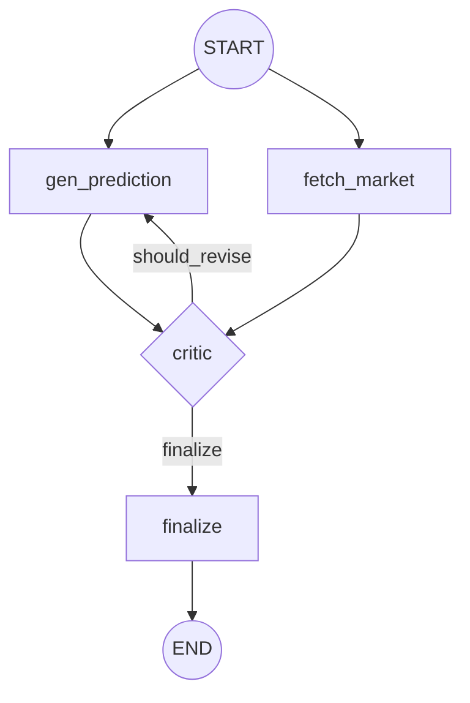
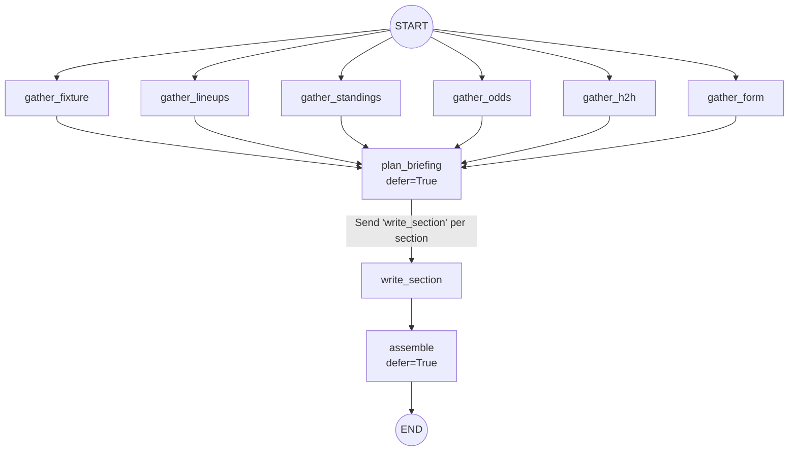
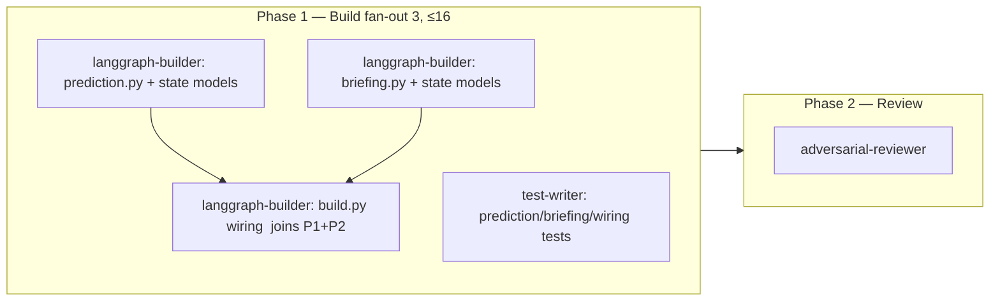

# wf-04 — Advanced Graph (prediction + briefing subgraphs)

> Purpose: build the two remaining LangGraph runtime patterns — the **generator–evaluator** prediction subgraph (`app/graph/subgraphs/prediction.py`) and the **orchestrator–worker + parallelization** briefing subgraph (`app/graph/subgraphs/briefing.py`) — and wire both into the top-level `router` in `app/graph/build.py`, with a provable termination bound on the critic loop and deterministic `Send` fan-in.

**Two layers, kept strictly separate (per canonical-spec §0):**
- **(a) Runtime patterns** = the LangGraph behavior *inside Pitch IQ* — the subgraphs this doc builds (patterns #3, #4, #5 from canonical-spec §3.2).
- **(b) Build workflows** = how we *construct* those subgraphs with Claude Code — the dynamic workflow in the **Execution Strategy** section at the end. The runtime `interrupt()`/loop is product behavior; the build-time fan-out of 3 subagents is orchestration. They never mix: no human sign-off lives *inside* this workflow (sign-off is a boundary between workflows, canonical-spec §8).

---

## 1. Scope, prereqs, dependencies

| Field | Value |
|---|---|
| Workflow | **wf-04 advanced-graph** (canonical-spec §8 table) |
| Goal | prediction (gen-eval) + briefing (orch-worker + parallel) subgraphs, wired into router |
| Depends on | **wf-03 core-graph** (state schema, `router`, ReAct `qa_agent`, tool binding, `llm` factory) |
| Mode | **dynamic workflow** (justified in Execution Strategy) |
| Fan-out | **3** (prediction, briefing, router-wiring) — ≤ 16 cap respected |
| Verifier | `adversarial-reviewer`: critic loop terminates (≤2), no orphan `Send`, deterministic fan-in, calibration sanity |
| Save-as-command | **no** |

**Hard prereqs from wf-03 that this workflow consumes (do not re-create):**
- `app/graph/state.py` — `CompanionState` TypedDict + `Route` enum + the Pydantic payload models (`RouterDecision`, `UserContext`, `DataFragment`, `Prediction`, `Critique`, `BriefingPlan`, `BriefingSection`, `Briefing`). This workflow may *add fields/models* but must not break wf-03's router/qa_agent contract.
- `app/graph/router.py` — `router` node + `pick_route(state) -> Route` + `add_conditional_edges`.
- `app/graph/build.py` — `companion_graph` builder with `ingest → router → {…} → persist_memory → END`.
- `app/graph/llm.py` — `init_chat_model(...)` factory resolving `MODEL_ROUTER / MODEL_AGENT / MODEL_CRITIC` (canonical-spec §1).
- `app/providers/base.py` — `SportsDataProvider` / `OddsProvider` `Protocol`s + Pydantic models (`WinProbabilities`, `Fixture`, `Lineups`, `Standings`, `HeadToHead`, `TeamForm`, `MatchOdds`, `DataFragment`).
- `app/providers/fake.py` — `FakeProvider` (deterministic) for graph tests.

---

## 2. Pinned versions + sources

These are the only fast-moving libraries this workflow touches; pin exactly (canonical-spec §1, research `00-langgraph.md`).

| Package | Version | Used here for | Source |
|---|---|---|---|
| `langgraph` | **1.2.7** | `StateGraph`, `add_conditional_edges`, `add_node(..., defer=True)`, `START`/`END` | https://pypi.org/pypi/langgraph/json |
| `langchain` | **1.3.11** | (subgraphs use raw `StateGraph`, not `create_agent`) | https://pypi.org/pypi/langchain/json |
| `langchain-core` | **1.4.8** | messages, `Runnable`, `.with_structured_output` | https://pypi.org/pypi/langchain-core/json |
| `langchain-openai` | **1.3.3** | OpenAI chat models via `init_chat_model` | https://pypi.org/pypi/langchain-openai/json |
| `langgraph-prebuilt` | **1.1.0** | (not directly; `ToolNode` is qa_agent's) | https://pypi.org/pypi/langgraph-prebuilt/json |
| `langgraph-checkpoint` | **4.1.1** | `InMemorySaver` for graph tests | https://pypi.org/project/langgraph-checkpoint/ |

Key API facts (research `00-langgraph.md`):
- **Send API**: `from langgraph.types import Send`; a conditional-edge fn returns `list[Send]`, each dispatching one worker with its own payload; results merge through an `operator.add` channel (map-reduce). https://docs.langchain.com/oss/python/langgraph/workflows-agents
- **Deferred fan-in**: `add_node(name, fn, defer=True)` delays a node until all upstream branches finish. https://docs.langchain.com/oss/python/langgraph/use-graph-api
- **Subgraph composition (shared state keys)**: add the compiled subgraph directly as a node — it reads/writes the parent's channels; it inherits the parent checkpointer. https://docs.langchain.com/oss/python/langgraph/use-subgraphs

> **Layer note:** all of the above is **runtime** behavior. The Claude Code orchestration that builds it is in the Execution Strategy section and uses none of these libraries.

---

## 3. Runtime design — prediction subgraph (generator–evaluator + parallel)

File: `app/graph/subgraphs/prediction.py` · factory: `build_prediction_subgraph() -> CompiledStateGraph` · pattern #5 (+#3) from canonical-spec §3.2/§3.3.



Canonical signature (canonical-spec §3.3):
```
START → [gen_prediction ∥ fetch_market] → critic → (revise? loop≤2 : finalize) → END
```

### 3.1 Nodes (exact behavior)

| Node | Reads (state / runtime) | Writes (state channel) | Model |
|---|---|---|---|
| `gen_prediction` | `messages`, `intent.params` (fixture/team refs), `runtime.context` providers; `prediction_round` | `prediction: Prediction(probs, scoreline, drivers)`, `prediction_round += 1` (overwrite int) | `MODEL_AGENT` |
| `fetch_market` | team refs + kickoff; `runtime.context.odds_provider` | `gathered += [DataFragment(kind="market", payload=WinProbabilities)]` (`operator.add`) | none (provider call) |
| `critic` | `prediction`, `gathered` (market), `prediction_round` | `critique: Critique(verdict, issues[], market_delta)` | `MODEL_CRITIC` |
| `finalize` | `prediction`, `critique` | `prediction` (final), `final_response: str` (chat-formatted) | none |

- `fetch_market` calls `OddsProvider.get_win_probabilities(a, b, kickoff) -> WinProbabilities` (already de-vigged; `p_i=(1/d_i)/Σ(1/d_j)`, anchor Pinnacle — canonical-spec §4.2). It writes into the existing `gathered` channel (`operator.add`) so the value **persists across revise loops** without a new state field. `fetch_market` runs **once** (it is only reachable from `START`).
- `gen_prediction` produces a structured `Prediction` via `.with_structured_output(Prediction)` (OpenAI strict json_schema). `Prediction` and `Critique` are Pydantic `BaseModel` with `model_config = ConfigDict(extra="forbid")` (canonical-spec §3.1).
- **Critic rubric** (canonical-spec §3.3): probabilities valid + sum→1; within a sane band of the no-vig market; rationale cites form not vibes; flags favorite-bias. `Critique.verdict ∈ {pass, revise}` (use a `Verdict` enum), `Critique.market_delta` = max |p_model − p_market|.

### 3.2 The loop edge — provable termination (≤ 2 rounds)

State field (already in `CompanionState`, canonical-spec §3.1): `prediction_round: NotRequired[int]` — **no reducer → last-write-wins (overwrite)**.

Conditional edge after `critic`:
```
add_conditional_edges("critic", should_revise, {"gen_prediction": "gen_prediction", "finalize": "finalize"})
```
`should_revise(state) -> str`:
```
round = state.get("prediction_round", 0)          # = number of gen_prediction runs so far
if state["critique"].verdict == Verdict.REVISE and round < 2:
    return "gen_prediction"
return "finalize"
```

**Termination argument (the property the reviewer must confirm):**
1. `prediction_round` starts at `0` and is **strictly incremented by exactly 1** on every `gen_prediction` execution (overwrite channel, so no double-count from parallelism — `gen_prediction` is on a single branch).
2. The back-edge to `gen_prediction` is taken **only when `round < 2`**. So `gen_prediction` runs for `round ∈ {1, 2}` at most → **≤ 2 generations = ≤ 2 rounds**.
3. After the 2nd generation, `round == 2`, the guard `round < 2` is false, so the edge goes to `finalize` **regardless of verdict** — even a critic that *always* returns `REVISE` terminates.
4. There is no other cycle in the graph; every other edge is forward. Therefore the subgraph is a DAG except for one bounded back-edge → it halts.

Worst-case visit sequence: `gen(1) → critic → gen(2) → critic → finalize`. Best case: `gen(1) → critic → finalize`.

> **Adversarial edge to test:** if `prediction_round` were placed under an `operator.add`-style reducer it would double-count under any fan-in and break the bound. Keep it a plain overwrite int. The reviewer asserts the channel has no reducer.

### 3.3 Fan-in at `critic` (must NOT be deferred)

`critic` has two incoming edges (`gen_prediction`, `fetch_market`). On the **first** pass LangGraph's superstep barrier makes `critic` wait for both. On a **revise** pass only `gen_prediction → critic` fires (`fetch_market` is not re-entered).

> **Adversarial trap:** do **not** mark `critic` with `defer=True`. `defer=True` waits for *all* upstream branches every time; on the revise loop `fetch_market` never re-runs, so a deferred `critic` would deadlock. `critic` is a plain node. (The reviewer must assert `critic` is not deferred.)

---

## 4. Runtime design — briefing subgraph (orchestrator–worker + parallelization)

File: `app/graph/subgraphs/briefing.py` · factory: `build_briefing_subgraph() -> CompiledStateGraph` · patterns #3 + #4 from canonical-spec §3.2/§3.3.



Canonical signature (canonical-spec §3.3):
```
START → fan-out gather_{fixture,lineups,standings,odds,h2h,form} (∥, operator.add → gathered)
      → plan_briefing (orchestrator: choose sections by stakes + user bracket)
      → Send("write_section", spec) per section (∥ workers)
      → assemble (defer=True fan-in) → END
Sections: stakes, key_players, bracket_impact, head_to_head, form_and_prediction, how_it_works(rules)
```

### 4.1 Nodes (exact behavior)

| Node | Reads | Writes | Model |
|---|---|---|---|
| `gather_fixture` | fixture ref; `runtime.context.sports_provider.get_fixture` | `gathered += [DataFragment(kind="fixture", …)]` | none |
| `gather_lineups` | `…get_lineups` | `gathered += [DataFragment(kind="lineups", …)]` | none |
| `gather_standings` | `…get_standings` | `gathered += [DataFragment(kind="standings", …)]` | none |
| `gather_odds` | `odds_provider.get_win_probabilities` | `gathered += [DataFragment(kind="odds", …)]` | none |
| `gather_h2h` | `…get_head_to_head` | `gathered += [DataFragment(kind="h2h", …)]` | none |
| `gather_form` | `…get_team_form` | `gathered += [DataFragment(kind="form", …)]` | none |
| `plan_briefing` (**defer=True**) | all of `gathered`, `user_context` (favorites/bracket), `intent.params` | `briefing_plan: BriefingPlan(sections=[SectionSpec,…])` | `MODEL_CRITIC` (reasoning) |
| `write_section` (worker, via `Send`) | one `SectionSpec` payload + read-only `gathered` | `briefing_sections += [BriefingSection]` (`operator.add`) | `MODEL_AGENT` |
| `assemble` (**defer=True**) | `briefing_sections`, `briefing_plan` | `briefing: Briefing`, `final_response: str` | none |

- All six `gather_*` nodes write into the **`gathered`** channel (`Annotated[list[DataFragment], operator.add]`, canonical-spec §3.1) — independent provider pulls run concurrently → lower latency (pattern #3).
- `plan_briefing` is `defer=True` so it waits for **all** `gather_*` branches before choosing sections. (All gathers are at equal depth and run once with no loop, so deferral is safe here.) It selects from the fixed section menu by stakes + the user's bracket; output is `BriefingPlan.sections` — a list of `SectionSpec(name, order, hint)`.
- `write_section` workers are dispatched dynamically (count is data-dependent → **Send API**, pattern #4). Each worker writes exactly one `BriefingSection`.
- `assemble` is `defer=True` → fan-in barrier; it waits for every dispatched `write_section`, then assembles.

### 4.2 Send fan-out + deterministic fan-in

Dispatch is a conditional edge out of `plan_briefing`:
```python
from langgraph.types import Send
def dispatch_sections(state) -> list[Send]:
    return [Send("write_section", spec) for spec in state["briefing_plan"].sections]

builder.add_conditional_edges("plan_briefing", dispatch_sections, ["write_section"])
builder.add_edge("write_section", "assemble")   # workers fan into the deferred assemble node
```

**Determinism guarantees (what the reviewer asserts):**
1. **All sections produced**: `len(state["briefing_sections"]) == len(plan.sections)` after `assemble` (fan-out count == fan-in count). `operator.add` accumulates every worker's single-element list.
2. **Deterministic ordering**: `operator.add` merge order across parallel workers is **not** guaranteed. `assemble` must **sort `briefing_sections` by `SectionSpec.order`** (stable key from the plan) before composing `Briefing.content`. Never rely on arrival order.
3. **No orphan `Send`**: the dispatch target `"write_section"` is a registered node and is the only string emitted; the mapping list `["write_section"]` matches.
4. **No empty fan-out**: `plan_briefing` must always emit **≥ 1 section** (guarantee `stakes` is always present). An empty `dispatch_sections` returns `[]`, which would leave `assemble` (deferred, downstream of `write_section`) potentially unreached. Guard: `BriefingPlan` validation requires `len(sections) >= 1`; the reviewer tests a plan-returns-empty scenario.

### 4.3 Two invocation paths (same subgraph)

Per canonical-spec §3.3, the briefing subgraph is invoked **two ways**:
- **Chat route `BRIEFING`** — entered as a node in `companion_graph` (see §5). Fixture/team refs come from `state["intent"].params` (the `RouterDecision`). Produces `final_response` for the stream.
- **Headless by the scheduler** — `app/services/briefing_service.py` calls the compiled subgraph directly with a **system `thread_id`** and an injected fixture id, then upserts the `briefings` row (canonical-spec §5/§6). The subgraph reads the fixture ref from its input state in this path (no router). This workflow exposes `build_briefing_subgraph()` so `briefing_service` (built in wf-06) can import it; wf-04 does **not** build the service.

---

## 5. Router wiring (`app/graph/build.py`)

The third unit. Both subgraphs are `StateGraph(CompanionState)` → **shared state keys** → add the compiled subgraph **directly as a node** (research `00-langgraph.md` subgraph pattern 1; it inherits the parent checkpointer attached at `companion_graph.compile()`).

```python
# app/graph/build.py  (additions only — ingest/router/qa_agent/chitchat/persist_memory exist from wf-03)
from app.graph.subgraphs.prediction import build_prediction_subgraph
from app.graph.subgraphs.briefing import build_briefing_subgraph

builder.add_node("prediction", build_prediction_subgraph())
builder.add_node("briefing", build_briefing_subgraph())

# pick_route already maps Route -> node-name; extend its mapping dict:
#   Route.PREDICTION -> "prediction", Route.BRIEFING -> "briefing"
builder.add_conditional_edges("router", pick_route, {
    Route.MATCH_QA: "qa_agent", Route.RULES_QA: "qa_agent", Route.BRACKET_QA: "qa_agent",
    Route.PREDICTION: "prediction", Route.BRIEFING: "briefing",
    Route.BRACKET_OPS: "bracket_ops",   # bracket_ops added in wf-05; leave a TODO/stub edge if absent
    Route.CHITCHAT: "chitchat",
})

builder.add_edge("prediction", "persist_memory")
builder.add_edge("briefing", "persist_memory")
```

- Subgraph factories `compile()` **without** a checkpointer/store (they inherit the parent's at `companion_graph.compile()`).
- `Route.BRACKET_OPS` lands in wf-05; if `bracket_ops` is not yet a node, keep wf-03's existing placeholder rather than introducing a new contradiction.

---

## 6. Ordered tiny tasks (Build phase)

Exact file paths; each task is independently testable. Tasks 1 and 2 are parallel (no shared file); task 3 depends on both.

**Unit A — prediction (`app/graph/subgraphs/prediction.py`)**
1. Add/confirm Pydantic models in `app/graph/state.py`: `Prediction(probs: WinProbabilities-shaped, scoreline, drivers: list[str])`, `Critique(verdict: Verdict, issues: list[str], market_delta: float)`, `Verdict(str, Enum) = {PASS, REVISE}`. All `extra="forbid"`. Confirm `prediction_round: NotRequired[int]` has **no reducer**.
2. `app/graph/subgraphs/prediction.py`: implement `gen_prediction`, `fetch_market`, `critic`, `finalize`, `should_revise`, and `build_prediction_subgraph()` per §3. Resolve models via `app/graph/llm.py` (`MODEL_AGENT` for gen, `MODEL_CRITIC` for critic).
3. `tests/unit/graph/test_prediction.py` (test-writer): see §7.

**Unit B — briefing (`app/graph/subgraphs/briefing.py`)**
4. Add/confirm in `app/graph/state.py`: `SectionSpec(name, order: int, hint)`, `BriefingPlan(sections: list[SectionSpec])` (validator: `len>=1`), `BriefingSection(name, order, content)`, `Briefing(content, sections)`. `extra="forbid"`.
5. `app/graph/subgraphs/briefing.py`: implement the six `gather_*` nodes, `plan_briefing` (defer), `dispatch_sections`, `write_section`, `assemble` (defer, sort by `order`), and `build_briefing_subgraph()` per §4. Models: `plan_briefing → MODEL_CRITIC`, `write_section → MODEL_AGENT`.
6. `tests/unit/graph/test_briefing.py` (test-writer): see §7.

**Unit C — wiring (`app/graph/build.py`)**
7. Wire both subgraphs into `companion_graph` per §5; extend `pick_route` mapping for `Route.PREDICTION` / `Route.BRIEFING`; add `→ persist_memory` edges.
8. `tests/integration/graph/test_router_wiring.py` (test-writer): graph compiles; routing to `prediction`/`briefing` reaches `persist_memory` and sets `final_response`.

---

## 7. Tests / verification + Definition of Done

Graph tests use `FakeProvider` (deterministic) + `InMemorySaver` (canonical-spec §6). Run: `uv run pytest -q`.

**Prediction (`tests/unit/graph/test_prediction.py`)**
- `test_probabilities_valid_sum_to_one`: finalized `Prediction.probs.{home,draw,away}` each ∈ [0,1] and sum ≈ 1.0 (abs tol 1e-6).
- `test_critic_loop_terminates_when_always_revise`: monkeypatch `critic` to always return `Verdict.REVISE`; assert `gen_prediction` invoked **exactly 2 times** and the run ends at `finalize` (no recursion-limit error). Proves the ≤2 bound.
- `test_loop_short_circuits_on_pass`: critic returns `PASS` first pass → `gen_prediction` invoked once, `finalize` reached.
- `test_fetch_market_runs_once`: assert `OddsProvider.get_win_probabilities` called once even across a revise loop (market persists in `gathered`).
- `test_calibration_sanity`: with `FakeProvider` market = (0.6/0.25/0.15), final probs land within a sane band (|Δ| ≤ configured tolerance) — Brier-style guard, not exact match.

**Briefing (`tests/unit/graph/test_briefing.py`)**
- `test_all_sections_written`: plan with N sections → `len(briefing_sections) == N` and `Briefing` contains all N.
- `test_sections_ordered_deterministically`: shuffle worker completion (Fake delays) → assembled order strictly equals `SectionSpec.order`. Run twice → identical output (determinism).
- `test_no_orphan_send`: every `Send` targets `write_section`; graph compiles with the conditional-edge mapping.
- `test_empty_plan_guarded`: `BriefingPlan(sections=[])` raises validation (or `plan_briefing` always yields ≥1) — `assemble` never stranded.
- `test_gather_parallel_fan_in`: all six `DataFragment` kinds present in `gathered` before `plan_briefing` runs.

**Wiring (`tests/integration/graph/test_router_wiring.py`)**
- `test_compiles`: `companion_graph` compiles (validates edges/nodes).
- `test_route_prediction` / `test_route_briefing`: forced `Route` reaches the subgraph and `persist_memory`, `final_response` set.

**Definition of Done (gates — canonical-spec §9):**
- [ ] Critic loop **provably terminates** (≤2 rounds) — `test_critic_loop_terminates_when_always_revise` green.
- [ ] `Send` fan-out + `operator.add` fan-in produces **all** sections, in deterministic order.
- [ ] Prediction probabilities valid (each ∈ [0,1], **sum→1**).
- [ ] Both subgraphs wired; `companion_graph` compiles; routes reach `persist_memory`.
- [ ] `uv run ruff check . && uv run mypy app && uv run pytest -q` all green.
- [ ] `adversarial-reviewer` sign-off on the four invariants below.

---

## 8. Execution Strategy (build-time orchestration — layer (b))

> This section is about **building** the product with Claude Code, not runtime behavior. None of the runtime libraries above are involved.

### 8.1 Mode = dynamic workflow (justification)

**Dynamic workflow** (canonical-spec §8 mode rule). Justified because:
- **Two large, independent units** — `prediction.py` and `briefing.py` touch disjoint files and disjoint state channels (`prediction`/`critique`/`prediction_round` vs `briefing_plan`/`briefing_sections`/`briefing`); they parallelize cleanly.
- **Wiring is a thin third unit** that depends on both (`build.py`), naturally a join step.
- **Benefits from adversarial cross-check**: the two highest-risk properties — *critic-loop termination* and *deterministic `Send` fan-in* — are exactly the kind of "looks right, subtly wrong" logic an adversarial reviewer catches (deferred-critic deadlock, missing order-sort, double-counting round). This is the canonical trigger for workflow mode over turn-by-turn.

Not turn-by-turn: no mid-stream human sign-off is needed inside wf-04 (sign-off is the boundary *after* wf-03 spine and *before/after* this, per canonical-spec §9 — "after wf-03 graph spine/routing").

### 8.2 Phases (Build → Review) and fan-out



- **Fan-out = 3** (prediction, briefing, router-wiring) — within the ≤16 concurrency cap (canonical-spec §8). `prediction` and `briefing` run concurrently; `router-wiring` joins them. `test-writer` runs alongside builders (Sonnet).
- **Cost control** (canonical-spec §8): run one slice first — build `prediction.py` + its test green — to gauge spend, then fan out `briefing.py` + wiring.

### 8.3 Verifier (Phase 2)

`adversarial-reviewer` (Opus) must break the workers' output against the spec and assert four invariants:
1. **Loop termination** — even a perpetually-`REVISE` critic halts after exactly 2 `gen_prediction` runs; `prediction_round` is a plain overwrite int (no reducer).
2. **No orphan `Send`** — every `Send` targets a registered node; conditional-edge mapping matches; empty-plan path guarded.
3. **Deterministic fan-in** — `assemble` sorts by `SectionSpec.order`; identical output across two runs with shuffled worker completion; fan-out count == fan-in count; `critic` is **not** `defer=True` (no revise-loop deadlock).
4. **Calibration sanity** — finalized probabilities valid and within a sane band of the de-vigged market line (Brier-style, not exact).

Reviewer runs the gate: `uv run ruff check . && uv run mypy app && uv run pytest -q`.

### 8.4 Subagent roster + model routing (canonical-spec §8)

| Agent | Role here | Model | Why |
|---|---|---|---|
| `langgraph-builder` | author `prediction.py`, `briefing.py`, `build.py` wiring + state models | **Opus 4.8** | subgraph logic = graph design (loop bound, Send map-reduce) → Opus, not the mechanical Sonnet variant |
| `test-writer` | `test_prediction.py`, `test_briefing.py`, `test_router_wiring.py` | Sonnet | mechanical pytest scaffolding |
| `adversarial-reviewer` | break output vs the 4 invariants | **Opus 4.8** | adversarial reasoning about termination/determinism |

### 8.5 Tool allowlist (unattended run — canonical-spec §8)

- `langgraph-builder`: `Read, Edit, Write, Grep, Glob, Bash(uv:*), Bash(uv run:*), Bash(pytest:*), Bash(ruff:*), Bash(mypy:*), mcp__context7__*, WebFetch`
- `test-writer`: `Read, Edit, Write, Grep, Glob, Bash(uv:*), Bash(uv run:*), Bash(pytest:*)`
- `adversarial-reviewer`: `Read, Grep, Glob, Bash(uv:*), Bash(uv run:*), Bash(pytest:*)` (read-only on source; runs gate)
- Deny (global): `Bash(git push:*)`, destructive `rm -rf`, secret prints.

### 8.6 Save-as-command? **No**

Per canonical-spec §8 table. wf-04 is a one-time spine build, not a repeated review surface like wf-06 (`/review-endpoints`) or wf-08 (`/eval`).

---

## 9. Open questions (do not assert; resolve at build time)

1. **Generator model for `gen_prediction`**: canonical-spec §1 assigns `MODEL_CRITIC` to "prediction critic, briefing plan" and `MODEL_AGENT` to "briefing sections"; the generator is unstated. Assumed `MODEL_AGENT` (mid) here — confirm before pinning.
2. **Exact OpenAI snapshot ids** for `MODEL_AGENT`/`MODEL_CRITIC` (canonical-spec open question #1) — verify against the live OpenAI model list.
3. **Briefing personalization** (canonical-spec open question #7): personalized-per-user vs shared-per-fixture affects whether `plan_briefing` reads `user_context.bracket`. Subgraph supports both; default = read favorites/bracket when present.
4. **`fetch_market` failure handling**: if `OddsProvider` 429s/fails (canonical-spec §4.3 backoff→failover), `critic` must degrade to a market-less rubric rather than block. Decide: skip market-band check vs hard-fail. (Reviewer flags if unhandled.)
5. **`durability` for these runs**: canonical-spec uses `durability="sync"` only for HITL/scoring; prediction/briefing chat runs can use the default — confirm the default value on langgraph 1.2.7 (research `01-langgraph.md` open question; default could not be quoted from a rendered primary page).
