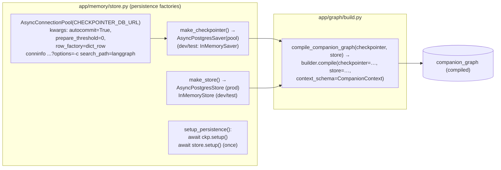
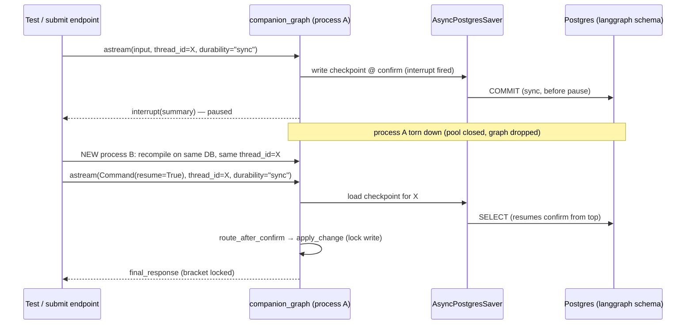
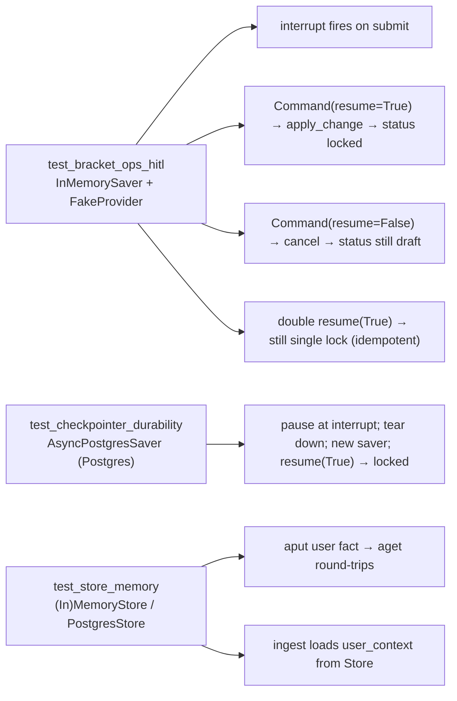

# wf-05 — Memory + HITL (build workflow)

> Purpose: the Claude Code build plan for wiring LangGraph **persistence** (AsyncPostgresSaver checkpointer + PostgresStore long-term memory at `compile()`) and the **in-product human-in-the-loop** `bracket_ops` subgraph that confirms a bracket lock before the write.

**Status:** derived from `../research/canonical-spec.md` (§3.2 #6/#7, §3.3, §3.4, §5, §6, §8, §9). If this doc disagrees with the canonical spec, the spec wins. Research sources: `../research/01-langgraph.md`, `../research/06-persistence.md`.

> **Two layers, kept separate (read this first):**
> - **Runtime patterns** = LangGraph behavior *inside the product*. What we are building here is two runtime patterns — pattern **#6 Memory** (checkpointer + store) and pattern **#7 Human-in-the-loop** (`interrupt`/`Command(resume)`).
> - **Build workflow** = the Claude Code orchestration *to build that runtime*. That is what the rest of this document specifies: mode, subagents, tasks, verifier, sign-off.
> The `interrupt()` in `bracket_ops` is an **in-product** pause for the *end user*. It is **not** a build-time sign-off. Build-time sign-off is a boundary *between* workflows (§Execution Strategy), never an `interrupt()` inside one (canonical-spec §8).

---

## 1. Goal & scope

Build the persistence + HITL slice of `companion_graph`:

1. **Checkpointer** — `AsyncPostgresSaver` (langgraph-checkpoint-postgres **3.1.0**, psycopg3 **3.3.4**) on the **`langgraph` schema**, via an `AsyncConnectionPool` with `autocommit=True, row_factory=dict_row, prepare_threshold=0`; `await checkpointer.setup()` **once**. Short-term, thread-scoped state + HITL durability.
2. **Store** — `AsyncPostgresStore` (prod) / `InMemoryStore` (dev), long-term cross-thread user facts namespaced `("user", user_id)`. Attached at the **same** `compile()`.
3. **`ingest`** node reads `user_context` from the Store; **`persist_memory`** node writes durable facts back to the Store.
4. **`bracket_ops`** subgraph (pattern #7): `validate_change → confirm[interrupt(summary)] → (approved? apply_change : cancel) → END`. `apply_change` is the **only** consequential write (lock/submit). Idempotent; run with `durability="sync"`.

**Prereq:** **wf-03** (core-graph) — `app/graph/state.py` (`CompanionState`, `Route`, `RouterDecision`, `UserContext`, `BracketChange`, `CompanionContext`), `app/graph/router.py`, `app/graph/build.py` skeleton, and stubs for `app/graph/nodes/{ingest,persist_memory}.py` already exist and the graph compiles. This workflow fills the persistence + HITL behavior into that spine.

**Out of scope (other workflows):** the brackets REST endpoints (`POST /api/brackets/{id}/submit`, `.../submit/confirm`) and the `lifespan.py` singleton that opens the pool and calls `setup()` are **wf-06** (api-streaming); the `SubmitConfirmDialog` HITL **UI** is **wf-07** (frontend). This workflow defines the *contracts* those consume — the `interrupt` payload shape and the `Command(resume=bool)` resume protocol — and proves them with direct-graph tests, not HTTP.

### Pinned versions (sources)
| Package | Version | Source |
|---|---|---|
| `langgraph` | 1.2.7 | https://libraries.io/pypi/langgraph |
| `langgraph-checkpoint` (BaseStore, InMemorySaver/Store) | 4.1.1 | https://pypi.org/project/langgraph-checkpoint/ |
| `langgraph-checkpoint-postgres` (AsyncPostgresSaver/Store) | 3.1.0 | https://pypi.org/project/langgraph-checkpoint-postgres/ |
| `psycopg[binary,pool]` | 3.3.4 | https://pypi.org/project/psycopg/ |

Key API docs: checkpointers https://docs.langchain.com/oss/python/langgraph/checkpointers · add-memory https://docs.langchain.com/oss/python/langgraph/add-memory · stores https://docs.langchain.com/oss/python/langgraph/stores · interrupts https://docs.langchain.com/oss/python/langgraph/interrupts · persistence https://docs.langchain.com/oss/python/langgraph/persistence · Durability https://reference.langchain.com/python/langgraph/types/Durability · AsyncPostgresSaver (no `schema=` arg) https://reference.langchain.com/python/langgraph.checkpoint.postgres/aio/AsyncPostgresSaver

---

## 2. Design (the two runtime patterns)

### 2.1 Persistence at `compile()` (pattern #6)



- **No `schema=` argument exists** on the Python `AsyncPostgresSaver` (constructor takes only `conn/pipe/serde`) — isolate checkpointer tables in the `langgraph` schema via the **connection `search_path`** (env `CHECKPOINTER_DB_URL` already carries `?options=-c%20search_path%3Dlanggraph`). This is the community-documented workaround, not an official API; verify against the deployed version (docs issue still open: https://github.com/langchain-ai/docs/issues/465). (research/06 §2; research/01 "Connection/pool requirements".)
- **Driver split is intentional:** the checkpointer uses **psycopg3** (`CHECKPOINTER_DB_URL`); the app ORM uses **asyncpg** (`DATABASE_URL`). Two separate pools, same Postgres instance, two schemas (`langgraph` vs `app`). No cross-schema FK (canonical-spec §5).
- `autocommit=True` is what lets `setup()` commit its DDL and avoids prepared-statement/pipeline errors behind a pooler (research/01; issue https://github.com/langchain-ai/langgraph/issues/5327). Both `AsyncPostgresSaver.setup()` **and** `AsyncPostgresStore.setup()` must be awaited once.
- **Store access inside nodes** is via the typed runtime: `context_schema=CompanionContext` makes `runtime.store` available to `ingest`/`persist_memory` (research/01 "Typed Runtime/context"; canonical-spec §3.1).
- **At-rest encryption (optional):** default is `JsonPlusSerializer`; if `LANGGRAPH_AES_KEY` is set, pass `EncryptedSerializer` as the saver `serde`. Scope (self-host vs LangSmith-platform auto-activation) is an open question — leave off unless the key is present (canonical-spec open Q #12; research/01 open Qs).

#### `ingest` reads, `persist_memory` writes

```python
# app/graph/nodes/ingest.py  (extend the wf-03 stub)
from app.memory.store import user_ns   # ("user", user_id)

async def ingest(state: CompanionState, runtime: Runtime[CompanionContext]) -> dict:
    item = await runtime.store.aget(user_ns(state["user_id"]), "profile")
    user_context = UserContext.model_validate(item.value) if item else UserContext()
    return {"user_context": user_context}            # + existing tournament/thread resolution

# app/graph/nodes/persist_memory.py
async def persist_memory(state: CompanionState, runtime: Runtime[CompanionContext]) -> dict:
    facts = derive_durable_facts(state)              # favorites/prefs/tone learned this turn; pure
    if facts:                                        # idempotent: skip no-op writes
        merged = {**(state["user_context"].model_dump()), **facts}
        await runtime.store.aput(user_ns(state["user_id"]), "profile", merged)
    return {}
```

`aget/aput/asearch` are the async Store methods; namespace is `("user", user_id)` (canonical-spec §5; research/01 stores). Semantic-search `index=` is **not** needed for MVP (simple key fetch).

### 2.2 `bracket_ops` HITL subgraph (pattern #7)

```mermaid
flowchart TD
  S((START)) --> V[validate_change]
  V -->|invalid| X[cancel]
  V -->|valid| C["confirm<br/>decision = interrupt(change_summary)"]
  C -. resume Command(resume=bool) .-> C
  C --> R{route_after_confirm<br/>state[approved]?}
  R -->|approve| A["apply_change<br/>(ONLY consequential write:<br/>draft → submitted/locked)"]
  R -->|cancel| X
  A --> E((END))
  X --> E
```

State fields used (all already in `CompanionState`, canonical-spec §3.1): `pending_change: BracketChange`, `approved: bool`, `final_response: str`, plus `user_id`, `tournament_id`.

**Idempotency rules (canonical-spec §3.3 + research/01 "current interrupt API"):**
- `interrupt()` makes the node **re-execute from the top** on resume. Therefore **all side effects live in `apply_change`, strictly *after* the interrupt** — `validate_change` and `confirm` are pure (build the summary, no DB writes).
- Exactly **one** `interrupt()` call, in `confirm`; resume values are matched by index, so the count/order is deterministic.
- **Never** wrap `interrupt()` in a bare `try/except Exception` — it would swallow the interrupt control-flow signal.
- `apply_change` is **itself idempotent**: it re-reads the bracket status and locks only if still `draft`/`submitted`; a duplicate/replayed resume on an already-`locked` bracket is a no-op returning the same confirmation. (Guards the at-most-once write even if the run is replayed.)
- The run that enters `bracket_ops` uses **`durability="sync"`** so the interrupt checkpoint is flushed **before** the pause — this is what makes resume survive a process restart (research/01 "Durability"; canonical-spec §3.3, §5).

```python
# app/graph/subgraphs/bracket_ops.py
from langgraph.graph import StateGraph, START, END
from langgraph.types import interrupt

async def validate_change(state, runtime) -> dict:
    change = state["pending_change"]
    problems = validate(change, runtime)          # picks complete? bracket in draft? before deadline?
    if problems:
        return {"approved": False, "final_response": f"Cannot submit: {problems}"}
    return {}                                      # pure; no writes

async def confirm(state, runtime) -> dict:
    summary = summarize_change(state["pending_change"])  # human-readable; THIS is the HITL UX contract
    approved: bool = interrupt(summary)            # pauses; resume value (bool) -> state["approved"]
    return {"approved": approved}

async def apply_change(state, runtime) -> dict:    # runs ONLY after resume(True); after the interrupt
    locked = await lock_bracket_idempotent(state["pending_change"].bracket_id, runtime)
    return {"final_response": locked.confirmation} # draft -> submitted/locked write happens here

async def cancel(state, runtime) -> dict:
    return {"final_response": "Bracket left in draft — nothing was locked."}

def route_after_confirm(state) -> str:
    return "apply" if state.get("approved") else "cancel"

def build_bracket_ops():
    b = StateGraph(CompanionState)                 # shares parent state; NO own checkpointer
    b.add_node("validate_change", validate_change)
    b.add_node("confirm", confirm)
    b.add_node("apply_change", apply_change)
    b.add_node("cancel", cancel)
    b.add_edge(START, "validate_change")
    b.add_conditional_edges("validate_change",
        lambda s: "cancel" if s.get("approved") is False else "confirm",
        {"confirm": "confirm", "cancel": "cancel"})
    b.add_conditional_edges("confirm", route_after_confirm,
        {"apply": "apply_change", "cancel": "cancel"})
    b.add_edge("apply_change", END)
    b.add_edge("cancel", END)
    return b                                        # compiled as a node inside companion_graph
```

The subgraph carries **no** checkpointer of its own — it inherits the top-level `companion_graph` checkpointer/store from `compile()` (that is the whole point of pattern #6). The `interrupt` is the **same payload** the wf-06 submit endpoint surfaces as `{interrupt:{id, summary}}` and the wf-07 `SubmitConfirmDialog` renders. **`summarize_change()`'s output is the HITL UX artifact under sign-off** at this workflow's boundary.

### 2.3 Wiring into `companion_graph` (`app/graph/build.py`)

```python
# app/graph/build.py
def build_companion_builder() -> StateGraph:
    b = StateGraph(CompanionState, context_schema=CompanionContext)
    b.add_node("ingest", ingest); b.add_node("router", router)
    # ... qa_agent / prediction / briefing / chitchat from wf-03/04 ...
    b.add_node("bracket_ops", build_bracket_ops().compile())   # subgraph as a node
    b.add_node("persist_memory", persist_memory)
    b.add_edge(START, "ingest"); b.add_edge("ingest", "router")
    b.add_conditional_edges("router", pick_route, {
        Route.BRACKET_OPS: "bracket_ops",                      # ... other routes ...
    })
    b.add_edge("bracket_ops", "persist_memory")
    b.add_edge("persist_memory", END)
    return b

def compile_companion_graph(checkpointer, store):
    return build_companion_builder().compile(checkpointer=checkpointer, store=store)
```

### 2.4 Durability across a simulated restart



**Resume protocol:** same `thread_id`, `Command(resume=True)` → `apply_change`; `Command(resume=False)` → `cancel`. Reading the interrupt back from a run uses the pinned version's typed-output API — `__interrupt__` projection on plain invoke vs `GraphOutput.interrupts` (`version="v2"`) vs `stream_events(..., version="v3").interrupts` (research/01 "How interrupts surface"). **Run the HITL graph via `astream(..., durability="sync")`, not `ainvoke`**, because `durability=` was added to stream/astream first and its wiring into `invoke/ainvoke` on 1.2.7 is unverified (issue https://github.com/langchain-ai/langgraph/issues/5741). Pin the exact accessor at wf-06; see open questions.

---

## 3. Ordered tasks (tiny, exact paths)

> All edits are backend (`backend/…`). Run `uv run pytest -q` after each test-bearing task. Side-effect-free tasks first; the consequential write (`apply_change`) and durability proof last.

| # | File | Task |
|---|---|---|
| T1 | `backend/uv.lock` (verify only) | Confirm `langgraph-checkpoint-postgres==3.1.0`, `langgraph-checkpoint==4.1.1`, `psycopg[binary,pool]==3.3.4` resolve; `uv run python -c "from langgraph.checkpoint.postgres.aio import AsyncPostgresSaver; from langgraph.store.postgres.aio import AsyncPostgresStore"`. |
| T2 | `app/memory/store.py` | `make_checkpointer(settings)` → prod: `AsyncPostgresSaver(AsyncConnectionPool(settings.checkpointer_db_url, kwargs={"autocommit":True,"prepare_threshold":0,"row_factory":dict_row}, open=False))`; dev/test: `InMemorySaver()`. (Pool opened in lifespan, wf-06.) |
| T3 | `app/memory/store.py` | `make_store(settings)` → prod `AsyncPostgresStore.from_conn_string(...)` / dev `InMemoryStore()`; add `user_ns(user_id) -> tuple[str,str]` returning `("user", user_id)`. |
| T4 | `app/memory/store.py` | `setup_persistence(checkpointer, store)` → `await checkpointer.setup()`; `await store.setup()` (guard: skip for in-memory). Idempotent / once. |
| T5 | `app/graph/nodes/ingest.py` | Extend stub: `runtime.store.aget(user_ns(user_id), "profile")` → populate `state["user_context"]` (default empty `UserContext` if absent). Keep tournament/thread resolution. |
| T6 | `app/graph/nodes/persist_memory.py` | `derive_durable_facts(state)` (pure) → `runtime.store.aput(user_ns(user_id), "profile", merged)`; skip when no new facts (idempotent). |
| T7 | `app/graph/subgraphs/bracket_ops.py` | Build subgraph per §2.2: `validate_change`, `confirm` (single `interrupt(summary)`), `apply_change` (idempotent lock), `cancel`, conditional edges, `build_bracket_ops()`. Side effects only in `apply_change`. |
| T8 | `app/graph/build.py` | Add `bracket_ops` node + `Route.BRACKET_OPS` conditional edge + `bracket_ops → persist_memory`; add `compile_companion_graph(checkpointer, store)` calling `compile(checkpointer=…, store=…, context_schema=CompanionContext)`. |
| T9 | `tests/integration/test_bracket_ops_hitl.py`, `tests/integration/test_checkpointer_durability.py`, `tests/integration/test_store_memory.py` | Write the three test suites (§4). `uv run pytest -q` green. |

---

## 4. Tests & verification (DoD)

Test stack (canonical-spec §6): pytest + pytest-asyncio, `FakeProvider`, `InMemorySaver`/`InMemoryStore` for fast graph tests; a **real Postgres** `AsyncPostgresSaver` only for the durability proof.



**Definition of Done — all must hold:**
- [ ] **Interrupt fires on submit:** invoking the graph on a valid `pending_change` pauses at `confirm`; the surfaced payload contains the human-readable `change_summary`.
- [ ] **Resume applies / cancels:** `Command(resume=True)` (same `thread_id`) → `apply_change` runs, bracket status → `submitted`/`locked`, `final_response` confirms; `Command(resume=False)` → `cancel`, **no write**, status stays `draft`.
- [ ] **Idempotent write:** replaying `resume(True)` (or resuming an already-locked bracket) does **not** double-apply — at most one lock.
- [ ] **Durable across a simulated restart (Postgres checkpointer):** pause at the interrupt with one `AsyncPostgresSaver`/pool; drop it; build a **fresh** saver on the same DB + `thread_id`; `Command(resume=True)` completes the lock. Proves `durability="sync"` flushed the interrupt checkpoint.
- [ ] **Store round-trips a user fact:** `aput(("user", uid), "profile", {...})` then `aget` returns it; `ingest` loads it into `state["user_context"]`.
- [ ] **`uv run pytest -q` green**, plus the canonical gate `uv run ruff check . && uv run mypy app && uv run pytest -q` (canonical-spec §9).

---

## 5. Execution Strategy (Claude Code build orchestration)

> This is the *build* layer — how Claude Code constructs the runtime above. (Distinct from the in-product `interrupt`, which is a runtime behavior, not a build sign-off.)

**Mode: `turn-by-turn`.** Justification (canonical-spec §8 mode rule): the slice is **tightly coupled to the compile wiring** — `compile_companion_graph` touches the whole graph spine (checkpointer + store + context_schema), so parallel edits would collide. And it **needs human sign-off on HITL UX** (the `change_summary` content and confirm/cancel flow), which the spec mandates as a **boundary between workflows, never an interrupt inside one**. HITL correctness (interrupt re-run semantics, side-effects-after-interrupt, idempotent writes, sync durability) is subtle and high-consequence (it gates a real DB lock), so a human stays in the loop step by step.

**Subagents (~2; canonical-spec §8 fan-out = 2):**

| Subagent | Does | Model | Tools (allowlist) |
|---|---|---|---|
| `langgraph-builder` | T2–T8: persistence factories, `ingest`/`persist_memory` Store I/O, `bracket_ops` subgraph, `build.py` compile wiring | **Opus** (HITL correctness — design tier, not mechanical) | `Read, Edit, Write, Grep, Glob, Bash(uv:*), Bash(uv run:*), Bash(pytest:*)`, `mcp__context7__*`, `WebFetch` |
| `test-writer` | T9: the three test suites (HITL resume, Postgres durability/restart, Store round-trip) | Sonnet | `Read, Edit, Write, Grep, Glob, Bash(uv:*), Bash(uv run:*), Bash(pytest:*)` |

**Verifier:** the **`adversarial-reviewer`** (Opus) independently runs the **interrupt/resume durability test** and tries to break it — asserts: side effects only after `interrupt()`; exactly one `interrupt()` in `confirm`; no bare `except` around `interrupt()`; `apply_change` idempotent on replay; checkpointer pool kwargs are `autocommit=True/prepare_threshold=0/row_factory=dict_row`; `setup()` called once; resume on a restarted saver still locks. Tools: `Read, Grep, Glob, Bash(uv:*), Bash(uv run:*), Bash(pytest:*)`.

**Model routing:** **Opus 4.8** for the builder (HITL correctness) and the reviewer; Sonnet acceptable only for the mechanical test scaffolding. (canonical-spec §8 "graph design → Opus".)

**Tool allowlist (unattended, canonical-spec §8):** `Read, Edit, Write, Grep, Glob`, `Bash(uv:*)`, `Bash(uv run:*)`, `Bash(pytest:*)`, `Bash(ruff:*)`, `Bash(mypy:*)`, `Bash(alembic:*)`, `mcp__context7__*`, `WebFetch`. **Deny:** `Bash(git push:*)`, `rm -rf`, secret prints. (No `pnpm`/`shadcn` — backend-only workflow.)

**Save-as-command?** **No** (canonical-spec §8 table).

**Sign-off boundary — AFTER this workflow:** boundary **#4 — approve HITL UX** (canonical-spec §9). Reviewer demo: trigger submit → interrupt → show the `change_summary`, confirm-locks / cancel-leaves-draft, and the simulated-restart resume. Human approves the interrupt summary wording and the confirm/cancel UX contract (which wf-07's `SubmitConfirmDialog` will render) before wf-06/wf-07 proceed.

---

## 6. Open questions (flagged, not asserted)

1. **Versioned interrupt-output accessor** — which of `__interrupt__` (v1 invoke) / `GraphOutput.interrupts` (v2) / `stream_events(...).interrupts` (v3) is the long-term default on langgraph **1.2.7**, and is v1's `__interrupt__`-in-result still the plain-`invoke` default? Resolve when wf-06 builds the submit endpoint. (research/01 open Qs; canonical-spec §3.4.)
2. **`durability=` on `ainvoke`** — confirmed for stream/astream; wiring into `invoke/ainvoke` tracked in issue #5741. Until verified on the installed signature, run the HITL graph via `astream(..., durability="sync")`. (research/01 open Qs.)
3. **Literal default of `durability`** — `"async"` is widely treated as the default but could not be quoted from a rendered primary page; irrelevant for HITL (we set `"sync"` explicitly) but confirm before relying on the default elsewhere. (research/01 open Qs.)
4. **Checkpointer schema isolation** — `search_path=langgraph` is a community workaround (no Python `schema=` arg); verify table placement against the deployed 3.1.0 wheel (docs issue #465 open). (research/06 open Qs.)
5. **`EncryptedSerializer` scope** — whether `LANGGRAPH_AES_KEY` auto-activates only on LangSmith/Platform or also self-hosted; keep off unless the key is set. (canonical-spec open Q #12; research/01 open Qs.)
6. **Briefings personalization** does not affect this workflow, but the same Store namespace `("user", user_id)` would back any personalized prefs — noted for consistency. (canonical-spec open Q #7.)
