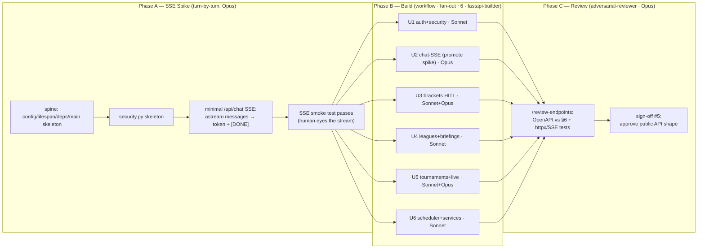

# wf-06 — API + Streaming (build workflow)

> Purpose: the executable Claude Code build plan for the FastAPI layer — every endpoint in spec §6, SSE chat streaming over `graph.astream(stream_mode="messages")`, the bracket submit/confirm HITL endpoints (interrupt → resume with `Command`), the live SSE feed, and the scheduled-briefing pipeline (APScheduler `'date'` jobs + `briefing_service` + `poller`).

**Source of truth:** [`../research/canonical-spec.md`](../research/canonical-spec.md) §6 (endpoints, project structure, scheduler jobs), §2 (lifespan singletons, env), §3.4 (streaming + interrupt surfacing), §5 (persistence), §8 (build-workflow rules + subagent roster + allowlist). Library/version/API claims trace to [`../research/04-fastapi-langgraph-integration-background-scheduler.md`](../research/04-fastapi-langgraph-integration-background-scheduler.md). **If anything here disagrees with the spec, the spec wins.**

**Two layers, kept strictly separate:**
- **(a) Runtime patterns** = LangGraph behavior *inside the product* (SSE over `astream`, `interrupt`/`Command` resume, the scheduler firing the briefing subgraph headless). This doc references those as the **behavior the built endpoints must exhibit**, cross-linked to spec §3/§6 — it does not re-design them.
- **(b) Build workflows** = Claude Code dynamic-workflow orchestration used *to build the product*. **This whole document is layer (b)**: phases, fan-out units, ordered tasks, verifier, sign-off.

---

## 1. Scope, prerequisites, inputs consumed

### Delivers (the §6 backend surface)
- All FastAPI routers under `app/api/*` matching spec §6 signatures exactly (auth, chat-SSE, brackets+HITL, leagues, briefings, tournaments+live, health).
- The shared spine: `app/main.py`, `app/lifespan.py`, `app/deps.py`, `app/security.py`, `app/config.py` wiring, `app/schemas/*`.
- Services: `app/services/{briefing_service,scoring_service,poller}.py`.
- Scheduler: `app/scheduler/{scheduler,jobs}.py`.
- DB repositories used by the endpoints: `app/db/repositories/{users,brackets,leagues,fixtures,briefings,conversations}.py` + any incremental alembic revision its endpoints/services require.
- Tests (httpx ASGITransport + SSE smoke + HITL flow + scheduler unit + OpenAPI contract) and the reusable `/review-endpoints` command.

### Prereqs (hard) — spec §8
- **wf-04 (advanced-graph):** `prediction` + `briefing` subgraphs exist and compile. `briefing_service` (this WF) invokes the **briefing subgraph headless** (spec §3.3).
- **wf-05 (memory-hitl):** `AsyncPostgresSaver` + Store wiring and the `bracket_ops` subgraph with `interrupt(change_summary)` in the `confirm` node (spec §3.4). The submit/confirm endpoints (this WF) drive that subgraph and resume it with `Command(resume=bool)`.
- Transitively: **wf-03** `companion_graph` spine (router + `qa_agent`) for chat; **wf-02** providers for the poller/odds/tools; **wf-01** monorepo + `alembic init -t async` + tool allowlist.

### Inputs consumed (must already exist; coordination note)
- `app/graph/build.py` exporting the **compiled** `companion_graph` factory and the subgraphs.
- `app/providers/*` (incl. `FakeProvider` for tests) and `app/providers/__init__.py` factory.
- App-schema SQLAlchemy models (`app/db/{base,models,session}.py`) + a baseline alembic migration for the spec §5 tables. **Ownership note:** `brackets`/`bracket_picks` land with wf-05 (its `apply_change` writes them); wf-06 **adds** the remaining tables its endpoints first consume (`conversations`, `leagues`, `league_memberships`, `briefings`, `fixtures` cache, `favorite_teams`) and their repositories via incremental alembic revisions. If a needed model is missing at start, that is the first task of the owning unit (see §9 / Open Question OQ-3).

---

## 2. Execution strategy (REQUIRED)

| Aspect | Decision | Why |
|---|---|---|
| **Mode** | **Dynamic workflow** — but **only after** a short **turn-by-turn SSE spike** (Phase A). | Streaming is the delicate part: token-frame protocol, node filtering, proxy buffering, and disconnect semantics must be proven once, sequentially, with a human eye. Once the SSE mechanism + shared spine are stable, the remaining endpoints are ~6 **independent groups** with no shared mutable surface → safe to fan out (spec §8: "workflow when parallelizable across many independent units"). |
| **Phases** | **Spike [turn-by-turn] → Build [workflow, fan-out ~6] → Review [adversarial].** | De-risk → parallelize → cross-check. |
| **Fan-out** | **~6 units**, cap **≤ 16** (spec §8 concurrency rule): `auth+security`, `chat-SSE`, `brackets(HITL)`, `leagues+briefings`, `tournaments+live`, `scheduler+services`. | Matches spec §8 WF table ("~6 (auth, chat-SSE, brackets, leagues+briefings, tournaments, scheduler)"). |
| **Verifier** | **`adversarial-reviewer`** (Opus) vs **spec §6 signatures** + the httpx/SSE tests. Packaged as the **`/review-endpoints`** command. | Spec §8 WF table verifier column. |
| **Save-as-command** | **Yes — `/review-endpoints`** (reusable; re-run on any endpoint change). | Spec §8 WF table. |
| **Model routing** | **Opus 4.8** for SSE/streaming work (`chat-SSE`, the live SSE endpoint, the submit/confirm `interrupt`/`Command` handling) **and the reviewer**; **Sonnet** for plain CRUD (`auth`, `leagues`, `briefings`, tournament JSON GETs, scheduler/service boilerplate). | Spec §8: "graph design, SSE → Opus 4.8; mechanical/boilerplate → Sonnet." |
| **Cost control** | Run the **one-unit slice first** (Phase A spike = the chat-SSE slice) to gauge spend before the full fan-out (spec §8 cost-control rule). | — |
| **Sign-off boundary** | **AFTER wf-06** — human approves the **public API shape** (sign-off #5, spec §9). A boundary *between* workflows, **never** an `interrupt` inside one (spec §8). | Frontend (wf-07) consumes this contract; lock it before building against it. |



### Tool allowlist for this WF (spec §8 `permissions.allow`)
`Read, Edit, Write, Grep, Glob`, `Bash(uv:*)`, `Bash(uv run:*)`, `Bash(pytest:*)`, `Bash(ruff:*)`, `Bash(mypy:*)`, **`Bash(alembic:*)`**, `Bash(git:*)` (no push), `WebFetch`, `WebSearch`, `mcp__context7__*`. **Deny:** `Bash(git push:*)`, `rm -rf`, secret prints. (No `pnpm`/`shadcn` — backend-only WF.)

### Agents (spec §8 roster)
- **`fastapi-builder`** — endpoints, SSE, DB, scheduler. Tools `Read,Edit,Write,Grep,Glob,Bash(uv,pytest,alembic),context7`. Sonnet, **Opus for SSE**.
- **`test-writer`** — pytest. Tools incl. `Bash(uv,pytest)`. Sonnet.
- **`adversarial-reviewer`** — break worker output vs §6 + tests. Tools `Read,Grep,Glob,Bash(uv,pytest)`. **Opus.**

---

## 3. Phase A — SSE spike (turn-by-turn, Opus)

**Justification (required):** SSE is the one delicate, easy-to-get-subtly-wrong path — token-frame protocol, which `langgraph_node` reaches the browser, terminal `[DONE]`, no proxy buffering, and clean disconnect. Proving it *once, sequentially*, with the spine it needs, both de-risks streaming and produces the stable contract files the 6 fan-out units build on. This is also the **one-unit cost slice** (spec §8).

**SSE transport decision (spec wins):** use **`sse-starlette` 3.4.5** `EventSourceResponse` ([pypi](https://pypi.org/project/sse-starlette/) · [repo](https://github.com/sysid/sse-starlette)) — chosen over the unverified first-party `fastapi.sse` (spec §1, Open Question #5). Research [04] reports `fastapi.sse.EventSourceResponse` was added in FastAPI 0.135.0 (PR #15030); **treat as unverified** — if confirmed present in `fastapi` **0.138.2** it is a drop-in import swap with identical headers (`text/event-stream`, `Cache-Control: no-cache`, `X-Accel-Buffering: no`, ~15 s keep-alive). Do **not** swap during this WF.

**Streaming contract (spec §3.4, Risk #2):** `graph.astream(input, config, stream_mode="messages")` → `(chunk, meta)` — the **stable v2 messages-mode contract**. Filter `meta["langgraph_node"]` to user-facing nodes only. The typed-projection `astream_events(version="v3")` is **beta** — do not adopt; gate behind GA. (We are Python ≥ 3.12, so the research [04] "pass `RunnableConfig` on Py<3.11" caveat does **not** apply; `streaming=True` on the chat model still does — owned by `app/graph/llm.py` from wf-03.)

### Ordered tasks (do in order; commit after the smoke passes)
1. `app/config.py` — confirm `pydantic-settings` `Settings` exposes the §2 env surface used here (`CORS_ORIGINS`, `RUN_SCHEDULER`, `JWT_*`, `LIVE_POLL_SECONDS`, `BRIEFING_LEAD_HOURS`, DB URLs). Add only missing keys.
2. `app/lifespan.py` — `@asynccontextmanager` building the §2 singletons onto `app.state`: compiled `companion_graph`, `AsyncPostgresSaver` (call `await checkpointer.setup()` once), `AsyncPostgresStore`, asyncpg engine, provider clients. Scheduler start is **conditional on `settings.RUN_SCHEDULER`** (wired fully in U6; stub the branch now). Tear pools down on shutdown.
3. `app/deps.py` — `get_settings`, `get_db` (async session), `get_state(request)->request.app.state`, `get_current_user` (stub returns a fixed test user this phase; real impl in U1).
4. `app/security.py` — skeleton: `OAuth2PasswordBearer`, `decode_token`, signatures only (filled in U1).
5. `app/schemas/common.py` + `app/schemas/chat.py` — `ChatIn{thread_id: str | None, message: str, tournament_id: str}`; RFC-9457 `Problem` model.
6. `app/api/health.py` — `GET /healthz → {status}`.
7. `app/api/chat.py` — **minimal** `POST /api/chat → EventSourceResponse`: resolve `thread_id`, run `astream(stream_mode="messages")`, emit `event="token"` for user-facing nodes, terminal `event="done", data="[DONE]"`. (Promoted to full spec in U2.)
8. `app/main.py` — `FastAPI(lifespan=...)`, `CORSMiddleware(allow_origins=settings.CORS_ORIGINS)`, include `health` + `chat` routers under `/api`.
9. `tests/conftest.py` + `tests/integration/test_chat_sse.py` — ASGITransport app fixture with `FakeProvider` + `InMemorySaver` overrides; **SSE smoke asserts ≥1 `token` frame then a `[DONE]` frame**. Run `uv run pytest tests/integration/test_chat_sse.py -q` green; **human eyes the streamed tokens**.

**Contract sketch — `app/api/chat.py` (subagents implement; not final code):**
```python
from sse_starlette.sse import EventSourceResponse, ServerSentEvent
from langchain_core.messages import AIMessageChunk

USER_FACING = {"qa_agent", "chitchat"}          # only these nodes' tokens reach the browser

@router.post("/chat")                            # POST /api/chat
async def chat(body: ChatIn, user=Depends(get_current_user), state=Depends(get_state)):
    thread_id = body.thread_id or await conversations_repo.create(user.id, body.tournament_id)
    config = {"configurable": {"thread_id": thread_id, "user_id": str(user.id)}}
    inp = {"messages": [("user", body.message)], "user_id": str(user.id),
           "tournament_id": body.tournament_id, "thread_id": thread_id}

    async def gen():
        async for chunk, meta in state.graph.astream(inp, config, stream_mode="messages"):
            node = meta.get("langgraph_node")
            if isinstance(chunk, AIMessageChunk) and node in USER_FACING and chunk.content:
                yield ServerSentEvent(event="token", data=chunk.content)
            elif node == "qa_agent" and getattr(chunk, "tool_calls", None):
                yield ServerSentEvent(event="tool", data=_tool_label(chunk))   # U2
        yield ServerSentEvent(event="done", data="[DONE]")

    return EventSourceResponse(gen())            # sets text/event-stream, X-Accel-Buffering:no
```

**Phase A exit criteria:** spine compiles; `uv run ruff check . && uv run mypy app` clean; SSE smoke green; `token`+`[DONE]` frames visually confirmed. → proceed to fan-out.

---

## 4. Phase B — Build (workflow, fan-out ~6)

Each unit owns a **disjoint file set** (§9) so the `fastapi-builder` instances run concurrently without collision, on the stable Phase-A spine. Every unit ends with its own httpx ASGITransport tests green.

### U1 — auth + security (Sonnet)
Endpoints (§6): `POST /api/auth/register (RegisterIn)→TokenOut` · `POST /api/auth/login (OAuth2 form)→TokenOut` · `GET /api/auth/google/login→302` · `GET /api/auth/google/callback (code,state)→TokenOut` · `GET /api/me→UserOut` · `PUT /api/me/favorite-teams (FavTeamsIn)→UserOut`.
Files: `app/security.py`, `app/api/auth.py`, `app/schemas/auth.py`, `app/db/repositories/users.py`; finalize `deps.get_current_user`.
Stack: **PyJWT HS256 + `pwdlib[argon2]`** + **Authlib (Google OAuth2 code flow, Q5)**, `OAuth2PasswordBearer`, `get_current_user` decodes token → 401 on `InvalidTokenError` (research [04]; [FastAPI OAuth2-JWT tutorial](https://fastapi.tiangolo.com/tutorial/security/oauth2-jwt/)). Custom dep — `fastapi-users` avoided (spec §1). ⚠️ Pin `authlib` at install (Q17).
Tasks: (1) `security.py`: `hash_password`/`verify_password` (argon2), `create_access_token` (HS256, `ACCESS_TOKEN_TTL_MIN`), `decode_token`, **Authlib `oauth.register("google", …)`** from `GOOGLE_CLIENT_ID`/`GOOGLE_CLIENT_SECRET`/`OAUTH_REDIRECT_URI`. (2) `schemas/auth.py`: `RegisterIn`, `TokenOut{access_token, token_type}`, `UserOut`, `FavTeamsIn{team_ids: list[str]}`. (3) `users` repo with `auth_provider`/`auth_subject` + **nullable `password_hash`**; `upsert_oauth_user(provider, subject, email, name)`. (4) `api/auth.py` six routes; login is an `OAuth2PasswordRequestForm`; `google/login`→redirect, `google/callback`→exchange code, upsert by `(auth_provider="google", auth_subject)`, issue HS256 JWT. (5) wire real `get_current_user`. (6) `tests/integration/test_auth.py` (password + a mocked Google callback).
DoD: register→login→`/api/me` round-trips a JWT; bad token → 401 problem+json; favorite-teams persists + returns updated `UserOut`.

### U2 — chat-SSE (Opus) — *promote the spike*
Endpoint (§6): `POST /api/chat (ChatIn)→EventSourceResponse` with events **`token`, `tool`, `done`**.
Files: `app/api/chat.py`, `app/schemas/chat.py`, `app/db/repositories/conversations.py`.
Tasks: (1) full `thread_id` resolution → upsert `conversations` row (logical join to checkpointer `checkpoints.thread_id`, spec §5). (2) emit `tool` events from `qa_agent` tool-call chunks (`_tool_label`). (3) error frame on graph exception (problem+json payload as an SSE `error` event, then close). (4) ensure proxy-safe headers carried by `EventSourceResponse`. (5) `tests/integration/test_chat_sse.py` hardened: asserts `token` frames, a `tool` frame when the fake graph calls a tool, terminal `[DONE]`.
DoD: TTFT path works against `FakeProvider`+`InMemorySaver`; only user-facing-node tokens stream; `[DONE]` always terminates (incl. error path).

### U3 — brackets (HITL) (Sonnet CRUD · **Opus** for submit/confirm)
Endpoints (§6): `POST /api/brackets→BracketOut` · `GET /api/brackets?tournament_id=` · `GET /api/brackets/{id}` · `PATCH /api/brackets/{id}/picks (PicksIn)→BracketOut` · `POST /api/brackets/{id}/submit→{interrupt}|BracketOut` · `POST /api/brackets/{id}/submit/confirm (ConfirmIn{approved})→BracketOut` · `GET /api/brackets/{id}/score→ScoreOut`.
Files: `app/api/brackets.py`, `app/schemas/bracket.py`, `app/db/repositories/brackets.py`.
HITL contract (spec §3.4): submit runs the graph (`route=BRACKET_OPS`) with **`durability="sync"`**; if it returns an interrupt, respond **409** `{"interrupt": {"id", "summary"}}`; confirm **resumes with `Command(resume=approved)`** on the **same `thread_id`** so the checkpoint holds the interrupted state. `apply_change` is the only consequential write; node idempotency owned by wf-05.
Tasks: (1) `schemas/bracket.py`: `BracketOut`, `PicksIn`, `ConfirmIn{approved: bool}`, `ScoreOut`, `InterruptOut{interrupt:{id,summary}}`. (2) brackets repo (draft/picks CRUD, denormalized `total_score`). (3) plain CRUD routes (Sonnet). (4) **submit/confirm** routes (Opus). (5) `score` route → `scoring_service`. (6) `tests/integration/test_brackets_hitl.py`.
DoD: **submit→interrupt(409 summary)→confirm(approved=True)→locked `BracketOut`**; `approved=False` cancels (status stays `draft`/`submitted`, no lock); idempotent re-resume safe.

**Contract sketch — submit/confirm (spec §3.4):**
```python
from langgraph.types import Command

def _thread(bracket_id, user_id) -> str:        # stable thread → checkpoint survives between calls
    return f"bracket-submit:{bracket_id}:{user_id}"

@router.post("/brackets/{bracket_id}/submit")
async def submit(bracket_id, user=Depends(get_current_user), state=Depends(get_state)):
    cfg = {"configurable": {"thread_id": _thread(bracket_id, user.id), "user_id": str(user.id)}}
    result = await state.graph.ainvoke(
        {"messages": [], "user_id": str(user.id), "route": "bracket_ops",
         "pending_change": {"kind": "submit", "bracket_id": str(bracket_id)}},
        cfg, durability="sync")
    if "__interrupt__" in result:               # langgraph 1.2.7 surfaces pending interrupts here
        intr = result["__interrupt__"][0]
        return JSONResponse(409, {"interrupt": {"id": intr.id, "summary": intr.value}})
    return BracketOut.model_validate(result["final"])

@router.post("/brackets/{bracket_id}/submit/confirm")
async def confirm(bracket_id, body: ConfirmIn, user=Depends(get_current_user), state=Depends(get_state)):
    cfg = {"configurable": {"thread_id": _thread(bracket_id, user.id), "user_id": str(user.id)}}
    result = await state.graph.ainvoke(Command(resume=body.approved), cfg, durability="sync")
    return BracketOut.model_validate(result["final"])
```

### U4 — leagues + briefings (Sonnet)
Endpoints (§6): `POST /api/leagues→LeagueOut` · `POST /api/leagues/join (JoinIn{invite_code,bracket_id})→LeagueOut` · `GET /api/leagues/{id}/leaderboard→LeaderboardOut` · `GET /api/fixtures/{id}/briefing?type=pre_match→BriefingOut` · `POST /api/briefings/{fixture_id}/generate (admin/manual)→{job_id}`.
Files: `app/api/leagues.py`, `app/api/briefings.py`, `app/schemas/league.py`, `app/schemas/briefing.py`, `app/db/repositories/{leagues,briefings}.py`.
Tasks: (1) league schemas + repo (invite_code unique, memberships, `bracket_id` linkage). (2) leaderboard reads denormalized `brackets.total_score`. (3) briefing GET reads `briefings` row (renders `pending`/`generating`/`ready`/`failed`). (4) manual generate enqueues via `scheduler`/`briefing_service` → returns `{job_id}`. (5) `tests/integration/test_leagues_briefings.py`.
DoD: create→join-by-code→leaderboard ordering correct; briefing GET returns current status; manual generate returns a `job_id`.

### U5 — tournaments + live (Sonnet JSON · **Opus** for live SSE)
Endpoints (§6): `GET /api/tournaments/{slug}→TournamentOut` · `/{slug}/fixtures→[FixtureOut]` · `/{slug}/standings→StandingsOut` · `GET /api/fixtures/{id}→FixtureOut` · `GET /api/fixtures/{id}/live→SSE` (live panel).
Files: `app/api/tournaments.py`, `app/schemas/tournament.py`, `app/db/repositories/fixtures.py`.
Live SSE: streams the poller-updated `fixtures` cache as `MatchEvent`/status frames + terminal `done` on FT. **Cross-process channel is an MVP design point** (poller runs in the worker process, the SSE endpoint in web): MVP = the endpoint **tails the poller-updated `fixtures` cache** on a short server-side interval; upgrade path = Postgres `LISTEN/NOTIFY` (or Redis pub/sub, "optional later" spec §3). See OQ-1.
Tasks: (1) tournament/fixture/standings schemas + repo. (2) three JSON GETs (Sonnet). (3) **live SSE** endpoint (Opus) using `EventSourceResponse`, events `event`/`status`/`done`. (4) `tests/integration/test_tournaments_live.py` (JSON + live SSE smoke driven by a fake cache writer).
DoD: JSON GETs match schemas; live SSE emits ≥1 event frame then `[DONE]` against a seeded cache.

### U6 — scheduler + services (Sonnet)
Files: `app/scheduler/scheduler.py`, `app/scheduler/jobs.py`, `app/services/briefing_service.py`, `app/services/scoring_service.py`, `app/services/poller.py`; finalize the `RUN_SCHEDULER` branch in `app/lifespan.py`.
Scheduler (spec §6 + research [04]): **APScheduler 3.11.3 `AsyncIOScheduler`** + persistent `SQLAlchemyJobStore` on the same Postgres ([pypi](https://pypi.org/project/APScheduler/) · [guide](https://apscheduler.readthedocs.io/en/3.x/userguide.html)). **NOT 4.x (alpha).** Started **only when `RUN_SCHEDULER=true`** (single replica — Risk #4 double-fire).
Jobs (spec §6):
- `schedule_briefings(tournament_id)` — scan upcoming fixtures; per fixture add a **`'date'`** job `generate_briefing(fixture_id)` at `kickoff − BRIEFING_LEAD_HOURS`, **`id=f"briefing:{fixture_id}"`, `replace_existing=True`** (idempotent on reboot).
- `generate_briefing(fixture_id)` — call `briefing_service` (runs the **briefing subgraph headless**, system `thread_id`) → upsert `briefings`.
- `poll_live()` — interval `LIVE_POLL_SECONDS=60`, active only in live windows; updates `fixtures` cache + pushes live SSE; triggers `score_settled_fixtures()` on FT.
- `nightly_sync()` — cron: refresh fixtures/standings, (re)schedule briefings, reconcile vs fallback.
Tasks: (1) `scheduler.py` factory. (2) `jobs.py` four jobs. (3) `briefing_service.generate(fixture_id)` headless subgraph + upsert (`generating`→`ready`/`failed`+`error`). (4) `scoring_service` settles `bracket_picks` vs `fixtures` → `points_awarded`/`is_correct`, denorm `brackets.total_score` (spec §5). (5) `poller.py`. (6) lifespan `RUN_SCHEDULER` branch. (7) `tests/unit/test_scheduler_jobs.py`.
DoD: `schedule_briefings` adds **exactly one job per fixture** with `id=briefing:{id}` + `replace_existing=True` (re-run replaces, no dupes); `generate_briefing` upserts a `ready` briefing via the fake subgraph; scheduler does not start when `RUN_SCHEDULER` unset.

**Contract sketch — scheduler/jobs (spec §6):**
```python
# app/scheduler/scheduler.py
from apscheduler.schedulers.asyncio import AsyncIOScheduler
from apscheduler.jobstores.sqlalchemy import SQLAlchemyJobStore

def build_scheduler(settings) -> AsyncIOScheduler:        # jobstore needs a SYNC driver URL (OQ-2)
    return AsyncIOScheduler(timezone="UTC", jobstores={
        "default": SQLAlchemyJobStore(url=settings.SCHEDULER_DB_URL)})  # derived from same Postgres

# app/scheduler/jobs.py
from datetime import timedelta
async def schedule_briefings(tournament_id: str) -> None:
    for fx in await fixtures_repo.upcoming(tournament_id):
        scheduler.add_job(generate_briefing, "date",
            run_date=fx.kickoff_at - timedelta(hours=settings.BRIEFING_LEAD_HOURS),
            args=[str(fx.id)], id=f"briefing:{fx.id}", replace_existing=True)

async def generate_briefing(fixture_id: str) -> None:
    await briefing_service.generate(fixture_id)            # headless briefing subgraph → upsert briefings
```

**Contract sketch — lifespan scheduler branch (spec §2):**
```python
# app/lifespan.py (inside the asynccontextmanager, after singletons built)
if settings.RUN_SCHEDULER:                                # exactly one replica owns the scheduler
    app.state.scheduler = build_scheduler(settings)
    register_periodic_jobs(app.state.scheduler)           # nightly_sync (cron), poll_live (interval)
    app.state.scheduler.start()
    await schedule_briefings_for_active_tournaments(app.state)
```

---

## 5. Phase C — Review (adversarial, Opus) + sign-off

Run **`/review-endpoints`** (the saved command, §8) with the `adversarial-reviewer`. The reviewer does **not** trust the builders; it independently verifies the contract.

**Checklist (verifier = spec §6 signatures + SSE/httpx tests):**
1. **OpenAPI vs §6** — every path/method/status in §6 is present with the exact request/response schema names; no extra/renamed routes; `/api` prefix; JWT required everywhere except `auth`/`healthz`.
2. **SSE** — chat emits `token`/`tool`/`done` and always terminates with `[DONE]` (incl. error path); only user-facing-node tokens stream; `EventSourceResponse` (sse-starlette 3.4.5), not raw `StreamingResponse`.
3. **HITL** — submit returns 409 `{interrupt}`; confirm resumes with `Command(resume=...)` on the same thread; `durability="sync"`; cancel path does not write.
4. **Scheduler** — one `'date'` job per fixture, `id=briefing:{id}`, `replace_existing=True`; scheduler off when `RUN_SCHEDULER` unset.
5. **Errors** — typed exceptions → RFC-9457 problem+json ([RFC 9457](https://www.rfc-editor.org/rfc/rfc9457)).
6. **Gate** — `uv run ruff check . && uv run mypy app && uv run pytest -q` green; `alembic upgrade head` clean.

**Sign-off boundary (#5, spec §9):** after the reviewer is green, a human **approves the public API shape**. This is the boundary into wf-07 (frontend builds against this contract). No `interrupt` inside the WF (spec §8).

---

## 6. Tests & Definition of Done

All endpoint tests use **httpx `ASGITransport`** against the app with `FakeProvider` + `InMemorySaver` dependency overrides (spec §6, Risk: deterministic, no live HTTP).

| Test file | Asserts | Owner |
|---|---|---|
| `tests/conftest.py` | ASGITransport app fixture; `FakeProvider`/`InMemorySaver` overrides; JWT helper | spike/U1 |
| `tests/integration/test_chat_sse.py` | **SSE smoke: `token` frame(s) → `tool` frame → `[DONE]`** | U2 |
| `tests/integration/test_auth.py` | register→login→`/api/me`; 401 on bad token | U1 |
| `tests/integration/test_brackets_hitl.py` | **submit→interrupt(409)→confirm→locked; cancel no-write** | U3 |
| `tests/integration/test_leagues_briefings.py` | create/join/leaderboard; briefing status; manual `{job_id}` | U4 |
| `tests/integration/test_tournaments_live.py` | JSON GETs + live SSE smoke | U5 |
| `tests/unit/test_scheduler_jobs.py` | **one job/fixture, `id=briefing:{id}`, `replace_existing=True`, idempotent re-run** | U6 |
| `tests/integration/test_openapi_contract.py` | `app.openapi()` paths/methods/schemas == §6 inventory | review |

**DoD (all must hold):**
- All §6 endpoints implemented with **exact** signatures; **`app.openapi()` matches spec §6**.
- SSE chat smoke green (token frames + `[DONE]`); HITL submit→interrupt→confirm green; scheduler one-job-per-fixture green.
- `uv run ruff check . && uv run mypy app && uv run pytest -q` green; `alembic upgrade head` clean.
- `adversarial-reviewer` / `/review-endpoints` passes; sign-off #5 obtained.

---

## 7. Endpoint → schema → file → unit inventory (§6)

| Method · path | In → Out | api file | schema | Unit |
|---|---|---|---|---|
| `GET /healthz` | — → `{status}` | `health.py` | — | spike |
| `POST /api/auth/register` | `RegisterIn`→`TokenOut` | `auth.py` | `auth.py` | U1 |
| `POST /api/auth/login` | OAuth2 form→`TokenOut` | `auth.py` | `auth.py` | U1 |
| `GET /api/auth/google/login` | →302 redirect | `auth.py` | `auth.py` | U1 |
| `GET /api/auth/google/callback` | `code,state`→`TokenOut` | `auth.py` | `auth.py` | U1 |
| `GET /api/me` | →`UserOut` | `auth.py` | `auth.py` | U1 |
| `PUT /api/me/favorite-teams` | `FavTeamsIn`→`UserOut` | `auth.py` | `auth.py` | U1 |
| `POST /api/chat` | `ChatIn`→`EventSourceResponse` | `chat.py` | `chat.py` | U2 |
| `GET /api/tournaments/{slug}` | →`TournamentOut` | `tournaments.py` | `tournament.py` | U5 |
| `GET /api/tournaments/{slug}/fixtures` | →`[FixtureOut]` | `tournaments.py` | `tournament.py` | U5 |
| `GET /api/tournaments/{slug}/standings` | →`StandingsOut` | `tournaments.py` | `tournament.py` | U5 |
| `GET /api/fixtures/{id}` | →`FixtureOut` | `tournaments.py` | `tournament.py` | U5 |
| `GET /api/fixtures/{id}/live` | →SSE | `tournaments.py` | `tournament.py` | U5 |
| `POST /api/brackets` | →`BracketOut` | `brackets.py` | `bracket.py` | U3 |
| `GET /api/brackets?tournament_id=` | →`[BracketOut]` | `brackets.py` | `bracket.py` | U3 |
| `GET /api/brackets/{id}` | →`BracketOut` | `brackets.py` | `bracket.py` | U3 |
| `PATCH /api/brackets/{id}/picks` | `PicksIn`→`BracketOut` | `brackets.py` | `bracket.py` | U3 |
| `POST /api/brackets/{id}/submit` | →`{interrupt}`\|`BracketOut` | `brackets.py` | `bracket.py` | U3 |
| `POST /api/brackets/{id}/submit/confirm` | `ConfirmIn`→`BracketOut` | `brackets.py` | `bracket.py` | U3 |
| `GET /api/brackets/{id}/score` | →`ScoreOut` | `brackets.py` | `bracket.py` | U3 |
| `GET /api/fixtures/{id}/briefing?type=` | →`BriefingOut` | `briefings.py` | `briefing.py` | U4 |
| `POST /api/briefings/{fixture_id}/generate` | →`{job_id}` | `briefings.py` | `briefing.py` | U4 |
| `POST /api/leagues` | →`LeagueOut` | `leagues.py` | `league.py` | U4 |
| `POST /api/leagues/join` | `JoinIn`→`LeagueOut` | `leagues.py` | `league.py` | U4 |
| `GET /api/leagues/{id}/leaderboard` | →`LeaderboardOut` | `leagues.py` | `league.py` | U4 |

---

## 8. `/review-endpoints` (save-as-command)

Persist to `.claude/commands/review-endpoints.md`. Reusable on any endpoint change (re-run before every sign-off / PR touching `app/api/*`).

```md
---
description: Adversarially review the FastAPI surface vs canonical-spec §6.
allowed-tools: Read, Grep, Glob, Bash(uv run:*), Bash(pytest:*), Bash(alembic:*)
model: opus
---
You are `adversarial-reviewer`. Do NOT trust the builders. Verify the backend API:
1. Load docs/plan/research/canonical-spec.md §6. Build the endpoint inventory (method, path, in/out schema, auth).
2. Generate app.openapi() (uv run). Diff EVERY path/method/status/schema name against §6. Report extras, omissions, renames, wrong auth.
3. SSE: confirm /api/chat emits token/tool/done and always terminates with [DONE]; sse-starlette EventSourceResponse (not raw StreamingResponse); only user-facing-node tokens stream.
4. HITL: /submit returns 409 {interrupt}; /submit/confirm resumes with Command(resume=...) on the same thread_id; durability="sync"; cancel writes nothing.
5. Scheduler: one 'date' job per fixture, id=briefing:{id}, replace_existing=True; off when RUN_SCHEDULER unset.
6. Errors are RFC-9457 problem+json.
7. Run: uv run ruff check . && uv run mypy app && uv run pytest -q ; alembic upgrade head.
Report findings most-severe first. Block sign-off on any §6 mismatch or failing gate.
```

---

## 9. File ownership map (parallel-safe fan-out)

Disjoint sets → no write collisions across the 6 concurrent `fastapi-builder` instances. Shared files (`main.py`, `lifespan.py`, `deps.py`, `config.py`, `schemas/common.py`) are **frozen after Phase A**; units only *append* router includes to `main.py` via the reviewer-merged step (or each unit's router auto-discovered) — not edited in parallel.

| Unit | Owns (write) | Reads (no write) |
|---|---|---|
| spike | `config.py`, `lifespan.py`, `deps.py`, `security.py`(skeleton), `main.py`, `schemas/{common,chat}.py`, `api/{health,chat}.py`(min), `conftest.py` | `graph/build.py`, `providers/*` |
| U1 | `security.py`, `api/auth.py`, `schemas/auth.py`, `db/repositories/users.py` | `deps.py` |
| U2 | `api/chat.py`, `schemas/chat.py`, `db/repositories/conversations.py` | spike spine |
| U3 | `api/brackets.py`, `schemas/bracket.py`, `db/repositories/brackets.py` | `graph/build.py` (bracket_ops), `scoring_service` |
| U4 | `api/{leagues,briefings}.py`, `schemas/{league,briefing}.py`, `db/repositories/{leagues,briefings}.py` | `scheduler`, `briefing_service` |
| U5 | `api/tournaments.py`, `schemas/tournament.py`, `db/repositories/fixtures.py` | `providers/*`, poller cache |
| U6 | `scheduler/{scheduler,jobs}.py`, `services/{briefing_service,scoring_service,poller}.py`, lifespan `RUN_SCHEDULER` branch | `graph/build.py` (briefing subgraph), `fixtures` repo |

> The lifespan `RUN_SCHEDULER` branch is the **one** shared edit U6 makes after Phase A — sequence it last (or have the spike land the branch as a no-op stub U6 fills) to avoid a merge race.

---

## 10. Risks (this WF) + open questions

**Risks carried (spec §9):**
- **#2 streaming beta** → ship `stream_mode="messages"` (stable v2); no `astream_events(v3)`.
- **#4 scheduler double-fire** → scheduler only on `RUN_SCHEDULER=true`, single replica; jobs idempotent (`id` + `replace_existing`).
- **#5 interrupt re-runs node** → idempotency owned by wf-05; submit/confirm share a stable `thread_id`, `durability="sync"`.
- **#6 schema collision** → app (asyncpg) vs langgraph (psycopg3) pools/schemas distinct; this WF uses the app pool only.

**Open questions (do not assert; flag at build time):**
| # | Question | Effect on this WF |
|---|---|---|
| OQ-1 | Cross-process channel for the live SSE feed (poller in worker → SSE in web): tail `fixtures` cache vs Postgres `LISTEN/NOTIFY` vs Redis. | MVP tails the cache; `LISTEN/NOTIFY` is the upgrade. Endpoint shape unchanged. |
| OQ-2 | APScheduler 3.x `SQLAlchemyJobStore` needs a **sync** driver URL; spec env lists only async `DATABASE_URL` + psycopg3 `CHECKPOINTER_DB_URL`. | Derive `SCHEDULER_DB_URL` (`postgresql+psycopg://…`) from the same Postgres; `'date'` jobs are also re-derivable via `nightly_sync` as a safety net. Confirm env var. |
| OQ-3 | Exact alembic ownership of app-schema tables across wf-05/wf-06. | wf-06 adds `conversations`/`leagues`/`league_memberships`/`briefings`/`fixtures`/`favorite_teams` if absent; `alembic upgrade head` in DoD. |
| #5 | First-party `fastapi.sse.EventSourceResponse` in 0.138.2 (research [04] says added 0.135.0; spec marks unverified). | Use `sse-starlette` 3.4.5 now; drop-in swap only post-confirmation, not in this WF. |
| #7/#9 | Briefings personalized-per-user vs shared-per-fixture (`briefings.user_id` nullable). | Affects briefing GET cache key + manual-generate args; endpoint shape unchanged. |

---

*Layer (b) build-workflow doc. Produces the layer-(a) API surface consumed by wf-07 (frontend). Runtime internals: graph §3 → doc 02; persistence §5 → doc 04; system wiring → [`../01-architecture.md`](../01-architecture.md).*
