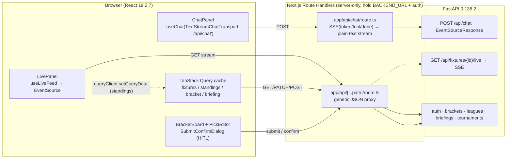
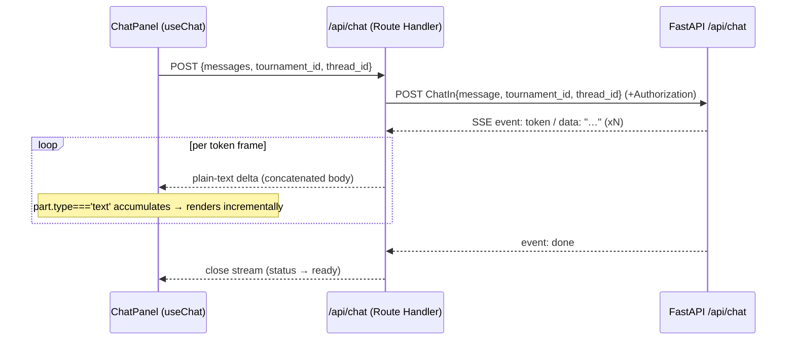
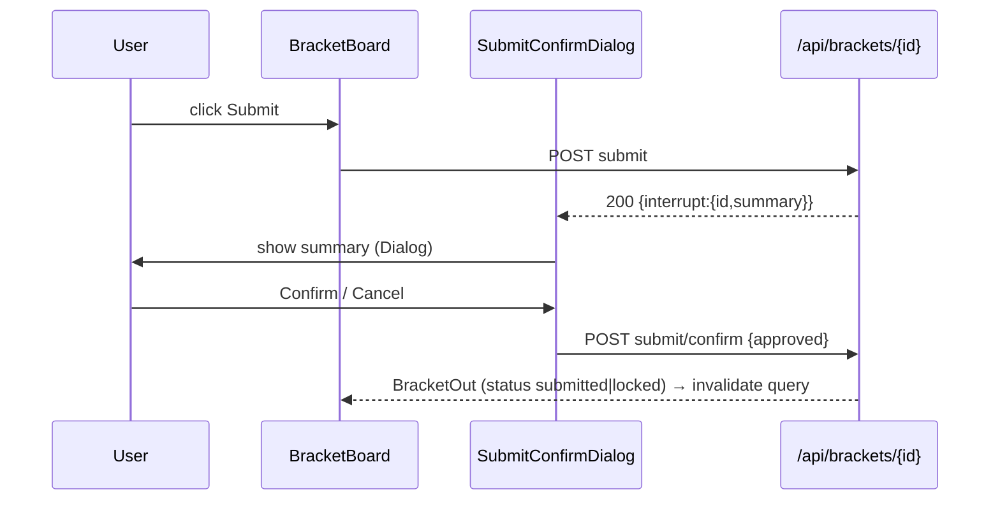
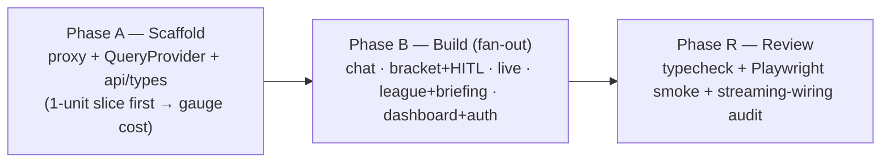

# wf-07 — Frontend (Next.js companion UI)

> Purpose: build the Next.js 16 chat panel (`useChat` + `TextStreamChatTransport` via the `/api/chat` proxy), the live "what's happening" panel (`useLiveFeed` / EventSource), the bracket board + pick editor + `SubmitConfirmDialog` (HITL surface), plus dashboard / auth / league pages — all wired to the streaming FastAPI backend with TanStack Query.

**Source of truth:** [`research/canonical-spec.md`](../research/canonical-spec.md) §1 (frontend stack), §6 (endpoints the UI consumes), §7 (frontend tree + streaming wiring verdict), §8 (wf-07 row + subagent roster + allowlist). Library/version/protocol claims trace to [`research/05-next-js-streaming-chat-ui.md`](../research/05-next-js-streaming-chat-ui.md). **If this doc disagrees with the spec, the spec wins.**

**Two layers, kept strictly separate:**
- **(a) Runtime patterns** — LangGraph behavior *inside the product*. This doc only *consumes* runtime output (the chat SSE stream, the live SSE feed, the HITL interrupt payload). It does not change graph internals.
- **(b) Build workflows** — Claude Code dynamic-workflow orchestration used *to build the product*. This doc **is** a layer-(b) artifact: it describes how we *build* the frontend. The "Execution Strategy" section (§9) is the layer-(b) plan.

---

## 1. Prerequisites & what this workflow consumes

- **Depends on:** **wf-06** (api-streaming) is complete — FastAPI endpoints, the chat SSE stream, the live SSE feed, and the bracket submit/interrupt/confirm endpoints exist and pass their httpx/SSE tests. wf-07 wires UI to those exact signatures; it does **not** invent new endpoints.
- **Sign-off entered with:** boundary #5 cleared (public API shape approved after wf-06, spec §9).
- **Sign-off this workflow produces:** boundary #6 — **UX approval** (spec §9: "after wf-07 UX"). This is the boundary *after* wf-07; HITL approval happens at a workflow boundary, never as an interrupt inside the run (spec §8 rule).

### Backend surface consumed (spec §6 — exact signatures)
| Endpoint (FastAPI, `/api` prefix) | UI consumer | Path through Next |
|---|---|---|
| `POST /api/chat` (`ChatIn{thread_id?,message,tournament_id}`) → `EventSourceResponse` (events: `token`, `tool`, `done`) | `ChatPanel` via `useChat` | **`/api/chat` Route Handler** (SSE→text transform) |
| `GET /api/fixtures/{id}/live` → **SSE** event feed | `LivePanel` via `useLiveFeed` | `/api/fixtures/{id}/live` (stream proxy) |
| `POST /api/auth/register` → `TokenOut`; `POST /api/auth/login` (OAuth2 form) → `TokenOut`; `GET /api/me` → `UserOut` | `(auth)/*`, dashboard | `/api/[...path]` generic proxy |
| `PUT /api/me/favorite-teams` (`FavTeamsIn`) → `UserOut` | dashboard | `/api/[...path]` |
| `GET /api/tournaments/{slug}` → `TournamentOut`; `/{slug}/fixtures` → `[FixtureOut]`; `/{slug}/standings` → `StandingsOut` | tournament page (prefetch) | `/api/[...path]` |
| `GET /api/fixtures/{id}` → `FixtureOut` | live/bracket | `/api/[...path]` |
| `POST /api/brackets` → `BracketOut`; `GET /api/brackets?tournament_id=`; `GET /api/brackets/{id}`; `PATCH /api/brackets/{id}/picks` (`PicksIn`) → `BracketOut` | bracket editor | `/api/[...path]` |
| `POST /api/brackets/{id}/submit` → `{interrupt}` \| `BracketOut`; `POST /api/brackets/{id}/submit/confirm` (`ConfirmIn{approved}`) → `BracketOut` | `SubmitConfirmDialog` (HITL) | `/api/[...path]` |
| `GET /api/brackets/{id}/score` → `ScoreOut` | bracket / league | `/api/[...path]` |
| `GET /api/fixtures/{id}/briefing?type=pre_match` → `BriefingOut` | `BriefingCard` / `BriefingList` | `/api/[...path]` |
| `POST /api/leagues` → `LeagueOut`; `POST /api/leagues/join` (`JoinIn{invite_code,bracket_id}`) → `LeagueOut`; `GET /api/leagues/{id}/leaderboard` → `LeaderboardOut` | `league/[id]`, `InvitePanel` | `/api/[...path]` |

---

## 2. Pinned stack (spec §1 — frontend; sources = research/05)

| Package | Pinned | Source |
|---|---|---|
| `next` | **16.2.9** (App Router, Turbopack default) | [registry.npmjs.org/next/latest](https://registry.npmjs.org/next/latest) |
| `react` / `react-dom` | **19.2.7** | [registry.npmjs.org/react/latest](https://registry.npmjs.org/react/latest) |
| `ai` | **7.0.8** (AI SDK core) | [registry.npmjs.org/ai/latest](https://registry.npmjs.org/ai/latest) |
| `@ai-sdk/react` | **4.0.9** ⚠️ verify peer vs `ai@7.0.8` at install | [registry.npmjs.org/@ai-sdk/react/latest](https://registry.npmjs.org/@ai-sdk/react/latest) |
| `@tanstack/react-query` | **5.101.2** | [registry.npmjs.org/@tanstack/react-query/latest](https://registry.npmjs.org/@tanstack/react-query/latest) |
| `tailwindcss` | **4.3.2** (CSS-first `@theme`, OKLCH) | [registry.npmjs.org/tailwindcss/latest](https://registry.npmjs.org/tailwindcss/latest) |
| shadcn CLI | **4.12.0** (Tailwind v4 + React 19 native; `data-slot`, no `forwardRef`) | [ui.shadcn.com/docs/cli](https://ui.shadcn.com/docs/cli) |
| `typescript` / `eslint` / `prettier` / `vitest` / `@playwright/test` | latest (pin in `pnpm-lock.yaml`) | tooling/tests |
| `pnpm` | latest | package manager + lockfile |

Node ≥ 22. `react-markdown` (stream-safe partial-markdown render) is added in the chat cluster; pin at install.

---

## 3. Target file tree (spec §7 — build to these exact paths, nothing else)

```
frontend/
  package.json  pnpm-lock.yaml  next.config.ts  tsconfig.json  postcss.config.mjs  components.json  .env.example
  app/
    layout.tsx                       # QueryProvider + Sonner Toaster + theme
    globals.css                      # @import "shadcn/tailwind.css"; @theme WC tokens
    page.tsx                         # dashboard
    (auth)/login/page.tsx
    (auth)/register/page.tsx
    tournament/[slug]/page.tsx       # 3-pane companion (Server Component prefetch → HydrationBoundary)
    bracket/[id]/page.tsx            # bracket editor
    league/[id]/page.tsx             # leaderboard
    api/chat/route.ts                # SSE→text transform proxy → FastAPI (no-transform, X-Accel-Buffering:no, auth inject)
    api/[...path]/route.ts           # generic JSON proxy → FastAPI (auth inject, CORS-free)
  components/
    chat/{ChatPanel,MessageList,MessageBubble,Composer,ToolBadge}.tsx
    bracket/{BracketBoard,MatchNode,PickEditor,SubmitConfirmDialog}.tsx   # SubmitConfirmDialog = HITL UI
    live/{LivePanel,EventFeed,MatchHeader}.tsx
    briefing/{BriefingCard,BriefingList}.tsx
    league/{Leaderboard,InvitePanel}.tsx
    ui/                              # shadcn primitives (copied source)
  lib/  api.ts  types.ts  queries.ts  format.ts
  providers/  QueryProvider.tsx
  hooks/  useLiveFeed.ts
```

**Do not create files outside this tree.** `frontend/.env.example` declares only the two frontend env vars (spec §1): `BACKEND_URL` (server-only, used by both Route Handlers) and `NEXT_PUBLIC_APP_URL`.

---

## 4. Streaming wiring — three decoupled streams, one coherent cache (spec §7)



State ownership is deliberately split (research/05 §"State separation"): **TanStack Query owns the server cache** (fixtures / standings / bracket / briefing); **`useChat` owns chat messages**; **`useLiveFeed` owns ephemeral live events** and cross-updates the query cache via `queryClient.setQueryData`. Three decoupled streams, one coherent cache.

### 4.1 Chat stream — the corrected text-protocol decision (load-bearing)

Spec §7 verdict: use **`TextStreamChatTransport`** (text protocol), **not** `DefaultChatTransport` (UI Message Stream). Rationale (spec §7 + Risk #3 + research/05 open questions): the AI SDK data/UI-message protocol has open FastAPI interop issues ([vercel/ai#7496](https://github.com/vercel/ai/issues/7496)); the text protocol is the dependable MVP path; upgrade to the UI Message Stream later.

```ts
// components/chat/ChatPanel.tsx (client)
import { useChat } from '@ai-sdk/react';
import { TextStreamChatTransport } from 'ai';
const { messages, sendMessage, status, stop } = useChat({
  transport: new TextStreamChatTransport({
    api: '/api/chat',
    body: { tournament_id, thread_id }, // merged into the POST the proxy maps to ChatIn
  }),
});
```

**Critical reconciliation the reviewer must verify (§9 verifier):** the backend chat endpoint emits an **SSE `EventSourceResponse`** with named events `token` / `tool` / `done` (spec §6), but `TextStreamChatTransport` reads `response.body` as a **plain concatenated text stream** — it does *not* parse SSE framing. Therefore `app/api/chat/route.ts` is **not** a raw pass-through (unlike the `DefaultChatTransport` pass-through shown in research/05). It must:

1. Read the incoming `useChat` POST body, extract the latest user message text + `thread_id` + `tournament_id`, and forward a backend-shaped `ChatIn{thread_id?,message,tournament_id}` to `${BACKEND_URL}/api/chat`, injecting `Authorization` from the httpOnly session cookie.
2. **Transform** the upstream SSE: parse frames, and for each `event: token` write `data`'s delta to the output stream; **drop** `tool` and `done` for the MVP text path (see §10 open question on tool badges).
3. Respond with `Content-Type: text/plain; charset=utf-8`, `Cache-Control: no-cache, no-transform`, `X-Accel-Buffering: no` (defeat reverse-proxy/CDN buffering — research/05 §proxy).



### 4.2 Live feed — `useLiveFeed` / EventSource

`GET /api/fixtures/{id}/live` is a server-push GET with no body, so `EventSource` is acceptable here (research/05 §LivePanel). If auth is required on the stream, route through the proxy as a fetch-stream (`hooks/useLiveFeed.ts`). The hook appends events to local state (`EventFeed` renders append-only) and calls `queryClient.setQueryData` to mutate cached standings/fixture score so the bracket and standings stay coherent without a second data path.

### 4.3 Non-streaming data — TanStack Query (research/05 §TanStack)

`providers/QueryProvider.tsx` creates one `QueryClient` in a `'use client'` provider via `useState(() => new QueryClient())`. Server Components (`tournament/[slug]/page.tsx`, `bracket/[id]/page.tsx`, dashboard) `prefetchQuery` → `dehydrate()` → `<HydrationBoundary>`; client components use `useQuery` / `useSuspenseQuery` from `lib/queries.ts`. Add `refetchInterval` (15–30s) on fixtures/standings **only during live windows**; tune `staleTime` otherwise.

### 4.4 HITL — `SubmitConfirmDialog`

Bracket submit/lock runs through the brackets API (not the chat stream — spec §3.4). `POST /api/brackets/{id}/submit` returns either a final `BracketOut` or an interrupt payload `{interrupt:{id,summary}}`. `SubmitConfirmDialog` (built on shadcn `Dialog`) renders the interrupt `summary`; on user choice it calls `POST /api/brackets/{id}/submit/confirm` with `ConfirmIn{approved:true|false}`, then invalidates the bracket query. This is the UI mirror of the runtime `interrupt()` / `Command(resume=…)` in `bracket_ops` (spec §3.2 #7).



---

## 5. shadcn primitives (allowlisted: `Bash(npx shadcn:*)` + `mcp__shadcn__*`)

Init once (Phase A): `npx shadcn@latest init` (writes `components.json`, `app/globals.css` with `@import "shadcn/tailwind.css"`, Tailwind v4 `@theme`). Then add the primitives the components compose from (research/05 §shadcn): 

```
npx shadcn@latest add card tabs badge scroll-area avatar skeleton dialog sonner separator button input label form textarea
```

- **Chat bubbles** ← `ScrollArea`, `Avatar`, `Card`; `sonner` toasts (legacy `toast` is deprecated).
- **Live panel** ← `Card`, `Badge`, `Tabs`, `Skeleton`, `ScrollArea` (append-only feed).
- **Bracket board** ← **no dedicated bracket primitive exists**; build a Tailwind grid of `Card`/`Separator` nodes with connector lines, WC-themed via `@theme` tokens (OKLCH).

---

## 6. Ordered tiny tasks (exact paths)

Tasks are grouped by the 6 fan-out clusters of §9. **Cluster A runs first** as the 1-unit cost slice (scaffold + prove the chat stream end-to-end), then clusters B–F fan out in parallel.

### Cluster A — Scaffold: proxy + providers + api/types  (run first, gauge cost)
1. `frontend/package.json` — pin §2 versions; scripts `dev/build/lint/typecheck/test`. `frontend/pnpm-lock.yaml` via `pnpm install`. **Verify `@ai-sdk/react@4.0.9` peer vs `ai@7.0.8` at install** (spec open Q #2).
2. `frontend/next.config.ts`, `frontend/tsconfig.json`, `frontend/postcss.config.mjs`, `frontend/.env.example` (`BACKEND_URL`, `NEXT_PUBLIC_APP_URL`).
3. `npx shadcn@latest init` → `frontend/components.json` + `frontend/app/globals.css` (`@import` + `@theme` WC tokens). Run the `add` line from §5.
4. `frontend/lib/types.ts` — TS mirrors of backend schemas (`TokenOut`, `UserOut`, `TournamentOut`, `FixtureOut`, `StandingsOut`, `BracketOut`, `PicksIn`, `ConfirmIn`, `BriefingOut`, `LeagueOut`, `LeaderboardOut`, `ScoreOut`, interrupt payload). Mirror spec §6 names exactly.
5. `frontend/lib/api.ts` — typed fetch helpers hitting same-origin `/api/...`; `frontend/lib/format.ts` (kickoff time in user tz, scoreline, minute+extra).
6. `frontend/providers/QueryProvider.tsx` — `'use client'`, `useState(() => new QueryClient())`.
7. `frontend/app/api/[...path]/route.ts` — generic JSON proxy → `${BACKEND_URL}/api/...`; inject `Authorization` from httpOnly cookie; forward method/body; strip CORS.
8. `frontend/app/api/chat/route.ts` — **SSE→text transform proxy** per §4.1 (map body → `ChatIn`, parse `token` events → plain text, `text/plain` + `no-transform` + `X-Accel-Buffering:no`).
9. `frontend/app/layout.tsx` — wrap `QueryProvider` + `<Toaster />` (sonner); import `globals.css`.
10. **Cost-slice proof (throwaway, then keep):** a minimal `ChatPanel` calling `useChat`; manually confirm tokens render incrementally end-to-end against the wf-06 backend. Record spend before fanning out B–F (spec §8 cost-control rule).

### Cluster B — Chat
11. `frontend/components/chat/ChatPanel.tsx` — `useChat({ transport: new TextStreamChatTransport({ api:'/api/chat', body:{tournament_id,thread_id} }) })`; `status` (`submitted`/`streaming`/`ready`/`error`), `stop()`.
12. `frontend/components/chat/MessageList.tsx` — render `messages[].parts` where `part.type==='text'`; auto-scroll via bottom sentinel + `IntersectionObserver`; typing indicator while `status==='streaming'`.
13. `frontend/components/chat/MessageBubble.tsx` — `Card`+`Avatar`; `react-markdown` for stream-safe partial markdown.
14. `frontend/components/chat/Composer.tsx` — input + send (`sendMessage`), disabled while streaming, `stop` button.
15. `frontend/components/chat/ToolBadge.tsx` — `Badge` for tool activity (MVP: see §10 open Q — text protocol drops `tool` parts; render only if a side-channel is wired, else placeholder).

### Cluster C — Bracket + HITL
16. `frontend/components/bracket/BracketBoard.tsx` — Tailwind grid of `MatchNode` + connector lines; `useSuspenseQuery` (bracket) inside `<Suspense>`; `refetchInterval` in live windows.
17. `frontend/components/bracket/MatchNode.tsx` — one `Card` node (teams/placeholders, kickoff, pick state).
18. `frontend/components/bracket/PickEditor.tsx` — edit picks → `PATCH /api/brackets/{id}/picks` (`PicksIn`); optimistic update + invalidate.
19. `frontend/components/bracket/SubmitConfirmDialog.tsx` — **HITL UI** per §4.4 (`Dialog` shows interrupt `summary`; confirm → `POST submit/confirm` `{approved}`).
20. `frontend/app/bracket/[id]/page.tsx` — Server Component: `prefetchQuery(bracket)` → `HydrationBoundary` → editor.

### Cluster D — Live
21. `frontend/hooks/useLiveFeed.ts` — EventSource (or proxied fetch-stream) to `/api/fixtures/{id}/live`; append events; `queryClient.setQueryData` to update cached standings/score.
22. `frontend/components/live/LivePanel.tsx` — `Card`+`Tabs`+`ScrollArea`; `Skeleton` while connecting.
23. `frontend/components/live/EventFeed.tsx` — append-only event list (`Badge` per event type).
24. `frontend/components/live/MatchHeader.tsx` — score + minute (`format.ts`).

### Cluster E — League + Briefing
25. `frontend/components/league/Leaderboard.tsx` — `useQuery(GET /api/leagues/{id}/leaderboard)`.
26. `frontend/components/league/InvitePanel.tsx` — create league (`POST /api/leagues`) + join (`POST /api/leagues/join` `JoinIn{invite_code,bracket_id}`).
27. `frontend/components/briefing/BriefingCard.tsx` — `useQuery(GET /api/fixtures/{id}/briefing?type=pre_match)` → render `BriefingOut.content` markdown.
28. `frontend/components/briefing/BriefingList.tsx` — upcoming briefings for the user's relevant fixtures.
29. `frontend/app/league/[id]/page.tsx` — Server Component prefetch leaderboard → `Leaderboard`.

### Cluster F — Dashboard + Auth + the 3-pane page
30. `frontend/app/(auth)/login/page.tsx` — OAuth2-form POST `/api/auth/login` → `TokenOut`; set httpOnly session cookie (via the proxy / a small route), redirect.
31. `frontend/app/(auth)/register/page.tsx` — `POST /api/auth/register` → `TokenOut`.
32. `frontend/app/page.tsx` — dashboard: `GET /api/me`, favorite teams (`PUT /api/me/favorite-teams`), brackets list, `BriefingList`.
33. `frontend/app/tournament/[slug]/page.tsx` — **3-pane** Server Component: `prefetchQuery` tournament/fixtures/standings → `HydrationBoundary` → `ChatPanel` · `LivePanel` · `BracketBoard` (+ `BriefingCard`).
34. `frontend/lib/queries.ts` — central TanStack query keys + hooks (`useTournament`, `useFixtures`, `useStandings`, `useBracket`, `useBriefing`, `useLeaderboard`) used by all clusters above.

> Cross-cluster file: `lib/queries.ts` (task 34) and `lib/types.ts` (task 4) are shared contracts — land `types.ts` in Cluster A and stub `queries.ts` keys early so clusters B–F don't collide. The reviewer reconciles final `queries.ts`.

---

## 7. Tests / verification & Definition of Done

**DoD (all must pass):**
1. `pnpm typecheck` clean. `pnpm lint` clean. (`pnpm build` succeeds — spec §9 frontend gate.)
2. **Playwright smoke** (spec §8 verifier + §9 E2E): `login → pick bracket → submit (confirm dialog) → chat streams → briefing shows`.
3. **Tokens render incrementally** — chat shows progressive text, not a single late blob (TTFB < 1.5s p50 target, spec §0 success criteria).
4. **Live feed appends** — `EventFeed` gains rows from the SSE feed without a full refetch; cached standings update via `setQueryData`.

```
# frontend gate (spec §9 "Gate commands")
pnpm lint && pnpm typecheck && pnpm test && pnpm build
# E2E smoke
pnpm exec playwright test
```

**Test placement:** Playwright spec under `frontend/` (e.g. `tests/e2e/smoke.spec.ts`); Vitest component tests colocated. Tests authored by `test-writer` (spec §8 roster); reviewer re-runs them. Back the smoke run with the backend `FakeProvider` + `InMemorySaver` so streaming is deterministic (spec §6 testing note).

---

## 8. Manual visual checks (reviewer, before UX sign-off)
- Chat: typing indicator during `status==='streaming'`; `stop()` cancels; markdown renders mid-stream without flicker.
- Live: append-only feed, no duplicates, correct minute/score; standings cross-update.
- Bracket: connector lines align; `SubmitConfirmDialog` shows the real interrupt `summary`; cancel path leaves bracket `draft`.
- Theming: WC `@theme` tokens (OKLCH) applied; dark/light legible; `Skeleton` placeholders on cold load.

---

## 9. Execution Strategy (layer-(b): how we BUILD this)

**Mode = dynamic workflow** (spec §8 wf-07 row). **Justification:** ~6 independent component clusters parallelize cleanly (shared contracts pinned up front in Cluster A), and the work benefits from a visual + typecheck cross-check at the end — exactly the spec's criterion for a workflow ("parallelizable across many independent units / benefits from adversarial cross-check"). It is *not* small/sequential/tightly-coupled, so turn-by-turn would leave parallelism on the table. **Note:** the one tightly-coupled, risk-bearing piece (the `/api/chat` SSE→text transform, §4.1) is de-risked by doing it *first* as the 1-unit cost slice (Cluster A), not by switching the whole workflow to turn-by-turn.

### Phases


- **Phase A (Scaffold, cost slice):** Cluster A tasks 1–10. Prove tokens stream end-to-end through the real `/api/chat` transform before spending on fan-out (spec §8 cost-control: "run a one-unit slice first").
- **Phase B (Build, fan-out):** the 5 remaining clusters in parallel.
- **Phase R (Review):** adversarial reviewer verifies (§ below) and the workflow ends at the UX sign-off boundary.

### Fan-out (≤16 cap respected; ~6 units)
| # | Cluster | Files | Agent / Model |
|---|---|---|---|
| 1 | proxy + QueryProvider + api/types (Phase A, first) | `app/api/chat`, `app/api/[...path]`, `providers/QueryProvider`, `lib/{types,api,format}`, config | `nextjs-builder` / **Sonnet** |
| 2 | chat | `components/chat/*` | `nextjs-builder` / **Sonnet** |
| 3 | bracket + HITL | `components/bracket/*`, `app/bracket/[id]` | `nextjs-builder` / **Sonnet** |
| 4 | live | `hooks/useLiveFeed`, `components/live/*` | `nextjs-builder` / **Sonnet** |
| 5 | league + briefing | `components/league/*`, `components/briefing/*`, `app/league/[id]` | `nextjs-builder` / **Sonnet** |
| 6 | dashboard + auth + 3-pane | `app/page`, `app/(auth)/*`, `app/tournament/[slug]`, `lib/queries` | `nextjs-builder` / **Sonnet** |

### Verifier (spec §8: "reviewer: typecheck + Playwright smoke + visual")
`adversarial-reviewer` (**Opus 4.8**) runs `pnpm typecheck` + `pnpm lint` + the Playwright smoke, performs the §8 visual checks, and specifically **audits the streaming wiring against the corrected text-protocol decision** (§4.1): confirms the client uses `TextStreamChatTransport` (not `DefaultChatTransport`), and that `/api/chat/route.ts` transforms the backend SSE `token` events into a plain-text stream (no raw SSE pass-through, since text protocol does not parse SSE). Reviewer also confirms tokens render incrementally and the live feed appends.

### Model routing (spec §8)
- Builders: **Sonnet** (`nextjs-builder` — mechanical component work).
- Reviewer: **Opus 4.8** (adversarial cross-check + streaming-wiring audit).

### Tool allowlist (spec §8 — for unattended runs)
`Read, Edit, Write, Grep, Glob`, `Bash(pnpm:*)`, `Bash(npx shadcn:*)`, `mcp__shadcn__*`, `mcp__context7__*`, `Bash(git:*)` (no push). Playwright via `Bash(pnpm:*)` (`pnpm exec playwright`). No backend tools (`uv`, `alembic`) in this workflow.

### Save-as-command
**Optional** (spec §8 wf-07 = "maybe"). If component churn recurs, capture the reviewer gate as `/review-frontend` (typecheck + lint + Playwright smoke + streaming-wiring audit). Not required to ship wf-07.

### Sign-off boundary
**AFTER** wf-07 — human **approves UX** (spec §9 boundary #6). Approval is a boundary between workflows, never an `interrupt()` inside the run (spec §8 rule). On approval, proceed to **wf-08** (integration-verification, depends on wf-06 + wf-07).

---

## 10. Open questions / frontend-specific risks (flag, don't assert)
1. **Tool badges under text protocol.** `TextStreamChatTransport` drops typed `tool` parts, but the backend emits `tool` SSE events and `ToolBadge.tsx` exists (spec §6/§7). MVP options: (a) defer `ToolBadge` until upgrading to the UI Message Stream (`DefaultChatTransport`) post-MVP, or (b) the `/api/chat` proxy side-channels `tool` events (e.g. a parallel parse) for a lightweight badge. **Recommend (a)** for MVP simplicity — keep `ToolBadge` as a placeholder. *Confirm with UX sign-off.*
2. **`@ai-sdk/react@4.0.9` ↔ `ai@7.0.8` peer pairing** — verify at install (spec open Q #2; research/05 open questions). If incompatible, re-pin from the npm `latest` dist-tag and re-run the cost slice.
3. **Auth/session storage.** Spec mandates the proxy injects auth (spec §2) but is silent on browser token storage. Plan: httpOnly cookie set on login, read by both Route Handlers. *Confirm: cookie vs. Authorization header relay; SameSite/secure flags for the chosen hosting target (spec open Q #9/#10).*
4. **Briefing personalization** — `BriefingOut`/`briefings.user_id` may be shared-per-fixture or personalized-per-user (spec open Q #7). `BriefingCard`/`BriefingList` query keys must match the resolved cardinality; treat as cache-key risk until resolved.
5. **TanStack streamed-SSR hydration** under Next 16 / React 19.2 (`ReactQueryStreamedHydration`) is unverified (research/05 open questions, advanced-ssr page returned 403). MVP uses the well-established `prefetchQuery` + `HydrationBoundary` pattern; revisit streamed hydration only if cold-load latency demands it.
6. **AI Elements / assistant-ui accelerators** (research/05 §shadcn) — not version-verified; evaluate only if hand-composed shadcn chat proves slow to build. Default = compose from primitives.
