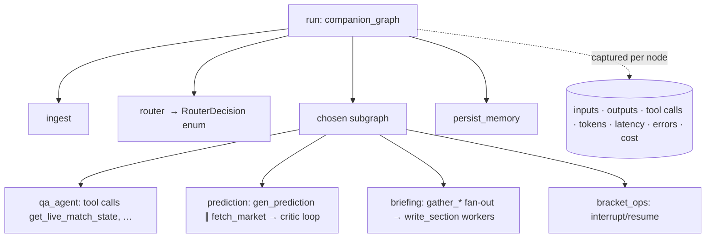
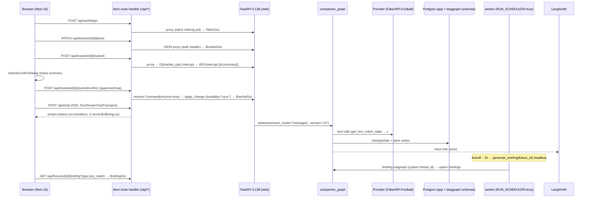
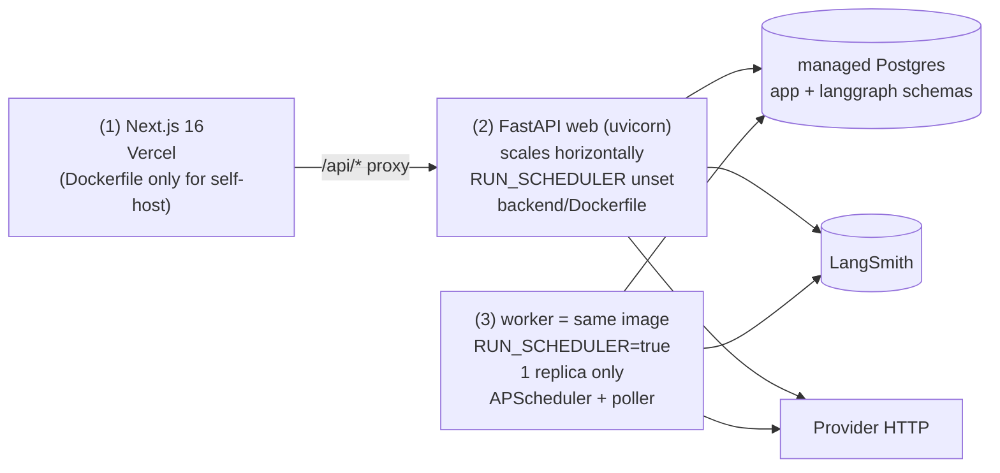
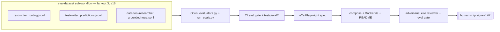

# wf-08 — Integration + Verification (e2e flow · eval harness · observability · deploy)

> Purpose: wire the full end-to-end vertical slice (Next.js → FastAPI SSE → `companion_graph` → providers → Postgres → LangSmith), build the LangSmith-pytest **eval harness** (`app/eval/*`), turn on **tracing/observability**, and ship the **3-process deployment** (web · single-scheduler worker · frontend) behind a green eval-threshold gate and a final human sign-off.

**Two layers, kept strictly separate (per canonical-spec §0):**
- **(a) Runtime patterns** = LangGraph behavior *inside Pitch IQ* — the e2e flow this workflow exercises and the traces it emits. This workflow does **not** add new runtime patterns; it integrates the seven built in wf-03/04/05 and observes them.
- **(b) Build workflows** = how we *construct/verify* the product with Claude Code — the **turn-by-turn** spine + a small fan-out **eval-dataset sub-workflow** in the Execution Strategy section. The LangSmith *traces* are runtime telemetry; the LangSmith *pytest CI gate* and the labeled-example generation are build/verify orchestration. They never mix: the final human sign-off is a boundary **after** this workflow, never an `interrupt()` inside it (canonical-spec §8/§9).

---

## 1. Scope, prereqs, dependencies

| Field | Value |
|---|---|
| Workflow | **wf-08 integration-verification** (canonical-spec §8 table) |
| Goal | e2e flow wired; eval harness (routing macro-F1, prediction Brier/log-loss/ECE vs no-vig market, groundedness/hallucination, refusal rate); observability/tracing; 3-process deploy |
| Depends on | **wf-06 api-streaming** (FastAPI endpoints + SSE + scheduler/briefing pipeline) **and wf-07 frontend** (Next chat + live panel + bracket board) |
| Mode | **turn-by-turn** + a small eval-dataset fan-out sub-workflow (justified in Execution Strategy) |
| Fan-out | eval-dataset sub-workflow only: **3** (routing.jsonl, predictions.jsonl, groundedness.jsonl) — ≤ 16 cap respected |
| Verifier | **adversarial e2e reviewer** (Opus) + **eval-threshold gate** (`uv run pytest -m langsmith`) |
| Save-as-command | **yes** → `/eval` (canonical-spec §8 table) |
| Sign-off | **#7 ship** — human boundary *after* this workflow (canonical-spec §9) |

**Hard prereqs consumed (do not re-create):**
- From **wf-06**: `app/main.py`, `app/lifespan.py` (compiled `companion_graph`, `AsyncPostgresSaver`, `PostgresStore`, asyncpg engine, scheduler-if-`RUN_SCHEDULER`, provider clients), all `app/api/*` endpoints (canonical-spec §6), `app/services/{briefing_service,scoring_service,poller}.py`, `app/scheduler/{scheduler,jobs}.py`, `backend/Dockerfile`.
- From **wf-07**: `frontend/app/api/chat/route.ts` (SSE proxy), `frontend/app/api/[...path]/route.ts` (JSON proxy), the 3-pane `tournament/[slug]/page.tsx`, `components/bracket/SubmitConfirmDialog.tsx` (HITL UI), `hooks/useLiveFeed.ts`.
- From the whole stack: `app/graph/*` (the seven runtime patterns), `app/providers/fake.py` (`FakeProvider`, deterministic — the eval/e2e data source so we never pay live providers per commit).

This workflow **adds**: `app/eval/{datasets/*.jsonl, evaluators.py, run_evals.py}`, `tests/eval/*`, the e2e Playwright spec, the CI eval gate, deploy configs (compose + frontend Dockerfile), and README run instructions. It **writes no new runtime graph code**.

---

## 2. Pinned versions + sources

Only the eval/observability libraries are new here; everything else is the locked stack (canonical-spec §1). Pin exactly.

| Package | Version | Used here for | Source |
|---|---|---|---|
| `langsmith[pytest]` | **0.9.3** (2026-06-26) | tracing client + `@pytest.mark.langsmith` CI evals, `Client.create_dataset/create_examples/evaluate` | https://pypi.org/project/langsmith/ |
| `openevals` | **0.2.0** (2026-04-07) | `create_llm_as_judge(HALLUCINATION_PROMPT / RAG_GROUNDEDNESS_PROMPT)`, `create_json_match_evaluator` | https://github.com/langchain-ai/openevals · https://pypi.org/project/openevals/ |
| `agentevals` | **0.0.9** ⚠️ confirm currency | optional `create_trajectory_match_evaluator` (route→subgraph trajectory) | https://pypi.org/project/agentevals/ |
| `@playwright/test` | latest (pin in lockfile) | e2e against the running stack | (frontend devDep, canonical-spec §1) |
| `langgraph` / `langchain-openai` | **1.2.7** / **1.3.3** | invoked (not modified) by eval targets | https://pypi.org/pypi/langgraph/json |

Key API facts (research `07-observability-evaluation-for-a-langgraph-agent.md`):
- **Tracing = env vars only** for LangChain/LangGraph modules; no code changes. https://docs.langchain.com/langsmith/trace-with-langgraph
- **CI evals**: `@pytest.mark.langsmith` + `t.log_inputs/log_outputs/log_reference_outputs`; `LANGSMITH_TEST_CACHE` caches LLM HTTP so commits don't re-pay. https://docs.langchain.com/langsmith/pytest
- **Programmatic evals**: `client.evaluate(target, data=..., evaluators=[...], experiment_prefix=...)`; row evaluators get `inputs/outputs/reference_outputs`, summary evaluators run over the whole dataset. https://docs.langchain.com/langsmith/evaluation-quickstart
- **Structured outputs**: with OpenAI strict `json_schema`, schema validity is *guaranteed* → evaluate field **values** (`create_json_match_evaluator`), and track **refusals** (`message.refusal`) as a first-class failure, not JSON parse errors. https://developers.openai.com/api/docs/guides/structured-outputs
- **OTel / lock-in hedge**: LangSmith ingests OTLP at `https://api.smith.langchain.com/otel` (OpenLLMetry semconv); Langfuse / Arize Phoenix are the self-host alternatives. https://docs.langchain.com/langsmith/trace-with-opentelemetry

> **Layer note:** all of the above runs at **build/verify time** except the trace emission, which is **runtime** telemetry.

---

## 3. Observability / tracing (runtime telemetry)

### 3.1 Enable (env vars only — canonical-spec §2 env list)

```bash
export LANGSMITH_TRACING=true
export LANGSMITH_API_KEY=<key>
export LANGSMITH_PROJECT=pitch-iq           # routes traces into the project
# non-US only: export LANGSMITH_ENDPOINT="https://eu.api.smith.langchain.com"
```

These are already in the canonical env list (`LANGSMITH_TRACING`, `LANGSMITH_API_KEY`, `LANGSMITH_PROJECT`). Because every node uses LangChain/LangGraph modules, **no code change** is required: each `graph.astream(...)` / `graph.ainvoke(...)` records the full execution tree automatically. The older `LANGCHAIN_TRACING_V2` + `LANGCHAIN_API_KEY` still map to the same path (research §1).

### 3.2 What a trace captures

Per `graph.astream/ainvoke`, LangSmith records the full tree — **per node**: inputs/outputs, tool calls, token usage, latency, errors; plus run-level cost and feedback. Dashboards expose P50/P99 latency, token usage, error/cost breakdowns (research §1).



### 3.3 Trace hygiene (minimal, sensible)

- **Tag every runtime entry-point** with run metadata so traces are filterable: attach `config={"metadata": {"user_id", "tournament_id", "route", "thread_id"}, "run_name": "chat" | "briefing.headless" | "bracket.submit"}` at the call sites built in wf-06 (chat SSE, headless `briefing_service`, bracket submit/confirm). This is a one-line config addition at three call sites, not new graph code.
- **Non-LangChain code** (provider HTTP in `app/providers/*`, `scoring_service`) is not auto-traced — wrap the hot paths with `@traceable` if you want them in the tree (optional for MVP; tools called *inside* the ReAct loop are already captured as tool calls).
- **TTFT success criterion** (chat time-to-first-token < 1.5s p50, canonical-spec §0) is measured client-side at the SSE boundary; the LangSmith first-token / node latency dashboard is a server-side proxy. Record both; gate on the client measurement in the e2e smoke (§8).
- **Cost control:** the free Developer tier is 5k base traces/mo at 14-day retention, 1 seat; Plus is $39/seat/mo, 10k base traces, $2.50/1k overage (research §1, https://www.langchain.com/pricing). During the seasonal spike, sample if needed and keep `LANGSMITH_TEST_CACHE` on in CI so eval runs don't burn live LLM spend.

---

## 4. Eval harness (build/verify layer)

Three suites, all over `FakeProvider`/recorded fixtures for reproducibility (no live provider spend), all gated on thresholds from canonical-spec §0. Two surfaces: a **CLI** (`run_evals.py`, the `/eval` command) for ad-hoc/offline runs against LangSmith datasets, and **`tests/eval/*`** (`@pytest.mark.langsmith`) for the CI gate `uv run pytest -m langsmith`.

```
app/eval/
  datasets/
    routing.jsonl         # {inputs:{message,tournament_id,user_context?}, outputs:{route}}
    predictions.jsonl     # {inputs:{fixture,market_winprob}, outputs:{outcome,should_flag?}}
    groundedness.jsonl    # {inputs:{question,context}, outputs:{answer_ref?}}
  evaluators.py           # row + summary evaluators (deterministic) + openevals judges
  run_evals.py            # CLI: load jsonl → upsert LS dataset → client.evaluate → print aggregates
tests/eval/
  test_routing.py         # @pytest.mark.langsmith, asserts macro-F1 ≥ 0.9
  test_prediction.py      # asserts Brier ≤ market+0.02; reports log-loss/ECE; calibration sanity
  test_groundedness.py    # asserts groundedness pass-rate ≥ 0.95; reports hallucination + refusal rate
```

### 4.1 Routing accuracy — deterministic, closed-set (research §4a)

Router is a closed-set classifier (`Route` enum, OpenAI strict structured output), so use a **deterministic exact-match row evaluator** + a **summary evaluator** for macro-F1, never an LLM judge.

```python
# app/eval/evaluators.py
def routing_correct(outputs, reference_outputs):                      # row evaluator
    return {"key": "routing_correct", "score": int(outputs["route"] == reference_outputs["route"])}

def routing_summary(outputs, reference_outputs):                      # summary evaluator
    # accuracy, per-class precision/recall, macro-F1, confusion matrix over the 7 Route classes
    return [{"key": "routing_macro_f1", "score": macro_f1}, {"key": "routing_accuracy", "score": acc}]
```

- **Target**: invoke the `router` node only (`router_target(inputs) -> {"route": Route}`). It *does* call `MODEL_ROUTER` (that is what we measure) — cache via `LANGSMITH_TEST_CACHE`.
- **Optional trajectory check**: if the route is asserted as a subgraph call, add agentevals `create_trajectory_match_evaluator(trajectory_match_mode="unordered"|"subset")` (research §4a; pin only after confirming `agentevals 0.0.9` currency — open question).
- Labels = the 7 routes: `match_qa, rules_qa, bracket_qa, prediction, briefing, bracket_ops, chitchat` (canonical-spec §3.1). Confusion matrix exposes which routes collide.
- **Threshold (gate): macro-F1 ≥ 0.9** (canonical-spec §0).

### 4.2 Prediction calibration vs no-vig market — deterministic numeric (research §4b)

Two complementary checks. Numeric calibration is **never** delegated to an LLM judge.

1. **Calibration**: deterministic summary evaluators **Brier, log-loss, ECE** comparing the finalized `Prediction.probs` to actual outcomes; baseline = the **de-vigged market** line (`WinProbabilities`, `p_i=(1/d_i)/Σ(1/d_j)`, anchor Pinnacle — canonical-spec §4.2). Plus a per-row sanity evaluator: probs ∈ [0,1], `home+draw+away ≈ 1`, and within a sane band of the implied market line.
   - **Target**: run the `prediction` subgraph with `FakeProvider` supplying the dataset's market line; capture finalized `Prediction.probs`.
   - **Threshold (gate): model Brier ≤ market Brier + 0.02** (canonical-spec §0). Report log-loss + ECE (not gated; tracked for drift).

   ```python
   def brier_vs_market(outputs, reference_outputs):   # summary; multiclass 3-way (home/draw/away)
       model  = mean(brier(o["probs"], r["onehot"]) for o, r in zip(outputs, reference_outputs))
       market = mean(brier(r["market"], r["onehot"]) for r in reference_outputs)
       return {"key": "brier_delta_vs_market", "score": model - market}   # gate: ≤ 0.02
   ```

2. **Does the critic catch naive predictions?** Labeled set in `predictions.jsonl` tagging deliberately naive predictions (`should_flag=true`, e.g. "always pick the favorite", ignores live data) vs sound ones (`false`). Measure the critic's **precision/recall/F1** at flagging via an openevals `create_llm_as_judge` with a custom rubric ("does the critique correctly identify the flaw?"). Reported, not hard-gated (rubric judge has variance).

### 4.3 Groundedness / faithfulness — judge + deterministic backstop (research §4c)

```python
from openevals.llm import create_llm_as_judge
from openevals.prompts import HALLUCINATION_PROMPT   # or RAG_GROUNDEDNESS_PROMPT
grounded = create_llm_as_judge(prompt=HALLUCINATION_PROMPT, feedback_key="groundedness",
                               model="openai:<pinned-snapshot>")
# called with outputs=answer, context=live data passed to qa_agent
```

- **Target**: run the `qa_agent` ReAct path with `FakeProvider` as the data source; capture the answer **and** the tool-returned data as `context`.
- Report **groundedness pass-rate** (= 1 − hallucination rate). Pair the judge with a **cheap deterministic check** that every numeric fact / entity in the answer actually appears in the tool context — this catches fabricated figures the judge may miss and reduces judge-variance reliance (canonical-spec §0 "no fabricated numbers").
- **Threshold (gate): groundedness pass-rate ≥ 0.95** (canonical-spec §0).

### 4.4 Structured-output refusal rate (research §5)

With OpenAI strict structured outputs, schema validity is guaranteed → **do not** test JSON parse. Instead:
- Evaluate field **values** (`openevals.create_json_match_evaluator`) where a reference structure exists (router decision, prediction shape).
- **Track refusals as a first-class failure**: a refusal surfaces as `message.refusal` rather than schema-conforming JSON. Add a `refusal_rate` summary evaluator counting refusals across router + prediction calls. **Tracked/reported, no hard gate** in the spec (threshold = open question; alert if non-zero).

### 4.5 Threshold table (the gate)

| Suite | Metric | Gate | Source |
|---|---|---|---|
| Routing | macro-F1 | **≥ 0.90** | canonical-spec §0 |
| Prediction | Brier(model) − Brier(market) | **≤ 0.02** | canonical-spec §0 |
| Prediction | log-loss, ECE | reported (no gate) | research §4b |
| Prediction | critic flag precision/recall/F1 | reported | research §4b |
| Groundedness | pass-rate (1 − hallucination) | **≥ 0.95** | canonical-spec §0 |
| Structured | refusal rate | reported (alert if > 0) | research §5 |

---

## 5. End-to-end flow wiring (the integration this workflow proves)

No new graph code — this is the assembly check that the layers built in wf-01…wf-07 form one coherent vertical slice. The canonical happy path (canonical-spec §9 Playwright line): **login → pick bracket → submit (confirm dialog) → chat streams → briefing shows**.



The integration checklist (verified by the e2e Playwright spec, §8): JWT round-trips through both proxies; the HITL 409/resume contract works against the real `bracket_ops` interrupt; SSE tokens arrive un-buffered; the single worker actually fires a briefing job and the row lands `status='ready'`; traces appear in LangSmith.

---

## 6. Deployment topology (3 processes · single scheduler)

Canonical-spec §2: **three processes**, one managed Postgres, secrets via env, LangSmith via env vars. **Hosting (Q4 resolved): Next.js → Vercel; FastAPI web + worker → Railway services (same image, `RUN_SCHEDULER` differs); managed Postgres = Railway Postgres or Neon.**



| Process | Image | Key env | Replicas | Owns |
|---|---|---|---|---|
| (1) frontend | `frontend/Dockerfile` (or Vercel build) | `BACKEND_URL` (server-only), `NEXT_PUBLIC_APP_URL` | ≥1 | UI + `/api/*` proxies |
| (2) web | `backend/Dockerfile` | `DATABASE_URL`, `CHECKPOINTER_DB_URL`, `OPENAI_API_KEY`, `MODEL_*`, provider keys, `JWT_*`, `LANGSMITH_*`, `CORS_ORIGINS` — **`RUN_SCHEDULER` unset/false** | ≥1 (scale out) | API + SSE + graph |
| (3) worker | **same `backend/Dockerfile`** | identical + **`RUN_SCHEDULER=true`**, `LIVE_POLL_SECONDS=60`, `BRIEFING_LEAD_HOURS=2` | **exactly 1** | APScheduler jobs + poller |

**Why a single scheduler replica:** APScheduler (`AsyncIOScheduler`, 3.11.3 — not 4.x alpha) running in-process under multiple uvicorn workers would **double-fire**, producing duplicate briefings per fixture. Pinning the worker to **1 replica** (or, later, a Postgres advisory-lock leader election) guarantees one briefing per fixture (canonical-spec §2, risk #4). The web tier therefore must **never** set `RUN_SCHEDULER=true`.

**Deploy artifacts this workflow adds:**
- `frontend/Dockerfile` — Node 22, `pnpm install --frozen-lockfile`, `pnpm build`, `pnpm start` (only for the self-hosted Node path; Vercel needs no Dockerfile).
- `docker-compose.yml` (repo root) — `postgres` + `web` + `worker` (same image, differing `RUN_SCHEDULER`) + `frontend`, used for local full-stack e2e and **deploy smoke**.
- `backend/Dockerfile` already exists (wf-06) — reused unchanged for both web and worker.
- Hosting (Q4 **resolved**): **Vercel (frontend) + Railway (web + single `RUN_SCHEDULER` worker) + managed Postgres.** On Railway, define two services from `backend/Dockerfile` differing only by `RUN_SCHEDULER`; configs stay platform-agnostic and the compose file remains the portable local/CI smoke target.

**Deploy smoke (gate):** `docker compose up` → `uv run alembic upgrade head` → `GET /healthz` 200 → one chat request streams tokens → one briefing job is scheduled/fires and a `briefings` row reaches `status='ready'` → a trace is visible in LangSmith.

---

## 7. Ordered tiny tasks (build/verify phase)

Exact paths; each independently checkable. The eval-dataset tasks (1–3) fan out in parallel; everything else is sequential turn-by-turn.

**A — eval datasets (fan-out sub-workflow, parallel)**
1. `app/eval/datasets/routing.jsonl` — ≥ ~15 labeled examples per `Route` (7 classes), incl. adversarial near-collisions (e.g. match_qa vs rules_qa). Format: `{"inputs":{"message","tournament_id","user_context?"},"outputs":{"route"}}`.
2. `app/eval/datasets/predictions.jsonl` — fixtures with `inputs:{fixture, market_winprob}` and `outputs:{outcome(onehot), should_flag?}`; include deliberately naive predictions (`should_flag=true`) + sound ones.
3. `app/eval/datasets/groundedness.jsonl` — `inputs:{question, context(live-data blob)}`, optional `outputs:{answer_ref}`; include questions whose grounded answer requires a tool-returned number (to exercise the fabricated-number backstop).

**B — evaluators + harness (turn-by-turn)**
4. `app/eval/evaluators.py` — `routing_correct` (row), `routing_summary` (macro-F1/confusion), `brier_vs_market` + `logloss` + `ece` + `prob_sanity`, `critic_flag_judge` (openevals), `groundedness` (openevals `HALLUCINATION_PROMPT`) + `numeric_entities_present` (deterministic backstop), `refusal_rate`.
5. `app/eval/run_evals.py` — CLI: load each `*.jsonl`, `Client.create_dataset/create_examples` (upsert), define `target(inputs)` per suite (invoke `router` / `prediction` subgraph / `qa_agent` over `FakeProvider`), run `client.evaluate(..., experiment_prefix=...)`, print aggregates + pass/fail vs §4.5 thresholds. This is the `/eval` command body.

**C — CI eval gate (turn-by-turn)**
6. `tests/eval/test_routing.py`, `tests/eval/test_prediction.py`, `tests/eval/test_groundedness.py` — `@pytest.mark.langsmith`, `t.log_inputs/log_outputs/log_reference_outputs`, assert the §4.5 gates. Run via `uv run pytest -m langsmith`.
7. `.github/workflows/eval.yml` — PR-gated + nightly job: `uv sync`, set `LANGSMITH_*` + `LANGSMITH_TEST_CACHE`, run `uv run pytest -m langsmith`. Extends the wf-01 CI skeleton; eval suite kept off the fast per-commit path (canonical-spec §9 "nightly/PR-gated").

**D — e2e + deploy + docs (turn-by-turn)**
8. `frontend/e2e/companion.spec.ts` (Playwright) — login → edit picks → submit → confirm dialog → chat streams (assert token frames + TTFT) → pre-match briefing renders. Runs against the compose stack.
9. `docker-compose.yml` (root) + `frontend/Dockerfile` — 3-process topology per §6; web has no `RUN_SCHEDULER`, worker has `RUN_SCHEDULER=true` and 1 replica.
10. `README.md` (root) — run instructions: local (`uv sync` / `pnpm install`, alembic upgrade, `docker compose up`), env-var checklist (canonical-spec §2), gate commands (§8), `/eval` usage, deploy notes + the single-scheduler caveat.
11. `.claude/commands/eval.md` — the `/eval` slash command (wraps task 5/6); save-as-command per canonical-spec §8.

---

## 8. Tests / verification + Definition of Done

**Gate commands (canonical-spec §9):**
- Backend: `uv run ruff check . && uv run mypy app && uv run pytest -q`
- Frontend: `pnpm lint && pnpm typecheck && pnpm test && pnpm build`
- Evals: `uv run pytest -m langsmith` (or `/eval`)
- E2e: `pnpm exec playwright test` against `docker compose up`
- Deploy smoke: per §6

**Definition of Done (gates):**
- [ ] **e2e Playwright passes against the running stack** — login→pick→submit→confirm dialog→chat streams→briefing shows (canonical-spec §9 path).
- [ ] **Eval thresholds met**: routing **macro-F1 ≥ 0.90**; prediction **Brier ≤ market + 0.02**; groundedness **pass-rate ≥ 0.95** (canonical-spec §0). log-loss/ECE/refusal/critic-flag reported.
- [ ] **Traces visible in LangSmith** — `companion_graph` runs (chat, headless briefing, bracket submit) appear with per-node inputs/outputs, tool calls, tokens, latency.
- [ ] **Deploy smoke green** — 3-process compose up; `alembic upgrade head`; `/healthz` 200; one chat streams; one briefing reaches `status='ready'`; **exactly one** scheduler replica (no double-fire).
- [ ] TTFT chat < 1.5s p50 observed in the e2e measurement (canonical-spec §0).
- [ ] `uv run ruff check . && uv run mypy app && uv run pytest -q` and the full frontend gate green.
- [ ] **adversarial e2e reviewer** sign-off + eval-threshold gate green.
- [ ] **Human ship sign-off (#7)** recorded.

---

## 9. Execution Strategy (build-time orchestration — layer (b))

> This section is about **building/verifying** the product with Claude Code, not runtime behavior. The LangSmith *pytest* gate and labeled-example generation are orchestration; the LangSmith *traces* are runtime telemetry.

### 9.1 Mode = turn-by-turn + a small eval-dataset fan-out (justification)

**Turn-by-turn** is the canonical mode for wf-08 (canonical-spec §8 table). Justified because:
- **Cross-cutting**: this workflow touches both stacks (backend eval/deploy + frontend e2e) and the seam between them; the units are not disjoint files but one integration surface — the trigger for turn-by-turn over fan-out.
- **Sequential dependency**: datasets → evaluators → CI gate → e2e → deploy → README is a chain; each step verifies the previous, so parallelism buys little and risks integrating against a moving target.
- **Final human sign-off**: this is sign-off **#7 ship** (canonical-spec §9). A ship decision wants a single coherent reviewable diff, not N concurrent branches.

**Exception — one bounded fan-out:** generating the three labeled eval datasets (§7 tasks 1–3) is *embarrassingly parallel* and adversarial-friendly (more diverse near-collision examples = better). So a **small eval-dataset sub-workflow** fans out **3** units (routing / predictions / groundedness), then the spine resumes turn-by-turn.



### 9.2 Verifier — adversarial e2e reviewer + eval-threshold gate

`adversarial-reviewer` (Opus) must break the integration against the spec and assert:
1. **No double-fire** — web tier has `RUN_SCHEDULER` unset; worker is **1 replica**; killing the worker stops briefings (proves ownership).
2. **HITL contract** — submit returns the `409 {interrupt}` payload; confirm resumes with `Command(resume=bool)`; `apply_change` is the only consequential write and is idempotent (canonical-spec §3.3).
3. **Eval integrity** — thresholds in `tests/eval/*` match canonical-spec §0 (no silently-loosened gate); evaluators use **deterministic** logic for routing + calibration (LLM judge only for groundedness/critic-flag, research §4); refusal rate is tracked.
4. **Trace + smoke** — traces actually appear; deploy smoke is reproducible from a clean `docker compose up`.

The reviewer then runs the eval-threshold gate (`uv run pytest -m langsmith`) and the full backend/frontend/e2e gates (§8). Both must be green before sign-off.

### 9.3 Subagent roster + model routing (canonical-spec §8)

| Agent | Role here | Model | Why |
|---|---|---|---|
| `test-writer` | `routing.jsonl`, `predictions.jsonl`, `tests/eval/*`, `companion.spec.ts` | Sonnet | mechanical fixtures/scaffolding |
| `data-tool-researcher` | `groundedness.jsonl` (realistic live-data contexts) | Sonnet | knows provider data shapes |
| `langgraph-builder` / `fastapi-builder` | **eval design**: `evaluators.py`, `run_evals.py` (calibration math, judge wiring) | **Opus 4.8** | eval design = Opus (canonical-spec §8: "eval design (wf-08) → Opus") |
| `fastapi-builder` | `docker-compose.yml`, `frontend/Dockerfile`, `.github/workflows/eval.yml`, README | Sonnet | mechanical deploy/config |
| `adversarial-reviewer` | break e2e + audit eval thresholds | **Opus 4.8** | adversarial reasoning over the integration seam |

**Cost control** (canonical-spec §8): run one suite end-to-end first (routing — cheapest, deterministic) to validate the harness wiring + LangSmith dataset round-trip, then build prediction + groundedness.

### 9.4 Tool allowlist (unattended run — canonical-spec §8)

- eval-design / builders: `Read, Edit, Write, Grep, Glob, Bash(uv:*), Bash(uv run:*), Bash(pytest:*), Bash(ruff:*), Bash(mypy:*), Bash(alembic:*), Bash(pnpm:*), Bash(npx shadcn:*), mcp__context7__*, WebFetch`
- e2e/test: add `Bash(playwright:*)` (via `pnpm exec playwright`); deploy: `Bash(docker:*)` for compose smoke (add to allowlist for this workflow only).
- `adversarial-reviewer`: `Read, Grep, Glob, Bash(uv:*), Bash(uv run:*), Bash(pytest:*), Bash(pnpm:*)` (read-only on source; runs gates).
- Deny (global): `Bash(git push:*)`, destructive `rm -rf`, secret prints. **Eval/CI must never print `LANGSMITH_API_KEY` / `OPENAI_API_KEY`** — secrets come from env only.

### 9.5 Save-as-command? **Yes → `/eval`**

Per canonical-spec §8 table. `/eval` (`.claude/commands/eval.md`) runs `app/eval/run_evals.py` (or `uv run pytest -m langsmith`), prints per-suite aggregates vs the §4.5 thresholds, and is reusable every PR / before each ship — the repeated-review surface that justifies a saved command (like wf-06's `/review-endpoints`).

### 9.6 Final sign-off (boundary, not interrupt)

wf-08 ends at **sign-off #7 ship** (canonical-spec §9). This is a **boundary after the workflow**, surfaced to a human — never an `interrupt()` inside the build run (canonical-spec §8: "Sign-off = boundary between two workflows"). The human reviews: e2e green, eval thresholds met, traces visible, deploy smoke green → approves ship.

---

## 10. Open questions (do not assert; resolve at build time)

1. **Exact OpenAI judge/generation snapshot** for openevals + router/agent/critic (canonical-spec open question #1; research §5 open question) — pin a `gpt-5.x` snapshot for reproducible evals before hardcoding; verify against OpenAI's live model list.
2. **`agentevals 0.0.9` currency** (canonical-spec §1 ⚠️; research open question) — confirm whether trajectory eval has a newer release or folded into openevals before pinning the optional routing trajectory check.
3. **Refusal-rate threshold** — spec gives no number; default = report + alert if > 0. Decide a hard gate value at build time.
4. **Eval data source for calibration** — `FakeProvider` market lines vs a small recorded real-fixture set with known outcomes; the latter gives a more honest Brier-vs-market but needs labeled historical results. Default: recorded fixtures with frozen outcomes.
5. ✅ **Hosting (Q4 resolved): Vercel + Railway + managed Postgres.** Frontend on Vercel (no `frontend/Dockerfile` needed in prod); FastAPI web + single `RUN_SCHEDULER` worker as two Railway services from `backend/Dockerfile`; single-scheduler pinned by replica count = 1 (advisory-lock leader election only if scaled later).
6. **LangSmith tier during the seasonal spike** — free 5k traces/mo may be exceeded; budget Plus ($39/seat/mo) and/or sample, and keep the OTel `/otel` + Langfuse/Phoenix hedge documented (research §1/§2).
7. **`LANGSMITH_TEST_CACHE` cache scope in CI** — confirm cache keys are stable across runners so PR gates don't re-pay; verify with the langsmith pytest docs at build time.
