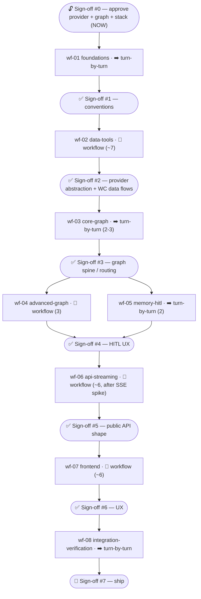

# 07 — Master Task Checklist

> Purpose: the single master checklist that links every build workflow **wf-01 … wf-08** with explicit dependency ordering, execution-mode tags, and per-workflow definition-of-done gates, partitioned into **stages by the sign-off boundaries of canonical-spec §9**.

Authoritative source: `research/canonical-spec.md` §8 (build workflows) + §9 (sign-offs, gate commands). Versions/sources trace to `research/09-decision-memo.md`. The per-workflow detail docs live in `06-workflows/wf-0N-*.md` (only `wf-04-advanced-graph.md` is written so far; the rest expand from the spec §8 row + this checklist).

---

## How to read this

**Two layers — kept strictly separate (canonical-spec §0):**
- **(a) Runtime patterns** = LangGraph behavior *inside* Pitch IQ (the 7 mandated patterns). These are *what each workflow builds*.
- **(b) Build workflows** = Claude Code dynamic-workflow orchestration used *to build* the product. wf-01 … wf-08 below are layer (b); their fan-outs and reviewers never leak into product runtime.

**Mode legend (canonical-spec §8 mode rule):**
- `🔁 workflow` — dynamic workflow: parallelizable across independent units and/or benefits from an adversarial cross-check.
- `➡️ turn-by-turn` — small, tightly-coupled, sequential, or needs mid-stream human sign-off.

> **Sign-off rule (canonical-spec §8/§9):** a sign-off is the boundary *between* two workflows — **never an interrupt inside one**. Every stage below ends on a clean sign-off; no sign-off ever splits a workflow.

**Concurrency:** every workflow fan-out is **≤ 16** (cap respected, canonical-spec §8). **Cost control:** each `🔁 workflow` runs **one unit-slice first** (one provider / one endpoint / one component) to gauge spend, then full fan-out.

**Gate commands (canonical-spec §9) — every workflow's DoD includes the relevant one(s):**
- Backend: `uv run ruff check . && uv run mypy app && uv run pytest -q`
- Frontend: `pnpm lint && pnpm typecheck && pnpm test && pnpm build`
- Evals (nightly/PR-gated): `uv run pytest -m langsmith` (with `LANGSMITH_TEST_CACHE`)

---

## Dependency graph (what unblocks what)

**Critical-path notes (raw dependency edges from canonical-spec §8 table):**
- `wf-04` and `wf-05` are **siblings** — both depend only on `wf-03`, so they run **in parallel** within one stage. There is **no sign-off after wf-04**; its DoD is verified by its own adversarial reviewer and it lands inside the stage closed by **sign-off #4** (whose human focus is HITL UX).
- `wf-06` is the **first join**: it requires **both** `wf-04` *and* `wf-05` complete (graph patterns + memory/HITL) before the API can stream them.
- `wf-08` is the **final join**: requires **both** `wf-06` *and* `wf-07`.

## Ordered build sequence (linearized)

This is the safe serial order (parallelism only inside `wf-04 ∥ wf-05`). Each item is tagged with its execution mode.

| # | Step | Mode | Unblocks | Closing sign-off |
|---|---|---|---|---|
| 0 | **Sign-off #0** — approve provider + graph + stack + product open-Qs | gate (now) | wf-01 | — |
| 1 | **wf-01 foundations** | ➡️ turn-by-turn | wf-02 | #1 conventions |
| 2 | **wf-02 data-tools** | 🔁 workflow (~7) | wf-03 | #2 provider abstraction + WC data flows |
| 3 | **wf-03 core-graph** | ➡️ turn-by-turn (2-3) | wf-04, wf-05 | #3 graph spine / routing |
| 4a | **wf-04 advanced-graph** | 🔁 workflow (3) | wf-06 | (none — folds into stage 4) |
| 4b | **wf-05 memory-hitl** | ➡️ turn-by-turn (2) | wf-06 | #4 HITL UX |
| 5 | **wf-06 api-streaming** | 🔁 workflow (~6) | wf-07, wf-08 | #5 public API shape |
| 6 | **wf-07 frontend** | 🔁 workflow (~6) | wf-08 | #6 UX |
| 7 | **wf-08 integration-verification** | ➡️ turn-by-turn | ship | #7 ship |

## Stage ↔ sign-off map (canonical-spec §9)

| Stage | Workflow(s) | Reviewer / verifier (§8) | Save-as-command (§8) | Closes on |
|---|---|---|---|---|
| **0 — gate** | _none_ (decision gate) | human (architect + product) | — | **Sign-off #0** |
| **1 — foundations** | wf-01 | smoke: installs + lints pass | no | **Sign-off #1** |
| **2 — data layer** | wf-02 | adversarial reviewer vs `base.py` protocol + respx tests | maybe `/verify-providers` | **Sign-off #2** |
| **3 — graph spine** | wf-03 | reviewer: routing unit tests + graph compiles | no | **Sign-off #3** |
| **4 — graph patterns + memory/HITL** | wf-04 ∥ wf-05 | wf-04 adversarial reviewer (loop/Send invariants); wf-05 reviewer (interrupt/resume durability) | no | **Sign-off #4** |
| **5 — public API** | wf-06 | adversarial reviewer vs §6 signatures + httpx/SSE tests | yes `/review-endpoints` | **Sign-off #5** |
| **6 — frontend** | wf-07 | reviewer: typecheck + Playwright smoke + visual | maybe | **Sign-off #6** |
| **7 — ship** | wf-08 | adversarial e2e reviewer + eval thresholds | yes `/eval` | **Sign-off #7** |

---

## Stage 0 — Sign-off #0 gate (NOW · approve provider + graph + stack)

> No build work. This is the standing decision gate that unblocks wf-01. Research + planning are complete (this session); the items below must be **approved by the user** before any code is written.

**Approve / decide:**
- [ ] **Stack** — lock the pinned versions in canonical-spec §1 / decision-memo §1 (langgraph **1.2.7**, langchain **1.3.11**, fastapi **0.138.2**, sse-starlette **3.4.5**, APScheduler **3.11.3**, SQLAlchemy **2.0.51**, next **16.2.9**, react **19.2.7**, ai **7.0.8**, tailwindcss **4.3.2**, shadcn **4.12.0**). Sources: <https://pypi.org/pypi/langgraph/json>, <https://registry.npmjs.org/next/latest>, <https://registry.npmjs.org/ai/latest>.
- [ ] **Providers** — approve API-Football v3 (primary, `league=1, season=2026`) + football-data.org v4 (fallback, `WC`) + The Odds API v4 (`soccer_fifa_world_cup`); Sportradar deferred (canonical-spec §4.2, decision-memo §2).
- [ ] **Graph** — approve the 7-pattern `companion_graph` design (canonical-spec §3) and the runtime/build two-layer split.
- [x] **Budget ceiling (Q7) RESOLVED** ≈ **$50–90/mo**: API-Football Pro **$19/mo** + The Odds API **$30/mo** + LangSmith free; football-data.org free fallback (canonical-spec §9 risk #1).
- [x] **Product open-Qs RESOLVED at sign-off #0:** briefings **shared-per-fixture** (Q2 → `briefings.user_id` nullable); auth **email/password + Google OAuth** (Q5 → Authlib, `users.auth_provider`/`auth_subject`, nullable `password_hash`, `/api/auth/google/*`); hosting **Vercel + Railway + managed Postgres** (Q4).
- [ ] **Still-open before dependent phases:** leagues **single- vs multi-tournament** (Q3; default single-tournament → before the schema migration); OpenAI snapshot ids (Q1 → before wf-03); checkpoint encryption (Q6; default optional).
- [ ] **Build-time open-Qs to verify at install, not now** acknowledged: OpenAI snapshot ids (#1), `@ai-sdk/react`↔`ai@7.0.8` peer (#2), `agentevals 0.0.9` currency (#3), `durability` default (#4), first-party `fastapi.sse` vs sse-starlette (#5) — canonical-spec §9 open questions.

✅ **Sign-off #0 →** unblocks **wf-01**.

---

## Stage 1 — wf-01 foundations  ·  ➡️ turn-by-turn

**Goal (canonical-spec §8):** monorepo, tooling, CI skeleton, `.env`, root `CLAUDE.md`, agent roster, allowlist. **Depends on:** — (root). **Verifier:** smoke — installs + lints pass. **Save-as-cmd:** no.

**Definition of Done:**
- [ ] Monorepo scaffolded: `backend/` + `frontend/` top-level trees per canonical-spec §6/§7 (dirs present, stubs OK).
- [ ] Backend env via **uv**: `backend/pyproject.toml` + `uv.lock` pinning every §1 backend version; `uv sync` installs clean.
- [ ] Frontend env via **pnpm**: `frontend/package.json` + `pnpm-lock.yaml` pinning every §1 frontend version; `pnpm install` clean; **verify `@ai-sdk/react` ↔ `ai@7.0.8` peer range at install** (open-Q #2, risk #8).
- [ ] `backend/.env.example` + `frontend/.env.example` with **all** canonical env vars (canonical-spec §2): `DATABASE_URL`, `CHECKPOINTER_DB_URL`, `OPENAI_API_KEY`, `MODEL_ROUTER/AGENT/CRITIC`, provider keys, `JWT_*`, `LANGSMITH_*`, `RUN_SCHEDULER`, `LIVE_POLL_SECONDS=60`, `BRIEFING_LEAD_HOURS=2`, `CORS_ORIGINS`, `BACKEND_URL`, `NEXT_PUBLIC_APP_URL`.
- [ ] Lint/type/format wired: `ruff` + `mypy` (backend), `eslint`/`prettier`/`typescript` (frontend).
- [ ] Root `CLAUDE.md` written; `.claude/agents/` holds the **6-agent roster** (canonical-spec §8: `langgraph-builder`, `fastapi-builder`, `nextjs-builder`, `data-tool-researcher`, `test-writer`, `adversarial-reviewer`); `.claude/settings.json` `permissions.allow`/`deny` set (allow Read/Edit/Write/Grep/Glob, `Bash(uv/pytest/ruff/mypy/alembic/pnpm/npx shadcn/git)`, `WebFetch/WebSearch`, `mcp__context7__*`, `mcp__shadcn__*`; **deny** `Bash(git push:*)`, `rm -rf`, secret prints).
- [ ] CI skeleton runs the §9 gate commands.
- [ ] **Smoke gate green:** backend installs + lints pass; frontend installs + lints pass.

✅ **Sign-off #1 — conventions →** unblocks **wf-02**.

---

## Stage 2 — wf-02 data-tools  ·  🔁 workflow (fan-out ~7)

**Goal:** provider abstraction + impls + Pydantic models + tests (mock HTTP). **Depends on:** wf-01. **Fan-out:** ~7 (base+models, api_football, football_data, the_odds_api, caching, fake, tests). **Verifier:** adversarial reviewer vs `base.py` protocol + respx tests. **Save-as-cmd:** maybe `/verify-providers`.

**Definition of Done:**
- [ ] `app/providers/base.py`: `SportsDataProvider` + `OddsProvider` **`Protocol`s** + all canonical-spec §4.4 Pydantic models (`ProviderRef`, `TeamRef`, `TournamentRef`, `Team`, `Fixture`, `MatchEvent`, `LiveMatchState`, `Lineups`, `Standings`, `HeadToHead`, `TeamForm`, `MatchOdds`, `WinProbabilities`, `DataFragment`) — all `model_config = ConfigDict(extra="forbid")`.
- [ ] `ApiFootballProvider` (primary; base `https://v3.football.api-sports.io`, header `x-apisports-key`; `league=1, season=2026`), `FootballDataProvider` (fallback; `https://api.football-data.org/v4`, `X-Auth-Token`, comp `WC`), `TheOddsApiProvider` (`apiKey` query, `soccer_fifa_world_cup`, `h2h`, `oddsFormat=decimal`) — each depends **only on the Protocol**.
- [ ] `CachingProvider` decorator: TTL cache + token-bucket rate limit + live/idle cadence + **429 → exponential backoff → failover to football-data.org** (canonical-spec §4.3).
- [ ] De-vig correct: `p_i = (1/d_i)/Σ(1/d_j)`, anchor **Pinnacle** (canonical-spec §4.2).
- [ ] `FakeProvider` deterministic for tests/CI; factory `app/providers/__init__.py` selects impl via `settings`.
- [ ] Graceful handling of **missing lineups/events** (coverage varies per match, decision-memo §2).
- [ ] respx-mocked unit tests per provider; `FakeProvider` exercised.
- [ ] Gate green + **adversarial reviewer** confirms every impl satisfies `base.py` (no concrete-client leakage into tools).

✅ **Sign-off #2 — provider abstraction + WC data flows →** unblocks **wf-03**.

---

## Stage 3 — wf-03 core-graph  ·  ➡️ turn-by-turn (fan-out 2-3)

**Goal:** state schema, router, ReAct `qa_agent`, tool binding, `llm` factory (the graph **spine**). **Depends on:** wf-02. **Verifier:** reviewer — routing unit tests + graph compiles. **Save-as-cmd:** no.

**Definition of Done:**
- [ ] `app/graph/state.py`: `CompanionState` TypedDict + `Route` enum + Pydantic payload models (`RouterDecision`, `UserContext`, `DataFragment`, …) with `add_messages` + `operator.add` reducers exactly per canonical-spec §3.1; all payloads `extra="forbid"`.
- [ ] `app/graph/llm.py`: `init_chat_model(...)` factory resolving `MODEL_ROUTER / MODEL_AGENT / MODEL_CRITIC` so a non-OpenAI model is a config change (canonical-spec §1).
- [ ] `app/graph/router.py`: `router` node using `.with_structured_output(RouterDecision)` (OpenAI strict json_schema, enum-closed) + `pick_route(state) -> Route`; low-confidence → `CHITCHAT` clarifying question (pattern #1).
- [ ] `app/graph/subgraphs/qa_agent.py`: `langchain.agents.create_agent(model, tools=[...], checkpointer=True)` ReAct with the **8 tools** bound (`get_fixture, get_live_match_state, get_lineups, get_standings, get_head_to_head, get_team_form, get_bracket_status, explain_rule`); system prompt forbids unverified facts (pattern #2).
- [ ] `app/graph/tools/{__init__,sports,bracket,rules}.py` — tool wrappers over the §4.1 Protocol only.
- [ ] `app/graph/build.py`: `companion_graph` spine `ingest → router → {qa_agent | chitchat | …} → persist_memory → END`; `app/graph/nodes/{ingest,chitchat,persist_memory}.py` present (memory wiring stubbed until wf-05).
- [ ] **`companion_graph` compiles**; routing unit tests pass as a closed-set classifier; reviewer sign-off.
- [ ] Backend gate green: `uv run ruff check . && uv run mypy app && uv run pytest -q`.

✅ **Sign-off #3 — graph spine / routing →** unblocks **wf-04 and wf-05 (parallel)**.

---

## Stage 4 — wf-04 advanced-graph ∥ wf-05 memory-hitl

> Two siblings off the same parent (wf-03), run **in parallel**. Stage closes on **Sign-off #4 (HITL UX)** once **both** DoDs are green. wf-04 has no sign-off of its own — its adversarial reviewer is the gate.

### wf-04 advanced-graph  ·  🔁 workflow (fan-out 3)

**Goal:** `prediction` (generator–evaluator, pattern #5+#3) + `briefing` (orchestrator–worker + parallelization, patterns #4+#3) subgraphs, wired into `router`. **Depends on:** wf-03. **Fan-out:** 3 (prediction, briefing, router-wiring). **Verifier:** adversarial reviewer (loop terminates, Send fan-in). **Save-as-cmd:** no. Detail: `06-workflows/wf-04-advanced-graph.md` §7.

**Definition of Done (verbatim from wf-04 §7):**
- [ ] Critic loop **provably terminates** (≤ 2 rounds) — `test_critic_loop_terminates_when_always_revise` green.
- [ ] `Send` fan-out + `operator.add` fan-in produces **all** sections, in **deterministic order** (`assemble` sorts by `SectionSpec.order`).
- [ ] Prediction probabilities valid (each ∈ [0,1], **sum → 1**).
- [ ] Both subgraphs wired into `companion_graph`; it compiles; `Route.PREDICTION`/`Route.BRIEFING` reach `persist_memory` with `final_response` set.
- [ ] `uv run ruff check . && uv run mypy app && uv run pytest -q` all green.
- [ ] `adversarial-reviewer` sign-off on the 4 invariants (loop termination, no orphan `Send`, deterministic fan-in / `critic` **not** `defer=True`, calibration sanity).

### wf-05 memory-hitl  ·  ➡️ turn-by-turn (fan-out 2)

**Goal:** `AsyncPostgresSaver` + Store + `bracket_ops` interrupts (patterns #6 + #7). **Depends on:** wf-03. **Verifier:** reviewer — interrupt/resume durability test. **Save-as-cmd:** no.

**Definition of Done:**
- [ ] `app/memory/store.py`: `AsyncPostgresStore` (prod) / `InMemoryStore` (dev); long-term user facts namespaced `("user", user_id)`.
- [ ] Checkpointer: `AsyncPostgresSaver` on the **`langgraph` schema** via a **dedicated psycopg3 pool** (`options='-c search_path=langgraph'`, `autocommit=True`, `row_factory=dict_row`, `prepare_threshold=0`); `await checkpointer.setup()` once (canonical-spec §5, risk #6).
- [ ] `companion_graph.compile(checkpointer=…, store=…)`; `ingest` loads `user_context` from Store; `persist_memory` writes durable facts.
- [ ] `app/graph/subgraphs/bracket_ops.py`: `validate_change → confirm[interrupt(summary)] → (approved? apply_change : cancel) → END`; node **idempotent** (side effects *after* `interrupt()`, deterministic interrupt order, never bare-`except` around `interrupt()`); `apply_change` is the only consequential write; `durability="sync"` for this run (risk #5).
- [ ] **interrupt/resume durability test green** (`Command(resume=True/False)`); reviewer sign-off.
- [ ] Backend gate green.

✅ **Sign-off #4 — HITL UX** (requires wf-04 **and** wf-05 DoD green) **→** unblocks **wf-06**.

---

## Stage 5 — wf-06 api-streaming  ·  🔁 workflow (fan-out ~6, after a turn-by-turn SSE spike)

**Goal:** FastAPI endpoints + SSE + scheduler/briefing pipeline. **Depends on:** wf-04 **and** wf-05. **Fan-out:** ~6 (auth, chat-SSE, brackets, leagues+briefings, tournaments, scheduler). **Verifier:** adversarial reviewer vs canonical-spec §6 signatures + httpx/SSE tests. **Save-as-cmd:** **yes** `/review-endpoints`.

> Run the **turn-by-turn SSE spike first** (prove `astream(stream_mode="messages", version="v2")` → `sse-starlette EventSourceResponse` end-to-end), then fan out.

**Definition of Done:**
- [ ] All canonical-spec §6 endpoints with **exact signatures**: `GET /healthz`; auth (`/api/auth/register|login`, `/api/auth/google/login|callback` [Authlib], `/api/me`, `/api/me/favorite-teams`); `POST /api/chat` → `EventSourceResponse` (events `token`/`tool`/`done`); tournaments + fixtures (`/api/fixtures/{id}/live` SSE); brackets incl. `POST /api/brackets/{id}/submit` → `{interrupt}|BracketOut` and `/submit/confirm` → resumes `Command(resume=…)`; briefings; leagues.
- [ ] `app/main.py` + `app/lifespan.py` build singletons **once**: compiled `companion_graph` + `AsyncPostgresSaver` + `PostgresStore` + asyncpg engine + scheduler (only if `RUN_SCHEDULER`) + provider clients.
- [ ] Chat SSE via **`sse-starlette` `EventSourceResponse` (3.4.5)** over `graph.astream(..., stream_mode="messages", version="v2")` filtered by `meta["langgraph_node"]` (risk #2); TTFT < 1.5s p50 target (canonical-spec §0).
- [ ] **Alembic async** migrations for the full §5 app schema (`users`, `tournaments`, `teams`, `fixtures`, `brackets`, `bracket_picks`, `leagues`, `league_memberships`, `briefings`, `conversations`, …); `alembic upgrade head` clean.
- [ ] Scheduler jobs `app/scheduler/jobs.py`: `schedule_briefings`, `generate_briefing` (kickoff − `BRIEFING_LEAD_HOURS`, id `briefing:{fixture_id}`, `replace_existing=True`), `poll_live` (interval `LIVE_POLL_SECONDS`, live windows only), `nightly_sync`; **single scheduler process** (risk #4); `briefing_service` runs the briefing subgraph headless and upserts `briefings`; `scoring_service` settles picks on FT.
- [ ] Typed exceptions (`ProviderError`, `RateLimitError`, `AuthError`, `NotFound`) → handlers → RFC-9457 problem+json.
- [ ] Tests: httpx ASGITransport + respx + **SSE smoke** (asserts token frames) + interrupt/resume + `alembic upgrade head`; **adversarial reviewer** vs §6 signatures.
- [ ] Backend gate green; **`/review-endpoints` saved**.

✅ **Sign-off #5 — public API shape →** unblocks **wf-07**.

---

## Stage 6 — wf-07 frontend  ·  🔁 workflow (fan-out ~6)

**Goal:** Next chat + live panel + bracket board wired to backend. **Depends on:** wf-06. **Fan-out:** ~6 (proxy+providers, chat, bracket, live, league, dashboard/auth). **Verifier:** reviewer — typecheck + Playwright smoke + visual. **Save-as-cmd:** maybe.

**Definition of Done:**
- [ ] `app/api/chat/route.ts` SSE proxy → FastAPI (hides `BACKEND_URL`, injects auth, `Cache-Control: no-cache, no-transform`, `X-Accel-Buffering: no`, no buffering) + `app/api/[...path]/route.ts` generic JSON proxy.
- [ ] Chat: `useChat({ transport: new TextStreamChatTransport({ api: '/api/chat' }) })` — **text protocol** (risk #3, AI SDK issue #7496); `components/chat/*` stream tokens.
- [ ] 3-pane `app/tournament/[slug]/page.tsx` (ChatPanel · LivePanel · BracketBoard) via Server Component `prefetchQuery` → `HydrationBoundary`.
- [ ] **TanStack Query 5.101.2** hooks (fixtures/standings/bracket) with `refetchInterval` in live windows; LivePanel subscribes `/api/fixtures/{id}/live` (EventSource / `useLiveFeed`) and merges via `queryClient.setQueryData`.
- [ ] `components/bracket/*`: `BracketBoard` (Tailwind grid of `Card` nodes + connector lines), `PickEditor`, and **`SubmitConfirmDialog` = the HITL UI** (shows interrupt summary → `POST /submit/confirm`).
- [ ] League leaderboard + invite (`components/league/*`); `(auth)/login|register`; dashboard `page.tsx`.
- [ ] Design system: **shadcn/ui on Tailwind v4** with World-Cup theming via `@theme` tokens.
- [ ] `pnpm lint && pnpm typecheck && pnpm test && pnpm build` green; **Playwright smoke** + visual; reviewer sign-off.

✅ **Sign-off #6 — UX →** unblocks **wf-08**.

---

## Stage 7 — wf-08 integration-verification  ·  ➡️ turn-by-turn (+ eval-dataset sub-workflow)

**Goal:** e2e flow, eval harness, observability, deploy. **Depends on:** wf-06 **and** wf-07. **Verifier:** adversarial e2e reviewer + eval thresholds. **Save-as-cmd:** **yes** `/eval`.

**Definition of Done:**
- [ ] **Playwright e2e** (the canonical happy path, canonical-spec §9): login → pick bracket → submit (confirm dialog) → chat streams → briefing shows.
- [ ] Eval harness `app/eval/`: `datasets/{routing.jsonl, predictions.jsonl, groundedness.jsonl}`, `evaluators.py`, `run_evals.py`; `@pytest.mark.langsmith` with `LANGSMITH_TEST_CACHE`.
- [ ] **Eval thresholds met** (canonical-spec §0 success criteria): routing **macro-F1 ≥ 0.9**; prediction **Brier ≤ market + 0.02** (+ log-loss/ECE vs no-vig line); groundedness **pass-rate ≥ 0.95** (`openevals 0.2.0` judges + deterministic number-in-source check); refusal rate tracked. (`agentevals 0.0.9` trajectory eval — confirm currency, open-Q #3.)
- [ ] **LangSmith tracing** live (`LANGSMITH_TRACING=true`, `LANGSMITH_API_KEY`, `LANGSMITH_PROJECT`) — traces on every node.
- [ ] **Deploy topology** (canonical-spec §2): 3 processes — Next.js, FastAPI web (scheduler **off**), single worker (`RUN_SCHEDULER=true`, 1 replica) — + one managed Postgres; secrets via platform env.
- [ ] Success criteria confirmed in staging: TTFT < 1.5s p50; briefings stored before kickoff for **100%** of relevant fixtures; engine reusable for a 2nd tournament config with **zero schema DDL**.
- [ ] **Adversarial e2e reviewer** sign-off; **`/eval` saved**.

🚢 **Sign-off #7 — ship.**

---

## Current status

- ✅ **Research complete** — `research/00-…09-*.md` (7 verified research streams + verification verdicts + decision memo).
- ✅ **Planning complete (this session)** — `canonical-spec.md` locked; planning docs `00`–`03` + `06-workflows/wf-04-advanced-graph.md` + this master checklist `07` written. (Remaining `06-workflows/wf-{01,02,03,05,06,07,08}-*.md` detail docs expand from the §8 rows + this checklist; no source code written yet.)
- ⏳ **Awaiting Sign-off #0** (approve provider + graph + stack + product open-Qs) — **no build workflow (wf-01) may start until #0 is granted.**

**Next action:** obtain **Sign-off #0**, then begin **wf-01 foundations** (➡️ turn-by-turn).
