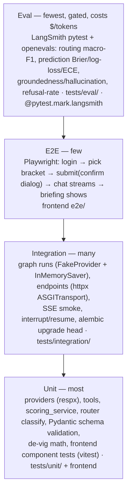

# 08 — Testing & Verification

> Purpose: the test pyramid, LangGraph-specific tests, the agent-quality eval suite, the CI gates, and the **exact** verification commands a future build session runs after every task — and which build-workflow each command gates.

**Status:** derived from the canonical spec (`research/canonical-spec.md` §9, §6, §3, §0) and `research/07-observability-evaluation-for-a-langgraph-agent.md`. If anything here disagrees with the canonical spec, the spec wins.

---

## 0. Two layers (keep them separate)

This doc sits at the seam between the project's two layers, so it states the relationship explicitly:

- **Runtime patterns** = LangGraph behavior *inside the product* (the router, ReAct qa_agent, prediction gen→critic loop, briefing orchestrator-worker, bracket_ops HITL). **This is what the tests and evals assert against.**
- **Build workflows** = Claude Code dynamic-workflow orchestration used *to build the product* (wf-01…wf-08, `06-workflows/`). **These are what the verification commands gate.** A workflow's worker emits code, the workflow's verifier runs the gate command; the command must be green before the sign-off boundary.

So: *evals measure the runtime; gate commands gate the build.* Section 5 lists the commands; section 7 maps each command to the wf/task it gates.

---

## 1. The test pyramid

Four layers, widest (cheapest, most numerous) at the bottom. Mirrors canonical-spec §9 "Testing/verification" and §6 "Error handling / testing".



| Layer | Lives in | Tooling (pinned) | What it asserts |
|---|---|---|---|
| **Unit** | `tests/unit/`, frontend `*.test.tsx` | pytest + pytest-asyncio, **respx** (mock provider HTTP), vitest | Provider impls vs `app/providers/base.py` `Protocol`; tools in `app/graph/tools/{sports,bracket,rules}.py`; `scoring_service` settle math; router structured-output classify; de-vig `p_i=(1/d_i)/Σ(1/d_j)`; Pydantic models (`extra="forbid"`) reject bad payloads; React components (Composer, MessageBubble, BracketBoard) |
| **Integration** | `tests/integration/` | pytest-asyncio, **httpx `ASGITransport`**, `FakeProvider` + `InMemorySaver`/`InMemoryStore` | Compiled `companion_graph` end-to-end per route; `/api/*` endpoints vs §6 signatures; `/api/chat` SSE frame smoke; bracket_ops `interrupt`/`Command(resume=…)`; `alembic upgrade head` on ephemeral Postgres |
| **E2E** | frontend `e2e/` | **@playwright/test** | The one golden journey: login → pick bracket → submit → `SubmitConfirmDialog` (HITL) → confirm → chat streams tokens → briefing card renders |
| **Eval** | `tests/eval/` + `app/eval/` | **langsmith[pytest] 0.9.3**, **openevals 0.2.0**, agentevals 0.0.9 ⚠️ | Agent *quality*, not pass/fail correctness: routing macro-F1, prediction calibration vs no-vig market, groundedness/hallucination, refusal-rate (section 4) |

**Backend test scaffolding (canonical-spec §6):** the FastAPI `app` is built with `lifespan` overrides → `InMemorySaver`/`InMemoryStore`, `FakeProvider` (from `app/providers/fake.py`), `RUN_SCHEDULER=false`. Endpoint tests drive it through `httpx.ASGITransport` (no socket). Provider unit tests use `respx` so no real API-Football / The Odds API calls. Result: deterministic, network-free, no flakiness, no per-run cost — except the eval layer, which is gated and cached (sections 5–6).

---

## 2. LangGraph-specific testing (runtime patterns)

These are integration tests of the runtime graph, all built on the **`FakeProvider` + `InMemorySaver`** harness (canonical-spec §6). `FakeProvider` returns deterministic `Fixture`/`LiveMatchState`/`WinProbabilities` so the graph's logic — not the data feed — is under test. The compiled graph comes from `app/graph/build.py`; state shape is `CompanionState` (`app/graph/state.py`).

Each of the 7 mandated patterns gets a targeted test. The five non-trivial ones:

### 2.1 Conditional routing — closed-set classify (`app/graph/router.py`)
The `router` node runs an LLM `.with_structured_output(RouterDecision)` (OpenAI strict json_schema, enum-closed over the `Route` enum). Because the label space is closed, test it as a **deterministic classifier**: a small labeled set of utterances → expected `Route`, asserting `pick_route(state) == expected`.

```python
# tests/integration/test_router.py
@pytest.mark.parametrize("utterance, expected", [
    ("why 6 minutes added?",              Route.MATCH_QA),
    ("is a back-pass to the keeper legal?", Route.RULES_QA),
    ("who do you think wins tonight?",     Route.PREDICTION),
    ("brief me on the quarter-final",      Route.BRIEFING),
    ("lock my bracket",                    Route.BRACKET_OPS),
    ("hey",                                Route.CHITCHAT),
])
async def test_router_classifies(graph_fake, utterance, expected):
    out = await graph_fake.ainvoke({"messages":[HumanMessage(utterance)], ...})
    assert out["route"] == expected
```
Low-confidence `RouterDecision.confidence` must fall through to `CHITCHAT` (clarifying question) — assert that explicitly. The same labeled corpus, expanded and held out, becomes the **routing eval dataset** (section 4a). Unit-level routing is part of the **wf-03** verifier; the macro-F1 threshold is enforced at **wf-08** eval time.

### 2.2 Critic-loop termination (`app/graph/subgraphs/prediction.py`)
The generator→evaluator loop is `gen_prediction` → `critic` → conditional edge back to `gen_prediction` **iff** `Critique.verdict == "revise"` **and** `prediction_round < 2`, else `finalize`. The termination guarantee is the dangerous part. Force the worst case: stub the critic to **always** return `verdict="revise"` and assert the graph still halts.

```python
# tests/integration/test_prediction.py
async def test_critic_loop_terminates(graph_fake_always_revise):
    out = await graph_fake_always_revise.ainvoke({...})  # critic never passes
    assert out["prediction_round"] <= 2          # hard cap honored
    assert out["prediction"] is not None         # finalize still ran → no infinite loop
```
Also assert the happy path (critic `pass` on round 0 → no revise) and that the final `Prediction.probs` are valid (in [0,1], sum→1) — the same sanity invariant the calibration eval uses (section 4b). This is the **wf-04** verifier's headline check ("critic loop terminates ≤2").

### 2.3 Send fan-in + parallel fan-in (`app/graph/subgraphs/briefing.py`)
Two concurrency patterns in one subgraph:
- **Parallelization** — static fan-out `gather_{fixture,lineups,standings,odds,h2h,form}` write into the `gathered: Annotated[list[DataFragment], operator.add]` channel. Assert all six fragments land and the reducer concatenates them (length == number of gather nodes that produced data).
- **Orchestrator–worker (Send)** — `plan_briefing` emits one `Send("write_section", spec)` per chosen section; `assemble` is `defer=True` so it fires only after **all** dynamic workers complete. Assert `len(briefing_sections) == len(briefing_plan.sections)`, no section dropped, no `assemble` ran early (deferred fan-in).

```python
# tests/integration/test_briefing.py
async def test_send_fanin_collects_all_sections(graph_fake):
    out = await briefing_subgraph.ainvoke({...})  # plan picks N sections
    assert len(out["briefing_sections"]) == len(out["briefing_plan"].sections)
    assert {s.kind for s in out["briefing_sections"]} == set(out["briefing_plan"].sections)
```
Run the briefing **both ways** it is invoked (canonical-spec §3.3): the chat `BRIEFING` route, and headless via `briefing_service` with a system `thread_id`. The Send fan-in + deferred assemble is the second **wf-04** verifier check ("no orphan `Send`, deterministic fan-in").

### 2.4 Interrupt / resume durability (`app/graph/subgraphs/bracket_ops.py`)
`bracket_ops` is `validate_change → confirm[interrupt(summary)] → (approved? apply_change : cancel)`. Two properties to prove:
1. **Surfacing** — invoking the graph returns an `__interrupt__` payload carrying the change summary (the brackets API maps this to a `409`-style `{interrupt:{id,summary}}`, canonical-spec §3.4); the consequential write has **not** happened yet.
2. **Resume + idempotency** — resuming with `Command(resume=True)` reaches `apply_change` exactly once; `Command(resume=False)` reaches `cancel` and writes nothing. Because `interrupt()` re-runs the node from the top on resume (Risk #5), assert `apply_change` is idempotent (side-effects placed *after* the interrupt, deterministic interrupt order, no bare-except around `interrupt()`).

```python
# tests/integration/test_bracket_ops.py
async def test_interrupt_then_resume_applies_once(graph_fake):
    cfg = {"configurable": {"thread_id": "t-hitl"}}
    first = await graph_fake.ainvoke({...submit...}, cfg)
    assert first["__interrupt__"][0].value["summary"]            # surfaced, not applied
    resumed = await graph_fake.ainvoke(Command(resume=True), cfg)  # same thread_id
    assert resumed["approved"] is True and bracket.status == "locked"

async def test_interrupt_resume_reject_writes_nothing(graph_fake):
    cfg = {"configurable": {"thread_id": "t-hitl-2"}}
    await graph_fake.ainvoke({...submit...}, cfg)
    out = await graph_fake.ainvoke(Command(resume=False), cfg)
    assert out["approved"] is False and bracket.status != "locked"
```
`InMemorySaver` persists across `ainvoke`/resume **within a test** (same `thread_id`), which proves logical durability. **True cross-process durability** (checkpoint survives a restart) needs the real `AsyncPostgresSaver` (`langgraph` schema, psycopg3 pool) and runs with `durability="sync"` — add one Postgres-backed integration test against an ephemeral DB. This is the **wf-05** verifier's defining check.

### 2.5 Memory (checkpointer + store)
`ingest` loads `UserContext` from the Store (`("user", user_id)` namespace); `persist_memory` writes durable facts back. Test with `InMemoryStore`: seed favorites, assert `ingest` populates `state["user_context"]`, assert `persist_memory` round-trips a new fact to a fresh thread (cross-thread memory). Short-term thread state via the checkpointer is covered by 2.4.

> **Layer reminder:** everything in §2 tests the **runtime** product. The *act of running these tests* is the verifier inside a **build workflow** (§7).

---

## 3. Eval layer overview (agent quality)

Evals are distinct from tests: tests assert deterministic correctness (does the code do X?); evals score **non-deterministic agent quality** against thresholds (canonical-spec §0 Success criteria). They live in `tests/eval/` (the `@pytest.mark.langsmith` tests) and draw on `app/eval/`:

```
app/eval/
  datasets/
    routing.jsonl        # labeled utterance → Route
    predictions.jsonl     # fixtures + naive/sound predictions, market lines, should_flag
    groundedness.jsonl    # question + live-data context + answer (+ numeric facts)
  evaluators.py           # routing_correct, brier/log_loss/ece, critic-flag judge, groundedness judge, numeric-in-source, refusal_rate
  run_evals.py            # client.evaluate(target, data=..., evaluators=[...], experiment_prefix=...)
```

Two ways the eval suite runs (research §3):
- **CI / gate:** `langsmith[pytest]` — `@pytest.mark.langsmith` decorated tests in `tests/eval/`, run via `uv run pytest -m langsmith`, logging with `t.log_inputs / t.log_outputs / t.log_reference_outputs`. Source: <https://docs.langchain.com/langsmith/pytest>.
- **Ad-hoc / experiment:** `app/eval/run_evals.py` calls `client.evaluate(...)` against a LangSmith dataset for richer experiment comparison. Source: <https://docs.langchain.com/langsmith/evaluation-quickstart>.

Pinned eval libs (canonical-spec §1): **langsmith[pytest] 0.9.3** (2026-06-26, <https://pypi.org/project/langsmith/>), **openevals 0.2.0** (2026-04-07, <https://pypi.org/project/openevals/>, <https://github.com/langchain-ai/openevals>), **agentevals 0.0.9** ⚠️ *confirm currency before pinning — PyPI date 2025-07-24 looks stale; open question* (<https://pypi.org/project/agentevals/>).

---

## 4. Eval datasets & evaluators

| # | Suite | Dataset | Evaluator type | Metric → threshold (canonical-spec §0) |
|---|---|---|---|---|
| a | Routing accuracy | `routing.jsonl` | deterministic row + summary (macro-F1) | **macro-F1 ≥ 0.90** |
| b1 | Critic catches naive picks | `predictions.jsonl` (`should_flag`) | openevals LLM-judge (categorical) | precision/recall/F1 of flagging (track; no hard gate) |
| b2 | Prediction calibration | `predictions.jsonl` + market | deterministic numeric (Brier/log-loss/ECE) | **Brier ≤ market + 0.02** |
| c | Q&A groundedness | `groundedness.jsonl` | openevals LLM-judge + deterministic numeric-in-source | **groundedness pass-rate ≥ 0.95** (no fabricated numbers) |
| d | Refusal rate | all generation suites | deterministic counter | refusal-rate tracked as first-class failure |

### 4a. Routing accuracy — deterministic, not an LLM judge
Closed-set classification with labels → use a **deterministic exact-match** row evaluator plus a **summary evaluator** for the aggregate (research §4a):

```python
# app/eval/evaluators.py
def routing_correct(outputs, reference_outputs):
    return {"key": "routing_correct", "score": int(outputs["route"] == reference_outputs["route"])}
# summary evaluator → accuracy, per-class precision/recall, macro-F1, confusion matrix (which routes collide)
```
OpenAI strict structured outputs keep the label space closed (every output is a valid `Route`), so the metric is *which* route, never JSON validity. Optionally also assert the route manifested as the right subgraph call with agentevals `create_trajectory_match_evaluator(trajectory_match_mode="unordered"|"subset")` (<https://docs.langchain.com/langsmith/trajectory-evals>) — pending the agentevals currency check.

### 4b. Prediction sanity — two complementary suites
**Does the critic catch naive picks?** `predictions.jsonl` holds deliberately naive predictions ("always pick the favorite", ignores live data) tagged `should_flag=true` and sound ones tagged `false`. An openevals `create_llm_as_judge(prompt=<custom rubric: "does the critique correctly identify the flaw?">, feedback_key="critic_flags_naive", choices=...)` scores whether the `critic` flagged the flaw; report **precision / recall / F1** of flagging (recall = caught bad ones; precision = didn't over-flag good ones).

**Calibration vs the no-vig market — deterministic, never an LLM judge.** Reference probabilities are the **de-vigged** market line from `OddsProvider.get_win_probabilities(...)` (`WinProbabilities(devig=True)`, `p_i=(1/d_i)/Σ(1/d_j)`, anchored on **Pinnacle**, canonical-spec §4.2). Summary evaluators compute **Brier score, log-loss, and ECE** of the model's `Prediction.probs` against outcomes / market; a row sanity evaluator asserts probabilities are in `[0,1]`, sum→1, and sit within a sane band of the implied line. Gate: **Brier ≤ market + 0.02** (canonical-spec §0). Numeric calibration is computed in code, not delegated to a judge (research §4b).

### 4c. Q&A groundedness / hallucination
Use openevals `create_llm_as_judge(prompt=HALLUCINATION_PROMPT, ...)` (or `RAG_GROUNDEDNESS_PROMPT`), passing the **live data as `context`** and the qa_agent answer as `outputs`; report a **hallucination rate / groundedness pass-rate** (gate ≥ 0.95). Pair the judge with a **cheap deterministic numeric-fact-in-source check** — assert every number/entity in the answer actually appears in the tool-returned source data. This catches fabricated figures the judge may miss and reduces judge-variance reliance (research §4c). This directly enforces the qa_agent system-prompt rule "never state an unverified live fact" (canonical-spec §3.3).

### 4d. Refusal rate (structured-output consideration)
With OpenAI strict structured outputs, schema validity is **guaranteed**, so it stops being the interesting metric — evaluate **field values**, not JSON parse failures. But a refusal surfaces as `message.refusal` (not schema-conforming JSON): **count refusal-rate separately** from "wrong answer" as a first-class failure across all generation suites (research §5). Source: <https://developers.openai.com/api/docs/guides/structured-outputs>.

**Judge model:** openevals judges (`create_llm_as_judge`) take a configurable model (e.g. `model="openai:o3-mini"` in the docs); wire it to a pinned snapshot via the same `init_chat_model` config used for `MODEL_CRITIC` (`app/graph/llm.py`). The exact OpenAI snapshot id is **canonical-spec open question #1** — pin before relying on eval reproducibility.

---

## 5. The exact verification commands

A future build session runs these **after each task**, verbatim (canonical-spec §9). They are the contract between a workflow worker and its verifier.

```bash
# Backend gate — run from backend/
uv run ruff check . && uv run mypy app && uv run pytest -q

# Frontend gate — run from frontend/
pnpm lint && pnpm typecheck && pnpm test && pnpm build

# Evals — gated (nightly + eval-touching PRs), needs LANGSMITH_API_KEY
uv run pytest -m langsmith
```

Notes that make these reliable:
- **`uv run pytest -q` deliberately excludes evals.** Configure `pyproject.toml` so the default run is fast and free:
  ```toml
  [tool.pytest.ini_options]
  asyncio_mode = "auto"
  addopts = "-m 'not langsmith'"          # default gate skips paid eval tests
  markers = ["langsmith: agent-quality evals (LangSmith) — run via -m langsmith"]
  ```
  `addopts` is prepended, so `uv run pytest -m langsmith` overrides it (last `-m` wins) and runs **only** the eval tests. The plain gate never hits OpenAI/LangSmith → deterministic and $0.
- **`pnpm test` = vitest** (component/unit). Playwright e2e is heavier and run separately as `pnpm test:e2e` (the **wf-07** verifier "Playwright smoke" and the **wf-08** golden journey), not inside the per-task frontend gate.
- **`pnpm build`** (Next.js 16, Turbopack) is in the gate because type-only errors and RSC/route-handler misuse surface at build, not lint.
- All `Bash(uv:*) Bash(uv run:*) Bash(pytest:*) Bash(ruff:*) Bash(mypy:*) Bash(pnpm:*)` are on the unattended allowlist (canonical-spec §8) so verifiers run without prompts.

---

## 6. CI gates — PR vs nightly

| Trigger | Job | Command | Why here |
|---|---|---|---|
| **PR** (paths `backend/**`) | backend gate | `uv run ruff check . && uv run mypy app && uv run pytest -q` | fast, deterministic, free — must pass to merge |
| **PR** (paths `frontend/**`) | frontend gate | `pnpm lint && pnpm typecheck && pnpm test && pnpm build` | fast, deterministic, free — must pass to merge |
| **PR** (paths `app/graph/**`, `app/eval/**`, prompts) | evals (cached) | `uv run pytest -m langsmith` with **`LANGSMITH_TEST_CACHE`** on | catch routing/calibration/groundedness regressions where they originate, without re-paying tokens |
| **Nightly** (cron) | full evals | `uv run pytest -m langsmith` (cache may be cold) | thresholds enforced against current models/data; drift detection |
| **Nightly** (cron) | migrations | `alembic upgrade head` on ephemeral Postgres | schema integrity |
| **PR/Nightly** (frontend) | e2e | `pnpm test:e2e` (Playwright) | golden journey; nightly always, PR on `frontend/**` |

**`LANGSMITH_TEST_CACHE`** caches LLM HTTP calls so unchanged eval commits don't re-pay per run — the single most important knob for keeping the eval gate affordable on PRs (research §3). Companion env knobs: `LANGSMITH_TEST_SUITE`, `LANGSMITH_EXPERIMENT`, `LANGSMITH_EXPERIMENT_METADATA` (JSON CI labels), and `LANGSMITH_TEST_TRACKING=false` for a dry run. Tracing itself is env-driven: `LANGSMITH_TRACING`, `LANGSMITH_API_KEY`, `LANGSMITH_PROJECT` (canonical-spec §2 env vars; <https://docs.langchain.com/langsmith/trace-with-langgraph>). Source for the pytest integration + caching: <https://blog.langchain.com/pytest-and-vitest-for-langsmith-evals/>.

Rationale for the split: the backend/frontend gates are cheap and run on every PR; the eval suite costs tokens and is non-deterministic, so it runs on eval-relevant PRs **with cache** and unconditionally **nightly**. This matches canonical-spec §9 ("evals nightly/PR-gated") and Risk-#8 mitigation (CI smoke on bleeding-edge versions).

---

## 7. Command → workflow / task gating map

Each build workflow (canonical-spec §8) has a **Verifier** that runs one of the §5 commands before its sign-off boundary. (Runtime patterns are *what* is tested; build workflows are *when* the gate runs.)

| WF (build) | What it produces | Gate command run by its verifier | The specific check it enforces |
|---|---|---|---|
| **wf-01** foundations | monorepo, tooling, CI skeleton | smoke: `uv` install + `pnpm install`, `ruff`/`eslint` lint pass | "installs + lints pass" (no app code yet) |
| **wf-02** data-tools | provider impls + Pydantic models | `uv run ruff check . && uv run mypy app && uv run pytest -q` | respx provider unit tests + `FakeProvider` conform to `app/providers/base.py` Protocol; de-vig math |
| **wf-03** core-graph | state, router, qa_agent, llm factory | `uv run ruff check . && uv run mypy app && uv run pytest -q` | **routing classify tests** (§2.1) + graph compiles |
| **wf-04** advanced-graph | prediction + briefing subgraphs | `uv run ruff check . && uv run mypy app && uv run pytest -q` | **critic loop terminates ≤2** (§2.2) + **Send fan-in / no orphan Send** (§2.3) |
| **wf-05** memory-hitl | AsyncPostgresSaver + Store + bracket_ops | `uv run ruff check . && uv run mypy app && uv run pytest -q` | **interrupt/resume durability + idempotency** (§2.4) |
| **wf-06** api-streaming | FastAPI endpoints + SSE + scheduler | `uv run ruff check . && uv run mypy app && uv run pytest -q` | endpoints vs §6 signatures (httpx ASGITransport) + **SSE token-frame smoke** + `alembic upgrade head` |
| **wf-07** frontend | Next chat + live + bracket board | `pnpm lint && pnpm typecheck && pnpm test && pnpm build` (+ `pnpm test:e2e`) | vitest components + **Playwright smoke** + visual |
| **wf-08** integration-verification | e2e flow + eval harness + deploy | all three: backend gate, frontend gate + `pnpm test:e2e`, **`uv run pytest -m langsmith`** | golden Playwright journey + **eval thresholds** (§4): macro-F1 ≥ 0.90, Brier ≤ market+0.02, groundedness ≥ 0.95 |

The eval command (`uv run pytest -m langsmith`) is **only** a wf-08 verifier and a nightly/eval-PR CI job — never part of the per-task backend gate, so wf-02…wf-06 stay fast and free.

---

## 8. Open questions (verify at build time)

1. **Exact OpenAI snapshot ids** for `MODEL_ROUTER/MODEL_AGENT/MODEL_CRITIC` and the openevals judge model — pin against OpenAI's live model list before relying on eval reproducibility (canonical-spec open question #1; research §5).
2. **agentevals 0.0.9 currency** — PyPI date (2025-07-24) looks stale vs langsmith/openevals; confirm a newer release exists or whether trajectory eval folded into openevals before pinning the §2.1/§4a trajectory check (canonical-spec §1 ⚠️; research open questions).
3. **`durability` default + whether wired to `ainvoke`** (langgraph #5741) — the interrupt/resume durability test (§2.4) assumes `durability="sync"` for HITL/scoring runs; verify the parameter is honored on the async path (canonical-spec open question #4).
4. **LangSmith free-tier trace/retention limits** under nightly eval volume — 5k traces/mo, 14-day base retention; confirm headroom or budget Plus ($39/seat/mo) before turning evals on for every eval-PR (research §1).
5. **Briefing personalization (per-user vs shared-per-fixture)** changes the groundedness dataset fixtures (`briefings.user_id` nullability) — pin before authoring `groundedness.jsonl` (canonical-spec open question #7).
