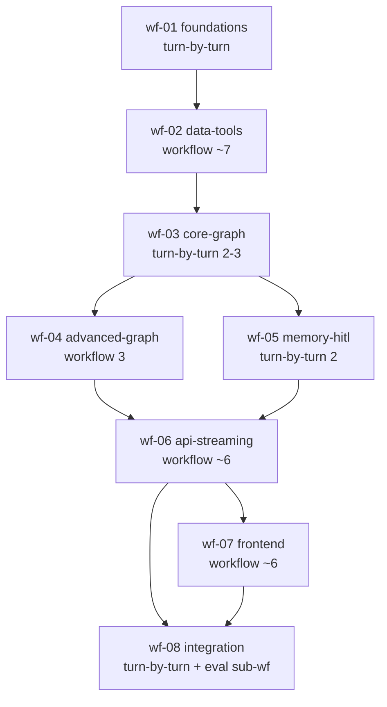

# 10 — Build Orchestration

> The build-time agent strategy for Pitch IQ as ONE picture: the custom subagent roster, the wf-01…wf-08 phase→mode→fan-out→verifier→command master table, model/effort routing, cost control, and the unattended-run tool allowlist. This is the doc the execution session opens to know **HOW to build**.

---

## 0. Read this first — two layers, kept strictly separate

This doc is **only** about layer (b).

| Layer | What it is | Where it is specified |
|---|---|---|
| **(a) Runtime patterns** | LangGraph behavior *inside the product* — the 7 mandated patterns (conditional routing, ReAct, parallelization, orchestrator–worker, generator–evaluator, memory, HITL) that run when a user chats. | canonical-spec §3 (`app/graph/**`). **NOT this doc.** |
| **(b) Build workflows** | Claude Code dynamic-workflow orchestration used *to build the product* — subagents, fan-out, adversarial review, save-as-commands. | canonical-spec §8 (`.claude/**`). **THIS doc.** |

A `interrupt()` in layer (a) is a product feature (HITL bracket lock). A human **sign-off** in layer (b) is a boundary *between two build workflows*, never an interrupt inside one (canonical-spec §8). Do not conflate them.

All paths, versions, signatures, node/edge names, and table/column names below are quoted from `docs/plan/research/canonical-spec.md` (the single source of truth) and `docs/plan/research/09-decision-memo.md` (source URLs for pins). If anything here disagrees with the canonical spec, **the spec wins**.

---

## 1. The custom subagent roster (`.claude/agents/`)

Six custom subagents, each defined as a Markdown agent file under **`.claude/agents/`** with a YAML frontmatter (`name`, `description`, `tools`, `model`) plus a role prompt. Each agent's `tools` line is a strict allowlist — a worker can only touch the tools below, which is what makes unattended fan-out safe. Model is chosen per role (cheaper Sonnet for mechanical work; Opus 4.8 for design/SSE/review/eval — see §4).

| Agent (`.claude/agents/<name>.md`) | Role | Tools (allowlist) | Model |
|---|---|---|---|
| **`langgraph-builder`** | Build graph nodes / subgraphs / tools in `app/graph/**` (state, router, qa_agent, prediction, briefing, bracket_ops, tools, llm factory). | `Read, Edit, Write, Grep, Glob`, `Bash(uv, pytest)`, `context7`, `WebFetch` | **Opus** (graph design) / **Sonnet** (mechanical) |
| **`fastapi-builder`** | Build endpoints, SSE transport, DB/repositories, alembic migrations, scheduler/services in `app/api/**`, `app/db/**`, `app/services/**`, `app/scheduler/**`. | `Read, Edit, Write, Grep, Glob`, `Bash(uv, pytest, alembic)`, `context7` | **Sonnet** (**Opus for SSE**, wf-06) |
| **`nextjs-builder`** | Build Next.js components, streaming wiring, the `/api/*` proxy route handlers in `frontend/**`. | `Read, Edit, Write, Grep, Glob`, `Bash(pnpm)`, `shadcn MCP`, `context7` | **Sonnet** |
| **`data-tool-researcher`** | Implement provider clients (`app/providers/**`) and *verify live API shapes* against vendor docs before coding to them. | `Read, Edit, Write`, `Bash(uv)`, `WebSearch`, `WebFetch`, `context7` | **Sonnet** (**Opus if the API shape is ambiguous**) |
| **`test-writer`** | Write pytest / pytest-asyncio / respx / vitest / Playwright tests (`tests/**`, `frontend/**/*.test.*`, e2e). | `Read, Edit, Write, Grep, Glob`, `Bash(uv, pytest, pnpm, playwright)` | **Sonnet** |
| **`adversarial-reviewer`** | *Break* worker output against the spec + tests. Read-only on source + can run the gates; never edits product code. | `Read, Grep, Glob`, `Bash(uv, pytest, pnpm)` | **Opus** |

Notes:
- The reviewer is deliberately **non-writing** (no `Edit`/`Write`): its job is to find where a worker's output violates `canonical-spec` §3/§4/§6/§7 or fails the gate commands, and report — the orchestrator then dispatches a fix turn. This keeps "build" and "critique" responsibilities clean.
- `data-tool-researcher` is the only agent with `WebSearch`, because provider API shapes (API-Football v3, football-data.org v4, The Odds API v4) must be confirmed against live docs — several facts are still **open questions** (§7).
- `langgraph-builder`, `fastapi-builder`, `nextjs-builder`, `data-tool-researcher`, `test-writer` get `context7` (and shadcn MCP for the frontend builder) to pull *current* library docs at the pinned versions rather than coding from memory against bleeding-edge releases (Risk #8).

---

## 2. THE master table — wf-01 … wf-08 (canonical-spec §8)

**Mode rule (§8):** use a **dynamic workflow** when work is parallelizable across many independent units / benefits from adversarial cross-check; use **turn-by-turn** when it is small, tightly coupled, sequential, or needs mid-stream human sign-off. **Concurrency: all fan-outs ≤ 16** (cap respected).

| WF | Goal | Depends on | Mode | Fan-out (width → units) | Verifier | Save-as-cmd |
|---|---|---|---|---|---|---|
| **wf-01 foundations** | monorepo, tooling, CI skeleton, `.env`, root `CLAUDE.md`, agent roster, allowlist | — | **turn-by-turn** (small, sequential, sign-off) | n/a | smoke: installs + lints pass | no |
| **wf-02 data-tools** | provider abstraction + impls + Pydantic models + tests (mock HTTP) | wf-01 | **workflow** | **~7** → base.py+models, api_football, football_data, the_odds_api, caching, fake, tests | `adversarial-reviewer` vs `app/providers/base.py` protocol + respx tests | **maybe** (`/verify-providers`) |
| **wf-03 core-graph** | state schema, router, ReAct qa_agent, tool binding, llm factory | wf-02 | **turn-by-turn** (spine, tightly coupled) | **2–3** subagents | reviewer: routing unit tests + graph compiles | no |
| **wf-04 advanced-graph** | prediction (gen-eval), briefing (orch-worker + parallel) subgraphs | wf-03 | **workflow** | **3** → prediction, briefing, wiring | `adversarial-reviewer`: critic loop terminates, `Send` fan-in | no |
| **wf-05 memory-hitl** | `AsyncPostgresSaver` + Store + bracket_ops interrupts | wf-03 | **turn-by-turn** (coupled, HITL UX sign-off) | **2** | reviewer: interrupt/resume durability test | no |
| **wf-06 api-streaming** | FastAPI endpoints + SSE + scheduler/briefing pipeline | wf-04, wf-05 | **workflow** (after a turn-by-turn SSE spike) | **~6** → auth, chat-SSE, brackets, leagues+briefings, tournaments, scheduler | `adversarial-reviewer` vs §6 signatures + httpx/SSE tests | **yes** (`/review-endpoints`) |
| **wf-07 frontend** | Next chat + live panel + bracket board wired to backend | wf-06 | **workflow** | **~6** → proxy+providers, chat, bracket, live, league, dashboard/auth | reviewer: typecheck + Playwright smoke + visual | **maybe** |
| **wf-08 integration-verification** | e2e flow, eval harness, observability, deploy | wf-06, wf-07 | **turn-by-turn** (cross-cutting, final sign-off) | small + eval-dataset sub-workflow | adversarial e2e reviewer + eval thresholds | **yes** (`/eval`) |

### 2.1 Build-phase dependency DAG



`wf-04` and `wf-05` both depend only on `wf-03` and touch disjoint files (`subgraphs/{prediction,briefing}.py` vs `memory/store.py` + `subgraphs/bracket_ops.py` + lifespan saver), so they can run back-to-back or interleaved without collision. Everything else is a strict chain.

### 2.2 What each phase dispatches

| WF | Primary builder(s) | Reviewer | Tests by | Per-unit slice for cost probe (§3) |
|---|---|---|---|---|
| wf-01 | orchestrator turn-by-turn (no fan-out) | self / smoke | — | n/a |
| wf-02 | `data-tool-researcher` ×N | `adversarial-reviewer` | `test-writer` | build **`api_football.py` first**, gauge spend, then fan out the other 6 |
| wf-03 | `langgraph-builder` (Opus) | `adversarial-reviewer` | `test-writer` | sequential spine — slice = `router.py` first |
| wf-04 | `langgraph-builder` ×3 | `adversarial-reviewer` | `test-writer` | build **`prediction.py` first**, then `briefing.py` + wiring |
| wf-05 | `langgraph-builder` + `fastapi-builder` (saver/lifespan) | `adversarial-reviewer` | `test-writer` | slice = checkpointer setup before bracket_ops interrupts |
| wf-06 | `fastapi-builder` ×~6 (**Opus on chat-SSE**) | `adversarial-reviewer` | `test-writer` | spike **chat-SSE endpoint** turn-by-turn first, then fan out the other 5 |
| wf-07 | `nextjs-builder` ×~6 | `adversarial-reviewer` | `test-writer` (Playwright) | build **proxy + providers first** (one component), then fan out panels |
| wf-08 | all builders + eval-dataset sub-workflow | adversarial e2e reviewer | `test-writer` | run eval on **one dataset (routing)** before the full eval suite |

### 2.3 Dynamic-workflow fan-out (the shape a "workflow"-mode phase runs)

```mermaid
sequenceDiagram
    participant O as Orchestrator (execution session)
    participant Slice as 1-unit slice (cost probe)
    participant W as N workers (builder subagents, ≤16)
    participant R as adversarial-reviewer (Opus)
    participant G as Gate commands

    O->>Slice: build ONE unit (1 provider / 1 endpoint / 1 component)
    Slice-->>O: artifact + token/$ cost
    Note over O: extrapolate spend × N; abort/adjust if over budget
    O->>W: fan out remaining units in parallel (same spec slice)
    W-->>O: artifacts
    O->>R: review all vs canonical-spec §-refs + tests
    R-->>O: pass / break-report (read-only)
    O->>W: dispatch fix turns for failures (drop to /effort high)
    O->>G: run gate (ruff + mypy + pytest / pnpm lint+typecheck+test+build)
    G-->>O: green → sign-off boundary
```

`turn-by-turn` phases (wf-01/03/05/08) skip the fan-out: the orchestrator drives a single builder step-by-step, reviewer runs at the end, gate must be green before the sign-off boundary.

---

## 3. Cost control

The seasonal-window strategy (canonical-spec §0) means we are spending against a hard demand window; build spend must not blow the same budget that funds the live API tiers. Three levers:

### 3.1 Slice-first: probe spend on ONE unit before any large fan-out
**Run each large workflow on a one-unit slice first (one provider / one endpoint / one component) to gauge spend, then full fan-out** (canonical-spec §8). Concretely:
- **wf-02** → build `api_football.py` (+ `base.py` models) alone, measure tokens/$, then fan out `football_data`, `the_odds_api`, `caching`, `fake`, `tests` (≤16, actual ≈7).
- **wf-06** → spike the **chat-SSE** endpoint turn-by-turn, then fan out `auth`, `brackets`, `leagues+briefings`, `tournaments`, `scheduler`.
- **wf-07** → build the **`/api/*` proxy + providers** component, then fan out `chat`, `bracket`, `live`, `league`, `dashboard/auth`.
- **wf-08** → run the eval harness on **one dataset** (`eval/datasets/routing.jsonl`) before running predictions + groundedness.

Extrapolate `slice_cost × fan_out_width`; if it exceeds the build budget, narrow scope or downshift the model before dispatching workers.

### 3.2 Model routing — cheaper where mechanical, Opus where it matters
Per canonical-spec §8: **mechanical/boilerplate → Sonnet; graph design (wf-03/04), SSE (wf-06), adversarial reviewers, eval design (wf-08) → Opus 4.8.**

| Route to **Sonnet** (mechanical) | Route to **Opus 4.8** (high-stakes) |
|---|---|
| Provider impls & Pydantic models (wf-02) | LangGraph graph design — state/router/subgraphs (wf-03, wf-04) |
| CRUD endpoints, repositories, schemas (wf-06 non-SSE) | SSE transport + streaming wiring (wf-06 chat-SSE) |
| Next.js components & proxy boilerplate (wf-07) | **All `adversarial-reviewer` runs** (every phase) |
| Test scaffolding (`test-writer`, all phases) | Eval design & thresholds (wf-08) |
| `data-tool-researcher` routine impls | `data-tool-researcher` when the API shape is ambiguous |

The per-agent default model in §1 already encodes this; override per-task only when a "Sonnet" agent hits a design-shaped subtask (e.g. `fastapi-builder` on the SSE generator → Opus).

### 3.3 When to drop to `/effort high`
Reserve the highest effort for the hard, ambiguous, correctness-critical first pass; drop to **`/effort high`** for **routine follow-ups** — the mechanical iterations after the design is settled:
- Fix turns that address a specific reviewer finding (the design already exists; you are patching).
- Adding a sibling unit that mirrors an already-built one (e.g. 2nd–6th endpoint after the chat-SSE spike; 2nd–7th provider after `api_football`).
- Test-writing against an already-green implementation.
- Boilerplate regeneration after a small schema/signature tweak.

Keep `ultra`/`xhigh` (§4) for the **first** design pass of graph/SSE/eval phases, not their follow-ups.

### 3.4 Standing cost guards (also protect the build budget)
- `LANGSMITH_TEST_CACHE=true` on eval runs (wf-08) so re-running `pytest -m langsmith` per commit does not re-pay for LLM judge calls (canonical-spec §9).
- `FakeProvider` + `InMemorySaver` for all graph/integration tests so the suite costs **$0 of provider/LLM quota** (canonical-spec §4.1, §6).
- Builders use `context7`/`shadcn MCP` to read pinned-version docs instead of trial-and-error against live libraries (cuts wasted iterations from version drift, Risk #8).

---

## 4. Recommended `/effort` per phase

Effort tracks where reasoning depth actually pays: the graph spine, the gen-eval/orch-worker subgraphs, the SSE plumbing, and the eval harness are the phases where a shallow first pass costs more in rework than the deep pass costs in tokens.

| WF | Mode | Default model | **`/effort`** | Why this effort |
|---|---|---|---|---|
| wf-01 foundations | turn-by-turn | Sonnet | **high** | Mechanical scaffolding; correctness is "installs + lints pass". |
| wf-02 data-tools | workflow | Sonnet | **high** | Mostly mechanical impls; the *shape verification* (open questions) is the researcher's job, not extra effort. |
| wf-03 core-graph | turn-by-turn | **Opus** | **ultra / xhigh** | Graph spine + routing closed-set classifier; design errors propagate everywhere downstream. |
| wf-04 advanced-graph | workflow | **Opus** | **ultra / xhigh** | Generator–evaluator loop termination (≤2 rounds) + `Send` map-reduce fan-in (`defer=True`) are easy to get subtly wrong. |
| wf-05 memory-hitl | turn-by-turn | Opus/Sonnet | **high** | Pattern is well-defined; the care is in *discipline* (idempotent node, side-effects-after-`interrupt()`, `durability="sync"`), not exploratory reasoning. |
| wf-06 api-streaming | workflow (post SSE spike) | Sonnet (**Opus SSE**) | **ultra / xhigh** | SSE under FastAPI + the AI-SDK text-protocol path (Risk #2, #3) is the riskiest plumbing in the build. |
| wf-07 frontend | workflow | Sonnet | **high** | Component work is mechanical once the three-stream wiring is settled; reviewer + Playwright catch regressions. |
| wf-08 integration-verification | turn-by-turn | Opus (eval) | **ultra / xhigh** | Eval design (router macro-F1, Brier/log-loss/ECE vs market, groundedness) + e2e are correctness gates for ship. |

Rule of thumb: **ultra/xhigh on wf-03, wf-04, wf-06, wf-08** (graph design, SSE, eval); **high on wf-01, wf-02, wf-05, wf-07**. Then per §3.3, downshift the *follow-up* turns within any phase to `/effort high`.

---

## 5. Tool allowlist for unattended runs (`.claude/settings.json` → `permissions.allow`)

For autonomous fan-out, the session runs under this allowlist (canonical-spec §8). Workers are *additionally* constrained by their own per-agent `tools` line (§1) — the intersection is what a given worker can actually do.

**Allow:**
```
Read, Edit, Write, Grep, Glob
Bash(uv:*)            Bash(uv run:*)
Bash(pytest:*)        Bash(ruff:*)        Bash(mypy:*)
Bash(alembic:*)
Bash(pnpm:*)          Bash(npx shadcn:*)
Bash(git:*)           # commits/branches/status — NO push
WebFetch              WebSearch
mcp__context7__*      mcp__shadcn__*
```

**Deny (explicit):**
```
Bash(git push:*)      # nothing leaves the machine unattended
rm -rf (destructive)  # no destructive deletes
secret prints         # never echo .env / API keys / JWT_SECRET
```

Operational notes:
- `Bash(git:*)` allows local commits and branching but `Bash(git push:*)` is denied — unattended runs never publish. (Also matches the global rule: commit/push only when the user asks.)
- The allowlist is **build-tool only**: no arbitrary `Bash(*)`, no network egress beyond `WebFetch`/`WebSearch`/MCP. Provider API keys live in `.env` and are exercised only through the typed provider clients, never via raw `curl` in an unattended worker.
- Gate commands run inside this allowlist: backend `uv run ruff check . && uv run mypy app && uv run pytest -q`; frontend `pnpm lint && pnpm typecheck && pnpm test && pnpm build`; evals `uv run pytest -m langsmith` (canonical-spec §9).

---

## 6. Sign-off boundaries (between workflows, never inside one)

A human sign-off is the seam between two build workflows (canonical-spec §8, §9). It is the **build-time** analogue of — but architecturally distinct from — the **runtime** `interrupt()` HITL in `bracket_ops` (layer a). Build sign-offs gate progression; runtime interrupts gate a bracket write.

```mermaid
flowchart LR
    S0(["0 · approve provider+graph+stack (now)"]) --> wf01
    wf01 --> S1(["1 · conventions"]) --> wf02
    wf02 --> S2(["2 · provider abstraction + WC data flows"]) --> wf03
    wf03 --> S3(["3 · graph spine / routing"]) --> wf04 --> wf05
    wf05 --> S4(["4 · HITL UX"]) --> wf06
    wf06 --> S5(["5 · public API shape"]) --> wf07
    wf07 --> S6(["6 · UX"]) --> wf08
    wf08 --> S7(["7 · ship"])
```



The orchestrator does not cross a boundary until: the phase's verifier (reviewer) passes **and** the gate command for that layer is green.

---

## 7. Pins & open questions the execution session must resolve at build time

These do not change the orchestration, but the relevant builder must confirm them at install/run (sources: `09-decision-memo.md`, all inline-linked there). Mark anything still unverified as an open question rather than asserting it.

| Item | Owner agent / phase | Status | Source |
|---|---|---|---|
| Backend pins: langgraph **1.2.7**, langchain **1.3.11**, langchain-core **1.4.8**, langchain-openai **1.3.3**, langgraph-checkpoint **4.1.1**, langgraph-checkpoint-postgres **3.1.0**, langgraph-prebuilt **1.1.0**, fastapi **0.138.2**, starlette **1.3.1**, uvicorn **0.49.0**, sse-starlette **3.4.5**, APScheduler **3.11.3**, SQLAlchemy **2.0.51**, asyncpg **0.31.0**, psycopg **3.3.4**, alembic **1.18.5**, langsmith **0.9.3**, openevals **0.2.0** | `fastapi-builder` / `langgraph-builder` (wf-01) | ✅ verified | `09-decision-memo.md` §1 (PyPI links) |
| Frontend pins: next **16.2.9**, react/react-dom **19.2.7**, ai **7.0.8**, @ai-sdk/react **4.0.9**, @tanstack/react-query **5.101.2**, tailwindcss **4.3.2**, shadcn CLI **4.12.0** | `nextjs-builder` (wf-01, wf-07) | ✅ verified (see ↓ for the one ⚠️) | `09-decision-memo.md` §1 (npm links) |
| `@ai-sdk/react 4.0.9` ↔ `ai@7.0.8` peer pairing | `nextjs-builder` (wf-07) | ⚠️ **open** — verify peer range in `package.json` at install | memo §1, OQ #2 |
| `agentevals 0.0.9` currency (2025-07-24 date looks stale) | `test-writer` (wf-08) | ⚠️ **open** — confirm before pinning | memo §1, OQ #3 |
| OpenAI snapshot ids for `MODEL_ROUTER` / `MODEL_AGENT` / `MODEL_CRITIC` (resolved via `app/graph/llm.py` `init_chat_model`) | `langgraph-builder` (wf-03) | ⚠️ **open** — verify vs OpenAI live model list before pinning | spec §1, OQ #1/#4 |
| `fastapi.sse.EventSourceResponse` exists in 0.138.2? Else **sse-starlette 3.4.5 stands** (already pinned) | `fastapi-builder` (wf-06) | ⚠️ **open** — sse-starlette is the safe default | memo §4, OQ #5 |
| LangGraph `durability` default + whether wired to `ainvoke` (#5741); use explicit `durability="sync"` for HITL/scoring | `langgraph-builder` (wf-05) | ⚠️ **open** — set explicitly, don't rely on default | memo §8 OQ #1 |
| `langchain.agents.create_agent` full signature (`response_format`, `state_schema`, `context_schema`, hooks) | `langgraph-builder` (wf-03) | ⚠️ **open** — confirm via `context7` before relying | memo §8 OQ #8 |
| football-data.org redistribution/caching ToS for commercial use | `data-tool-researcher` (wf-02) | ⚠️ **open** — read actual ToS | memo §8 OQ #6 |

The execution session: open this doc, pick the next phase off the §2 DAG, set the §4 effort + §3.2 model, run the §3.1 one-unit slice, fan out under the §5 allowlist (≤16), gate, then stop at the §6 sign-off boundary.
